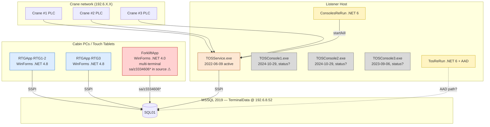

# 00 — דוח גילוי שלב 1 · תקציר מאוחד

> **פרויקט:** Goldbond · מודרניזציית מערכת איתור מנופי RTG
> **מחבר:** Mary (אנליסטית עסקית, BMad)
> **תאריך:** 26 באפריל 2026
> **שלב:** ✅ שלב 1 (גילוי-עומק) **הושלם**. בהמתנה לבדיקת מפעיל ולאישור לפני תחילת שלב 2 (Architect).
> **שורש הסקירה:** `CurrentSystem/Current/` (קוד מקור), `CurrentSystem/Current/rtg-discovery/` (ייצוא DB), בינארים פרוסים תחת `CurrentSystem/Current/RTG/`, `RTG1-2/`, `RTG3/`.
> **תיעוד מלא:** 9 מסמכי-משנה (`01_inventory.md` עד `09_open_questions.md`).

---

## 1. תקציר מנהלים (עמוד אחד)

Goldbond מפעילה **שלושה מנופי-RTG** המעבירים מכולות בטרמינל הקונטיינרים בילקסקיו (`ILCXQ`, אשדוד), ומדווחים בזמן-אמת ל-MIS. המערכת מורכבת מארבעה רכיבים:

1. **Listener (TCP)** — מקבל הודעות מהמנופים בפרוטוקול ASCII-over-TCP, כותב ל-MSSQL `TerminalData` ב-`192.6.8.52`.
2. **Operator UI לתא המנוף — `RTGApp.exe`** — WinForms .NET 4.8, שני builds (`RTGApp1-2` לקראנים 1+2, `RTGApp3` לקראן 3).
3. **Operator UI לנהג מלגזה — `ForkliftApp.exe`** — WinForms .NET 4.0, שני terminals תומכים (אשדוד + חיפה).
4. **DB משותף — `TerminalData` MSSQL 2019** — שורש-נתון לכלל המסוף; שותף עם MIS, ForkliftApp, WMS, ומערכת "Web" שמכלכל את `AuditWeb`.

**הסקירה חשפה ארבע מסקנות אסטרטגיות:**

1. **הליסטנר בייצור הוא `TOSService.exe` 2022-06-09 — בינארי בן ארבע שנים.** קוד-המקור הקאנוני **אבד** (הקוד הנוכחי ב-`From TFS/RTG/TOSService/TOSService/Program.cs` הוא טיוטת-שכתוב מ-2026-04-21 שלא קומפלה — `Main` הוא `void` ולא `static`). **Reverse Engineering נדרש לפני Phase 2.** קיימים גם 3 בינארים מקבילים `TOSConsole1/2/3.exe` (חדשים יותר — 2024-10) שהסטטוס שלהם בייצור לא ברור.
2. **שכפול-קוד הוא הנורמה.** 4 ענפים של `RTGApp` (1-2, 3, "גנרי", שכפול-פריסה), 3 פרויקטים נפרדים של `TOSConsole`, 3 של `KillToss`. `if (CHE.Text == "GOLD1")` ו-`if (CHE.Text == "GOLD2")` ב-Form1 — לא parametric. כל זה ידרוש מאמץ-איחוד גדול ב-Phase 2.
3. **ה-DB הוא event-bus דרך triggers + polling.** טבלת `TB_Parameters` (1 שורה, 48 עמודות) משמשת כ-pub/sub. trigger `TB_Location_Container_up` מעדכן 5 דגלים בוליאניים (`RefreshMapRTG`, `RefreshMapRTG2/3/4/3N`) שכל UI cabin polling עליהם כל ~500ms. **המסר**: מודל אנטי-מודרני — בעיצוב החדש זה צריך להיות PG `LISTEN/NOTIFY` + WebSocket.
4. **ממצאי אבטחה חמורים, הדורשים פעולה מיידית — לפני Phase 2 ובלי תלות בו:**
   - `ForkliftApp/app.config` ו-`ForkliftApp/frmLogIn.cs:194` מכילים בקוד-מקור: `User ID=sa;Password=z3334606*` (גלוי, ב-git checkout כל מי שיש לו source).
   - `ForkliftApp.Entities/app.config` מכיל וריאנט אחר: `User ID=sa;Password=3334606`.
   - PIN של RTGApp **לא מאומת מול ה-LoginName** — כל מי שיש לו PIN בקבוצה 22 יכול להיכנס בשם של מישהו אחר. SQL Injection טריוויאלי.
   - ForkliftApp `txtUserName.Text == "sa"` — דלת-אחורית מובנית שדורשת רק מספר-מלגזה אם שם המשתמש הוא "sa" — ה-flnu מקבל ערך 0.
   - אין whitelist על port 30701-30703 — כל מי שמגיע ל-OT network יכול לזייף הודעות PLC.

**52 שאלות פתוחות** זוהו. נכון ל-2026-04-26 (סבב שני אחר תשובות Yaniv): **2 P0 פתוחים** (Q-RE-01 — מקור TOSService מ-TFS, Q-DB-02 — `xp_cmdshell` audit) — ירידה מ-6. השאר ירדו ל-P1 (Q-PROTO-04, KoneCranes spec + chesimu מספיקים) או נסגרו (Q-RE-02 — `TosReRun` הוא watchdog, אישור Yaniv).

הסקירה המלאה מספיקה לתכנון **מודולרי, crane-by-crane**, עם **קראן 3 כפיילוט** (הקטן והמבודד יחסית), בכפוף ל-dual-write ל-MSSQL כל זמן ש-MIS, ForkliftApp ו-AuditWeb עדיין צורכים מ-MSSQL.

---

## 2. כיצד המערכת עובדת היום (נרטיב, 3-5 עמודים)

### 2.1 ההיערכות הפיזית

טרמינל-המכולות של Goldbond באשדוד (`ILCXQ`) מפעיל 3 קראני RTG (Rubber-Tired Gantry) שמעבירים מכולות בין גושי-חצר (BlocCodes `BOND1`, `BOND2`, `BOND3`), משאיות (`T`), וקרקע (`G`). כל קראן בעל PLC/transponder שמדבר פרוטוקול ASCII-over-TCP **לליסטנר מרכזי**. קראנים 1 ו-2 עובדים בצפון (`BOND1/2`), קראן 3 עובד בדרום (`BOND3`).

לכל קראן בתוך התא מותקן Windows PC (טאבלט או desktop) שמריץ `RTGApp.exe`. המפעיל נכנס עם PIN בן 4 ספרות, רואה את מפת החצר (יחס מכולות לכל bay-row-height), ושולח הוראות PICK/PLACE. הקראן מבצע פיזית, מדווח בחזרה על אירועי pick ו-place, והמערכת רושמת בטבלת `RG_Shifting`.

מאחורי הקלעים, שרת ה-DB (`SQL01` ב-`192.6.8.52`) מחזיק את כל המצב. ה-listener בייצור הוא `TOSService.exe` — בינארי .NET Framework מ-2022-06-09. הוא רץ ב-(host מסויים, סביר שעל אותו שרת או קרוב), פותח port TCP, וכותב ישירות ל-DB. **שלושה watchdogs מקבילים** מנסים לדאוג שהליסטנר רץ: (א) `ConsolesReRun.exe` (.NET 6, מ-2023, עם kill+start ל-`TOSCONSOLE{1,2,3}.exe`); (ב) `TosReRun.exe` (.NET 6, מ-2022, עם תלויות AAD/MSAL — תפקיד מדויק לא ברור בלי RE); (ג) `xp_cmdshell` בתוך SP `RunEnconsoleRTG{n}` שמופעל ידנית ב-DB. **הסיכונים של 3 מסלולי-בקרה במקביל ברורים** — race conditions, double-spawn, אובדן TCP socket.

ב-DB יש בנוסף שלושה SP-ים `KillToss{n}` שמפעילים `xp_cmdshell` להריגה ידנית של ה-listeners. ה-paths שב-SPs (`c:\RTG\RTG{n}\TOSConsole{n}.exe`, `C:\RTG\RTG{n}\KillToss{n}.exe`) **שונים** מהנתיבים בפועל בקובצי הפריסה (`RTG/Console{n}/...`). אחת מהשתיים: או שיש פריסה משנית על שרת ה-DB, או שה-SPs לא פועלים בפועל.

### 2.2 מפת רכיבים

```
┌────────────────────┐      TCP 30701-30703       ┌──────────────────────────┐
│ Crane PLC          │◄───── ASCII, "??" framed ──►│ Listener Host            │
│ (3 cranes)         │       fixed byte offsets    │                          │
└────────────────────┘                              │  TOSService.exe (2022)   │
                                                    │  ← Active in production  │
                                                    │  TOSConsole{1,2,3}.exe   │
                                                    │  (2023-2024, status?)    │
                                                    │  ConsolesReRun (.NET 6)  │
┌────────────────────┐                              │  TosReRun (.NET 6, AAD?) │
│ Cabin PC (x3)      │                              └────────────┬─────────────┘
│                    │                                           │
│ RTGApp.exe         │                                           │ SSPI hardcoded
│ WinForms + Hebrew  │                                           │
│ RTL                │                                           │
└──────┬─────────────┘                                           │
       │ SSPI app.config (RTG1-2) / Settings (RTG3)              │
       │                                                         ▼
       ▼                                              ┌──────────────────────────┐
┌──────────────────────────────────────────────────────────────────────────────┐
│ MSSQL 2019 Standard · TerminalData @ 192.6.8.52 (SQL01)                       │
│                                                                                │
│ RG_A1 (3) RG_B3 (475) RG_Container (0) RG_Log (31k) RG_Shifting (503k)        │
│ RG_A1_LOG (?) RG_ColDG (84) RG_ErrorLog (1.6M)                                 │
│ TB_Location (35k) TB_Parameters (1, 48 cols)                                   │
│ CO_Containers (2.6M, SHARED) CO_ContainerProfile (1.7M, SHARED)                │
│ CP_Deal / CP_Order (SHARED) HR_Emp / SC_Users (SHARED) TC_Client (SHARED)     │
│                                                                                │
│ + triggers: TB_Location_Container_up → RefreshMapRTG{1..4,3N} flags            │
│             rg_a1_updatetime → recursive UPDATE on RG_A1                       │
│             rg_up_triger → INSERT to RG_A1_LOG every UPDATE                    │
│             update_location_in_container → UPDATE CO_Containers                │
│ + xp_cmdshell SPs: RunEnconsoleRTG{n}, KillToss{n}                             │
│ + ~80 sp_ForkLift* (ForkliftApp integration surface)                            │
│ + Web triggers (CO_Containers, TC_Client, SC_Users, ...) → AuditWeb            │
│ + SendClientToWMS trigger → TC_ClientToWMS                                     │
└──────────────────────────────────────────────────────────────────────────────┘

┌────────────────────┐
│ Forklift Tablet    │
│                    │
│ ForkliftApp.exe    │
│ WinForms .NET 4.0  │
│ TouchScreen UI     │
│ Multi-terminal     │  ─── sa/z3334606* hardcoded ⚠ ───┐
│ (ILCXQ + ILGBH)    │                                   ▼
└────────────────────┘                          (same TerminalData)
```

### 2.3 התרחיש היומיומי

מפעיל מגיע לקראן 1 ונכנס. ה-form login קורא `C:\RTG\CHEName.txt` — קובץ של שורה אחת (`BOND1`) שממלא את שדה ה-CHE. ה-form load מבצע `SELECT LoginName FROM HR_Emp JOIN SC_Users WHERE UserGroupCode = 22` — מילוי dropdown. המפעיל בוחר שם, מקליד PIN בן 4 ספרות. SQL: `SELECT COUNT(*) ... WHERE UserPinCode = <PIN>` — אם > 0, login מוצלח (ה-LoginName הנבחר **לא** חלק מהבדיקה — פגם ידוע). INSERT ל-`RG_Log`. פתיחת `FrmMap01`.

`FrmMap01` מתחיל WinForms timer שפעיל כל ~500ms. בכל tick: (א) `SELECT ... FROM RG_A1 WHERE CHE='GOLD1'` → עדכון תצוגת סטטוס; (ב) `SELECT TB_Parameters.ContainerPick1` — אם TRUE, "מציג widget"; (ג) `SELECT TB_Parameters.RefreshMapRTG` — אם TRUE, רענון מפת ה-map ע"י `V_MapRTGBond1` ואיפוס flag.

במקביל, ב-listener: `TOSService` (לפי הידוע) פתוח על TCP listening port. בכל iteration: `SELECT Message FROM RG_B3 WHERE CHE='GOLD1' AND A3Date IS NULL AND PickDate IS NULL` — שולף עבודות-ממתינות, ממיר ל-bytes, שולח ל-PLC. ואז קורא מ-stream — אם יש הודעה: בודק קידומת `??`, ואז סוג: `A1` = position update (UPDATE `RG_A1`), `A2 03` = PICK done (UPDATE `RG_B3.PickDate`, optional ContainerPick flag, ACK), `A2 04` = PLACE done (UPDATE `RG_B3.PlaceDate`, INSERT `RG_Shifting`, UPDATE `TB_Location` ×2, UPDATE `CO_Containers`, ACK), `A3` = cancel ack (UPDATE `RG_B3.CancelDate / A3Date`).

הסיכומים שמתבצעים ב-PLACE מפעילים שורת triggers ב-DB:
- `update_location_in_container` ב-`RG_Shifting INSERT` → UPDATE על `CO_Containers.LocationCode` (כפילות עם הקוד-של-הליסטנר).
- `TB_Location_Container_up` בכל UPDATE ל-`TB_Location` → UPDATE על `TB_Parameters.RefreshMapRTG{n}` (לפי תשלובת BlocCode + CHE).
- `CO_Containers_LocationCode_UpdateTrigger` → INSERT ל-`CO_ContainersLocation` (טבלת היסטוריה).
- ה-`Web*Triggers` על כל update חשוב → INSERT ל-`AuditWeb` עם `INSERT INTO ... VALUES (...)` כטקסט מלא.

ב-cabin הבא של ה-Timer (~500ms אחר כך), ה-UI רואה את ה-flag, מבצע query לעמודות ב-`V_MapRTGBond1`, מאפס את ה-flag → כל זה יוצר עוד טריגר fire על TB_Parameters → trigger chain שלם בכל PLACE.

### 2.4 ההבדלים בין הקראנים והפיצול של קראן 3

קראנים 1 ו-2 חולקים build אחד: `RTGApp1-2.exe`. הם מבדילים את עצמם ע"י `C:\RTG\CHEName.txt` (BOND1 או BOND2). קראן 3 בעל build משלו `RTGApp3.exe` עם CHE=`GOLD3`, BlockName=`Bond3`.

ב-DB: שני csproj-ים שונים בתיקיית RTG3 (`RTGApp.csproj` + `RTGApp3.csproj`). קוד `Form1.cs` ב-RTG1-2 = 3,230 שורות; ב-RTG3 = 3,062 שורות; ב-"גנרי" = 3,058 שורות. הגנרי קרוב מאוד ל-RTG3 — ייתכן ששתיהן מאותו origin. RTG3 חסר `Utils.cs` שיש ב-RTG1-2.

ב-listener: `TOSConsole1/2/3` הם 3 solutions-נפרדים זהות 95%, נבדלים ב-port (30701/2/3), CHE constant, ו-log path. ב-Console2 גרסת לוג חדשה יותר (`2024-08-14`) — תיקון לא ניטמע ב-1 ו-3. **קראן 3 חסר את הענף `if (G||T)` ב-PLACE** — באג מוכר (אישור Yaniv 2026-04-26: לא חוסם בייצור).

זה הקבוץ שנושא את ה-ForkliftApp בנוסף — אפליקציה שונה לחלוטין במבנה (N-tier 5 פרויקטים), בעלת 14 מסכי-מפעיל, F-keys keyboard shortcuts, ותמיכה בשני terminals: אשדוד (`ILCXQ`) וחיפה (`ILGBH`). **התקיימות של terminal שני לא הופיעה בבריף.** השאלה אם RTGApp רץ גם בחיפה — Q-UI-07 פתוחה.

### 2.5 מודל הנתונים בפסקה אחת

`RG_A1` (3 שורות) = מצב חי של 3 הקראנים. `RG_B3` (475) = תור עבודות; כל שורה היא pick-and-place עם תאריכי-מחזור-חיים (`A3Date`, `PickDate`, `PlaceDate`, `FinishDate`, `CancelDate`) במקום state machine מובהק. `RG_Container` (0) = מכולה "באוויר" של קראן (transient); אבל **מי INSERT ל-`RG_Container` לא נמצא בקוד שראינו** (Q-DB-07). `RG_Log` (31k) ו-`RG_Shifting` (503k) הם append-only היסטוריה. `RG_ErrorLog` (1.6M) = log שגיאות אפליקטיבי ב-DB. `RG_A1_LOG` = log של כל position update (נכתב ע"י trigger, כמות לא ידועה — סביר מיליונים). `TB_Location` (35k) = מפת החצר. `TB_Parameters` (1 שורה, 48 עמודות) = god-table של pub/sub flags. כל יתר הטבלאות (CO_*, CP_*, TC_*, HR_*, SC_*) **משותפות** עם מערכות אחרות; כל RTG-write עליהן הוא יציאה ל-integration surface.

### 2.6 פרוטוקול הרשת

הקראנים מדברים פרוטוקול ASCII-over-TCP. הודעות-נכנסות מתחילות ב-`??`. סוגי-הודעות: `A1` (position), `A2 03` (pick), `A2 04` (place), `A3` (cancel ack). כל שדה ב-offset קבוע — `Time` ב-12, `HBBlockName` ב-22, וכו'. תגובות יוצאות מתחילות ב-`0xFF 0xFF` ונושאות `04B2<counter><checksum>` ל-ACK או `03B10FEFA` ל-NAK. **ה-checksum הוא modular sum + two's complement — לא CRC-CCITT למרות ה-class בשם `Crc16Ccitt`.** אין framing בשכבה — הליסטנר מניח ש-`stream.Read(256)` מחזיר הודעה אחת. ה-listener **לא מאמת checksum נכנס** — שיבוש שקט ל-DB אם ה-PLC משדר corrupted.

---

## 3. ארכיטקטורת המצב הנוכחי (Mermaid)



---

## 4. סיכוני TOP

| # | סיכון | חומרה | המסמך הקשור |
|---:|---|:---:|---|
| 1 | TOSService בייצור הוא בינארי 4-שנים — מקור קאנוני נדרש מ-TFS | 🔴 P0 | Step 8, Q-RE-01 |
| 2 | ~~ForkliftApp credentials `sa/z3334606*` חשופים בקוד~~ ✅ הסיסמה מתה (Yaniv 2026-04-26) — עדיין למחוק מ-source ל-hygiene | 🟢 | Step 6, §02 §7 |
| 3 | SQL Injection ב-PIN check של RTGApp + ForkliftApp | 🔴 P0 | Step 3, Step 7 #7 |
| 4 | אין authentication על port-listening (spoofed PLC) | 🔴 P0 | Step 5, Q-PROTO-01 |
| 5 | משלוש watchdogs במקביל — race conditions (TosReRun = watchdog ל-TOSService, אושר 2026-04-26) | 🟡 P1 | Step 2, Step 7 #20, Q-RE-02 |
| 6 | חוסר framing ב-TCP — אובדן הודעות שקט | 🟡 P1 | Step 5, Step 7 #2-3 |
| 7 | חוסר transactions ב-PLACE flow | 🟡 P1 | Step 3, Step 7 #12 |
| 8 | dual write לא מתועד ל-AuditWeb / WMS | 🟡 P1 | Step 4 §8 |
| 9 | ~~Multi-terminal לא מתועד (Haifa)~~ ✅ נסגר 2026-04-26 — בחיפה אין מנופים | — | Q-UI-07 |
| 10 | RG_Log אין logout — audit trail מעוות | 🟡 P1 | Step 7 #11 |

---

## 5. השאלות הפתוחות שחוסמות את התחלת Phase 2

### P0 — חוסמים ממש (2 פתוחים, 4 ירדו ב-2026-04-26)

| # | שאלה | מקור |
|---:|---|---|
| 1 | מה הקוד הקאנוני של `TOSService.exe` 2022? **נתיב חדש:** מ-TFS (לא RE) — Yaniv 2026-04-26 | Q-RE-01 |
| 2 | מי ה-DB principals שיכולים `EXEC` על SP-ים `xp_cmdshell`? (audit של הקיים, לא חוסם עיצוב Phase 2) | Q-DB-02 |
| ~~3~~ ✅ | ~~מה הקוד של `TosReRun.exe`?~~ | **watchdog ל-TOSService** (Q-RE-02, Yaniv 2026-04-26) |
| ~~4~~ ⬇ P1 | ~~האם ה-PLC משדר checksum נכנס?~~ | **KoneCranes spec + chesimu = מספיק לעיצוב; ולידציה ב-cutover** (Q-PROTO-04) |
| ~~5~~ ✅ | ~~היכן באמת מותקנים ה-listeners ב-prod?~~ | **על `192.6.8.52` — אותו שרת כמו MSSQL** (Q-DB-01) |
| ~~6~~ ✅ | ~~ForkliftApp רץ ב-Haifa?~~ | **לא — בחיפה אין מנופים** (Q-UI-07) |

### P1 — מומלץ לפתור לפני Phase 2

| # | שאלה | מקור |
|---:|---|---|
| 7 | איזה מבין 4 הענפים של RTGApp מותקן בייצור על כל crane? | Q-COMP-01 |
| 8 | מה הסטטוס בייצור של `TOSConsole1/2/3`? פעילים-במקביל ל-TOSService? | Q-COMP-02 |
| 9 | מה תפקיד `TosReRun.exe` ביחס ל-ConsolesReRun? מי מפעיל כל אחד? | Q-COMP-03, Q-COMP-06 |
| 10 | האם ה-PLC עושה deduplication על job-burst אחרי reconnect? | Q-FLOW-02 / Q-PROTO-05 |

---

## 6. המלצה לתחילת Phase 2

**הצעד הראשון של Phase 2 (Architect) ממתין כעת ל-blocker יחיד:**

1. **Q-RE-01** — לאתר את מקור TOSService ב-TFS (אם נמצא ולא drift מהבינארי — סוגר; אחרת RE עם ILSpy על עותק שנשלוף בנפרד).

**Q-DB-02 לא חוסם עיצוב** אם נחליט (כפי שנמצא במגמה לאור עמדת Yaniv) ש-Phase 2 = security-by-design ולא ננסה לאחזר את הסכמת ההרשאות הישנה. עדיין נדרש כ-cutover prerequisite.

**אסטרטגיית המעבר המומלצת:**

- **מודולרי, crane-by-crane**, עם **קראן 3 כפיילוט** (הקטן והמבודד; כבר בעל פיצול-קוד נפרד).
- **dual-write ל-MSSQL** מהיום הראשון של כל מודול עד שהדאוסטרים (MIS, ForkliftApp, AuditWeb-Web, WMS) מהגרים גם הם.
- **תיקוני אבטחה תפעוליים** (לא חוסמי-עיצוב): מחיקת credentials מ-source ה-ForkliftApp (גם אם הסיסמה כבר מתה — hygiene), הוספת firewall rules על port 30701-30703 (whitelist לכתובות IP של PLC בלבד), בדיקת `xp_cmdshell` enabled (ל-audit ולתיעוד; הפלטפורמה החדשה לא תשתמש בה).
- **עיקרון אבטחה ל-Phase 2 (Yaniv 2026-04-26):** אין `sa`, אין credentials מובנים בקוד, אין הצגת סיסמאות ב-config — security-by-design.

---

## 7. קישורים למסמכי-המשנה

| מסמך | תוכן |
|---|---|
| [01_inventory.md](01_inventory.md) | אינוונטר מאגר המקור (550 קבצים, שפות, גדלים, תאריכים, נקודות-כניסה, מועמדים לקוד-מת) |
| [02_components.md](02_components.md) | מיפוי 20 רכיבים ל-7 קטגוריות, diff בין forks, configs + secrets register |
| [03_data_flows.md](03_data_flows.md) | 7 זרימות end-to-end עם Mermaid sequence diagrams |
| [04_database.md](04_database.md) | מבנה DB מלא — 24 טבלאות, 13 views, ~80 SPs sp_ForkLift, 5 triggers קריטיים, Web triggers, ER diagram |
| [05_protocol.md](05_protocol.md) | פרוטוקול ASCII-over-TCP — message types, offsets, ACK/NAK, checksum, framing issues |
| [06_operator_ui.md](06_operator_ui.md) | RTGApp + ForkliftApp — מסכים, auth, RTL, multi-terminal |
| [07_edge_cases.md](07_edge_cases.md) | 31 מקרי-קצה (11 P1, 15 P2, 5 P3) |
| [08_binaries.md](08_binaries.md) | 15 בינארים — תאריכי build, dependencies, מצב RE |
| [09_open_questions.md](09_open_questions.md) | 52 שאלות פתוחות (6 P0, 17 P1, 29 P2) + תוכנית-פעולה לסגירה |

---

## ✅ GATE LIFTED — מעבר ל-Architect (2026-04-26)

Brownfield discovery הושלם. כל ה-P0 ירדו / נסגרו. **Phase 2 (Architect) יכול להתחיל.**

**P0 — סטטוס סופי 2026-04-26:**
- Q-DB-01 ✅ — listeners על `192.6.8.52` (אותו שרת כמו MSSQL)
- Q-UI-07 ✅ — בחיפה אין מנופים; multi-terminal לא חל
- Q-RE-02 ✅ — `TosReRun` = watchdog ל-TOSService
- Q-RE-01 ✅ — מקור TOSService זמין ב-TFS (`CurrentSystem/Current/From TFS/RTG/TOSService/`); drift מ-binary יאומת ב-ILSpy לפני cutover
- Q-PROTO-04 ⬇ P1 — KoneCranes V40 spec + chesimu מספיקים לעיצוב
- Q-DB-02 ⬇ P1 — Phase 2 = security-by-design, אין `xp_cmdshell`, ה-audit ל-cutover plan
- `sa` password ✅ — מת בייצור; קוסמטית למחוק מ-source

**Architect — קלטים מומלצים בבריף הראשון:**
1. כל מסמכי `docs/brownfield/00-09`
2. מקור ה-TOSService ב-TFS: `CurrentSystem/Current/From TFS/RTG/TOSService/TOSService/Program.cs`
3. ספק KoneCranes V40: `KoneCranes/RTG/Network/RTG-TD-Konecranes TOS interface_V40.pdf`
4. NFR מרכזי: security-by-design (no `sa`, no embedded credentials, no plaintext passwords)
5. אסטרטגיה: modular crane-by-crane, קראן 3 כפיילוט, dual-write ל-MSSQL בכל שלב

---

> **סיום שלב 1.** ✅ הושלם.
