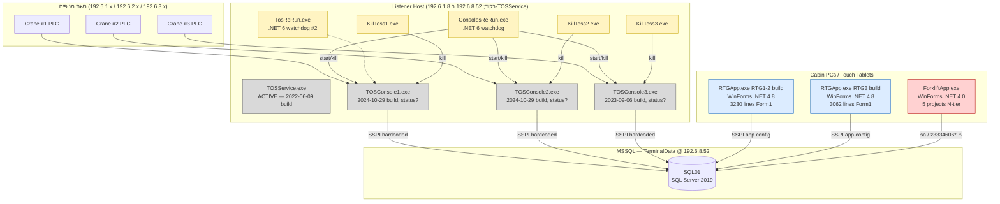

# 02 — מיפוי רכיבים (Component Mapping)

> **פרויקט:** Goldbond · מודרניזציית מערכת איתור מנופי RTG
> **מחבר:** Mary, האנליסטית העסקית (BMad)
> **תאריך:** 26 באפריל 2026
> **שלב:** שלב 1 — גילוי, צעד 2 מתוך 9
> **קלט עיקרי:** קריאת קוד מקור ב-`CurrentSystem/Current/From TFS/RTG/` ובינארים פרוסים תחת `CurrentSystem/Current/RTG/`, `RTG1-2/`, `RTG3/`.
> **מטרת המסמך:** סיווג מלא של כל רכיב במערכת לקטגוריה לוגית, זיהוי שפה/runtime/תלויות, איתור פיצולים (forks), הצפת קונפיגים וסודות (`⚠`), ובניית diff פרויקט-לפרויקט בין הענפים המשוכפלים. ניתוח התנהגותי מועבר לצעד 3, DB לצעד 4, פרוטוקול לצעד 5, מסכי UI לצעד 6.
> **מצב:** טיוטה לבדיקה ואישור.

---

## 1. תקציר מנהלים

המערכת מתפרשת על פני **שתי אפליקציות-מפעיל בלתי-תלויות** (`RTGApp` למנופים, `ForkliftApp` למלגזות) שצורכות את אותו `TerminalData`, **שלושה תהליכי-listener נפרדים** (`TOSConsole1/2/3`) שמקבלים מהקראנים ב-TCP וכותבים ל-DB באותו תהליך, **שני watchdogs במקביל** (`ConsolesReRun` ו-`TosReRun`) שמרענן את ה-listeners, ושלושה כלי-עזר זעירים להרג תהליכים (`KillToss1/2/3`). שירות נוסף בשם `TOSService` קיים בקוד ובינארי — **אך לא ניתן להריצו כפי שהוא** (חסר `static` ב-`Main` — לא נקודת-כניסה תקינה ל-.NET). ייתכן שהוא ניסיון-שכתוב נטוש שאיכשהו עדיין פרוס.

חמש תופעות-רוחב כבדות שמשפיעות על תכנון המערכת החדשה:

1. **תרבות הפיצול קשה.** `TOSConsole` ו-`KillToss` קיימים כשלוש solutions עצמאיים לחלוטין (לא configurations של אחד) — קוד 95%+ זהה עם הבדלים נקודתיים ב-port, ב-CHE, וב-log path בלבד. `RTGApp` קיים בארבעה ענפים (1-2, 3, "גנרי", ושכפול-פריסה תחת `RTG1-2/`).
2. **DB connection מקודד בקוד-מקור, לא בקובץ-קונפיג.** הקלאס `Crc16Ccitt` (שמו מטעה — זה class גישה ל-DB עם פונקציית-checksum כשיטה נוספת) מחזיק `connectionString = "Data Source=192.6.8.52;...;Integrated Security=SSPI;"` כתבליט-טקסט בתוך `Crc32.cs`. כל .exe.config של ה-listeners ריקים מ-connection strings.
3. **🚨 פריצת-אבטחה מסדר ראשון ב-ForkliftApp.** קובץ `ForkliftApp/app.config` מכיל בקובץ-מקור: `User ID=sa;Password=z3334606*` בטקסט גלוי. זהו חשבון `sa` (root) של MSSQL לשרת ה-DB הראשי. דורש **רוטציית סיסמה דחופה** ללא תלות במעבר.
4. **ארכיטקטורת ForkliftApp נקייה משמעותית מ-RTGApp.** ForkliftApp מאורגן ב-N-tier קלאסי (Presentation / BusinessLogic / DataAccess / Entities / Framework — 5 פרויקטים), בעוד RTGApp הוא קוד-מסך-יחיד מונוליטי. זה רומז שזה **מפתח שונה או דור-קוד מאוחר יותר**.
5. **שלושה מנגנוני-בקרה במקביל ל-listeners.** (א) `KillToss{n}.exe` להרג ידני; (ב) `ConsolesReRun.exe` (.NET 6) להפעלה-מחדש אוטומטית; (ג) `TosReRun.exe` (.NET 6) — watchdog שני שלא ברור מה תפקידו לצד הראשון. בנוסף הבריף הזכיר stored procedures (`RunEnconsoleRTG{n}`, `KillToss{n}`) שמפעילים את אלה דרך `xp_cmdshell` — מה שמוסיף מסלול **רביעי**. נושא קריטי לעיצוב Phase 2.

---

## 2. מודל הרכיבים

---

## 3. טבלת מיפוי רכיבים מלאה

| # | פרויקט / בינארי | קטגוריה | שפה / runtime | תפקיד | סטטוס |
|---:|---|---|---|---|---|
| 1 | `TOSConsole1` | **Listener + Persistence — סטטוס ייצור לא ודאי** | C# / .NET Framework 4.8 | קולט TCP מקראן 1, כותב לטבלאות `RG_A1`, `RG_B3`, `RG_Container`, `RG_Shifting`, `TB_Location`, `CO_Containers`, `TB_Parameters` | בינארי פרוס מ-**2024-10-29** (17,408 בייטים) ב-`RTG/Console1/`. **לא ברור אם רץ בפועל** לאור אישור 2026-04-26 ש-TOSService הוא הליסטנר הפעיל. ייתכן ששלושת ה-TOSConsole-ים הם דור-קוד שהוחלף ב-TOSService או רצים במקביל — Q-COMP-02 |
| 2 | `TOSConsole2` | **Listener + Persistence — סטטוס ייצור לא ודאי** | C# / .NET Framework 4.8 | זהה לעיל לקראן 2 (port 30702, CHE `GOLD2`) | בינארי פרוס מ-**2024-10-29** ב-`RTG/Console2/`; גיבוי `NewVer/` מ-2024-08; גיבוי נוסף `LastWorkingVer/2024/08/` מ-2023-09. סטטוס לפי Q-COMP-02 |
| 3 | `TOSConsole3` | **Listener + Persistence — סטטוס ייצור לא ודאי** | C# / .NET Framework 4.8 | זהה לעיל לקראן 3 (port 30703, CHE `GOLD3`) | בינארי פרוס מ-**2023-09-06** ב-`RTG/Console3/`. הוותיק מבין השלושה. סטטוס לפי Q-COMP-02 |
| 4 | `TOSService` | **🔥 Listener בייצור (אקטיבי)** | C# / .NET Framework 4.x | אישור 2026-04-26: **זהו המנגנון שמדבר עם המנופים בייצור היום**. בינארי פרוס `RTG/TosService/TOSService.exe` תאריך build **2022-06-09** (17,920 בייטים, .pdb קיים) | פעיל. **המקור ב-`From TFS/RTG/TOSService/` הוא טיוטת-שכתוב מ-2026-04-21 שלא קומפלה ולא נפרסה** (`void Main` בלי `static`) — ה-2022 binary בנוי על קוד-מקור קודם שאיבדנו ויש לעשות לו RE בצעד 8 |
| 5 | `ConsolesReRun` | **Supervisor / Watchdog** | C# / .NET 6 | מריץ `kill + restart` ל-`E:\RTG\Console{1,2,3}\TOSConsole{1,2,3}.exe` כשמופעל; אין try/catch | פעיל לפי קיום ב-`RTG/ConsoleReRun/`; כפי הנראה מופעל מ-Task Scheduler (לא תועד) |
| 6 | `TosReRun` | **Supervisor / Watchdog #2** | C# / .NET 6 (לפי תלויות) | תפקיד מקביל ל-`ConsolesReRun`. נושא תלויות `Azure.Identity`, `Microsoft.Data.SqlClient`, JWT — מרמז על אינטגרציה ל-Azure SQL או Azure AD שלא מתועדת בשום מקום | **קוד מקור לא נמצא תחת `From TFS/RTG/`** — בינארי בלבד תחת `RTG/ReRun/`. דורש Reverse Engineering בצעד 8 |
| 7 | `KillToss1/2/3` | **Supervisor — utility** | C# / .NET Framework 4.x | 3 בינאריים נפרדים שכל אחד מהם הורג את `TOSCONSOLE{n}.exe` | פעיל; מנגנון ידני לעצירה |
| 8 | `RTGApp1-2.csproj` (תחת `RTG1-2/RTGApp/RTGApp/`) | **Operator UI — RTG** | C# / WinForms / .NET Framework 4.8 | UI תא המנוף לקראנים 1-2; כניסה ב-`Program.cs` → `FrmLogin` → `FrmMap01` (Form1) | פעיל; פיצול נפרד מ-RTG3 |
| 9 | `RTGApp3.csproj` (תחת `RTG3/RTGApp/RTGApp/`) | **Operator UI — RTG** | C# / WinForms / .NET Framework 4.8 | UI תא המנוף לקראן 3 | פעיל; **תיקייה זו מכילה גם `RTGApp.csproj` נוסף** — שתי solutions באותה תיקייה |
| 10 | `RTGApp.csproj` ה"גנרי" (תחת `From TFS/RTG/RTGApp/RTGApp/RTGApp/`) | **Operator UI — RTG (לא ברור)** | C# / WinForms / .NET Framework 4.8 | אין pseudonym; שונה במעט מהשתיים האחרות (קרוב ל-RTG3 לפי גודל קבצים) | **לא ידוע אם מותקן בייצור** (Q-COMP-01) |
| 11 | `RTGApp` (תחת `RTG1-2/RTG/RTGApp/`) | **שכפול-מקור של פריסה** | C# / WinForms / .NET Framework 4.8 | העתק שני של RTGApp1-2 שיושב בתוך תיקיית הפריסה. תאריכי שינוי 2022 — ישן מהענף הראשי | **לא ברור אם מתעדכן או מתחזק** |
| 12 | `ForkliftApp` (presentation) | **Operator UI — Forklift** | C# / WinForms / .NET Framework 4.0 | UI נהג המלגזה; כניסה: `frmLogIn` → 14 forms נוספים; משתמש ב-`TouchScreen` UserControl | פעיל לפי אישור 2026-04-26; runtime ישן מ-RTGApp |
| 13 | `ForkliftApp.BusinessLogic` | **Operator UI — Forklift (BL)** | C# / .NET Framework 4.0 | שכבת לוגיקה עסקית (`ForkliftAppBL.cs`) | פעיל |
| 14 | `ForkliftApp.DataAccess` | **Operator UI — Forklift (DAL)** | C# / .NET Framework 4.0 | שכבת גישה לנתונים (`ForkliftAppDA.cs`) | פעיל |
| 15 | `ForkliftApp.Entities` | **Operator UI — Forklift (DTO)** | C# / .NET Framework 4.0 | Typed DataSet (`ForkliftAppDS`) + app.config משלו | פעיל; **app.config משלו מכיל `User ID=sa;Password=3334606`** ⚠ (סיסמה שונה!) |
| 16 | `ForkliftApp.Framework` | **Operator UI — Forklift (utils)** | C# / .NET Framework 4.0 | `DatabaseManager.cs`, `SQLHelper.cs` | פעיל; **app.config שלו מכיל connection string ל-`MOSHE`/`VideoLib` — סוג של זיהום ממוצר אחר** ⚠ |
| 17 | `ForkLiftAppSetup` | **Deployment** | Visual Studio Setup Project (`.vdproj`) | מתקין MSI ל-ForkliftApp | קיים; לא ברור אם משמש |
| 18 | `RTG/Install/ndp48-x86-x64-allos-enu.exe` | **Deployment** | Microsoft installer | מתקין .NET Framework 4.8 | קיים; כנראה לתחזוקת תחנות חדשות |
| 19 | `RTG/LastWorkingVer/2022/06/Console{1,2,3}/` | **Backup / Stale** | בינאריים | גיבויים מיוני 2022 | מועמד לקוד-מת — דורש אישור (Q-INV-07) |
| 20 | `RTG/Console2/{LastWorkingVer,NewVer}/` | **Backup / Stale** | בינאריים | גיבוי שני בתוך פריסת קראן 2 | מועמד לקוד-מת |

---

## 4. ניתוח-עומק לפי רכיב

### 4.1 Listener Tier — `TOSConsole1/2/3`

**מה הם עושים בעצם:** כל אחד מהם פותח port TCP ייעודי (30701/2/3), מקבל חיבור יחיד מה-PLC של הקראן, ומריץ לולאת polling שעושה שלושה דברים בכל איטרציה:

1. שואב מ-`RG_B3` הודעות-יוצאות ממתינות (משימות שהמפעיל הזין דרך ה-UI) ושולח אותן ב-binary לקראן.
2. קורא 256 בייטים מה-stream, מנתח אותם לפי קידומת `??` ואז סוג הודעה (`A1` = position update, `A2 03` = pick, `A2 04` = place, `A3` = cancel ack).
3. עבור כל סוג — מבצע סדרת UPDATE/SELECT/INSERT ל-DB **בקונקטנציה של מחרוזות** (ללא parameters, ללא transactions), משלים ב-ACK/NAK חזרה ל-PLC.

**ארכיטקטורה פנימית:**
- `Main` הוא `static void` עם `goto START` ו-`goto Outer` כ-control flow (לולאות `while(true)` עטופות בתוויות).
- כל גישה ל-DB עוברת דרך `Crc16Ccitt CC = new Crc16Ccitt(); CC.ReturnDT(sql)`. הקלאס נמצא ב-`Crc32.cs` (!) ומכיל גם את הפונקציה `calcChecksum` — אז זה class שעושה גם DB וגם checksum.
- `WriteLog` כותב ל-UNC path: `\\Broadcast\Logs\RTG\RTG{n}\TOSConsole{n}\Log -MM-dd-yyyy.txt`.
- אין framing, אין validation של inbound checksum, אין retry לוגי על write ל-DB.

**העובדה שמדובר בשלוש solutions נפרדים:** אומתה — `From TFS/RTG/TOSConsole1/TOSConsole.sln`, `TOSConsole2/TOSConsole.sln`, `TOSConsole3/TOSConsole.sln`. כל אחד עם csproj משלו (`TOSConsole1.csproj`, `TOSConsole2.csproj`, `TOSConsole3.csproj`).

### 4.2 Listener בייצור — `TOSService` (תיקון לאור אישור 2026-04-26)

**מצב מאומת:** TOSService.exe הוא הליסטנר הפעיל בייצור היום, לפי אישור Yaniv. הבינארי הפרוס מתוארך **2022-06-09** וגודלו 17,920 בייטים. קובץ `.pdb` קיים לצדו — מקל על Reverse Engineering.

**הסתירה בין הבינארי לקוד-המקור:**
ה-`Program.cs` שב-`From TFS/RTG/TOSService/TOSService/Program.cs` **לא יכול לקמפל** כפי שהוא היום:
- `Main` ו-`TOS` הם **instance methods** (`void`, לא `static`).
- רק `TOS("Gold2", 30702)` לא-מוערה ב-`Main`.
- ה-while-loop של קריאת stream מוערה ב-`//`.
- בלוג: `version 2022-03-21`.

תאריך השינוי האחרון של ה-`Program.cs` הוא **2026-04-21 10:34** — חמישה ימים לפני סקירה זו. כלומר: **המקור הזה הוא טיוטת-שכתוב פעילה שמישהו עבד עליה לאחרונה אבל מעולם לא הצליחה לקמפל ולא נפרסה**. הבינארי בייצור בנוי על קוד-מקור **קודם** שאיבדנו (אלא אם מצוי ב-TFS history).

**משמעות לתכנון Phase 2:**
1. אנחנו לא יודעים בוודאות מה ה-binary של 2022 עושה. ניתוח התנהגות בצעד 3 יסתמך על הקוד-מקור של TOSConsole1 (הקרוב ביותר במבנה לצורת השכתוב המתוכננת) **כקירוב**, ויסומן בגלוי שזה קירוב.
2. **Reverse Engineering של `TOSService.exe` יהיה משימה ראשית בצעד 8**, עם שימוש ב-PDB ב-decompiler כדי לחשוף את הקוד הקאנוני.
3. ייתכן שה-source ב-TFS history יחזיר את הגרסה האמיתית — שאלה ל-Q-COMP-11.
4. הוותק של הבינארי (כמעט 4 שנים) מסביר את האי-הצלחה לבצע שינויים מאז 2022 — היה ניסיון שכתוב שלא הסתיים. עוד סימן לחוב טכני.

**הקוד שעבד פעם — מה אנחנו יכולים להניח עליו:**
- כתב ל-`TerminalData` במחרוזות-מצוטטות (כמו ה-Console-ים).
- עבד מול lLocal IP `192.6.8.52` (ה-IP של DB השרת — חשוב, שונה מ-`192.6.1.8` של ה-Console-ים).
- עיבד נוטיפיקציות מהמנוף ב-port 30702 (המספר היחיד שלא-מוערה ב-Main של הטיוטה).
- כתב לוג ל-`\\Broadcast\Logs\RTG\TosService\Log_<DayOfYear>.txt`.

### 4.3 Process Supervisors

| בינארי | מה עושה | בעיה אפשרית |
|---|---|---|
| `KillToss{1,2,3}.exe` | `Process.GetProcessesByName("TOSCONSOLE{n}").Kill()` בלולאת `try/catch` ריקה | משתמש סוג `try/catch`-Pokemon — תופס הכל ולא מדווח. אם הקראן באמצע handshake יש סיכוי לאיבוד נתונים |
| `ConsolesReRun.exe` (.NET 6) | מריג `TOSCONSOLE{1,2,3}` מהפרוצסים, ואז מריץ מחדש מ-`E:\RTG\Console{1,2,3}\` | אין try/catch סביב `Process.Start`. אין delay בין הריגה להפעלה. הריגה רצה לפני שהפעלה רצה. לא בודק שהבינארי קיים |
| `TosReRun.exe` (.NET 6) | **קוד מקור לא נמצא** — תלויות מרובות (`Azure.Identity`, `Microsoft.Data.SqlClient`, JWT, MSAL) רומזות שזה לא רק watchdog פשוט. ייתכן שהוא מתחבר ל-Azure SQL כדי לנטר משהו, או מבצע פונקציה שונה מ-`ConsolesReRun` | **דורש Reverse Engineering בצעד 8** |

**שילוב מסוכן:** אם `ConsolesReRun` ו-`TosReRun` רצים שניהם ב-Task Scheduler (או כשירות), הם עלולים להריג זה את זה (שניהם הורגים `TOSCONSOLE*`). **Q-COMP-03**.

### 4.4 Operator UI — RTG (`RTGApp`)

**מה זה:** ה-UI של תא המנוף. תוכנית WinForms מונוליטית. נקודת-כניסה: `Program.cs` → `Application.Run(new FrmLogin())` → `FrmMap01` (Form1). הרבה מסכים נוספים: `ContainerLocation`, `FrmContainerNoLocation`, `FrmContainersByBloc`, `FrmEmptyContainers`, `FrmExpectedContainers`, `FrmInOutDiory`, `FrmLogin`, `FrmMenu`, `FrmRecommendedLocation`, `Works`, `Form2`. מסכים מנותחים בעומק בצעד 6.

**שתי קבצים קשיים שנפלו לעין:**
- `Class1.cs` — שם-ברירת-מחדל של Visual Studio. לא שונה. זה סימן שהתוכן נכתב במהירות ולא תוחזק.
- `CodeFile1.cs` — קיים רק ב-RTG3. שם-ברירת-מחדל גם הוא.

**Connection:**
- ב-`From TFS` — קובץ `RTG1-2/RTGApp/RTGApp/app.config` מחזיק `Data Source=192.6.8.52;Initial Catalog=TerminalData;Integrated Security=True` (SSPI).
- אבל הקובץ `RTG3/RTGApp/RTGApp/app.config` הוא **ריק** מ-connection string — רק supportedRuntime.
- וב-deploys — `RTG1-2/RTGApp.exe.config` ו-`RTG3/RTGApp.exe.config` שניהם **ריקים**.

**מה זה אומר:** הבינארי הפרוס מסתמך על default מקודד בקוד או על `Settings.settings` שנקלט בזמן build. ה-app.config של ה-deploy לא משמש בפועל. **Q-COMP-04** — מאיפה ה-`RTGApp.exe` בייצור באמת לוקח את ה-connection string?

### 4.5 Operator UI — Forklift (`ForkliftApp`)

**ארכיטקטורה (להבדיל מ-RTGApp):** N-tier קלאסי של 5 פרויקטים:

| פרויקט | תפקיד | קבצי מפתח |
|---|---|---|
| `ForkliftApp` | Presentation (WinForms) | `Program.cs` → `frmLogIn` → 14 frm-* forms; `Form1.cs` ב-namespace **`NumericKeyPad`** (UserControl למקלדת מספרית); `TouchScreen.cs` UserControl |
| `ForkliftApp.BusinessLogic` | Business Logic | `ForkliftAppBL.cs` |
| `ForkliftApp.DataAccess` | Data Access | `ForkliftAppDA.cs` |
| `ForkliftApp.Entities` | DTOs / Typed DataSet | `ForkliftAppDS.{xsd,xss,xsc,Designer.cs}` |
| `ForkliftApp.Framework` | Utils | `DatabaseManager.cs`, `SQLHelper.cs` |

**מסכי המפעיל:** `frmLogIn`, `frmActivity`, `frmChangeForkliftNUMBER`, `frmComment`, `frmEmptyContainers`, `frmInfoMenu`, `frmInformation`, `frmInOutDiory`, `frmMessage`, `frmRecommendedLocation`, `frmSameDealNumber`, `frmSelectContainer`, `frmSpecialLocation`, `frmWorks`. כמה שמות חופפים ל-RTGApp (`FrmEmptyContainers`, `FrmRecommendedLocation`, `FrmInOutDiory`) — **אינדיקציה לאופי מסכים שמשמשים את שני סוגי המפעילים**.

**מאפייני-עומק:**
- Runtime: **`v4.0` (לא 4.8 כמו RTGApp).** רומז על קוד ישן יותר או חוסר עדכון.
- **`Ping.cs`** — class שכנראה בודק connectivity ל-DB.
- **`MyGlobal.cs`** — global state (כפי שראיתי ב-Form1: `MyGlobal.bTouch`).
- **`Installer1.cs`** — Custom Action של Windows Installer לזמן התקנה. מקובל בעידן ההוא.
- **`ForkLiftNumber.xml`** — קובץ XML שכנראה מכיל את מספר המלגזה הספציפי לתחנה. אנלוג ל-`CHEName.txt` של RTGApp.

**Connection strings:** מוסבר בפירוט ב-§7 (Configs and secrets register). **חמור: בכל אחד משלושת ה-app.config של ForkliftApp יש connection string שונה — אחד עם `sa` ו-password גלוי, שני עם `sa` ו-password אחר, שלישי מצביע למסד אחר לחלוטין.**

### 4.6 Shared DB-access — `Crc16Ccitt` (Class)

**שם הקלאס:** `Crc16Ccitt` (אבל לא עושה CRC16 CCITT)
**שם הקובץ:** `Crc32.cs` (אבל לא עושה CRC32)
**מה הוא בעצם:** class גישה ל-DB שמחזיק `connectionString` קשיח, ומספק שיטה אחת מרכזית: `ReturnDT(string sql)` — מחזיר `DataTable` עבור SELECT, או מבצע ExecuteNonQuery עבור כל השאר.

**מאפיינים בעייתיים:**
- ה-connection string (`Data Source=192.6.8.52;...;Integrated Security=SSPI;`) **קשיח בקוד** — לא ניתן לשנות בלי build חדש.
- מכיל גם את `calcChecksum(string instr)` — פונקציית-checksum חיבורית פשוטה (`sum += (int)char; ~sum + 1`). זה לא CRC16-CCITT (שזה הפעלת polynomial על registers — שונה בתכלית).
- אין pooling, אין connection lifecycle ניקוי תקין (חסר `using`).
- אין parameterization — כל ה-SQL בא בשרשור מחרוזות (SQL Injection trivially exploitable מצד spoofed crane).

**הופעות:** הקלאס מוגדר ארבע פעמים — אחד בכל אחד מ-`TOSConsole{1,2,3}/Crc32.cs` ו-`TOSService/Crc32.cs`. כלומר **ארבעה עותקים זהים של אותו קוד שמתנהג כ-shared library — אך פיזית אינו**.

---

## 5. Diff: TOSConsole1 vs TOSConsole2 vs TOSConsole3

קריאה ידנית של שלושת `Program.cs`. ההבדלים הם:

| מאפיין | TOSConsole1 | TOSConsole2 | TOSConsole3 |
|---|---|---|---|
| **TCP port** | 30701 | 30702 | 30703 |
| **CHE constant** ב-SQL | `'GOLD1'` | `'GOLD2'` | `'GOLD3'` |
| **TB_Parameters flag** ב-PICK | `ContainerPick1` | `ContainerPick2` | `ContainerPick3` |
| **Log path** | `\\Broadcast\Logs\RTG\RTG1\TOSConsole1\` | `\\Broadcast\Logs\RTG\RTG2\TOSConsole2\` | `\\Broadcast\Logs\RTG\RTG3\TOSConsole3\` |
| **גרסת לוג** | `version 2023-09-06` | `version 2024-08-14` | `version 2023-09-06` |
| **`Crc16Ccitt` import** | זהה | זהה | זהה |
| **Logging extras** | בסיסי | מוסיף `WriteLog(...)` בתוך `ReturnAsciText` ו-Sent | מוסיף `WriteLog(data)` לפני `ToUpper` |
| **`localAddr` declaration** | מוצהר ולא בשימוש | מוצהר ולא בשימוש | **מוערה ב-`//`** |
| **PLACE branch — בדיקה לפני handoff** ב-`G`/`T` | `if (G || T)` | `if (G || T)` | **`if (T)`** — בודק רק `T` בלי `G`! |
| **Crc32.cs (DB helper)** | זהה | זהה | זהה |

**שתי תופעות שדורשות תיעוד מיוחד:**

1. **TOSConsole3 חסר את הענף `G` ב-PLACE.** בשורה 346 של `TOSConsole3/Program.cs` הבדיקה היא `data.Substring(89, 1).ToString() == "T"` בלבד, בעוד ב-Console1 ו-Console2 היא `== "G" || == "T"`. המשמעות: **כשקראן 3 מבצע PLACE על קרקע (`G`), ה-branch של ה-handoff למלגזה (`UPDATE CO_Containers SET ReleaseForkliftDate = ...`) לא רץ**. הקראן 3 מתעדכן בטבלת `TB_Location` כמיקום-יד-המלגזה, אבל ה-flow האסינכרוני אל ForkliftApp שבור עבור Place-on-Ground. **Q-COMP-05.**

2. **Console2 הוא הגרסה החדשה ביותר מבין השלושה** — log version `2024-08-14`. ובכל זאת התיקון לא קיבל merge חזרה ל-1 ו-3. זה תועדה של drift חי.

---

## 6. Diff: RTGApp1-2 vs RTGApp3 (preliminary — full UI diff בצעד 6)

| מאפיין | RTG1-2 | RTG3 |
|---|---|---|
| **csproj name** | `RTGApp1-2.csproj` | `RTGApp3.csproj` (וגם `RTGApp.csproj` נוסף!) |
| **Assembly name** | `RTGApp` (לפי תוכן csproj) | יש לאמת לפי כל csproj בנפרד |
| **TargetFramework** | v4.8 | v4.8 |
| **קבצים ייחודיים** | `Utils.cs`, `RTGApp.sln` | `CodeFile1.cs`, `RTGApp.csproj` (הנוסף) |
| **קבצים משותפים** | 54 (אותם forms, designer, helpers) | 54 |
| **`Form1.cs` line count** | 3,230 | 3,062 |
| **`FrmLogin.cs` line count** | 264 | 253 |
| **`UserConnection.cs`** | קיים | קיים |
| **`app.config`** | מכיל `connectionString` ל-`192.6.8.52` ב-SSPI | **ריק** — רק supportedRuntime |
| **`app.config` של deploy** | ריק | ריק |

**מסקנות ראשוניות:** ההבדל בין שתי הגרסאות הוא של ~5% מקבצי המקור החיים. רוב ההבדל ב-`Form1.cs` — 168 שורות. הניתוח הסמנטי של ההבדל יידחה לצעד 6, אבל שתי תיקיות הן בבירור פיצול **ידני** של אותו origin משותף ולא configurations.

**ב-`From TFS/RTG/RTGApp/RTGApp/RTGApp/`** (הגרסה ה"גנרית"): גודל Form1 = 3,058 שורות, **קרוב מאוד ל-RTG3** (3,062). זה רומז שהגרסה ה"גנרית" אינה template אלא וריאנט נוסף קרוב יותר ל-RTG3.

---

## 7. Configs and Secrets Register

קריטי — מסומן `⚠` עבור secrets.

| קובץ | סוד | חומרה | הערות |
|---|---|---|---|
| `From TFS/RTG/New Folder/ForkliftApp/ForkliftApp/app.config` | `User ID=sa;Password=z3334606*` | 🚨 **קריטי** | חשבון `sa` (root) של MSSQL בטקסט גלוי בקוד-מקור. סיסמה זו נמצאת בכל git checkout/clone של ה-repo |
| `From TFS/RTG/New Folder/ForkliftApp/ForkliftApp.Entities/app.config` | `User ID=sa;Password=3334606` | 🚨 **קריטי** | **סיסמה שונה** (חסר `*`, חסר `z` בהתחלה — וריאנט נוסף). מצביע ל-`SQLSRV` (לא `192.6.8.52`) — שרת אחר? סביבה אחרת? historic? |
| `From TFS/RTG/New Folder/ForkliftApp/ForkliftApp.Framework/app.config` | `Data Source=MOSHE;Initial Catalog=VideoLib;Integrated Security=True` | ⚠ זיהום | מצביע ל-DB אחר לחלוטין (`VideoLib` על שרת בשם `MOSHE` — כנראה שם תחנת מפתח). Leftover ממוצר אחר. לא רגיש בעצמו אבל מסגיר תרבות: app.config-ים לא תוחזקו |
| `From TFS/RTG/RTG1-2/RTGApp/RTGApp/app.config` | `Data Source=192.6.8.52;...;Integrated Security=True` | ✓ | SSPI — אין creds. סביר ובסטנדרט |
| `From TFS/RTG/RTG3/RTGApp/RTGApp/app.config` | (ריק) | ✓ | אין creds; השאלה מאיפה הקוד לוקח connection (Q-COMP-04) |
| `Crc32.cs` (4 עותקים: TOSConsole1/2/3, TOSService) | `Data Source=192.6.8.52;...;Integrated Security=SSPI;` | ⚠ קוד-קשיח | SSPI — אין creds רגישים, אבל IP **קוד-קשיח** במקור. כל שינוי IP ידרוש re-build של 4 בינאריים |
| `RTG1-2/RTGApp.exe.config` (deployed) | (ריק) | — | מסגיר שה-config לא משמש בייצור |
| `RTG3/RTGApp.exe.config` (deployed) | (ריק) | — | אותו דבר |
| `RTG/Console{1,2,3}/TOSConsole{n}.exe.config` (deployed) | (ריק) | — | אותו דבר ל-listeners |

**המלצה דחופה לצעד 9:** רוטציית סיסמת `sa` ב-MSSQL **לפני** שמתחילים ב-Architect phase. זה לא יכול לחכות.

---

## 8. שאלות פתוחות שנפתחו בצעד הזה

| # | שאלה | למה זה חשוב |
|---:|---|---|
| Q-COMP-01 | איזה מבין 3 הענפים של RTGApp באמת מותקן בייצור על כל crane? (RTG1-2 build על cabin 1+2; ?-build על cabin 3?) — האם הגרסה ה"גנרית" `From TFS/RTG/RTGApp/` רצה גם איפשהו? | מבנה הייצור |
| Q-COMP-02 | ~~האם TOSService רץ בייצור?~~ **נסגר 2026-04-26: כן, זה הליסטנר הפעיל.** שאלה חדשה: מה הסטטוס בייצור של `TOSConsole1.exe` (2024-10-29), `TOSConsole2.exe` (2024-10-29), `TOSConsole3.exe` (2023-09-06)? האם הם פרוסים-לא-פעילים, רצים במקביל ל-TOSService, או מכוונים לקראנים אחרים? | משפיע על תרשים הזרימה והעיצוב |
| Q-COMP-11 | האם זמין TFS history של `TOSService/Program.cs` ב-revision של ה-build מ-2022-06-09? | שואב את הקוד הקאנוני בלי RE |
| Q-COMP-03 | מי מפעיל את `ConsolesReRun` ומי את `TosReRun`? Task Scheduler? שירות? שניהם רצים יחד? | race condition ב-watchdogs |
| Q-COMP-04 | מאיפה `RTGApp.exe` (בייצור) לוקח את ה-connection string, אם ה-`.exe.config` ריק? | Settings מקודדים בזמן build, או embedded resource, או fallback ל-`Crc16Ccitt`? |
| Q-COMP-05 | ~~האם ההבדל ב-PLACE branch של TOSConsole3 (`if (T)` בלבד, בלי `G`) הוא **באג** או **התנהגות מכוונת**?~~ **נסגר 2026-04-26: באג מוכר, לא חוסם בייצור.** המשתמשים עובדים סביבו. **המערכת החדשה חייבת לטפל בזה כראוי** — לתעד בצעד 7 (edge cases) ולהבטיח התנהגות עקבית בכל הקראנים | קריטי לעיצוב Phase 2 |
| Q-COMP-06 | מה התפקיד של `TosReRun` (binary ב-`RTG/ReRun/`) שאין לו קוד-מקור ב-`From TFS`? האם קיים אינטגרציה ל-Azure SQL? | יכול להיות source-of-truth מקביל לא מתועד |
| Q-COMP-07 | מי המפתחים שעובדים על המערכת? (`MOSHE` ב-app.config של ForkliftApp.Framework מסגיר שם תחנה — האם `Moshe` הוא מתכנת ידוע?) | Knowledge management ל-Phase 2 |
| Q-COMP-08 | האם `ForkLiftNumber.xml` (קובץ ב-`ForkliftApp/`) הוא הפרמטר היחיד שמבדיל בין מלגזות שונות בפריסות שונות, באנלוגיה ל-`CHEName.txt` של RTGApp? | פיצול per-device |
| Q-COMP-09 | האם שלוש ה-app.config של ForkliftApp באמת בשימוש בפריסה, או רק זה של פרויקט הפרזנטציה? Visual Studio בדרך כלל merging-ם, אבל זה לא ברור | משפיע על ניתוח האבטחה |
| Q-COMP-10 | מה משמעות `RG_ColDG` (84 שורות ב-DB) שמופיע בבריף בלבד ולא בקוד שעבר עד כה? | יילקח ב-Step 4 (DB) |

---

## 9. צעדים הבאים

1. **המתנה לאישורך** על ממצאי הצעד — בעיקר על הסיווג של TOSService כשבור (Q-COMP-02), על ה-PLACE-on-Ground bug ב-TOSConsole3 (Q-COMP-05), ועל הצורך הדחוף ב-rotation של סיסמת `sa` (§7).
2. בכפוף לאישור — מעבר ל-**צעד 3 (זרימות end-to-end)** עם התרחישים שצוינו בבריף: position update, login, container select + report activity, network drop/reconnect, malformed packet, DB write fail, service start/stop. כל אחד עם narrative + Mermaid sequence diagram.
3. **בקשה אופרטיבית:** לקראת צעד 4 — אבקש את פרטי החיבור ל-DB המראה (server, instance, credentials או הוראת Integrated Security, ו-CIDR/IP מקור מורשה אם יש Firewall) כדי לאמת מטא-נתונים מול ה-`rtg-discovery/` files.

---

> **סיום צעד 2.** המשך מותנה באישור.
