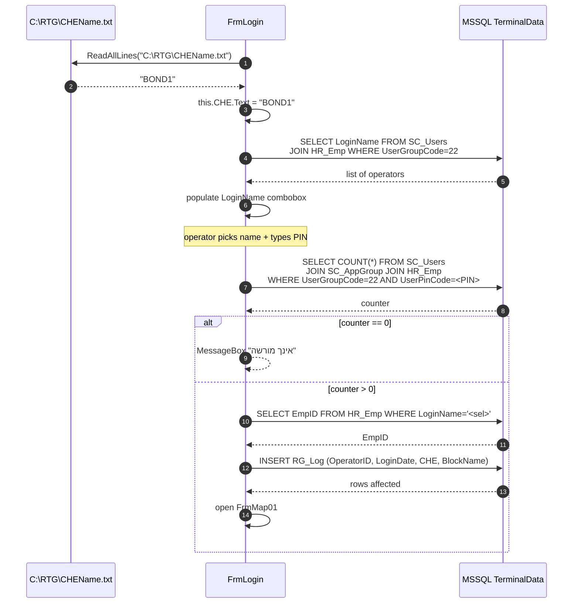
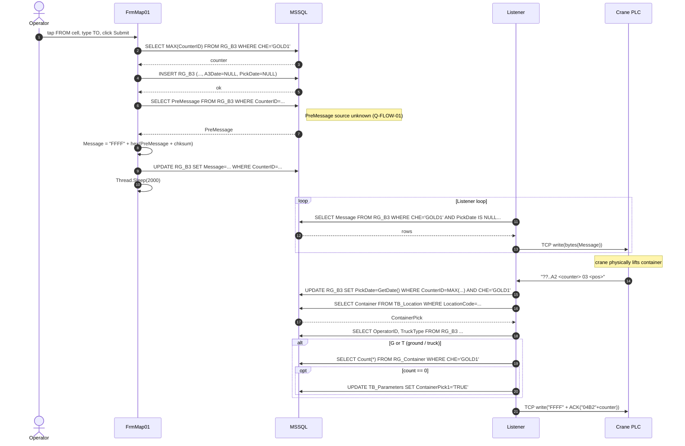
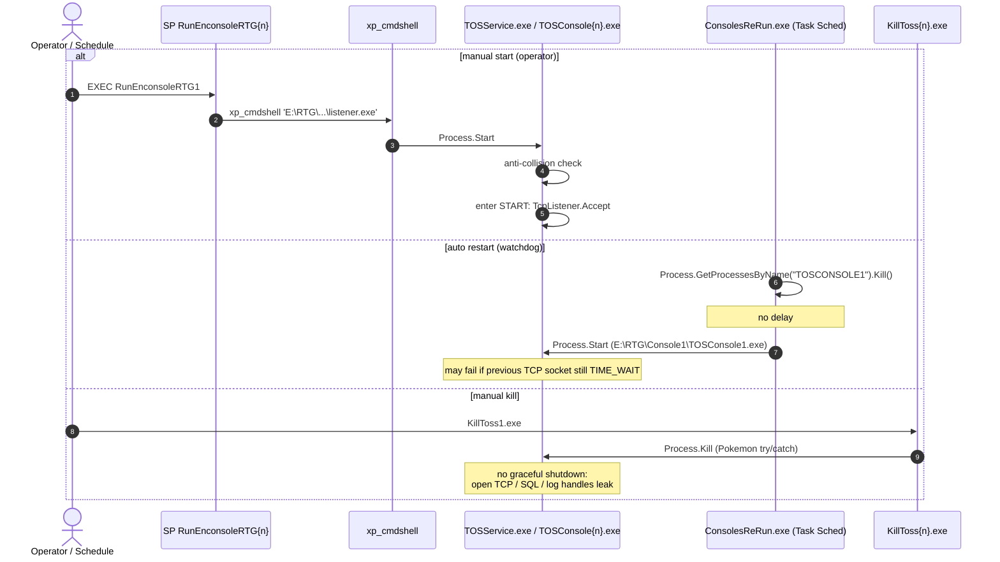

# 03 — זרימות קצה-לקצה (End-to-End Data Flows)

> **פרויקט:** Goldbond · מודרניזציית מערכת איתור מנופי RTG
> **מחבר:** Mary, האנליסטית העסקית (BMad)
> **תאריך:** 26 באפריל 2026
> **שלב:** שלב 1 — גילוי, צעד 3 מתוך 9
> **קלט עיקרי:** קריאת `FrmLogin.cs` ו-`Form1.cs` (FrmMap01) ב-`From TFS/RTG/RTG1-2/RTGApp/RTGApp/`; קריאת `Program.cs` ו-`Crc32.cs` ב-`From TFS/RTG/TOSConsole1/TOSConsole/` כקירוב להתנהגות הליסטנר בייצור (`TOSService.exe` 2022-06-09 — שראינו ב-Step 2 אין לנו את הקוד הקאנוני שלו).
> **מטרת המסמך:** לתאר 7 תרחישי זרימה בייצור — כל אחד עם נרטיב צעד-אחר-צעד ותרשים Mermaid sequence — כדי שכל בעל-עניין יבין איך הקראן, הליסטנר, ה-DB וה-UI מתקשרים בכל סיטואציה. נושא תיעוד עומק לפי רכיב מועבר לצעד 4 (DB), צעד 5 (פרוטוקול), צעד 6 (UI).
> **מצב:** טיוטה לבדיקה ואישור.

---

## אזהרות שיש לקרוא לפני המשך

1. **מקור הליסטנר.** הסיפורים שלהלן מתארים את התנהגות ה-listener על-פי הקוד שב-`TOSConsole1/Program.cs` (.NET 4.8, 2024-10-29 build). זה שונה מהבינארי שמדבר עם המנופים בייצור (`TOSService.exe` 2022-06-09 — קוד-המקור הקאנוני שלו אבד; הקוד הנוכחי ב-`TOSService/Program.cs` הוא טיוטה שלא קומפלה). שני המקורות אמורים להיות דומים מאוד בלוגיקה — אבל **כל פרט שאשתמש בו חייב להיבדק מול ה-RE של TOSService.exe בצעד 8**.
2. **באג ידוע.** ה-PLACE-on-Ground ב-TOSConsole3 (`if (T)` בלבד) — לפי אישור Yaniv זה באג מוכר שלא חוסם בייצור. בזרימות שלהלן אתאר את הזרימה התקינה (`if (G || T)` כפי שב-TOSConsole1/2 ו-TOSService) ואסמן את החריגה במקום הרלוונטי.
3. **שפת ה-SQL.** כל ה-SQL שמופיע נלקח מילולית מהקוד. הוא נכתב בקונקטנציה של מחרוזות, לא בפרמטרים — סיכון SQL Injection קיים בכל זרימה. נושא נפרד (security) שיוצף בצעד 7 (edge cases) ובצעד 9.

---

## 1. זרימה: עדכון מיקום של מנוף (A1 — happy path)

**תרחיש:** המנוף נמצא ב-pose מסוים בחצר ושולח כל ~1-2 שניות הודעת position update. הליסטנר קולט וכותב ל-`RG_A1`. ה-UI של תא המנוף קורא ל-`RG_A1` בכל tick של ה-Timer (תוך פילוטר על ה-CHE שהופק מ-`CHEName.txt` בעת login).

### 1.1 נרטיב

1. ה-PLC של המנוף מרכיב חבילת ASCII בפורמט `??...A1<time><status><block><bay><row><height>...`.
2. ה-PLC שולח את החבילה ב-TCP ל-`<listener_ip>:30701` (קראן 1) / 30702 (קראן 2) / 30703 (קראן 3).
3. הליסטנר ב-loop הראשי מקבל `stream.Read(bytes, 0, 256)` — מחכה למחרוזת בייטים.
4. ממיר ל-ASCII string ול-uppercase (`data.ToUpper()`).
5. בודק קידומת `??` (אם לא — מחזיר NAK `FFFF303342313046454641` ולולאה).
6. בודק `data.Substring(4, 2) == "A1"` — אם כן, נכנס לענף עדכון מיקום.
7. **בונה SQL בקונקטנציה:**
   ```sql
   UPDATE dbo.RG_A1 set Time='<HHMMSS>', Status='<sssss>', HBBlockName='<BOND1   >',
                       HBBayNumber='<bay>', HBRowNumber='<row>', HBHeight='<HHHH>',
                       CraneStatus='<cs>', GPSStatus='<gs>', CTime=getdate(),
                       PLC='<pp>', Len='<ll>', TwistLock='<t>'
   WHERE CHE = 'GOLD1'
   ```
8. מריץ ב-`Crc16Ccitt.ReturnDT(sql)` (פתיחה+סגירה של SqlConnection בכל קריאה).
9. **לא** שולח ACK חזרה ל-PLC (A1 הוא one-way notification).
10. חוזר ל-`goto Outer` — קוראים את ההודעה הבאה.

**במקביל ב-UI** (Timer מהבר הראשי של FrmMap01, פולס בכל ~500 ms):
11. שולח `SELECT Time, Status, HBBlockName, HBBayNumber, HBRowNumber, HBHeight, CraneStatus, GPSStatus, CTime FROM dbo.RG_A1 WHERE CHE = '<this.CHE.Text>'` (לפי הענף `if (this.CHE.Text == "GOLD1")` שראינו ב-`Form1.cs`).
12. ממלא DataGridView (`DGH`) בנתוני המנוף.
13. **לא** מציג מפה ייעודית של מיקום הקראן בענף הזה — הוא רק מעדכן השעון, הסטטוס, ושמירה ל-`TimeByTimer` ו-`SecondsByTimer` (משתנים סטטיים — מצב משותף ל-form).

### 1.2 תרשים זרימה (Mermaid sequence)

```mermaid
sequenceDiagram
    autonumber
    participant PLC as Crane PLC
    participant LIS as Listener (TOSService.exe)
    participant DB as MSSQL TerminalData
    participant UI as RTGApp.exe (cabin)

    Note over PLC,LIS: every ~1-2s
    PLC->>LIS: TCP "??..A1<time><status><pos>"
    LIS->>LIS: data.ToUpper(); detect "A1"
    LIS->>DB: UPDATE RG_A1 SET ... WHERE CHE='GOLD1'<br/>(string-concat SQL, no params)
    DB-->>LIS: rows affected (ignored)
    Note over LIS: no ACK sent for A1
    LIS->>LIS: goto Outer (next read)

    loop UI Timer ~500ms
        UI->>DB: SELECT ... FROM RG_A1 WHERE CHE='GOLD1'
        DB-->>UI: latest pose row
        UI->>UI: render to DGH grid
    end
```

### 1.3 נקודות תורפה שזרימה זו חושפת

- **אין framing ב-TCP**. `stream.Read(256)` מחזיר "כל מה שיש ב-buffer", שזה לא בהכרח הודעה אחת שלמה. אם `??...A1<...>` נחתך באמצע — `Substring(0, 2) == "??"` עדיין true אבל ה-`Substring(12, 6)` מתפוצץ ב-`ArgumentOutOfRangeException` שנתפס ב-catch הכללי ומדפיס לוג בלי לעצור שום דבר.
- **אין inbound checksum validation**. המערכת מקבלת כל בייטים ש-PLC זייף — כולל מ-source spoofed.
- **UI polling 2x/s לכל cabin** = ~4-6 שאילתות SELECT לשנייה לכל ה-DB (3 cabin × 2/s) רק לעדכון `RG_A1`. בנוסף ל-polling של דגלים ב-`TB_Parameters`.
- **אין transaction ולא retries**. אם DB עסוק ו-UPDATE נכשל — המנוף ידע שהוא במיקום X אבל ה-DB יקרא לעולם את המיקום הקודם. אין מנגנון התאוששות.

---

## 2. זרימה: כניסת מפעיל ופתיחת session

**תרחיש:** המפעיל ניגש לתחנת תא המנוף (Windows PC), מריץ `RTGApp.exe`, נפתח `FrmLogin`. הוא בוחר CHE (ברירת-מחדל מקובץ), בוחר שם משתמש מ-combo, מקליד PIN, ולוחץ OK.

### 2.1 נרטיב

1. **טעינת הטופס** (`FrmLogin.FrmLogin_Load`):
   - קריאת קובץ `C:\RTG\CHEName.txt` (UNC קשיח ב-source!).
   - השורה הראשונה (לרוב היחידה) נכתבת לתיבת הטקסט `CHE`.
   - הקובץ הזה הוא הפיצול היחיד בין תחנות — הקובץ ב-cabin 1 מכיל `BOND1`, ב-cabin 2 מכיל `BOND2`, וכו'.

2. **טעינת רשימת המשתמשים** (`FrmLogin` constructor):
   - `Con1.ReturnDT(...)` שולח ל-DB:
     ```sql
     SELECT '' AS LoginName FROM TB_Parameters
     UNION ALL
     SELECT dbo.HR_Emp.LoginName
     FROM dbo.SC_Users
     INNER JOIN dbo.HR_Emp ON dbo.SC_Users.EmpID = dbo.HR_Emp.EmpID
     WHERE dbo.SC_Users.UserGroupCode = 22
     ```
   - הקבוצה `UserGroupCode = 22` היא המוסכמה לקבוצת מפעילי-מנוף.
   - תוצאת השאילתה ממלאת ComboBox `LoginName`.

3. **המפעיל מקליד PIN** דרך 10 כפתורי-מסך (`One_Click`, `TWO_Click`, ..., `Zero_Click`, `DELETE_Click`) — כל כפתור עושה `this.Password.Text += "<digit>"`. אין masking של ה-PIN שמופיע ב-textbox.

4. **לחיצה על OK** (`btnOK_Click`):
   - `BackColorField()` בודק שכל השדות (CHE, LiftBlockName, LoginName, Password) לא ריקים. אם ריקים — צובע ב-orange ויוצא.
   - שולח לבדיקת הזדהות:
     ```sql
     SELECT COUNT(*) AS Counter
     FROM dbo.SC_Users
     INNER JOIN dbo.SC_AppGroup ON dbo.SC_Users.UserGroupCode = dbo.SC_AppGroup.UserGroupCode
     INNER JOIN dbo.HR_Emp ON dbo.SC_Users.EmpID = dbo.HR_Emp.EmpID
     WHERE (dbo.SC_Users.UserGroupCode = 22)
       AND (dbo.HR_Emp.UserPinCode = <PIN_TEXT>)
     ```
   - **🚨 פגם אבטחה משמעותי:** ה-PIN נשלח כמספר לא-מצוטט (`= " + Password.Text + ")`) — SQL Injection טריוויאלי (PIN כמו `1 OR 1=1` יחזיר התאמות).
   - **🚨 פגם אבטחה משני:** השאילתה **לא בודקת את `LoginName`** שנבחר. כל מי שיש לו PIN זה שייך לקבוצה 22 — הוא בפנים כאילו הוא ה-LoginName שנבחר. ה-audit trail (`RG_Log`) שגוי באופן יסודי.
   - אם `Counter > 0`: מגדיר משתנים סטטיים `StrCHE`, `StrBlockName`, `StrOperatorID`.
   - מבצע `SELECT EmpID FROM dbo.HR_Emp WHERE LoginName = '<selected_name>'` — שולף את ה-EmpID של ה-LoginName שנבחר.
   - **מבצע INSERT ל-`RG_Log`**:
     ```sql
     INSERT dbo.RG_Log(OperatorID, LoginDate, CHE, BlockName)
     VALUES('<StrOperatorID>', GetDate(), '<this.CHE.Text>', '<this.LiftBlockName.Text>')
     ```
   - יוצר `FrmMap01` חדש, מציג, **לא סוגר את `FrmLogin`** (window stack מתרחב — נושא רחב יותר ב-Step 6).

5. **אם הזדהות נכשלה:** `MessageBox.Show("אינך מורשה להכנס למערכת \n      הקש ססמא שנית")`. **לא מאפס** את שדה ה-PIN (תגובה מועתקת `Password.Text = string.Empty` קיימת בקוד אבל מועלמת `//`).

### 2.2 תרשים זרימה



### 2.3 נקודות תורפה

- **PIN בטקסט גלוי במסך** (`textbox` ללא `PasswordChar`).
- **PIN ב-SQL ללא פרמטרים** — SQL injection.
- **LoginName אינו מאומת מול ה-PIN** — כל אחד יכול להזדהות בשם של מישהו אחר.
- **אין Account Lockout** — ניחושי PIN ללא מגבלה.
- **`RG_Log` כותב את `OperatorID` שנבחר ב-UI**, לא את ה-OperatorID שאומת בפועל — כל הביקורת זרועה זיופים פוטנציאליים.
- **`MessageBox` חוסם UI thread** — קלאסי WinForms; לא בעיה של Phase 1 אבל יש לבדוק שלא נחנקים בהודעות חוזרות.

---

## 3. זרימה: בחירת מכולה ודיווח פעילות (PICK + PLACE end-to-end)

זה הזרימה הארוכה ביותר. נחלק אותה לשתי תת-זרימות (PICK ו-PLACE) ולסוף — כיצד ה-UI מקבל אישור.

### 3.1 PICK — מהמפעיל למנוף (UI → DB → Listener → PLC) ולחזרה

**תרחיש:** המפעיל רואה במפה תא עם מכולה, לוחץ עליה, רושם destination, ולוחץ Submit. המנוף מקבל הוראה לבצע lift.

#### 3.1.1 נרטיב

1. המפעיל לוחץ על תא במפה ב-FrmMap01. UI מאחסן `FromLocation` ו-`ToLocation` בשדות הטופס.
2. המפעיל לוחץ על Submit (כפתור בטופס; קוד הענף לא נצפה ישירות בקריאות שעשיתי, אבל ההיגיון המתועד בליסטנר חושף מה ה-UI חייב לעשות):
   - שולף `MAX(CounterID)` מ-`RG_B3 WHERE CHE='<self>'` לבניית counter חדש.
   - מבצע `INSERT INTO RG_B3 (...)` עם השדות: `OperatorID`, `CHE`, `Counter`, `LiftBlockName`, `LiftBayNumber`, `LiftRowNumber`, `LiftHeight`, `PlaceBlockName`, `PlaceBayNumber`, `PlaceRowNumber`, `PlaceHeight`, `Len`, `TruckType`, `A3Date=NULL`, `PickDate=NULL`, `PlaceDate=NULL`, `CancelDate=NULL`.
   - שולף `PreMessage FROM RG_B3 WHERE CounterID=<new>` (השדה `PreMessage` נראה כמתמלא ע"י trigger או default — מקור עדיין לא ידוע, **Q-FLOW-01**).
   - בונה `Message = "FFFF" + hex(PreMessage + checksum)` עם `calcChecksum`.
   - `UPDATE RG_B3 SET Message=... WHERE CounterID=<new>`.
   - **`Thread.Sleep(2000)`** ב-UI (פטטרן ידוע ב-RTGApp לפי הבריף).
   - `SELECT COUNT(*) FROM RG_B3 WHERE CounterID=<new> AND PickDate IS NULL`. אם > 0 — הליסטנר עדיין לא איסף; UI ממשיך מסתובב.

3. **בליסטנר** (לולאת iteration):
   - `SELECT Message FROM dbo.RG_B3 WHERE CHE='GOLD1' AND A3Date IS NULL AND PickDate IS NULL UNION ALL SELECT MessageCancel FROM dbo.RG_B3 WHERE CHE='GOLD1' AND MessageCancel IS NOT NULL AND CancelDate IS NULL`.
   - אם יש שורות — לכל שורה: `ToByteArray(Message)` + `stream1.Write(msg, 0, msg.Length)` — שולח את ה-payload כ-binary ל-PLC.
   - אם אין — `Thread.Sleep(1000)` והמשך הלולאה.

4. **המנוף מבצע lift** ושולח back: `??...A2 <counter> 03 <pos>` — הודעת PICK done.

5. **בליסטנר** (בתוך לולאת `stream.Read`):
   - בודק `data.Substring(4, 2) == "A2"` ואז `data.Substring(14, 2) == "03"`.
   - אם `data.Substring(89, 1) == "G"` או `"T"` (קרקע / משאית — מקרה בו לא היה גוב לבדיקה):
     - `SELECT Count(*) FROM RG_Container WHERE CHE='GOLD1'`.
     - אם 0 — `UPDATE TB_Parameters SET ContainerPick1='TRUE'`.
   - `UPDATE RG_B3 SET PickDate=GetDate() WHERE CounterID = (SELECT MAX(CounterID) FROM RG_B3 WHERE CHE='GOLD1') AND CHE='GOLD1'`.
   - `SELECT Container FROM dbo.TB_Location WHERE LocationCode='<bay+row+height>' AND BlocCode='<block>'`.
   - אם רשומה אחת לפחות — שמירת `ContainerPick`, ושליפת `OperatorID`, `TruckType` מ-RG_B3.
   - שמירת `FromLocationStr = bay+row+height`.
   - שליחת ACK ל-PLC: `FFFF + hex("04B2" + counter + checksum("04B2" + counter))`.

#### 3.1.2 תרשים זרימה — PICK



### 3.2 PLACE — מהמנוף ל-DB וחזרה ל-UI

**תרחיש:** המנוף מסיים את ה-Drop, שולח ACK שהוא הניח את המכולה.

#### 3.2.1 נרטיב

1. המנוף שולח: `??...A2 <counter> 04 <pos>` — הודעת PLACE done.
2. **בליסטנר**:
   - `data.Substring(4, 2) == "A2"` ו-`data.Substring(14, 2) == "04"`.
   - שמירת `ToLocationStr = bay+row+height`.
   - `UPDATE RG_B3 SET PlaceDate=GetDate() WHERE CounterID=MAX AND CHE='GOLD1'`.
   - `SELECT COUNT(Container) FROM RG_Container WHERE CHE='GOLD1'`. אם > 0 — מכולה זוכרה כ"באוויר":
     - שולפת `Container, OperatorID FROM RG_Container WHERE CHE='GOLD1'`.
     - `DELETE FROM RG_Container WHERE CHE='GOLD1'`.
     - `UPDATE CO_Containers SET EntranceForkliftDate=GetDate(), EntranceForkliftOperatorID='<op>', EntranceForkliftNumber='1' WHERE Container='<X>' AND EntranceDate IS NOT NULL AND EntranceForkliftDate IS NULL`.
   - אם `ContainerPick.Length == 11` (קונטיינר חוקי בעל 11 תווים — תקן ISO):
     - INSERT ל-`RG_Shifting (OperatorID, CHE, BlockName, ShiftDate, Container, FromLocation, ToLocation)` עם JOIN ל-`V_RG_CurrentOperator` כדי לאתר את ה-active session.
     - `UPDATE TB_Location SET Container=NULL, CHE='GOLD1' WHERE Container='<X>'` — ניקוי ה-cell הישן.
     - **בענף `if (G || T)`** (קרקע / משאית):
       - **לא** מבצע UPDATE על `TB_Location` (כי המכולה לא בגוב).
       - מבצע `UPDATE CO_Containers SET RtgWeight=..., LocationCode=<truckType>, ReleaseForkliftDate=GetDate(), ExitForkliftOperatorID=...` — מסמן את המכולה כ"שוחררה למלגזה".
     - **בענף else** (גוב רגיל בחצר):
       - `UPDATE TB_Location SET Container='<X>', CHE='GOLD1' WHERE LocationCode=<new>` — מסמן את ה-cell החדש.
       - `UPDATE CO_Containers SET RtgWeight=..., LocationCode='<new>'` — מעדכן מיקום ב-master table.
   - שליחת ACK ל-PLC: `FFFF + hex("04B2" + counter + checksum)`.

3. **תוצאה ב-DB:** טבלאות שעודכנו — `RG_B3`, `RG_Container` (ניקוי אם היה), `CO_Containers`, `RG_Shifting` (insert), `TB_Location` (פעמיים: ניקוי הישן וקביעת החדש או ניקוי בלבד אם G/T).

4. **טריגרי DB** שיופעלו (מתועד בבריף, יאומת בצעד 4):
   - `TB_Location_Container_up` — בכל update ל-TB_Location: כותב flag `RefreshMapRTG{n}` ב-`TB_Parameters`.
   - `rg_up_triger` — בכל update ל-RG_A1: insert ל-`RG_A1_LOG`.
   - `update_location_in_container` — בכל insert ל-RG_Shifting: עוד update ל-CO_Containers (כפילות מסוימת).

5. **ב-UI** (Timer הבא, ~500ms אחרי):
   - בודק `TB_Parameters.RefreshMapRTG{n}`. אם TRUE — מבצע re-render של ה-yard grid (שאילתה ל-`V_MapRTGBond1` או דומה לפי block) ומאפס את ה-flag.
   - בודק `TB_Parameters.ContainerPick{n}`. אם TRUE — מציג widget "יש לך מכולה" ומאפס את ה-flag.

#### 3.2.2 תרשים זרימה — PLACE

```mermaid
sequenceDiagram
    autonumber
    participant PLC as Crane PLC
    participant LIS as Listener
    participant DB as MSSQL
    participant UI as FrmMap01

    PLC->>LIS: "??..A2 <counter> 04 <pos>"
    LIS->>LIS: detect "A2" + "04"; ToLocation=<bay+row+height>

    LIS->>DB: UPDATE RG_B3 SET PlaceDate=GetDate() WHERE CounterID=MAX AND CHE='GOLD1'
    LIS->>DB: SELECT COUNT(Container) FROM RG_Container WHERE CHE='GOLD1'
    DB-->>LIS: count

    opt count > 0
        LIS->>DB: SELECT Container, OperatorID FROM RG_Container WHERE CHE='GOLD1'
        DB-->>LIS: container, op
        LIS->>DB: DELETE RG_Container WHERE CHE='GOLD1'
        LIS->>DB: UPDATE CO_Containers SET EntranceForkliftDate=GetDate()...
    end

    opt ContainerPick.Length == 11
        LIS->>DB: INSERT RG_Shifting (...) FROM V_RG_CurrentOperator JOIN RG_Log
        LIS->>DB: UPDATE TB_Location SET Container=NULL WHERE Container=<X>
        Note right of DB: TB_Location_Container_up trigger fires<br/>SET RefreshMapRTG1='TRUE' in TB_Parameters

        alt G or T
            LIS->>DB: UPDATE CO_Containers SET ReleaseForkliftDate=GetDate(),<br/>LocationCode=<truckType>...
        else else (regular yard cell)
            LIS->>DB: UPDATE TB_Location SET Container=<X> WHERE LocationCode=<new>
            Note right of DB: trigger fires again
            LIS->>DB: UPDATE CO_Containers SET LocationCode=<new>
        end
    end

    LIS->>PLC: TCP write("FFFF" + ACK("04B2"+counter))

    Note over UI: ~500ms later, UI Timer ticks
    UI->>DB: SELECT RefreshMapRTG1, ContainerPick1 FROM TB_Parameters
    DB-->>UI: RefreshMapRTG1=TRUE
    UI->>DB: re-render via V_MapRTGBond1 (large JOIN)
    DB-->>UI: cells
    UI->>DB: UPDATE TB_Parameters SET RefreshMapRTG1='FALSE'
```

### 3.3 נקודות תורפה

- **"PreMessage"** במחזור ה-INSERT/UPDATE של `RG_B3` הוא קופסה שחורה. נצטרך לפתוח אותה בצעד 4 (DB triggers/defaults).
- **`Thread.Sleep(2000)`** ב-UI אחרי ה-INSERT — אנטי-פטטרן. מקפיא את ה-UI thread, גם אם הליסטנר כבר עיבד את ה-row.
- **`SELECT MAX(CounterID)` כ-correlation key** — race condition פוטנציאלי אם שני INSERT-ים מתבצעים סמוך אחד לשני (תיאורטית — בפועל ה-UI מסונכרן, אבל פגיע).
- **`if (G || T)` בכפול:** הענף נבדק פעמיים בקוד ה-PLACE — פעם אחת קצרה (SELECT Container, set flag), פעם שנייה ארוכה (כל ה-handoff). אם השני נכשל, הראשון כבר עדכן את `TB_Parameters` — מצב inconsistent.
- **`TB_Parameters` כשרשרת flags של pub/sub** — כל ה-cabin polling אותה כל 500ms; כל UPDATE מהליסטנר מפעיל trigger; אין pacing.
- **Trigger chain:** PLACE רגיל מפעיל לפחות 4 UPDATE-ים ל-`TB_Location` ו-`CO_Containers` שכל אחד מהם מפעיל trigger נוסף — פוטנציאל לחפילות (cascading triggers). יש לבחון בצעד 4.

---

## 4. זרימה: ניתוק רשת והתאוששות (TCP drop / reconnect)

**תרחיש:** הקראן מאבד חיבור TCP (PLC רב-rebooted, חוט WiFi נופל, switch נטמרל). הליסטנר ממתין על `stream.Read` מקבל 0 בייטים או SocketException.

### 4.1 נרטיב

1. הליסטנר ב-`while ((i = stream.Read(bytes, 0, 256)) != 0)` — אם `i == 0` היציאה מהלולאה.
2. אם `stream.Read` זרק SocketException — נופל ב-`catch (Exception e)` הפנימי, כותב ללוג, ועושה `goto Outer` (לולאה לאיטרציה הבאה — עם אותו `client` שעדיין בידו).
3. כשה-stream באמת מת — `stream.Read` יחזיר 0 או יזרוק. הקוד מטפל בשני המצבים בערך זהה אבל רק אחד מהם בעצם נשבר נקי. **המצב יותר נפוץ:** Exception → catch → goto Outer → לולאה אינסופית של `SELECT Message FROM RG_B3` בלי שהקראן באמת מחובר.
4. **רק** SocketException ב-`AcceptTcpClient` (ה-catch החיצוני) יביא ל-`goto START` שעושה `server.Stop()` ובונה TcpListener חדש.
5. כשה-PLC חוזר ומחבר מחדש — `AcceptTcpClient` משתחרר עם `client` חדש, מתחילים מחדש את הלולאה.

**פעם נוספת**: בליסטנר ב-iteration הראשונה אחרי החיבור, יש שאילתה `SELECT Message FROM RG_B3 WHERE CHE='GOLD1' AND A3Date IS NULL AND PickDate IS NULL UNION ALL SELECT MessageCancel ...`. **אם בזמן ה-disconnect הצטברו עבודות — הליסטנר ישלח אותן כולן ברצף**. הקראן יקבל אותן בהפרש זמן קטן ויצטרך להתמודד בעצמו (תור, deduplication, סדר). אנחנו **לא יודעים** אם ה-PLC מסתדר — שאלה לתיעוד הפרוטוקול בצעד 5.

### 4.2 תרשים זרימה

```mermaid
sequenceDiagram
    autonumber
    participant PLC as Crane PLC
    participant LIS as Listener
    participant DB as MSSQL

    PLC->>LIS: TCP connection alive
    Note over PLC,LIS: ... operating normally ...

    Note over PLC: network drop
    PLC--xLIS: TCP RST or timeout
    LIS->>LIS: stream.Read throws / returns 0
    alt inside inner catch
        LIS->>LIS: WriteLog(exception); goto Outer
        LIS->>DB: SELECT Message FROM RG_B3...
        Note over LIS: spins on dead stream<br/>until outer exception
    else inside outer catch
        LIS->>LIS: server.Stop(); goto START
        LIS->>LIS: new TcpListener; AcceptTcpClient (block)
    end

    Note over PLC: PLC reconnects
    PLC->>LIS: TCP SYN
    LIS-->>PLC: TCP SYN/ACK; AcceptTcpClient returns

    LIS->>DB: SELECT Message FROM RG_B3 WHERE PickDate IS NULL...
    DB-->>LIS: pending jobs accumulated during outage
    loop for each pending row
        LIS->>PLC: TCP write(bytes)
    end
    Note over PLC: PLC receives a burst of jobs;<br/>dedup behavior unknown (Q-FLOW-02)
```

### 4.3 נקודות תורפה

- **אין heartbeat** מצד הליסטנר — הוא לא יודע שהחיבור מת עד שיש read failure.
- **אין persistent send queue ב-RAM** — כל job-pending נשמר ב-DB. בריא יחסית, אבל זה אומר שהליסטנר צריך לשמור על כיוון "ידעתי שהבית לקח את זה כבר".
- **בלי dedup ב-PLC** — תרחיש: רגע לפני disconnect, PLC קיבל הודעת PICK; ה-PICK ACK מעולם לא הגיע ל-listener; אחרי reconnect, listener שולח שוב את ה-PICK; PLC עלול לחוות שתי הוראות על אותו ContainerID.
- **Inner catch ל-Outer גורם ל-spin loop על מסד-נתונים** עד שה-server קורס באמת.

---

## 5. זרימה: חבילה פגומה / out-of-range packet

**תרחיש:** PLC משדר חבילה לא-תקינה (חתוכה, מפורקת, or שדה במיקום שגוי).

### 5.1 נרטיב

1. הליסטנר מקבל `data` מ-`stream.Read`.
2. אם `data.Length < 2`, `data.Substring(0, 2)` יזרוק `ArgumentOutOfRangeException`. נתפס ב-catch הפנימי. WriteLog, goto Outer.
3. אם `data.Substring(0, 2) != "??"` — הליסטנר שולח NAK `FFFF303342313046454641` ולא מבצע פעולה ב-DB. (השליחה היא ב-`stream1.Write`; אם ה-stream פגום — Exception → catch).
4. אם `data.Substring(4, 2) != "A1" && != "A2" && != "A3"` (כלומר `??XX...` שאין לו handler) — בקוד שב-`TOSConsole1`, הקוד שולח את אותה NAK בסוף block ה-`if (data.Substring(0,2)=="??")`. אבל **בקוד TOSService** (ה-prod-binary-source-stalled שראינו), הבדיקה הזו היא:
   ```csharp
   if (data.Substring(4, 2) != "A1" || data.Substring(4, 2) != "A2" || data.Substring(4, 2) != "A3")
   ```
   — שזה **תמיד true** (מספר לא יכול להיות שונה משלושה מספרים שונים בו-זמנית). ב-TOSService — NAK תמיד נשלח. ב-TOSConsole — רק אם הקידומת זהתה אבל הקוד הספציפי לא נופל בענף.
5. אם `A1` שעבר את הבדיקה אבל יש בו offset corrupt (למשל `Substring(22, 8)` נופל מהקצה) — **ArgumentOutOfRangeException** → catch → goto Outer. ה-DB **לא** מתעדכן עם נתון חלקי, אבל **גם לא** נכתב לוג מובהק שמסביר שזה היה A1 שגוי. ניתוח post-mortem כמעט בלתי-אפשרי.
6. **אין inbound checksum validation.** אם PLC משדר כש-payload corrupted אך offset-ים תקינים — DB מתעדכן עם נתון שגוי **בלי שום שום אינדיקציה לכשל**. זה אולי המצב המסוכן ביותר.

### 5.2 תרשים זרימה

```mermaid
sequenceDiagram
    autonumber
    participant PLC as Crane PLC
    participant LIS as Listener
    participant DB as MSSQL

    PLC->>LIS: bytes (truncated / wrong offsets / no checksum verify)
    LIS->>LIS: data = ASCII.GetString(bytes); ToUpper

    alt prefix not "??"
        LIS->>PLC: NAK FFFF303342313046454641
    else prefix is "??"
        alt msgtype is A1/A2/A3
            LIS->>LIS: try Substring(<offset>, <len>)
            alt Substring throws (offset out of range)
                LIS->>LIS: catch; WriteLog; goto Outer
                Note over DB: no UPDATE; partial state avoided
            else Substring succeeds but content corrupt
                LIS->>DB: UPDATE RG_A1 SET <wrong values> WHERE CHE='GOLD1'
                Note right of DB: silent corruption
            end
        else msgtype unknown
            LIS->>PLC: NAK FFFF303342313046454641
        end
    end
```

### 5.3 נקודות תורפה

- **אין checksum validation** של inbound — הסיכון הקריטי. כל corruption שלא בולט ב-offset יזרום ל-DB.
- **`Substring` במקום ניתוח מבוסס-פרוטוקול** — שבריר.
- **חוסר logging הקשרי** של pareo packets — קשה לדבג בייצור.
- **NAK בקוד `FFFF303342313046454641`** — האם ה-PLC יודע מה זה? אינסטרוקציה ל-retry? להפסיק? **שאלה Q-FLOW-03**.

---

## 6. זרימה: כשל כתיבה ל-DB

**תרחיש:** ה-DB נופל, רשת עמוסה, או deadlock עם session אחר. הליסטנר עושה `Crc16Ccitt.ReturnDT(sql)` שמחזיר `null` במצב כשל.

### 6.1 נרטיב

1. ב-`Crc16Ccitt.ReturnDT`, אם פונקציית ה-SqlClient זרקה Exception, הקוד תופס את הכל ב-catch כללי, מבצע `TOSConsole.Program.WriteLog("Error : " + ex.ToString())`, ומחזיר `null`.
2. **בליסטנר**, הקוד שמשתמש ב-`dt = CC.ReturnDT(...)` ואז `dt.Rows[0][0]` — אם `dt == null`, יזרוק `NullReferenceException`. נתפס ב-catch הפנימי. WriteLog, goto Outer.
3. **המצב במצרפי**:
   - אם UPDATE ל-`RG_A1` נכשל — המנוף ימשיך לדבר; עוד 1-2 שניות הוא ישלח עוד A1; אם בינתיים ה-DB חזר — עדכון ייכתב.
   - אם INSERT/UPDATE ל-`RG_B3` (PICK/PLACE handler) נכשל באמצע — חלק מהטבלאות עודכנו, חלק לא. **inconsistent state**. אין transaction.
   - אם UPDATE ל-`TB_Parameters` (flag) נכשל — UI לא יקבל push, יחיה עם תצוגה ישנה עד שיגיע flag הבא או רענון ידני.
4. **המנוף קיבל את ה-PICK ACK** (כי ב-TOSConsole1 ה-ACK נשלח אחרי הצלחת SELECT — אם ה-SELECT הראשון של `Container FROM TB_Location` נכשל, אין ACK; אבל אם הוא הצליח אז המנוף מקבל ACK ו-DB-update עלול בכל זאת להיכשל בשורות הבאות). זה sequence שדורש ניתוח מדויק לכל branch.

### 6.2 תרשים זרימה

```mermaid
sequenceDiagram
    autonumber
    participant LIS as Listener
    participant CC as Crc16Ccitt.ReturnDT
    participant DB as MSSQL

    LIS->>CC: ReturnDT("UPDATE TB_Location SET ...")
    CC->>DB: connection.Open(); ExecuteNonQuery
    alt DB throws (deadlock / down / timeout)
        DB--xCC: SqlException
        CC->>LIS: WriteLog("Error : ..."); return null
    else success
        CC-->>LIS: DataTable
    end

    Note over LIS: subsequent code: dt.Rows[0][0]
    LIS->>LIS: NullReferenceException
    LIS->>LIS: catch (Exception e); WriteLog; goto Outer

    Note over LIS: no compensating action;<br/>partial writes left in tables
```

### 6.3 נקודות תורפה

- **אין transactions.** כשל באמצע PLACE → 5 טבלאות בחציות-מצב.
- **`return null` מ-`ReturnDT`** הוא חוזה גרוע — הקוד הקורא מניח non-null.
- **אין retry עם backoff.** ה-listener ימשיך ללולאה כאילו לא קרה כלום.
- **אין distinction ב-log** בין NRE שבא מ-DB-down לבין NRE שבא מ-payload-corrupt. ניטור = תפילה.
- **אין metric / alert.** אם DB נופל ב-3 בלילה — אין שום מכניזם להעיר אדם.

---

## 7. זרימה: start / stop של השירות

**תרחיש:** התהליך נופל (כשל לא צפוי), או מישהו מבקש להפעיל מחדש מסיבת תחזוקה.

### 7.1 נרטיב

1. **באתחול ידני (operator-initiated):**
   - מישהו מריץ `RunEnconsoleRTG{n}` (stored procedure ב-DB, לפי הבריף — לא נראה בקוד שעבר עד כה).
   - SP מבצעת `xp_cmdshell` שמריץ `E:\RTG\Console{n}\TOSConsole{n}.exe` — או `RTG/TosService/TOSService.exe` במצב הנוכחי.
   - הקוד ב-`Main` של הליסטנר בודק `Process.GetProcesses().Count(p => p.ProcessName == thisprocessname) > 1`. אם כן — `WriteLog(" Program allredy running ")` ויוצא. (anti-collision טוב!)
   - אם זו הפעם היחידה — נכנס ל-`START:` label ופותח TcpListener.

2. **באתחול אוטומטי (watchdog):**
   - `ConsolesReRun.exe` (ב-Task Scheduler — נחוש לפי הבריף; לא נמצא תיעוד) רץ:
     - `Process.GetProcessesByName("TOSCONSOLE1").Kill()` (אם רץ, יהרג)
     - `Process.Start("E:\RTG\Console1\TOSConsole1.exe")`
     - חוזר על שניהם עבור Console2, Console3.
   - **בעיה 1:** הריצה הזו תהרוג גם את `TOSService.exe` אם שמו דומה (לא — שונה). אבל כן תהרוג את התהליך גם אם הוא בחיים שמחים.
   - **בעיה 2:** אין delay בין `Kill` ל-`Start`. אם ה-TCP socket עדיין באמת `TIME_WAIT` — bind ייכשל. הקוד הזה לא יודע על זה.
   - **בעיה 3:** אם הבינארי לא בנתיב `E:\RTG\Console1\` (כי deploy שינה — ה-binaries שראינו ב-`RTG/Console1/` כן מתאימים), `Process.Start` יזרוק. אין try/catch.

3. **`KillToss{n}.exe`:**
   - מקבל את ה-PID לפי `ProcessName == "TOSCONSOLE{n}"` ועושה `Kill()`. ב-`try/catch (Exception ex) {}` ריק — ההריגה תקרה אם אפשר, ואם לא אז שום הודעה.

4. **`TosReRun.exe`:** קוד מקור לא קיים. דורש RE בצעד 8 כדי לדעת מה הוא מבצע.

5. **ב-stop גרצפול:** אין mechanism ב-listener לטיפול ב-Ctrl-C, SIGTERM, SCM Stop, etc. הוא יחנק על `AcceptTcpClient` blocking או על `stream.Read` blocking. רק `Process.Kill` יעצור אותו → leaks of: open TCP connection, open SqlConnection, open file handle של ה-log.

### 7.2 תרשים זרימה



### 7.3 נקודות תורפה

- **שלושה מסלולי הפעלה במקביל** (SP/xp_cmdshell, ConsolesReRun, KillToss) שאינם מתואמים.
- **`xp_cmdshell` מופעל מצד DB** — סודות OS עוברים דרך תוכן SP (אם יש משתנים) ו-DB privileges של SQL Account נדרש. נושא אבטחה.
- **`Process.Kill` מיידי** — לא graceful. אבדן: TCP write פעיל, SQL transaction (אם היה), log entry באמצע.
- **אין supervisor יחיד** (כמו systemd / Windows Service Control Manager) שמודע למצב.

---

## 8. שאלות פתוחות שנפתחו בצעד הזה

| # | שאלה | למה זה חשוב |
|---:|---|---|
| Q-FLOW-01 | מה מקור השדה `PreMessage` ב-`RG_B3`? Trigger? Default? Computed? | חשוב לעיצוב המחדש של ה-PICK flow |
| Q-FLOW-02 | האם ה-PLC של המנוף מבצע deduplication על הוראות חוזרות (אחרי reconnect)? | משפיע על ה-rebroadcast הקיים אחרי disconnect |
| Q-FLOW-03 | מה ה-PLC עושה כשהוא מקבל NAK `FFFF303342313046454641`? Retry? Halt? | פערי פרוטוקול שיש להבין לפני שכותבים listener חדש |
| Q-FLOW-04 | האם `xp_cmdshell` מופעל בייצור עם הרשאות SA, או יש sandbox? | הערכת סיכון |
| Q-FLOW-05 | האם נמצאים `RunEnconsoleRTG{n}` ו-`KillToss{n}` SP-ים ב-DB? לא ראינו אותם בקוד עצמו, רק בבריף | אם כן — חלק מהבקרה הוא במחזור DB, לא חיצוני |
| Q-FLOW-06 | האם ה-cabin polling-rate של 500ms הוא קונפיגורבילי, או מקודד-בקוד? | משפיע על עומס DB |
| Q-FLOW-07 | מהי התנהגות ה-PLC של המנוף ב-startup קר — האם הוא ממתין ל-handshake מהליסטנר, או שהוא מתחיל לשדר A1 ברגע שה-TCP מחובר? | משפיע על חוויית bring-up מחדש |

---

## 9. צעדים הבאים

1. **המתנה לאישור** — אישורי Yaniv על:
   - תיאור הזרימות (האם משקפים את הידע של גופים שעבדו על המערכת).
   - הגדרת באג `if (T)` ב-Console3 כידוע-לא-חוסם.
   - הצגת `if (G || T)` כברירת המחדל בנרטיב (כמו ב-TOSConsole1/2/TOSService).
2. בכפוף לאישור — מעבר ל-**צעד 4 (DB deep-dive)** עם שימוש ב-`rtg-discovery/` לקריאת מטא-נתונים, ובמקרי-בדיקה: שימוש ב-DB מראה (`10.10.200.51:49993` / `TerminalData_AI`) שהומציאו ב-`docs/patched_conn.txt`.
3. **תזכורת:** ה-RE של `TOSService.exe` בצעד 8 הוא קריטי. הסיפור שלעיל מתבסס על TOSConsole1 כקירוב; ה-binary 2022 עלול להיות שונה במספר נקודות.

---

> **סיום צעד 3.** המשך מותנה באישור.
