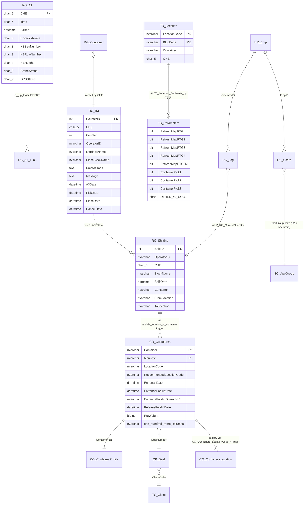

# 04 — Database Deep-Dive

> **פרויקט:** Goldbond · מודרניזציית מערכת איתור מנופי RTG
> **מחבר:** Mary, האנליסטית העסקית (BMad)
> **תאריך:** 26 באפריל 2026
> **שלב:** שלב 1 — גילוי, צעד 4 מתוך 9
> **קלטים עיקריים:** קבצי `rtg-discovery/` (יצוא MSSQL מ-2026-04-21 בגודל 192MB סה"כ): `00_database_context.txt` (מטא), `01_target_objects.txt` (היררכיית אובייקטים), `02_columns.txt` (53MB — נסרק ב-grep ממוקד), `03_keys_foreign_keys_indexes.txt` (145MB — נסרק ב-grep ממוקד), `04_row_counts.txt`, `05_module_definitions.sql` (232KB — חלקים מלאים), `06_triggers.sql` (184KB — חלקים מלאים), `07_core_sample_rows.txt` (2.6MB).
> **DB מראה לבדיקות:** `10.10.200.51,49993` / `TerminalData_AI` / `GBDEV` (לפי `docs/patched_conn.txt`) — לא נעשה בו שימוש פעיל בצעד הזה; ניתן לאמת מולו ספציפיים אם תידרש בדיקה.
> **מטרת המסמך:** תיאור מלא של DB `TerminalData` כפי שמתבטא בקוד עצמו (טבלאות, עמודות מרכזיות, אינדקסים, views, SPs, פונקציות, triggers), עם דגש על מה שמשמש את ה-RTG ואת ה-ForkliftApp, סיווג טבלאות לפי ownership ולפי read/write per component, וזיהוי טבלאות-משותפות שמהוות גבולות-הסכם של dual-write בעיצוב החדש.
> **מצב:** טיוטה לבדיקה ואישור.

---

## 1. תקציר מנהלים

`TerminalData` (Microsoft SQL Server 2019 Standard, 15.0.4460.4, על שרת `SQL01` ב-`192.6.8.52`) הוא ה-**single source of truth** לכל פעילות ה-RTG והמלגזות. אין בו schema-לפי-מודול; הכל ב-`dbo`. סף-הגילוי בקובצי `rtg-discovery/` מנה **24 טבלאות, 13 views, 2 פונקציות, 6 SPs לבקרת תהליכים, ו-~80 SPs של sp_ForkLift\*** — סך הכל ~125 אובייקטים בהיקף.

חמש תופעות מערכתיות שמשפיעות על תכנון הארכיטקטורה החדשה:

1. **`TB_Parameters` הוא event bus דרך triggers + polling.** טבלה בעלת שורה אחת ו-48 עמודות. ה-trigger `TB_Location_Container_up` עורך ב-`UPDATE` של `TB_Location` בודק את התשלובת `(BlocCode, CHE)` ומעדכן אחד מ-**5 דגלים בוליאניים** (`RefreshMapRTG`, `RefreshMapRTG2`, `RefreshMapRTG3`, `RefreshMapRTG4`, `RefreshMapRTG3N`) שכל UI cabin polling עליהם כל ~500ms ומאפס בעצמו. **זהו ה-pub/sub של המערכת — מודל אנטי-מודרני שצריך להיות ה-LISTEN/NOTIFY של PostgreSQL בעיצוב החדש.**
2. **טריגר recursive ב-`RG_A1`:** `rg_a1_updatetime` עושה `UPDATE RG_A1 SET CTime=getdate()` על אותה השורה שזה-עתה התעדכנה — recursive trigger. בנוסף, `rg_up_triger` מבצע `INSERT INTO RG_A1_LOG` של כל השורה. כלומר כל position-update מהמנוף = 1 UPDATE ראשי + 1 UPDATE טריגר רקורסיבי + 1 INSERT לוג.
3. **כתיבה כפולה ב-PLACE.** הליסטנר עצמו מבצע `UPDATE CO_Containers SET LocationCode=...`, ובמקביל ה-trigger `update_location_in_container` ב-`RG_Shifting INSERT` מבצע **שוב** את אותו UPDATE על `CO_Containers`. שני נתיבי כתיבה לאותו שדה לאותה רשומה.
4. **שכבת שכפול לתשתית "Web" שלא תועדה בבריף.** כל הטבלאות הראשיות (`CO_Containers`, `CP_Deal`, `SC_Users`, `TC_Client`, `HR_Emp`...) נושאות שלושיית triggers `*_WebDeleteTrigger`, `*_WebInsertTrigger`, `*_WebUpdateTrigger` שמייצרת INSERT/UPDATE/DELETE כטקסט-אנליטי לטבלת `AuditWeb` (חוץ ממשתמש `SQLWEB\Michaell-admin` או `GOLDBOND\SQLWEBUPDATE`). **המעבר לדור-ארכיטקטורה חדש חייב להבין מה צורך מ-`AuditWeb` ולספק אנלוג**, אחרת תשתית "Web" החיצונית תפסיק לקבל עדכונים.
5. **ה-SPs `RunEnconsoleRTG{n}` ו-`KillToss{n}` מצביעים ל-paths שלא תואמים את הפריסה שמצאנו.** SP מצפים לבינארים תחת `c:\RTG\RTG1\`, `c:\RTG\RTG2\`, `c:\RTG\RTG3\` (capital letters בחלק; lowercase ב-`c:`), אבל הבינארים בפועל יושבים ב-`RTG/Console1/`, `RTG/Console2/`, `RTG/Console3/` — שני שמות-תיקיות שונים. או שהמחשב המארח את ה-DB מארח גם פריסה משנית עם הנתיבים האלה (Q-DB-01), או ש-SPs האלה אינם פועלים בפועל.

---

## 2. תיאור פיזי של ה-DB

| מאפיין | ערך |
|---|---|
| **Database** | `TerminalData` |
| **Server** | `SQL01` (IP `192.6.8.52`) |
| **Version** | Microsoft SQL Server 2019 (RTM-CU32-GDR) (KB5077469) — 15.0.4460.4 (X64) |
| **Edition** | Standard Edition (64-bit) |
| **Host OS** | Windows Server 2019 Datacenter 10.0 build 17763 (Hypervisor) |
| **תאריך ייצוא הסקירה** | 2026-04-21 12:39:13 |
| **DB מראה לבדיקות** | `10.10.200.51,49993` / `TerminalData_AI` / משתמש `GBDEV` |

ה-`TerminalData` שותף בין מערכות-אם נוספות (MIS / ERP / ForkliftApp / WMS / מערכת-Web) — כפי שעולה מטריגרים ל-`AuditWeb` ול-`TC_ClientToWMS`. **המעבר ל-PostgreSQL ל-RTG חייב לכלול dual-write כדי לא לשבור את אותן מערכות.**

---

## 3. אינוונטר אובייקטים (מקבץ של `01_target_objects.txt`)

### 3.1 טבלאות RTG-ייעודיות (Priority 1 — "ה-core של ה-RTG")

| שם טבלה | תיאור (ינוסה ב-§4) | שורות |
|---|---|---:|
| `RG_A1` | מצב חי של 3 הקראנים, שורה לכל CHE | 3 |
| `RG_B3` | תור עבודות (jobs) — UI מציבה, listener צורכת, חוזרת לסטטוס בעקבות PICK/PLACE/A3 | 475 |
| `RG_Container` | מכולה "באוויר" (caught by spreader) — שורה זמנית עד PLACE | 0 |
| `RG_Log` | היסטוריית sessions של מפעילים — append-only | 31,654 |
| `RG_Shifting` | היסטוריית כל ה-PICK/PLACE — append-only | 503,414 |
| `RG_A1_LOG` | log של כל position-update; נכתב ע"י trigger `rg_up_triger` | (לא ברור — Q-DB-04) |
| `RG_ColDG` | מטא של עמודות עם DG (Dangerous Goods) — קבוע | 84 |
| `RG_ErrorLog` | log שגיאות אפליקטיבי (ב-DB) — append-heavy | 1,615,872 |

### 3.2 טבלאות yard map (Priority 1)

| שם טבלה | תיאור | שורות |
|---|---|---:|
| `TB_Location` | מפת החצר — תא = (BlocCode, LocationCode); שדה `Container` = ID של מכולה אם תפוס; `CHE` = מי-נגע | 35,174 |
| `TB_Parameters` | טבלת-אם ייחודית של שורה אחת ו-**48 עמודות** — pub/sub flags + מיני-קונפיגורציה | 1 |

### 3.3 טבלאות משותפות (Priority 2-3 — "shared with broader system")

| שם טבלה | תיאור (משוער מהקוד והוויו) | שורות |
|---|---|---:|
| `CO_Containers` | טבלת המכולות הראשית — 150+ עמודות, master record של כל מכולה במסוף | 2,591,916 |
| `CO_ContainerProfile` | מאפיינים פיזיים של כל מכולה (אורך, סוג, וכד') | 1,722,128 |
| `CP_Deal` | עסקאות לקוח | 2,080,099 |
| `CP_Order` | הזמנות מוצרים/עבודות (forklifts קוראים) | 400,969 |
| `TC_Client` | לקוחות | 90,559 |
| `TC_HazardousSubstances` | UN codes למשלוחים מסוכנים | 1,966 |
| `TB_Drivers` | נהגים | 49,667 |
| `TB_WorkType` | סוגי עבודות | 190 |
| `HR_Emp` | עובדים — login, PIN, EmpID | 876 |
| `SC_Users` | חיבור עובדים-לקבוצות | 1,345 |
| `SC_AppGroup` | קבוצות הרשאה | 1,060 |
| `TB_RecommendedLocation` | מיקומים מומלצים למכולות חדשות | 80 |

### 3.4 Views (Priority 1-2)

| שם View | מטרה |
|---|---|
| `V_MapRTGBond1` | מבנה-עמודות סלוט-של-בוקס לבלוק BOND1 (cells `100`, `102`, ..., `132`) — UI משתמש לרינדור |
| `V_MapRTGBond2` | אותו דבר ל-BOND2 (cells `133` עד `185`, נדלגים על מולטיפלים של 4) |
| `V_RG_CurrentOperator` | שולף את המפעיל הפעיל (MAX(LoginDate)) לכל CHE, חוץ מ-OperatorID `444444444` (User magic) |
| `V_ContainerUnloadRG` | מכולות בהמתנה לפריקה (Block 1+2) — ל-RTG1-2 |
| `V_ContainerUnloadRTG3` | מכולות בהמתנה לפריקה (Block 3 בלבד, `HandlingTypeCode='FR'`) — ל-RTG3 |
| `V_Location_BOND_TOP` | "המקום העליון" (top stack) ל-BlocCode | UI |
| `V_LocationCount` / `V_LocationCountRTG3` | ספירת מכולות ב-block | UI |
| `V_OrderForkLift` | הזמנות פעילות למלגזות | ForkliftApp |
| `V_RTG_App_ContainerMovement` | תנועות-מכולה היסטוריות | UI דוחות |
| `V_RTGLoad` / `V_RTG3Load` | מכולות בעמדת load | UI |
| `v_RtgContainerData` | פרטי מכולה ל-UI | UI |

### 3.5 Functions

| שם | תפקיד |
|---|---|
| `IntToHex` | סקאלרי — int → hex |
| `udf_GetNumeric` | סקאלרי — חילוץ ספרות ממחרוזת |

### 3.6 Stored Procedures

#### 3.6.1 בקרת-תהליכים (xp_cmdshell launchers)

| SP | פעולה |
|---|---|
| `RunEnconsoleRTG1` | `EXECUTE xp_cmdshell 'c:\RTG\RTG1\TOSConsole1.exe', 'no_output'` |
| `RunEnconsoleRTG2` | `EXECUTE xp_cmdshell 'c:\RTG\RTG2\TOSConsole2.exe', 'no_output'` |
| `RunEnconsoleRTG3` | `EXECUTE xp_cmdshell 'c:\RTG\RTG3\TOSConsole3.exe', 'no_output'` |
| `KillToss1` | `EXECUTE xp_cmdshell 'C:\RTG\RTG1\KillToss1.exe'` |
| `KillToss2` | `EXECUTE xp_cmdshell 'C:\RTG\RTG2\KillToss2.exe'` |
| `KillToss3` | `EXECUTE xp_cmdshell 'C:\RTG\RTG3\KillToss3.exe'` |

**הערות חמורות:**
- ה-SPs **מצביעים ל-`C:\RTG\RTG{1,2,3}\`** — נתיבים שאינם תואמים את הפריסה שמצאנו (`RTG/Console1/` וכד'). נדרש אישור היכן באמת הבינארים מותקנים על שרת ה-DB (Q-DB-01).
- `xp_cmdshell` חייב להיות **מופעל** ב-Server Configuration; ברירת-המחדל ב-MSSQL 2019 היא **כבוי**. מאחר שהבריף כן ציין שיש שימוש בו, ההפעלה שלו היא שאלת-אבטחה ראשונה: למי יש הרשאת `EXEC` על SP-ים אלה? (Q-DB-02).
- `'no_output'` הוא פרמטר-שני ל-`xp_cmdshell` — מסמן `Suppress all output` (לא מחזיר רשומות).

#### 3.6.2 sp_ForkLift\* (~80 SPs)

קטגוריות עיקריות (לא רשימה מלאה):

| קטגוריה | דוגמאות | מטרה |
|---|---|---|
| Permission/auth | `sp_ForkLiftPermissionByGroupCode`, `sp_ForkliftPermissionUser`, `sp_ForkliftValidUser`, `sp_ForkliftUser`, `sp_ForkliftOperatorID` | בדיקת הזדהות / הרשאות בכל פתיחת מסך |
| Container queries | `sp_ForkLiftContainersIn`, `sp_ForkLiftContainersOut`, `sp_ForkLiftContainersEM`, `sp_ForkLiftContainersEMOut`, `sp_ForkLiftContainersActQuery` (+ ~10 וריאנטים `_App`, `1`, `New`, `AAA`) | רשימות מכולות ל-mode פעולה |
| Container updates | `sp_ForkLiftContainersInUpDate`, `sp_ForkLiftContainersOutUpDate`, `sp_ForkLiftContainersLoctionUpDate`, `sp_ForkliftContainersCommentUpDate` | עדכוני מצב מכולה |
| Lookup combos | `sp_ForkliftCustomersCombo`, `sp_ForkliftLoctionCmbo`, `sp_ForkliftShipingLinesCombo`, `sp_ForkliftSpecialLocationCombo`, `sp_ForkliftWorksCombo`, `sp_ForkliftContainerTypeCombo` | מילוי dropdowns ב-UI |
| Recommendation | `sp_ForkLiftRecommendedLocation`, `sp_ForkLiftUpdateRecommendedLocation`, `sp_ForkLiftUpdateRecommendedLocationDealNumber` | הצעות מקום אוטומטיות |
| Misc / specials | `sp_ForkliftDamage`, `sp_ForkliftHazardousSubstances`, `sp_ForkliftUn`, `sp_ForkLiftWorkDone`, `sp_ForkLiftActWorks` | מסכים מיוחדים, דיווח-נזק, חומרים מסוכנים, סיום-עבודה |

**ה-vorm `_App` קיים ב-~10 SPs** — אינדיקציה שיש שתי גרסאות UI לנתון פוקנציונלי, אחד ל-WinForms desktop והשני ל-app נייד (משוער; דורש אישור — Q-DB-03).

**משמעות לעיצוב Phase 2:** בחלק ההגירה של ForkliftApp ל-API/Flutter — כל ה-SPs האלה הם logic שצריך להעתיק ל-stored-logic ב-PG/API tier, או להמיר ל-API queries ברורות. זה ~80 endpoints פוטנציאליים.

---

## 4. ניתוח-עומק של הטבלאות הקריטיות

### 4.1 `RG_A1` — המצב החי של הקראנים

מבנה (לפי קוד הליסטנר):

| שדה | סוג (משוער) | מי כותב | מי קורא |
|---|---|---|---|
| `CHE` (PK) | char(5) — `'GOLD1'`/`'GOLD2'`/`'GOLD3'` | (קבוע) | UI |
| `Time` | char(6) — `HHMMSS` | Listener (מ-A1) | UI |
| `Status` | char(4) | Listener | UI |
| `HBBlockName` | char(8) | Listener | UI |
| `HBBayNumber` | char(3) | Listener | UI |
| `HBRowNumber` | char(3) | Listener | UI |
| `HBHeight` | char(4) | Listener | UI |
| `CraneStatus` | char(2) | Listener | UI |
| `GPSStatus` | char(2) | Listener | UI |
| `CTime` | datetime | trigger `rg_a1_updatetime` (ולא הליסטנר!) | UI |
| `PLC` | char(2) | Listener | UI |
| `Len` | char(2) | Listener | UI |
| `TwistLock` | char(1) | Listener | UI |

**Triggers על RG_A1 (ראה §6):**
- `rg_a1_updatetime` — UPDATE recursive על `CTime`.
- `rg_up_triger` — INSERT ל-`RG_A1_LOG`.

### 4.2 `RG_B3` — תור-עבודות

מבנה משוער (לפי שאילתות הליסטנר וה-UI):

| שדה | מי כותב | סטטוס במחזור-החיים |
|---|---|---|
| `CounterID` (PK?) | UI INSERT (`MAX+1`) | מזהה ייחודי לכל job |
| `CHE` | UI | פילוטר |
| `Counter` | UI | רץ פנימי משחק על-ידי הכפלים |
| `OperatorID` | UI | מזהה המפעיל שביצע |
| `LiftBlockName`, `LiftBayNumber`, `LiftRowNumber`, `LiftHeight` | UI | היכן להרים |
| `PlaceBlockName`, `PlaceBayNumber`, `PlaceRowNumber`, `PlaceHeight` | UI | היכן להניח |
| `TruckType` | UI | סוג משאית/קרקע אם רלוונטי |
| `Len` | UI | אורך מכולה |
| `Message` | UI (UPDATE אחרי INSERT) | "FFFF + hex(PreMessage + checksum)" |
| `MessageCancel` | UI (UPDATE אם cancel) | message לביטול |
| `PreMessage` | **לא ברור — Q-FLOW-01 / Q-DB-05** | בסיס לבניית Message |
| `A3Date` | Listener (A3) | זמן ack לפני pick |
| `PickDate` | Listener (A2 03) | מתי הקראן הרים |
| `PlaceDate` | Listener (A2 04) | מתי הקראן הניח |
| `FinishDate` | (לא נצפה ב-flow — Q-DB-06) | סיום סופי? |
| `CancelDate` | Listener (A3 + MessageCancel) | מתי בוטל |

**אין state machine ענייני** — מצב ה-job מסומן ע"י קומבינציות של תאריכים (NULL/non-NULL). זה מקור ל-bugs.

### 4.3 `RG_Container` — מכולה "באוויר"

טבלת-עזר (currently 0 rows). הליסטנר עושה:
- בענף PICK עם `G`/`T`: `SELECT Count(*) FROM RG_Container WHERE CHE='GOLD1'` — אם 0, set `ContainerPick1` flag.
- בענף PLACE: `SELECT Container, OperatorID FROM RG_Container WHERE CHE='GOLD1'`; אם > 0 → `DELETE`. אם 0 — לא מבצע handoff.

ה-`INSERT` ל-`RG_Container` **לא נצפה בקוד שעבר**. ייתכן ש-`UI` כותב לזה, או trigger אחר, או פעולה נסתרת. **Q-DB-07.**

### 4.4 `RG_Shifting` — היסטוריית תנועות

מבנה ב-INSERT של הליסטנר:

```sql
INSERT dbo.RG_Shifting (OperatorID, CHE, BlockName, ShiftDate, Container, FromLocation, ToLocation)
SELECT RG_Log.OperatorID, RG_Log.CHE, '<block>', GetDate(), '<container>', '<from>', '<to>'
FROM V_RG_CurrentOperator INNER JOIN RG_Log ON ...
WHERE RG_Log.CHE = 'GOLD1'
```

**ה-`OperatorID` נשלף מ-V_RG_CurrentOperator (LoginDate הכי חדש שאינו 444444444), ולא מהקוד של מי-בעצם-עכשיו-עובד**. אם session לא נסגר תקין — האפיון ייכנס לתנועה הבאה. Q-DB-08.

**Trigger:** `update_location_in_container` — INSERT ל-RG_Shifting → UPDATE על CO_Containers.LocationCode (כפילות עם הליסטנר).

### 4.5 `TB_Location` — מפת החצר

מבנה משוער (לפי שאילתות):

| שדה | תפקיד |
|---|---|
| `LocationCode` | מזהה התא (פורמט `<bay+row+height>` או `<truckType>` או `'G'`/`'T'`) |
| `BlocCode` | `BOND1`, `BOND2`, `BOND3` |
| `Container` | NULL = ריק, אחרת ID של מכולה |
| `CHE` | המנוף האחרון שעדכן (`GOLD1`/`GOLD2`/`GOLD3`) |

**Trigger קריטי:** `TB_Location_Container_up` (FOR UPDATE) — בודק את הצירוף `(BlocCode, CHE)` של old/new ומעדכן את ה-flag המתאים ב-`TB_Parameters`:

| `BlocCode` | `CHE` | Flag נדלק |
|---|---|---|
| `BOND1` | `GOLD1` | `RefreshMapRTG` |
| `BOND2` | `GOLD1` | `RefreshMapRTG2` |
| `BOND1` | `GOLD2` | `RefreshMapRTG3` |
| `BOND2` | `GOLD2` | `RefreshMapRTG4` |
| `BOND3` | `GOLD3` | `RefreshMapRTG3N` |

המבנה הוא **(crane × block)** — לא קראן בלבד. רק 5 צירופים שתקפים מפעולה רגילה (קראן 3 לא יוצא מ-BOND3 וקראנים 1+2 לא נכנסים ל-BOND3, לפי הזרימות). שמות ה-flags הם chronological — לא מסטרים מבנים סמנטי.

### 4.6 `TB_Parameters` — God-table של signal bus

טבלה בעלת **שורה אחת בלבד** ועמודות (חלקיות, מהקוד שעבר עד כה):

| עמודה | סוג (משוער) | תפקיד | מי כותב | מי קורא |
|---|---|---|---|---|
| `RefreshMapRTG` | varchar(5) (TRUE/FALSE/NULL) | flag רענון מפת BOND1+GOLD1 | trigger `TB_Location_Container_up` | UI (פולס כל ~500ms) |
| `RefreshMapRTG2` | varchar(5) | flag רענון מפת BOND2+GOLD1 | trigger | UI |
| `RefreshMapRTG3` | varchar(5) | flag רענון מפת BOND1+GOLD2 | trigger | UI |
| `RefreshMapRTG4` | varchar(5) | flag רענון מפת BOND2+GOLD2 | trigger | UI |
| `RefreshMapRTG3N` | varchar(5) | flag רענון מפת BOND3+GOLD3 | trigger | UI |
| `ContainerPick1` | varchar(5) | flag "ייקח-מכולה" של GOLD1 | Listener TOSConsole1 | UI |
| `ContainerPick2` | varchar(5) | flag "ייקח-מכולה" של GOLD2 | Listener TOSConsole2 | UI |
| `ContainerPick3` | varchar(5) | flag "ייקח-מכולה" של GOLD3 | Listener TOSConsole3 | UI |
| **+ ~40 עמודות נוספות** | (לא נצפה) | קונפיגי-מערכת שונים | (שונים) | (שונים) |

**משמעות מערכתית:**
- ה-RTG ו-ForkliftApp כותבים אל אותה שורה. כל UPDATE על השורה זו = trigger evaluation עבור כל row-level trigger אחר ב-DB אם יש.
- אין רוחב רוחב לוגי בין הדגלים — תחרות לא צפויה אם שני קראנים עושים PLACE בו-זמנית.
- ה-UI מאפס flag עם UPDATE, מה שיוצר עוד trigger fire ועוד עומס.

### 4.7 `CO_Containers` — Master record של מכולה (~150+ עמודות, 2.6M שורות)

טבלת-ה-Mother של כל המוצר. מהמבנה שעבר ב-Web triggers, יש בה:

- מזהה: `Container` (PK probable), `Manifest`, `DealNumber`, `DealNumberSub`
- מאפיינים: `ContainerCapacity`, `NetoWeight`, `RtgWeight` (RTG-specific!), `EmptyContainer`, `DangerCode`, `UNCode1..4`
- חיים-של-מכולה (timestamps): `RegisterDate`, `EntranceDate`, `EntranceForkliftDate`, `EntranceForkliftOperatorID`, `EntranceForkliftNumber`, `ReleaseForkliftDate`, `ExitDate`, `ExitForkliftOperatorID`, `ExitForkliftNumber`, `ExitGAteDate`...
- מיקום: `LocationCode`, `RecommendedLocationCode`, `RTG` (boolean? לאיזה מנוף), `RTGLO`, `Terminal`, `LockLocation`, `WMS`
- שותפים: `ClientCode`, `EntranceDriverID`, `EntranceTruckID`, `EntranceTruckCompanyCode`, `ExitDriverID`, `ExitTruckID`, `EmptySupplyID`, `ContractorCode`...
- ועוד עשרות שדות לוגיסטיים, פיננסיים, ביטחוניים, וקודי-תקשורת.

**RTG כותב לטבלה הזו:** `LocationCode`, `EntranceForkliftDate/OperatorID/Number`, `ReleaseForkliftDate`, `ExitForkliftOperatorID/Number`, `RtgWeight`. זה **כתיבה** ל-master table של מערכת אחרת — חבר ב-dual-write בעיצוב החדש.

### 4.8 `RG_Log` — sessions של מפעילים

INSERT ע"י UI ב-login:
```sql
INSERT RG_Log (OperatorID, LoginDate, CHE, BlockName) VALUES (...)
```

נצרך ב-`V_RG_CurrentOperator` (MAX(LoginDate)).

**אין logout** — אין UPDATE / INSERT ב-logout. ה-session נשארת "פתוחה" עד login הבא ב-CHE זה. **משמעות:** ה-OperatorID של תנועות שמתבצעות אחרי שהמפעיל הקודם יצא יוסיף את שמו, עד שהמפעיל החדש מתחבר. **Q-DB-09.**

---

## 5. תרשים ER מצומצם (RTG core)



---

## 6. Triggers — שרשרת האירועים הנסתרת

קיים בערך 60+ trigger ב-DB. רובם של תשתית-Web (audit). הקריטיים ל-RTG הם 5:

### 6.1 `rg_a1_updatetime` (RG_A1, AFTER UPDATE)

```sql
CREATE TRIGGER rg_a1_updatetime ON [dbo].[RG_A1] AFTER UPDATE
AS BEGIN
    update [dbo].[RG_A1] set [CTime]=getdate() where [CHE] = (select che from inserted)
END
```

**בעיה:** recursive trigger על אותה טבלה. אם ה-DB מוגדר `RECURSIVE_TRIGGERS = ON` (default OFF) — תיווצר לולאה אינסופית. אם OFF — האפדייט הפנימי לא יפעיל את הטריגר שוב, אבל הוא **כן יעדכן את `CTime`** ל-`GetDate()` נוסף. בנוסף, האפדייט הפנימי הוא UPDATE מלא של השורה (לא רק `CTime`) אם המנגנון הוא של trigger רגיל — מה ש**מפעיל את `rg_up_triger`** (ה-trigger השני), שכותב פעמיים ל-`RG_A1_LOG`.

### 6.2 `rg_up_triger` (RG_A1, AFTER UPDATE)

```sql
CREATE TRIGGER rg_up_triger ON rg_a1 after UPDATE
AS BEGIN
    INSERT INTO RG_A1_LOG (Time, Status, HBBlockName, HBBayNumber, HBRowNumber, HBHeight, CraneStatus, GPSStatus, CHE, PLC, Len, TwistLock)
    SELECT Time, Status, HBBlockName, HBBayNumber, HBRowNumber, HBHeight, CraneStatus, GPSStatus, CHE, PLC, Len, TwistLock
    FROM inserted
END
```

**עומס:** כל position-update מהקראן (~1-2/s × 3 cranes = ~6/s) → INSERT ל-`RG_A1_LOG`. אם מתחילים מאפס במחזור 60 שעות עבודה ביום, זה ~1.3M שורות ביום ל-`RG_A1_LOG`. כפול 365 = ~470M שורות בשנה — נושא אחזקה משמעותי.

### 6.3 `update_location_in_container` (RG_Shifting, AFTER INSERT)

```sql
CREATE TRIGGER update_location_in_container ON [dbo].[RG_Shifting] AFTER INSERT
AS BEGIN
    UPDATE CO_Containers SET LocationCode = inserted.ToLocation
    FROM CO_Containers CROSS JOIN inserted
    WHERE CO_Containers.LocationCode = inserted.fromLocation
      AND CO_Containers.Container = inserted.Container
END
```

**בעיה:** הליסטנר עצמו עושה `UPDATE CO_Containers SET LocationCode = ...` בקוד ה-PLACE שלו (אחרי ה-INSERT ל-RG_Shifting). אז:
- ראשית: INSERT → trigger fires → UPDATE CO_Containers (התנאי `LocationCode = fromLocation` זמני קיים).
- שנית: הליסטנר בעצמו: UPDATE CO_Containers SET LocationCode = `<new>`. בשלב זה ה-LocationCode כבר השתנה ע"י הטריגר, אז ה-UPDATE-של-הליסטנר **על אותה רשומה** ידחוף שוב את השדה לאותו ערך. אין-פעולה אבל יוצר עוד trigger fires ב-Web triggers.

### 6.4 `TB_Location_Container_up` (TB_Location, FOR UPDATE)

(הוצג בפירוט ב-§4.5 וב-§4.6) — מעדכן 5 דגלים ב-`TB_Parameters` לפי הצירוף `(BlocCode, CHE)`.

### 6.5 `CO_Containers_LocationCode_InsertTrigger` ו-`UpdateTrigger` (CO_Containers)

```sql
CREATE TRIGGER CO_Containers_LocationCode_InsertTrigger ON CO_Containers FOR INSERT
AS INSERT CO_ContainersLocation (Container, Manifest, Terminal, LocationCode, CreateDate)
   SELECT Container, Manifest, Terminal, LocationCode, GETDATE() FROM inserted
   WHERE LocationCode IS NOT NULL AND LocationCode <> ''
```

**עומד-משלים:** כל שינוי `LocationCode` ב-`CO_Containers` (PICK + PLACE) → INSERT ל-`CO_ContainersLocation` (טבלה היסטורית). היא לא עברה במסכי הסיכום של 04, אבל קיימת לפי טריגר זה — ראויה לבדיקה (Q-DB-10).

### 6.6 הטריגרים `*_Web*Trigger` — האטה משמעותית

על **כל אחת מהטבלאות הראשיות** (`CO_Containers`, `CP_Deal`, `CP_Order`, `HR_Emp`, `SC_Users`, `TC_Client`) — שלושה triggers עם payload ענק:

```sql
CREATE TRIGGER [dbo].[CO_Containers_WebInsertTrigger] ON [dbo].[CO_Containers] FOR INSERT AS
begin try 
    if system_user <> 'SQLWEB\Michaell-admin' and system_user <> 'GOLDBOND\SQLWEBUPDATE'
    begin
        INSERT INTO AuditWeb (ActionType, UserName, ActionStatus, Action)
        SELECT 'INSERT_CO_Containers', system_user, 0,
            ' INSERT into [dbo].[CO_Containers] (' + <list_of_~150_cols> + ') values (' + 
            <isnull(replace(cast(inserted.<col1> as nvarchar(max)),'''','''''') ,'~') + ',' + ... > + ');'
        FROM inserted
    end
end try
begin catch
    execute sp_getWebError
end catch
```

**מאפיינים:**
- בונה INSERT statement כ**טקסט** ל-`AuditWeb` (לפי-שורה).
- מציין מי המשתמש; פוסח אם המשתמש הוא חשבון רפליקציה ידוע.
- מנגנון replication ל"Web" שאיננו בקוד הריאקטיבי — לא תועד בבריף.
- **משמעות לעיצוב:** כל אינטגרציה חדשה ל-RTG חייבת להבין מה המערכת ה-`Web` עושה עם `AuditWeb` ולספק טור-תחליף, אחרת זה שורה אחת אחורה לכל מסך-Web שצורך מהתשתית הזו.

ראויים לדגש:
- ה-Web triggers **לא יודעים-להגיב לסיבות** (כשלי SqlException → catch → `sp_getWebError`).
- העומס: כל PICK/PLACE = ~3 INSERTים ל-AuditWeb (אחד לכל UPDATE ל-CO_Containers, אחד לכל INSERT ל-RG_Shifting...) — מסת השורות ב-AuditWeb סביר שתהיה גבוהה משל ה-RG_Shifting עצמה.

---

## 7. סיווג קריאה/כתיבה לפי רכיב (Read/Write Matrix)

| טבלה | TOSConsole/Service (Listener) | RTGApp (cabin UI) | ForkliftApp |
|---|---|---|---|
| `RG_A1` | **W** (UPDATE) | R | — |
| `RG_A1_LOG` | (W via trigger) | (R אופציונלי לדוחות) | — |
| `RG_B3` | **R** (poll) + W (UPDATE PickDate/PlaceDate/CancelDate/A3Date) | **W** (INSERT/UPDATE) | — |
| `RG_Container` | **R** + W (DELETE) | (W?) Q-DB-07 | — |
| `RG_Log` | **R** (via V_RG_CurrentOperator) | **W** (INSERT login) | (יש sp_ForkliftOperatorID — אולי R) |
| `RG_Shifting` | **W** (INSERT) | R (דוחות) | R (דוחות) |
| `RG_ColDG` | — | **R** | — |
| `RG_ErrorLog` | (W?) | (W?) — TODO לאמת | (W?) |
| `TB_Location` | **W** (UPDATE) | **R** (rendering map) | **R** + W (sp_ForkLiftContainersLoctionUpDate) |
| `TB_Parameters` | **W** (ContainerPick{n} flags) | **R** (poll RefreshMapRTG flags) + W (UPDATE FALSE) | (W על TB_Parameters אחר?) — Q-DB-11 |
| `CO_Containers` | **W** (UPDATE LocationCode + EntranceForkliftDate + ReleaseForkliftDate + RtgWeight) | **R** | **R** + **W** (sp_ForkLift\*UpDate) |
| `CO_ContainerProfile` | **R** | **R** | **R** |
| `CO_ContainersLocation` | (W via trigger) | (R אופציונלי) | (R אופציונלי) |
| `CP_Deal` | **R** | **R** | **R** + **W** (sp_ForkLift\*) |
| `CP_Order` | **R** | **R** | **R** + **W** (sp_ForkLift\*) |
| `TB_Drivers` | **R** | **R** | **R** |
| `TB_WorkType` | **R** (`Gold3` flag) | **R** | **R** |
| `TB_RecommendedLocation` | — | **R** | **R** + **W** (sp_ForkLiftUpdateRecommendedLocation) |
| `HR_Emp` | **R** (V_RG_CurrentOperator → RG_Log) | **R** (auth) | **R** (auth via sp_ForkliftPermissionUser) |
| `SC_Users` | — | **R** (auth) | **R** (auth) |
| `SC_AppGroup` | — | **R** (auth) | **R** (auth) |
| `TC_Client` | — | **R** | **R** |
| `TC_HazardousSubstances` | — | **R** | **R** |
| `AuditWeb` | (W via Web triggers) | (W via triggers) | (W via triggers) |

**גבולות-ה-DUAL-WRITE לעיצוב Phase 2:** כל טבלה שיש לה **W** מאחד הרכיבים הקיימים — **חייבת** להיות במחזור-ה-dual-write עם MSSQL בעיצוב החדש. אלו: `RG_A1`, `RG_B3`, `RG_Container`, `RG_Log`, `RG_Shifting`, `TB_Location`, `TB_Parameters`, `CO_Containers`, `TB_RecommendedLocation`, `CP_Deal/Order` (אם sp_ForkLift\* בעצם כותב בהן).

טבלאות **קריאה-בלבד** מצד RTG ו-ForkliftApp (כמו `TC_Client`, `HR_Emp`, `SC_Users`) — אינן צריכות dual-write; אפשר **רק לקרוא מ-PG** אם נטמיע view materialized מ-MSSQL.

---

## 8. שיתופים עם רכיבים אחרים (Cross-cutting integrations)

מסקנות מהטריגרים:
1. **`AuditWeb`** — מערכת-Web חיצונית (לפי שמות חשבונות `SQLWEB\Michaell-admin`, `GOLDBOND\SQLWEBUPDATE`) צורכת אותה. **לא תועד בבריף.**
2. **`SendClientToWMS`** — trigger על `TC_Client` AFTER UPDATE; אם `wms=1`, INSERT ל-`TC_ClientToWMS`. כלומר יש WMS כצרכן, גם הוא לא תועד.
3. **`KerorMoves`** — trigger על `CP_Order` (לא נחקר בעומק — Q-DB-12).
4. **`create_RSHNLVFile`** — trigger על `CP_Deal` (לא נחקר — Q-DB-13).
5. **טריגרים על `HR_Emp`:** `Hr_emplogTriger`, `Hr_EmpUpdatePinCode` — מערכת ה-PIN של RTG משתמשת ב-PinCode של `HR_Emp` שבעצמה מנוהלת בידי מערכת אחרת (HR? MIS?).

**משמעות:** מערכת ה-RTG מתחברת **ל-DB משותף עם לפחות 4 צרכנים נסתרים** (Web, WMS, MIS, HR). כל שינוי schema צריך לקבל "אישור" מארבעה בעלי-עניין שאיננו יודעים ממנו.

---

## 9. שאלות פתוחות שנפתחו בצעד הזה

| # | שאלה | למה זה חשוב |
|---:|---|---|
| Q-DB-01 | היכן באמת מותקנים `TOSConsole{n}.exe` ו-`KillToss{n}.exe` על שרת ה-DB? `c:\RTG\RTG{n}\` (לפי ה-SP) או `RTG/Console{n}/` (לפי הקוד שראינו)? | ה-SPs לבקרה אינם פועלים אם הנתיב לא נכון |
| Q-DB-02 | מי ה-DB principals שיכולים `EXEC` על `RunEnconsoleRTG{n}` ו-`KillToss{n}`? האם `xp_cmdshell` enabled? | אבטחה |
| Q-DB-03 | למה יש 10+ SPs עם סיומת `_App` (כמו `sp_ForkLiftContainersIn_App`)? האם זה ל-app נייד נפרד? | מבנה אינטגרציה |
| Q-DB-04 | כמה שורות ב-`RG_A1_LOG` ומה מדיניות הניקוי? | אחזקה + נפח DB |
| Q-DB-05 | מה מקור השדה `RG_B3.PreMessage`? trigger? default? computed? UI INSERT? | flow ל-PICK |
| Q-DB-06 | מי כותב ל-`RG_B3.FinishDate`? לא הליסטנר, לא ה-UI שעבר. trigger? | flow |
| Q-DB-07 | מי INSERT ל-`RG_Container`? הליסטנר רק DELETE, ה-UI רק SELECT count | flow ל-handoff מלגזה |
| Q-DB-08 | האם session ב-`RG_Log` נסגרת תקין? יש logout? | תקינות audit trail |
| Q-DB-09 | האם יש מנגנון expiry / auto-close ל-RG_Log רשומות שלא נסגרו? | אותה שאלה מזווית מנהלת |
| Q-DB-10 | מה הסטטוס של `CO_ContainersLocation` (טבלת היסטוריה שטריגר כותב אליה)? כמה שורות? מי קורא? | חוסר תיעוד |
| Q-DB-11 | האם ForkliftApp כותב ל-`TB_Parameters` (ב-40 העמודות הלא-RTG)? | מודל הקונפיג המרכזית |
| Q-DB-12 | מה עושה הטריגר `KerorMoves` על `CP_Order`? | אינטגרציה |
| Q-DB-13 | מה עושה הטריגר `create_RSHNLVFile` על `CP_Deal`? | אינטגרציה |
| Q-DB-14 | מה ה-system load של triggers ה-Web*? כמה INSERT-ים ב-AuditWeb בשעה? | היתכנות העיצוב |
| Q-DB-15 | למה Bond1 ו-Bond2 ב-`V_MapRTGBond1`/`Bond2` מציגים רק חצי מהעמודות (100-132 / 133-185)? יש Bond3 view דומה? | UI rendering |

---

## 10. צעדים הבאים

1. **המתנה לאישורך** על ממצאי הצעד — בעיקר על מודל הטבלאות, על ה-Web triggers כשכבת אינטגרציה לא-מתועדת, ועל הסכנה במנגנון `xp_cmdshell` הקיים.
2. בכפוף לאישור — מעבר ל-**צעד 5 (פרוטוקול הרשת)** עם תיאור מלא של פורמט הודעות PLC ↔ Listener: ה-A1, A2 (03 / 04), A3, NAK, ACK; offsets בפועל; checksum (`calcChecksum` הקיים — sum ולא CRC); behaviour של reconnect; בעיות framing.
3. **בקשה אופרטיבית:** במקרה שיש שאלה ספציפית שדורשת ניתוח מול DB חי (למשל: כמה שורות ב-`RG_A1_LOG`, מה תוכן `TB_Parameters` למעט הדגלים שזיהינו, מה משמש ב-`AuditWeb` בפועל), אוכל לפנות ל-DB מראה (`10.10.200.51:49993` / `TerminalData_AI` / `GBDEV`). תאשר זאת אם רלוונטי בצעד 5.

---

> **סיום צעד 4.** המשך מותנה באישור.
