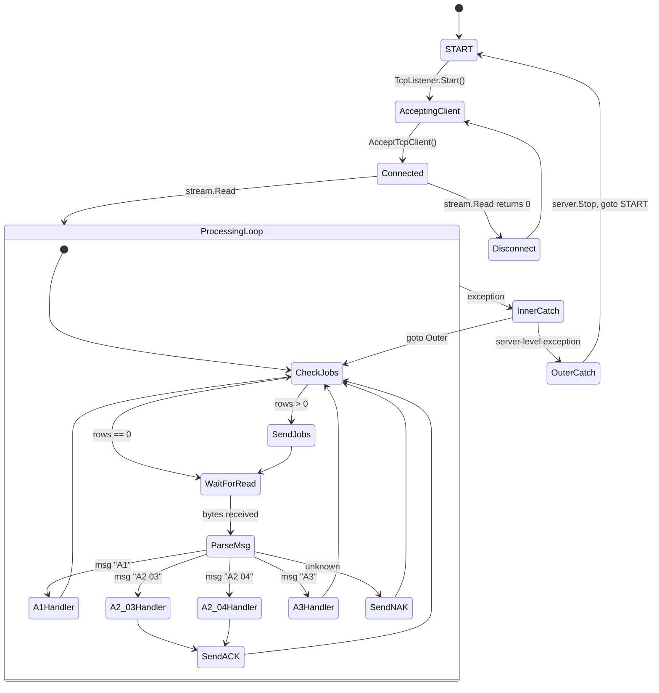

# 05 — פרוטוקול הרשת (Network Protocol)

> **פרויקט:** Goldbond · מודרניזציית מערכת איתור מנופי RTG
> **מחבר:** Mary, האנליסטית העסקית (BMad)
> **תאריך:** 26 באפריל 2026
> **שלב:** שלב 1 — גילוי, צעד 5 מתוך 9
> **קלטים עיקריים:** קוד `TOSConsole{1,2,3}/Program.cs`, `TOSService/Program.cs`, ו-`Crc32.cs` (זהה לארבעה הקבצים).
> **מטרת המסמך:** תיעוד מלא של הפרוטוקול PLC ↔ Listener: פורט, transport, פורמט הודעה, framing, message types, offsets, checksum, ACK/NAK, התנהגות reconnect, וההבדלים בין שלושת הקראנים.
> **מצב:** טיוטה לבדיקה ואישור.

> **אזהרה — אותה אזהרה מצעד 3:** הפרוטוקול שמתואר כאן נלמד מקוד ה-`TOSConsole1/Program.cs` והווריאנטים. הליסטנר בייצור (`TOSService.exe` 2022-06-09) עשוי להבדיל בפרטים. מאפייני הפרוטוקול (offsets, message types, ACK format, checksum) נראים יציבים בארבעת ה-source files שראינו, אך יש לאמת מול RE של הבינארי בצעד 8.

---

## 1. תקציר מנהלים

הפרוטוקול הוא **ASCII-over-TCP, בינארי-מקודד-hex**, עם **קידומת `??`** עבור הודעות יוצאות-מ-PLC ו-**קידומת `0xFF 0xFF`** עבור הודעות יוצאות-לליסטנר. הוא משתמש ב-**fixed byte offsets** בלי שום framing layer. הליסטנר עושה `stream.Read(256)` ומניח שכל קריאה מחזירה הודעה אחת שלמה — הנחה שגויה ב-TCP. אין hash/CRC validation על inbound, רק על outbound (וגם זה אינו CRC אלא modular sum של תווי ASCII). ארבעה message types (`A1`, `A2 03`, `A2 04`, `A3`) ושני reply types (ACK, NAK) — סך הכל 6 הודעות בקטלוג.

חמש תופעות חמורות של הפרוטוקול:

1. **אין framing** — הודעת A1 שנשברת ב-TCP segmentation תיגרם להודעה תופרדה לשתיים, או הודעה ארוכה תקבל "זנב" של הבאה. הקוד אינו מטפל בזה.
2. **אין inbound checksum validation** — הליסטנר מקבל כל מה ש-PLC זייף; שיבוש שקט ב-DB אם offset-ים תקפים אך תוכן corrupted.
3. **`Crc16Ccitt` הוא שם מטעה** — הקוד עושה `sum += (int)char` ואז `~sum + 1` (two's complement 16-bit) — לא CRC-CCITT אלא modular sum. אלגוריתם פגיע יותר.
4. **NAK statelessness:** הקוד שולח NAK תמיד באותה מחרוזת קבועה (`FFFF303342313046454641`) — אין בו "מה השגיאה" ולא counter. אם PLC retries אינסופית — אין דרך לשבור מעגל.
5. **Per-crane configuration קשיח בקוד** — port, CHE constant, log path — לא ב-config. שינוי דורש re-build.

---

## 2. שכבת התחבורה

| מאפיין | ערך |
|---|---|
| Transport | TCP IPv4 |
| Listening side | Goldbond infrastructure (Listener) |
| Initiating side | Crane PLC |
| Listener bind IP | `0.0.0.0` (`new TcpListener(port)`) — `IPAddress` הקשיח `192.6.1.8` או `192.6.8.52` שב-source הוצהר אבל לא בשימוש |
| Listener ports | **30701** (GOLD1), **30702** (GOLD2), **30703** (GOLD3) |
| מספר חיבורים מקראן | **אחד בלבד** (`AcceptTcpClient` אחד; שאר ניסיונות ימתינו ב-backlog) |
| Buffer size | `Byte[256]` — 256 bytes |
| Encoding | ASCII (`System.Text.Encoding.ASCII.GetString`) |
| Encoding ניתן ל-uppercase | כן (`data = data.ToUpper()`) — מאלץ אותיות גדולות |

**הערה אבטחה:** הליסטנר מקבל חיבור מ**כל IP**, אין whitelist. מי שיכול להגיע ל-port 30701 ב-OT network יכול לעשות `??...A2 04 ...` ולגרום לרשומה ב-DB עם פעולת PLACE שלא הייתה. **Q-PROTO-01.**

---

## 3. מבנה הודעה כללי

### 3.1 הודעה יוצאת מהקראן (PLC → Listener)

```
Offset:  0  1  2  3  4  5  6  ...
Bytes:   ?  ?  ?  ?  T  T  ?  ... <fields at fixed offsets>
```

- **Bytes 0-1:** `??` (קידומת קבועה).
- **Bytes 2-3:** מצויין הקוד אבל לא נבדק תוכן.
- **Bytes 4-5:** message type — `A1`, `A2`, `A3`.
- **Bytes 6 ו-mעלה:** תוכן לפי type (משתנה).

### 3.2 הודעה יוצאת לקראן (Listener → PLC)

שני סוגי-תגובה ועוד הודעת-עבודה (broadcast):

| מצב | פורמט |
|---|---|
| ACK של PICK/PLACE | `0xFF 0xFF` + `04B2<counter><checksum>` בקידוד hex של ASCII |
| NAK / unknown | `0xFF 0xFF 30 33 42 31 30 46 45 46 41` (קבוע, =`FFFF03B10FEFA` ב-ASCII) |
| Broadcast עבודה | בייטים מהשדה `Message` של `RG_B3` — תוכן שנקבע ע"י ה-UI |

ה-listener שולח את ההודעות ב-`stream.Write(bytes, offset, length)`.

### 3.3 הקידוד (encoding pattern)

ב-ACK: הליסטנר עובר על המחרוזת `"04B2<counter><chksum>"` בעזרת `ReturnAsciText`:
- כל תו ב-ASCII string מומר ל-`int → hex` של 2 ספרות.
- כל ה-strings מצורפים. ל-`"04B2"` למשל → `30 34 42 32` ב-hex (2 hex digits לכל ASCII char).
- ההמרה ל-bytes נעשית ב-`StrToByteArray` שלוקח שני hex digits וממיר ל-byte אחד.

תהליך מוזר: `"04B2"` (4 chars) → `"30344232"` (8 hex chars) → `[0x30, 0x34, 0x42, 0x32]` (4 bytes). הבייטים שיוצאים אל ה-PLC הם ה-ASCII codes של התווים `'0'`, `'4'`, `'B'`, `'2'`.

**נטו:** הפרוטוקול שולח אקסיט בלבד. גם ה-`0xFF 0xFF` קידומת אינה ASCII — היא binary בייטים. אז הודעה יוצאת מהליסטנר היא **2 בייטים בינאריים + ASCII payload**.

---

## 4. Message Types

### 4.1 `A1` — Position Update (PLC → Listener)

הודעה תקופתית שמשדרת מצב המנוף. מוצאת **כל ~1-2 שניות**.

**Offsets בקוד `TOSConsole1`:**

| Offset | אורך | שדה | יעד DB (RG_A1) |
|---:|---:|---|---|
| 0 | 2 | `??` (prefix) | — |
| 4 | 2 | `A1` (msg type) | — |
| 12 | 6 | `Time` (HHMMSS) | `Time` |
| 18 | 4 | `Status` | `Status` |
| 22 | 8 | `HBBlockName` (e.g. `BOND1   `) | `HBBlockName` |
| 30 | 3 | `HBBayNumber` | `HBBayNumber` |
| 33 | 3 | `HBRowNumber` | `HBRowNumber` |
| 36 | 4 | `HBHeight` | `HBHeight` |
| 40 | 2 | `CraneStatus` | `CraneStatus` |
| 42 | 2 | `GPSStatus` | `GPSStatus` |
| 55 | 2 | `PLC` | `PLC` |
| 75 | 2 | `Len` | `Len` |
| 77 | 1 | `TwistLock` | `TwistLock` |

**Bytes 6-11, 26-29, 44-54, 56-74:** לא מנוקבים בקוד; ייתכן שיש בהם תוכן (header? או padding) — **Q-PROTO-02**.

**ACK:** **לא נשלח** עבור A1. ה-listener מבצע UPDATE ל-`RG_A1` ועובר להודעה הבאה.

### 4.2 `A2 03` — PICK Done (PLC → Listener)

הודעה כשהמנוף סיים lift.

**Offsets:**

| Offset | אורך | שדה | תפקיד |
|---:|---:|---|---|
| 0 | 2 | `??` | prefix |
| 4 | 2 | `A2` | msg type |
| 12 | 2 | `Counter` | מסונכרן ל-`RG_B3.Counter` |
| 14 | 2 | `03` | sub-type (PICK) |
| 40 | 5 | (משוער: weight) | משמש ב-A2 04 ל-`RtgWeight`; ב-A2 03 לא נצפה שימוש |
| 78 | 5 | `BlocCode` (e.g. `BOND1`) | filter ב-WHERE |
| 86 | 3 | `Bay` | LocationCode prefix (digits) |
| 89 | 1 | `Row` | LocationCode middle (letter or digit) |
| 92 | 1 | `Height` | LocationCode suffix |
| 114 | 2 | (משוער: `Len`) | (לא ברור — Q-PROTO-03) |

**ACK שנשלח:**
```
0xFF 0xFF + ASCII("04B2" + <counter_2chars> + <calcChecksum("04B2" + counter)>)
```

**Side effect:** אם `Row` (offset 89) הוא `G` או `T` (ground/truck), ה-listener בודק `RG_Container` count — אם 0, מסמן `ContainerPick{n}` flag ב-`TB_Parameters`.

### 4.3 `A2 04` — PLACE Done (PLC → Listener)

מבנה זהה ל-A2 03; תת-סוג `04` במקום `03`. ה-listener מבצע handoff מלא:
- UPDATE `RG_B3.PlaceDate`
- אם יש `RG_Container` row → DELETE + UPDATE `CO_Containers.EntranceForkliftDate/OperatorID/Number`
- INSERT ל-`RG_Shifting`
- UPDATE שתיים על `TB_Location`: ניקוי המקום הישן + סימון המקום החדש (או רק הניקוי אם G/T)
- UPDATE על `CO_Containers.LocationCode + RtgWeight`

**ACK זהה ל-A2 03.**

### 4.4 `A3` — Cancel ACK (PLC → Listener)

הודעה כשהמנוף מקבל הוראת cancel.

**Offsets:**

| Offset | אורך | שדה |
|---:|---:|---|
| 0 | 2 | `??` |
| 4 | 2 | `A3` |
| 6 | 2 | `Counter` (להבדיל מ-A1/A2 שב-12) |

**Side effect:**
```sql
UPDATE RG_B3 SET CancelDate = GetDate()
WHERE A3Date IS NOT NULL AND Counter='<counter>' AND CHE='GOLD1'

UPDATE RG_B3 SET A3Date = GetDate()
WHERE A3Date IS NULL AND Counter='<counter>' AND CHE='GOLD1'
```

יש כפילות בלוגיקה (שני UPDATE-ים עוקבים) — נראה כשני "stages": ראשית `A3Date`, ושנית `CancelDate`. לא ברור למה לא במגוון אחד.

**אין ACK** עבור A3.

### 4.5 NAK (Listener → PLC)

קבוע: `0xFF 0xFF 30 33 42 31 30 46 45 46 41`. ב-ASCII זה `FFFF03B10FEFA` — אין משמעות פנימית מובהקת. קוד `03B1` ייתכן שמסמן NAK; `0FEFA` נראה כ-checksum-של-קבוע.

**מתי NAK נשלח:**
- ב-`TOSConsole1`: כשקידומת `??` קיימת אבל `A1`/`A2`/`A3` לא תואמים — שורת ברירת-מחדל בסוף ה-`if (data.Substring(0,2) == "??")`.
- ב-`TOSService` (גרסת המקור הנוכחית, ב-טיוטה): התנאי `if (sub != "A1" || sub != "A2" || sub != "A3")` הוא **תמיד true** (באג לוגי) — NAK נשלח אחרי **כל** הודעה. אם הבינארי הפרוס מ-2022 בנוי על קוד שהיה לו `&&` במקום `||` — הוא היה תקין.

### 4.6 Broadcast Job Message (Listener → PLC)

לא הודעת-תגובה אלא **הודעה יזומה** מהליסטנר. בכל iteration של הלולאה הראשית:

```sql
SELECT Message FROM RG_B3
WHERE CHE='GOLD1' AND A3Date IS NULL AND PickDate IS NULL
UNION ALL
SELECT MessageCancel FROM RG_B3
WHERE CHE='GOLD1' AND MessageCancel IS NOT NULL AND CancelDate IS NULL
```

לכל row תוצאה: `ToByteArray(Message)` ואז `stream.Write`. ה-`Message` הוא `"FFFF" + hex(PreMessage + checksum)` — נבנה ע"י ה-UI בשעת INSERT.

**הקראן מקבל burst של הודעות** אם הצטברו עבודות בזמן disconnect.

---

## 5. ה-Checksum (`calcChecksum`)

```csharp
static string calcChecksum(string instr)
{
    int Checksum = 0;
    for (int i = 0; i < instr.Length; i++)
    {
        Checksum += (int)(instr[i]);
    }
    ushort twosComp = (ushort)(~Checksum + 1);
    return string.Format("{0:X}", twosComp);
}
```

**מה זה עושה:** סיכום ערכי-ASCII של תווי הקלט, ואז two's complement 16-bit של הסכום, מיוצג כ-hex.

**מה זה לא עושה:** אינו CRC-16-CCITT. לא אינו CRC כלל. **זהו פשוט additive checksum** — חלש.

**שם הקלאס:** `Crc16Ccitt` — מטעה בכוונה או בטעות. שם הקובץ `Crc32.cs` — מטעה גם הוא.

**נחישות לשגיאות:**
- שינוי שני בייטים שמתקזזים (`+1` ו-`-1`) → checksum זהה — מצב cleartrack מתפספס.
- Permutation של בייטים → checksum זהה.
- שינוי בייט בודד → checksum משתנה (זה יחיד שהוא כן תופס).

**מסקנה לעיצוב:** ב-Phase 2 — להשתמש ב-CRC-16-CCITT אמיתי או ב-CRC-32, **בכפוף לכך שה-PLC תומך**. אם ה-PLC משדר checksum לפי האלגוריתם הקיים (=additive sum), ובינתיים אנחנו לא רוצים לשנות את הקוד של ה-PLC — נצטרך **לחלץ אותו פרוטוקול ישן** ולתעד בבריור שזה weakness ידוע.

---

## 6. Inbound Checksum Validation — איננה

הליסטנר **אינו מבצע** validation על checksum של הודעה נכנסת. הוא רק:
- בודק קידומת `??`.
- חותך לפי offsets קשיחים.
- מבצע SQL.

אם PLC מזייף או רשת מטעה payload עם offsets תקפים אך תוכן שגוי — DB יתעדכן בלי אזהרה. **Q-PROTO-04.**

---

## 7. Framing (אינו)

הקוד מניח שכל `stream.Read(256)` מחזיר הודעה אחת:

```csharp
while ((i = stream.Read(bytes, 0, bytes.Length)) != 0)
{
    data = System.Text.Encoding.ASCII.GetString(bytes, 0, i);
    data = data.ToUpper();
    if (data.Substring(0, 2) == "??") { ... }
}
```

**הנחות שגויות:**
- TCP יכול לשבר הודעה אחת לשני packets (Nagle's, MTU). `stream.Read` יחזיר את ה-packet הראשון; ה-`Substring(0, 2) == "??"` יעבוד אבל ה-Substring(12, 6) (Time) או Substring(22, 8) (HBBlockName) יזרוק `ArgumentOutOfRangeException`.
- TCP יכול לאחד שתי הודעות לאותו packet. `stream.Read` יחזיר 256 bytes שמכילים שתי הודעות. הקוד יבדוק את הראשונה ויעבד אותה; השנייה תאבד (היא יושבת ב-buffer מ-offset הבא של ההודעה הראשונה והקוד אינו מבצע scan).

**משמעות מעשית:** בייצור-טוב הזה הולך לעבוד רוב הזמן, **כי PLC ככל הנראה שולח חבילה אחת בכל פעם, וה-MTU מאפשר את זה**. אבל בלחץ network — אבדן הודעות שקט.

**לעיצוב Phase 2:** framing מבוסס-`System.IO.Pipelines` (ב-.NET 8) או length-prefix ב-PLC — מה שאפשרי.

---

## 8. State Machine והתנהגות לאורך זמן



**עקרונות:**
- שני catch levels: inner (per-message) ו-outer (per-connection).
- אין shutdown gracefully.
- אין heartbeat.

---

## 9. הבדלים בין שלושת הליסטנרים והשירות (`TOSService`)

| מאפיין | TOSConsole1 | TOSConsole2 | TOSConsole3 | TOSService |
|---|---|---|---|---|
| port | 30701 | 30702 | 30703 | 30702 (קשיח, רק Gold2 מוגדר ב-`Main`) |
| CHE | `'GOLD1'` | `'GOLD2'` | `'GOLD3'` | פרמטר (`gold` ב-`TOS()`) |
| `localAddr` (declared but mostly unused) | `192.6.1.8` | `192.6.1.8` | מוערה | `192.6.8.52` |
| Log path | `\\Broadcast\Logs\RTG\RTG1\TOSConsole1\` | `\\Broadcast\Logs\RTG\RTG2\TOSConsole2\` | `\\Broadcast\Logs\RTG\RTG3\TOSConsole3\` | `\\Broadcast\Logs\RTG\TosService\` |
| Log version | `2023-09-06` | `2024-08-14` | `2023-09-06` | `2022-03-21` |
| Stream read mode | `while (...) {}` (full loop) | `while (...) {}` | `while (...) {}` | **single read** (`{...}` בלי while) |
| בדיקה לפני `goto START` (anti-collision) | יש (`Process.GetProcesses().Count(thisName) > 1`) | יש | יש | יש |
| WriteLog ב-`ReturnAsciText` | לא | יש | לא | יש |
| בענף `A2 04` בדיקת G||T | `G || T` | `G || T` | **`T` בלבד** (באג ידוע — Q-COMP-05) | `G || T` (בקוד הטיוטה) |
| `if (data.Substring(4,2) != A1 \|\| != A2 \|\| != A3)` בדיקה ל-NAK | מובלעת בענף else | מובלעת | מובלעת | **תמיד true** — NAK ייצא תמיד |

**מסקנה:** drift בולט. הקוד אינו מסונכרן בין שלושת הענפים. מה שאחת תיקנה אחת לא קיבלה. וב-TOSService — **הקוד לא יכול לקמפל**.

---

## 10. Reconnect & resilience

**ב-Listener:**
- אם `stream.Read` מחזיר 0 — יציאה מ-while הפנימי. קופץ ל-`AcceptTcpClient` הבא.
- אם זרק SocketException — נופל ב-catch הפנימי, `goto Outer` — לולאה אינסופית של DB queries בלי קראן מחובר.
- רק ב-`AcceptTcpClient` exception → `goto START` → `server.Stop()` → recreate.

**ב-PLC:** אין מידע ישיר; ההנחה ש-PLC עושה auto-reconnect ב-TCP keep-alive או keep-alive פעיל בעת שהוא רואה שאין תגובה.

**Burst של הודעות אחרי reconnect:**
כל ה-`RG_B3` rows שלא הצליחו ב-PickDate IS NULL ולא ב-A3Date IS NULL — יישלחו שוב ברצף, ב-loop בלי delay. PLC עלול לקבל 2-3 jobs באלפיות שניה. **אם PLC לא עושה dedup — ייתכן double-execute.** Q-PROTO-05 (כפולה ל-Q-FLOW-02).

---

## 11. שאלות פתוחות שנפתחו בצעד הזה

| # | שאלה | למה זה חשוב |
|---:|---|---|
| Q-PROTO-01 | מי בעל זכות-גישה ל-port 30701-30703 ב-OT network? יש Firewall/whitelist? | אבטחה |
| Q-PROTO-02 | מה תוכן הבייטים בין ה-prefix ל-message type (offsets 6-11) ובין השדות (offsets 26-29, 44-54, 56-74)? Header? Padding? | תיעוד מלא של הפרוטוקול |
| Q-PROTO-03 | מה משמעות `Substring(114, 2)` — `Len`? יחסית למיקום או לאורך מכולה? | תיאור A2 |
| Q-PROTO-04 | האם ה-PLC משדר checksum בהודעות נכנסות? אם כן, באיזה offset? אם כן — צריך לבדוק | קריטי לזיהוי שיבוש שקט |
| Q-PROTO-05 | האם ה-PLC עושה deduplication על job-burst אחרי reconnect? | קריטי לסיכון שכפולה |
| Q-PROTO-06 | מה ההתנהגות של ה-PLC בקבלת NAK `FFFF03B10FEFA`? Retry? Halt? | חלק מהתגובה לסיטואציית corruption |
| Q-PROTO-07 | האם זה פרוטוקול KoneCranes או Goldbond proprietary או vendor אחר? | מקור לדוקומנטציה רשמית |
| Q-PROTO-08 | האם ה-PLC מבצע connection-keep-alive (keepalive packets / ping) או רק TCP-level keepalive? | מימוש reconnect ב-Phase 2 |

---

## 12. צעדים הבאים

1. **המתנה לאישורך** על תיאור הפרוטוקול — בעיקר על הזיהוי `Crc16Ccitt` כשם שגוי, על ההגדרה של NAK, ועל הבעיות של no-framing + no-validation.
2. בכפוף לאישור — מעבר ל-**צעד 6 (Operator UI inventory)** עם ניתוח מסך-אחרי-מסך של RTGApp ו-ForkliftApp, כולל RTL/Hebrew, אופנת auth, התנהגות offline, ו-pain points.
3. **בקשה אופרטיבית:** אם תוכל להעביר vendor docs של פרוטוקול-המנוף (KoneCranes V40 או דומה) — זה יתיר מספר שאלות פתוחות (Q-PROTO-02, 04, 06, 07).

---

> **סיום צעד 5.** המשך מותנה באישור.
