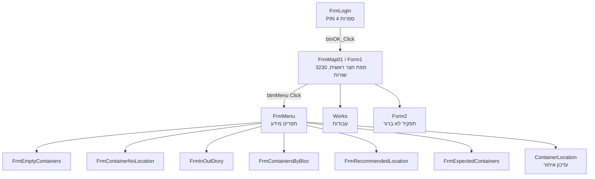
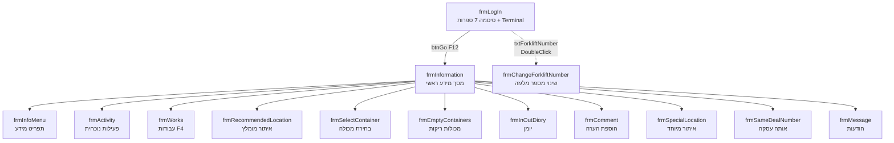

# 06 — Operator UI Inventory

> **פרויקט:** Goldbond · מודרניזציית מערכת איתור מנופי RTG
> **מחבר:** Mary, האנליסטית העסקית (BMad)
> **תאריך:** 26 באפריל 2026
> **שלב:** שלב 1 — גילוי, צעד 6 מתוך 9
> **קלטים עיקריים:** RTGApp (`From TFS/RTG/RTG1-2/RTGApp/RTGApp/`), ForkliftApp (`From TFS/RTG/New Folder/ForkliftApp/ForkliftApp/`); קוד ה-Forms, ה-Designer files (לחילוץ Hebrew labels), `app.config`, ו-`FrmLogin.cs` / `frmLogIn.cs`.
> **מטרת המסמך:** סקירה של כל מסך משני ה-UI: שם, תפקיד, מסלולי-ניווט, פעולות, טקסט עברי/RTL, מודל הזדהות, התנהגות offline (אם בכלל), ו-pain points אופרטיביים שניכרים בקוד או בהערות.
> **מצב:** טיוטה לבדיקה ואישור.

---

## 1. תקציר מנהלים

שתי אפליקציות-מפעיל פעילות במערכת:

1. **RTGApp.exe** — UI לתא המנוף. WinForms .NET 4.8, מסך אחד ראשי עם מפת-החצר (`FrmMap01` = `Form1.cs`, ~3,000 שורות). כניסה דרך `FrmLogin` עם **PIN בן 4 ספרות** (לא מסונן באובייקט הסיסמה — מוצג גלוי), ניווט ל-FrmMenu (~7 מסכי-משנה למידע ועדכון).
2. **ForkliftApp.exe** — UI לתא מלגזה. WinForms .NET 4.0, ארכיטקטורת N-tier עם 5 פרויקטים. כניסה דרך `frmLogIn` עם **סיסמה בת 7 ספרות**, מסך-מידע ראשי (`frmInformation`) ו-13 מסכי-משנה. **יש בסיס קוד למעבר בין שני terminals: אשדוד (ILCXQ) וחיפה (ILGBH)** — ממצא שלא הופיע בבריף.

חמש תופעות מערכתיות ברמת ה-UI:

1. **שתי שיטות-הזדהות שונות** — RTGApp בודק PIN של 4 ספרות נגד `HR_Emp.UserPinCode`, ForkliftApp בודק 7 ספרות מול `ForkliftAppDA.IsValidUser`. שני מסלולי auth שמתחברים לאותה `HR_Emp`.
2. **🚨 ForkliftApp `frmLogIn.cs:194` מכיל connection string עם `sa`/`z3334606*` בקוד-מקור** — לא רק ב-app.config. הקוד פותח SqlConnection ישירות עם credentials embedded.
3. **שני terminals תומכים** — Ashdod ו-Haifa. הקובץ `Terminal.txt` (יחיד בכל תחנה) קובע. ForkliftApp תומך בשני; RTGApp **לא נצפה בו תיעוד דומה** — סביר שעובד רק באחד.
4. **פעמון התראת-תקשורת ב-ContainerLocation** — `"כשל בתקשורת מול מנוף יש לרענן תקשורת מול מנוף"` (טקסט מהקוד) — הודעה ברורה כשהקראן לא עונה. רומז שזה מצב שכיח דיו לכדי מסר ייעודי.
5. **אין תמיכה offline** — שתי האפליקציות תלויות ב-DB live. מסכים נטענים בקריאות ישירות SqlConnection. בנפילת רשת/DB ה-UI נכבה (MessageBox + Cursor.Default).

---

## 2. RTGApp — UI תא המנוף

### 2.1 ארכיטקטורת מסכים



### 2.2 פירוט המסכים

| Form | תפקיד (לפי לייבל מקובץ) | מקור | פעולות עיקריות (Buttons) | Hebrew indicator |
|---|---|---|---|---|
| `FrmLogin` | הזדהות | קובץ `CHEName.txt` + DB query על SC_Users group 22 | בחירת CHE, BlockName, LoginName; הקשת PIN; OK/Exit | `אינך מורשה להכנס למערכת` |
| `FrmMap01` (Form1) | מפת חצר ראשית | `V_MapRTGBond1`/`V_MapRTGBond2`, polling 500ms | לחיצה על תא בחצר → fill From/To; Submit; Cancel; שורת סטטוס; כפתורי-מידע | `עדכון איתורים`, `מחק`, `הסר מערוגה` |
| `FrmMenu` | תפריט מידע מסכים-משנה | אין DB; פותח forms חדשים | 7 כפתורים → 7 מסכי-משנה | (כפתורים מוגדרים ב-Designer) |
| `FrmEmptyContainers` | מכולות ריקות | DB query | חיפוש, סינון, סגירה | `אין נתונים`, `יציאה`, `מכולות ריקות` |
| `FrmContainerNoLocation` | מכולות ללא איתור | DB query | חיפוש, סגירה | `מכולות ללא איתור` |
| `FrmInOutDiory` | יומן כניסות/יציאות | DB query | תצוגה, סגירה | (Hebrew column headers) |
| `FrmContainersByBloc` | מכולות לפי גוש | DB query (GroupBy block) | בחירת block, תצוגה | `מכולות לגוש` |
| `FrmRecommendedLocation` | מיקומים מומלצים | DB | תצוגה | (Hebrew) |
| `FrmExpectedContainers` | מכולות צפויות | DB | תצוגה | (Hebrew) |
| `ContainerLocation` | עדכון איתור ידני | DB UPDATE | בחירת מקור, יעד, אישור | `עדכון איתורים`, `מאיתור:`, `לאיתור:`, `כשל בתקשורת מול מנוף יש לרענן תקשורת מול מנוף` |
| `Works` | מסך עבודות (לא נצפה לעומק) | DB | (Q-UI-01) | `עבודות` |
| `Form2` | לא ידוע — שם default | (לא נצפה) | (Q-UI-02) | (Q-UI-02) |

### 2.3 פרטי FrmMap01 (המסך הראשי)

- **גודל קוד:** 3,230 שורות (RTG1-2) / 3,062 שורות (RTG3) — מונולית.
- **State:** משתני static משותפים ל-form (`TimeByTimer`, `SecondsByTimer`).
- **Timer פולס כל ~500ms** (`TimerCHE_Tick_1`):
  - שואב `RG_A1` עבור ה-CHE שנבחר ב-login.
  - בודק `TB_Parameters.RefreshMapRTG{n}` — אם TRUE, רענון map מ-View `V_MapRTGBond{n}`, איפוס flag.
  - בודק `TB_Parameters.ContainerPick{n}` — אם TRUE, פעולת UI ייעודית (מציג widget?).
  - מעדכן `SecondsByTimer` ע"פ פער הזמנים.
- **ענפי if (CHE.Text == "GOLD1") ו-if (CHE.Text == "GOLD2")** — קוד hardcoded לשם הקראן (לא parametric). Q-UI-03.
- **פתיחת Forms-משניים:** `FrmMenu`, `Works`, `ContainerLocation` — UI inadvertent multi-window experience (forms פתוחים נשארים פתוחים).

### 2.4 PIN entry ב-FrmLogin

הוצג בפירוט בצעד 3 §2. סיכום הפגמים:
- 10 כפתורי טאצ' (One_Click ... Zero_Click + DELETE).
- ה-PIN נראה גלוי ב-textbox (אין `PasswordChar`).
- ה-SQL: `SELECT COUNT(*) WHERE UserGroupCode=22 AND UserPinCode = <PIN_TEXT>` — לא parameter, וגם לא מתחשב ב-LoginName הנבחר. כל אחד עם PIN זה יכנס.
- אין lockout, אין retry counter, אין lokking.

### 2.5 RTL / Hebrew

כל הטקסטים שמצאנו מ-Designer files הם ב-עברית עם הגדרת RTL מובנית של WinForms (כפי שמשתמע מ-`label.Text = "מאיתור:"` שמוצג RTL כשה-Form הוא RTL). לא ראינו locale-flag בקוד; ההנחה היא ש-WinForms יורש את ה-locale של המערכת המארחת (Windows Hebrew) או שיש `RightToLeft=Yes` ב-Designer.

**לא נצפו טקסטים אנגליים מסוג שגיאה לטובת המפעיל** — כל ה-error labels בעברית. סטנדרט טוב.

---

## 3. ForkliftApp — UI נהג מלגזה

### 3.1 ארכיטקטורת מסכים



### 3.2 פירוט המסכים

| Form | תפקיד | מקור נתונים | פעולות (Buttons) | Hebrew indicator |
|---|---|---|---|---|
| `frmLogIn` | הזדהות + בחירת terminal | `V_UserMalgezot`, `Terminal.txt`, `ForkLiftNumber.xml` | בחירת user, הקשת PW (7 ספרות), אישור F12 / יציאה F10 | `לא קיים משתמש כזה`, `אישור {F12}`, `יציאה  F10` |
| `frmInformation` | מסך מידע ראשי — פרטי מכולה נוכחית | DB queries מ-`CO_Containers`, `CP_Deal`, `TC_Client` וכד' | F2 נזק, F3 שאילתה, F4 עבודות, F5 מידע, F6 אחים, F7 שמורות, F10 יציאה, F12 המשך | `מכולה:`, `משקל:`, `תוכן:`, `לקוח:`, `קו:`, `איתור/צפוי:`, `נזק   F2`, `שמורות F7`, `אחים   F6`, `יציאה  F10`, `שאילתה F3`, `עבודות F4`, `מידע   F5`, `המשך {F12}`, `קרון`, `העמסה לרכבת`, `העמסה למשאית`, `הוספת הערה` |
| `frmActivity` | רישום פעילות (PICK/PLACE) | sp_ForkLift\* | (Q-UI-04) | (Hebrew) |
| `frmChangeForkliftNumber` | שינוי מספר מלגזה | קובץ `ForkLiftNumber.xml` | אישור / ביטול | `שינוי מספר מלגזה`, `הקש/י מספר מלגזה חדש` |
| `frmComment` | הוספת הערה | DB | סגור / עדכן | `הוספת הערה`, `הוסיפו הערה` |
| `frmEmptyContainers` | מכולות ריקות | sp_ForkLiftContainersEM | (Q-UI-05) | (Hebrew) |
| `frmInfoMenu` | תפריט מידע | אין DB | סגור / מסכי משנה | (Hebrew) |
| `frmInOutDiory` | יומן כניסות/יציאות | sp_ForkLiftInOutDiory(_App) | (Q-UI-05) | (Hebrew) |
| `frmMessage` | הודעות-מערכת | (Q-UI-06) | סגור | (Hebrew) |
| `frmRecommendedLocation` | מיקומים מומלצים | sp_ForkLiftRecommendedLocation | (Q-UI-05) | (Hebrew) |
| `frmSameDealNumber` | מכולות מאותה עסקה | (Q-UI-05) | סגור | (Hebrew) |
| `frmSelectContainer` | בחירת מכולה | (Q-UI-05) | סגור | (Hebrew) |
| `frmSpecialLocation` | איתורים מיוחדים | sp_ForkliftSpecialLocationCombo | (Q-UI-05) | `איתור מיוחד` |
| `frmWorks` | רשימת עבודות | sp_ForkLiftWorks(ByDate) | F9 הכל, F10 יציאה, F5 מידע | `הכל   F9`, `יציאה F10`, `מידע   F5` |
| `Form1` (`NumericKeyPad`) | UserControl גנרי של מקלדת | אין | (משמש בכל ה-forms) | `מחק`, `Back` |

### 3.3 פרטי frmLogIn

- **טעינה אוטומטית** של `ForkLiftNumber.xml` מהתיקייה הנוכחית — קובץ XML עם elements `ForkLiftID` ו-`ForkliftAppVertsia` (גרסה).
- **טעינה אוטומטית** של `Terminal.txt` — `"1"` → אשדוד; אחרת → חיפה.
- ה-combobox `cmbTerminal` הופך ל-`Enabled = false` אחרי הטעינה — המפעיל **לא יכול לשנות**.
- `frmLogInLoad` פותח SqlConnection **ישירות בקוד** (line 194) עם:
  ```
  Data Source=192.6.8.52;Initial Catalog=TerminalData;Persist Security Info=True;User ID=sa;Password=z3334606*
  ```
  ⚠ זה **בנוסף** ל-credentials ב-app.config — שני מקומות לאותם credentials.
- שאילתה `SELECT LoginName FROM V_UserMalgezot ORDER BY LoginName`. מילוי dropdown.
- **PIN בן 7 ספרות** (`if (this.txtPassWord.Text.Length == 7)`) — אורך שונה מ-RTGApp (4 ספרות).
- **משתמש "sa"** מטופל במיוחד — אם `txtUserName.Text == "sa"`, מעבר ל-`flnu = 0` בלי לבדוק ForkliftNumber. דלת אחורית מובנית.
- כפתור `אישור {F12}` — קישור פעולה ל-F12.
- כפתור `יציאה F10` — קישור ל-F10. הקוד `frmLogIn_KeyDown` עם F1/F10 **מוערה ב-//** — נסיון מוקדם להוסיף קיצורים ש-disabled.

### 3.4 RTL / Hebrew

ForkliftApp כתוב 100% בעברית בלייבלים, ועם **קיצורי-מקלדת F2-F12** — ככל הנראה מסוף-מלגזה משתמש במקלדת פיזית בנוסף לטאצ'-סקרין. F-keys זה דפוס שנפוץ במלגזות.

### 3.5 Terminal-awareness — חידוש שלא תועד בבריף

```csharp
if (cmbTerminal.Text == "אשדוד")
{
    ForkliftAppBL.m_Terminal = "ILCXQ";
    ForkliftAppDA.m_Terminal = "ILCXQ";
}
else
{
    ForkliftAppBL.m_Terminal = "ILGBH";
    ForkliftAppDA.m_Terminal = "ILGBH";
}
```

**שתי terminals**: `ILCXQ` (אשדוד) ו-`ILGBH` (חיפה?). הבריף הזכיר רק `ILCXQ` (Goldbond's container terminal). **שאלה גדולה: האם ForkliftApp רץ ב-Goldbond Haifa גם? RTGApp רץ שם? מה ה-DB?** — Q-UI-07.

זה משנה את המודל מ-"מערכת לטרמינל בודד" ל-"מערכת ל-2 טרמינלים בלפחות".

### 3.6 PIN entry ב-frmLogIn

- 10 כפתורי טאצ' (One_Click ... Zero_Click + DELETE).
- `txtPassWord` הוא `MaskedTextBox` — בניגוד ל-RTGApp שמשתמש ב-`TextBox` רגיל. **כנראה הסיסמה מוסתרת** (אבל לא נצפה ה-Mask property — Q-UI-08).
- אורך 7 — אם המפעיל מקליד פחות, הקוד ב-`touchScreen1_OnUserControlButtonClicked` בדק `if (this.txtPassWord.Text.Length == 7)` ב-button "אישור {F12}". אבל אם המפעיל לא לוחץ touchScreen1's button — בדיקה רק ב-`btnGo_Click` שאינה מסתפקת באורך.
- יש מצב race עדין: `IsValidUser` שולח `un, pw, ForkLiftNum` ל-`ForkliftAppDA.IsValidUser` — לא ראינו את הקוד שם, אבל ההנחה שזה SP `sp_ForkliftValidUser` עם 3 פרמטרים.

---

## 4. השוואת משכי-זמן ו-pain points (משוער מהקוד)

| תופעה | RTGApp | ForkliftApp |
|---|---|---|
| **תכופת polling** | 500ms ל-Timer ראשי + Q-UI-09 | (לא נצפה — דורש בדיקה) |
| **Thread.Sleep ב-UI** | 2000ms בענף PICK (לפי הבריף — לא נצפה ישירות עוד) | (Q-UI-10) |
| **מספר sub-windows פתוחות בו-זמנית** | פוטנציאלית-רב — `frm.Show()` לא `ShowDialog()` | משולבת — `frm.ShowDialog()` ב-frmInformation |
| **ניהול מצב שגיאה** | `MessageBox.Show` חוסם UI thread | אותו דבר |
| **תמיכה ב-offline** | אין | אין |
| **תמיכה ב-keyboard-shortcuts** | מינימלית | רחבה (F2-F12) |
| **חתימה דיגיטלית (sign-in audit)** | INSERT ל-`RG_Log` (אבל פגום — ראה צעד 3) | (`sp_ForkliftValidUser` — לא נצפה) |

---

## 5. Pain points מהקוד וההערות

### RTGApp:
- "כשל בתקשורת מול מנוף יש לרענן תקשורת מול מנוף" (`ContainerLocation.cs`) — מסר ייעודי שמרמז שזה מצב שכיח.
- "מכולה לא מזוהה חובה להקליד מספר מכולה לפני הנחה בערוגה" — מצב חוסר-זיהוי של מכולה (אם הקראן מנקה אותה לפני שהמערכת זיהתה).
- `Class1.cs` ו-`CodeFile1.cs` — קבצי-default-name. סימן לאיכות-קוד נמוכה.
- Designer files עם ~1000+ שורות — מסכים שנכתבו ב-VS Designer ולא תוחזקו ידנית.

### ForkliftApp:
- "לא קיים משתמש כזה \nנסה שנית בבקשה" — generic error message; לא מבחין בין משתמש לא-קיים, סיסמה שגויה, מספר-מלגזה שגוי.
- Comments מוערים ב-//// בלוקים גדולים של תאמת-מבחנים (`txtUserName.Text = "sa"`, `txtPassWord.Text = "3334606"`, `txtForkliftNumber.Text = "25"`) — credentials לבדיקה נשארו בקוד ב-comment, **אבל הצביעו על ערכי-ברירת-מחדל שהיו פעם** ובעצם זרים.
- F-keys זמינים אבל רובם לא ברורים — `F2 נזק`, `F3 שאילתה`, ... — מערכת F-keys שלמה שדורשת לימוד.
- `MyGlobal.bTouch` — boolean גלובלי שמשפיע על האם הקלדת מקש מוסיפה לטקסט או מחליפה. נושא בעיתי עבור concurrent touches.

---

## 6. Auth model — סיכום בין שתי האפליקציות

| היבט | RTGApp | ForkliftApp |
|---|---|---|
| **שדה זיהוי** | `LoginName` (combo) | `txtUserName` (combo) — "sa" מקבל treatment מיוחד |
| **שדה PIN/Password** | `Password` (TextBox רגיל) | `txtPassWord` (MaskedTextBox) |
| **אורך** | 4 ספרות | 7 ספרות |
| **שיטת בדיקה** | `SELECT COUNT(*) FROM HR_Emp WHERE UserPinCode = <PIN_TEXT>` ללא parametrization | `ForkliftAppDA.IsValidUser(un, pw, ForkLiftNum)` — נראה SP-based |
| **שדה נוסף** | `CHE` + `BlockName` (פוסט-זיהוי) | `txtForkliftNumber` + `cmbTerminal` |
| **דלת אחורית** | אין מובהקת (אבל ה-LoginName אינו מאומת — ראו §2.4) | `txtUserName.Text == "sa"` מקבל בדיקה פחותה |
| **שמירת session** | משתני static (`StrCHE`, `StrBlockName`, `StrOperatorID`) ב-FrmLogin | `GlobalVariables.LoginNameStr` static בתוך `frmLogIn` |
| **logout** | אין | אין מנגנון מובהק |
| **Lockout** | אין | אין |
| **MaskedTextBox / PasswordChar** | אין (PIN גלוי) | יש MaskedTextBox (Mask field נדרש לבדוק — Q-UI-08) |

---

## 7. Offline behavior — אין

שתי האפליקציות **תלויות ב-DB live**. בקריסת DB:
- `Crc16Ccitt.ReturnDT` (RTG) או `SqlConnection.Open` (Forklift) זורק SqlException.
- ב-RTGApp — Cursor חוזר ל-Default; `MessageBox` עלול להיות מוצג.
- ב-ForkliftApp — `MessageBox.Show(ex.Message)` (לא Hebrew, generic error).

אין מנגנון:
- write queue
- offline cache של מצב המכולות
- dryrun-mode

**משמעות לעיצוב Phase 2:** offline-first architecture חייבת להופיע אם רשת לא יציבה. מינימום: write-queue ב-Forklift (כי הוא כן יכול עובד ללא DB אם המלגזה כרגע באוויר עם מכולה).

---

## 8. שאלות פתוחות שנפתחו בצעד הזה

| # | שאלה | למה זה חשוב |
|---:|---|---|
| Q-UI-01 | מה התפקיד של `Works.cs` ב-RTGApp? לא נצפה | מסך נוסף לא מתועד |
| Q-UI-02 | מה התפקיד של `Form2.cs` ב-RTGApp? שם default | מסך נוסף לא מתועד |
| Q-UI-03 | למה `if (CHE.Text == "GOLD1")` ו-`if (CHE.Text == "GOLD2")` ב-FrmMap01 — ולא parametric? יש ענפים ייחודיים שאי-אפשר לאחד? | חוב טכני |
| Q-UI-04 | מה תהליך הדיווח ב-`frmActivity` של ForkliftApp? לא נצפה | זרימת activity reporting |
| Q-UI-05 | מה הזרימה של `frmWorks`, `frmRecommendedLocation`, `frmInOutDiory`, `frmEmptyContainers` ב-ForkliftApp? לא נצפו לעומק | להשלים מסכי-משנה |
| Q-UI-06 | מי מייצר הודעות ב-`frmMessage` ב-ForkliftApp? push? polling? | מודל messaging פנימי |
| Q-UI-07 | האם ForkliftApp רץ גם ב-Goldbond Haifa (`ILGBH`)? אם כן — האם RTGApp שם גם? יש שני TerminalData? | היקף הפרויקט גדל פעמיים |
| Q-UI-08 | מהו ה-Mask של `txtPassWord` ב-ForkliftApp? סיסמה מוסתרת? | בדיקת UX סודיות |
| Q-UI-09 | מהו ה-frequency של ה-Timer ב-FrmMap01 ב-RTGApp? נצפה רק 500ms בבריף — צריך לאמת בקוד | נושא עומס DB |
| Q-UI-10 | האם יש `Thread.Sleep` ב-ForkliftApp UI? | UX freezes |
| Q-UI-11 | האם המסך הראשי של ForkliftApp (`frmInformation`) הוא modal (`ShowDialog`) או modeless (`Show`)? — בקוד נצפה `ShowDialog` | מודל ה-window stack |
| Q-UI-12 | האם הליסטנר של ForkliftApp רץ אוטומטית ב-startup של Windows, או שהמשתמש מפעיל ידני? | תפעול |

---

## 9. צעדים הבאים

1. **המתנה לאישורך** על הסקירה — בעיקר על שתי הממצאים הגדולים: (א) שני terminals תומכים, (ב) credentials של `sa` בקוד ForkliftApp.
2. בכפוף לאישור — מעבר ל-**צעד 7 (Edge case register)** עם לפחות 25 תרחישי-תקלה ועיוותי-קלט שעוברו עד כה: ניתוק רשת, malformed packet, באג TOSConsole3, dead session ב-RG_Log, באג `||` של NAK, ועוד.

---

> **סיום צעד 6.** המשך מותנה באישור.
