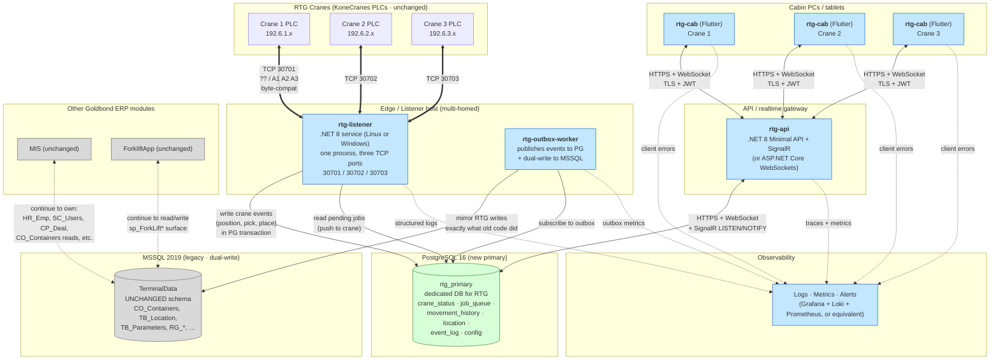

# 01 — Target Architecture

> **Phase 2 — Step 2.1** · Designer: Claude Code · Date: 2026-04-21
> **Based on:** all 9 Phase 1 discovery documents + operator answers of 2026-04-21 (vendor=KoneCranes; crane subnets 192.6.{1,2,3}.x; DB on 192.6.8.x; TOSService is live).

---

## 1. Design principles (inherited from the prompt + Phase 1 findings)

These are the non-negotiable constraints on the new design:

1. **Every capability that exists today must exist in the new system.** Migration is about technology and UX, not feature reduction.
2. **Module-by-module, not big-bang.** During transition, write to both PostgreSQL (primary) and MSSQL (legacy) in parallel.
3. **The operator is not a technical user.** UI must be radically simple. Operators wear gloves, don't stare at the screen, operate one-handed.
4. **Hebrew-first, RTL.** No exceptions.
5. **Preserve the wire protocol byte-for-byte.** KoneCranes PLCs will not be re-firmware'd.
6. **No secrets in binaries.** No secrets in source. No secrets in code review.
7. **No `xp_cmdshell`-driven control plane.** The process-lifecycle / DB-server coupling must be replaced with proper process supervision.
8. **One code path per component.** Retire the Crane-1-2 / Crane-3 fork.
9. **Observability is a first-class concern.** Today there is almost none.

---

## 2. High-level component diagram



---

## 3. Component catalogue (what replaces what)

| Legacy component | Replacement | Lives on | Why |
|---|---|---|---|
| `TOSConsole1.exe` + `TOSConsole2.exe` + `TOSConsole3.exe` (x86 .NET 4.8, copy-paste triplicated) | **`rtg-listener`** — single .NET 8 service, one process, three configurable TCP bindings | Edge / listener host | Consolidate three copy-paste programs; cross-platform (Linux-capable); modern runtime; parametrised per-crane via config |
| `TOSService.exe` (secondary listener on DB server, only GOLD2 active) | **Retired.** If crane-2 PLC is configured to target the DB server's IP, move it to target the edge host instead as part of Phase 2 rollout. Keep the TOSService binary deployed (not restarted) as a dormant fallback for weeks 1-2 of the transition per crane, then remove. | — | Redundant under the new model; preserves blast-radius during cutover |
| `ConsolesReRun.exe` watchdog (.NET 6) | **`systemd` (Linux) or Windows Service recovery actions** on the edge host | Edge host | Industry-standard supervision; no custom watchdog required |
| `KillToss1/2/3.exe` | Retired. Replaced by service-manager commands. | — | Hard-kill utility; not needed with proper supervision |
| Stored procs `KillToss{n}`, `RunEnconsoleRTG{n}` invoking `xp_cmdshell` | **Retired.** `xp_cmdshell` disabled on SQL01. UI's "Reconnect" button becomes a signed HTTPS call to `rtg-api` → `systemctl restart rtg-listener@{crane_id}`. | — | Removes a gaping security hole. |
| `RTGApp.exe` RTG1-2 variant + `RTGApp.exe` RTG3 variant (both x86 WinForms .NET 4.8) | **`rtg-cab`** — single Flutter app, parametrised per-crane from config. Targets: Windows (primary, for existing cabin PCs) and Android tablet (secondary, for future field use). | Cabin PC / tablet | Unifies the fork; modern UI; offline-tolerant; RTL-first; cross-platform; replaces 2 binaries with 1 |
| `TB_Parameters.RefreshMapRTG{n}` bit flags + 500-ms UI polling | **Server-push via SignalR / WebSocket** on `rtg-api`; server watches PG via `LISTEN/NOTIFY` | `rtg-api` + PG triggers | Replaces polling-over-DB pattern with push events; drops DB load ~36 q/s → ~0 baseline |
| Direct DB access from the WinForms UI with hard-coded / fallback credentials | **HTTPS API**. Cabin UI never holds a DB credential. Auth is JWT from `rtg-api`. | — | Defuses the `malgezot/12345678` and `z3334606*` exposure; enables per-user lockout, audit, rotation |
| `RG_ErrorLog` (1.6 M rows) as application log | **Structured logs to Loki / journald / file** with retention policy | Observability stack | Removes DB-write-amplification from the logging path |

---

## 4. Technology stack per component — with justifications

### 4.1 Listener (`rtg-listener`) — **.NET 8 LTS** (Windows-compatible; Linux-preferred)

| Option | Pros | Cons | Verdict |
|---|---|---|---|
| **.NET 8 LTS** | (a) Team familiarity — the existing code is C#; (b) first-class `System.Net.Sockets` with modern `SocketAsyncEventArgs`; (c) `System.IO.Pipelines` solves the framing problem natively; (d) easy SQL Server + PostgreSQL dual-write via `Microsoft.Data.SqlClient` + `Npgsql`; (e) self-contained single-file deploy; (f) LTS = 3 years support | Larger runtime footprint than Go/Rust; GC pauses under heavy load (not a concern at this rate) | **✅ Chosen** |
| Go | Tiny binary, good concurrency, good networking primitives. Arguably the best for a pure TCP broker. | No C# team knowledge; PG + MSSQL drivers less mature than .NET's; the team is probably Windows-dev first | Rejected |
| Rust | Best performance and safety. | Big onboarding curve for a small team; overkill for the throughput | Rejected |
| Node.js | Ubiquitous for network servers; quick to iterate. | Awkward with binary protocols (Buffer semantics); worse SQL Server support; harder to deploy as a Windows service | Rejected |

**Why .NET 8 fits:** preserves the team's existing skills from the legacy code; `System.IO.Pipelines` *is* the answer to Phase 1's biggest wire-protocol gap (no framing). Cross-platform so the edge host can be Linux if that's preferred.

### 4.2 API / Realtime gateway (`rtg-api`) — **ASP.NET Core Minimal API + SignalR on .NET 8**

| Option | Pros | Cons | Verdict |
|---|---|---|---|
| **ASP.NET Core + SignalR** | Proven, well-supported, excellent WebSocket ergonomics, same runtime as listener, first-class auth middleware | Microsoft-ecosystem lock-in (acceptable here) | **✅ Chosen** |
| Node + Socket.IO | Lightweight, popular | Team skill; less clean integration with PG notifications | Rejected |
| Raw WebSocket (no library) | Minimal dependency | Reinvent too much | Rejected |

**Transport:** HTTPS + SignalR (which uses WebSocket when supported, falls back to long-polling). The cabin UI holds one persistent WebSocket to receive live state; write operations are plain REST POSTs.

### 4.3 Cabin UI (`rtg-cab`) — **Flutter (Dart)**

| Option | Pros | Cons | Verdict |
|---|---|---|---|
| **Flutter (Dart)** | (a) User explicitly requested it; (b) single codebase targets Windows desktop and Android tablet; (c) excellent RTL & large-touch-target support; (d) mature WebSocket + HTTP client; (e) offline storage via `sqflite`/`drift`; (f) Hebrew rendering works out-of-the-box | Dart is a new language to the team; deploying on Windows is fine but slightly fiddly; limited Windows tablet testing vs web-based UIs | **✅ Chosen (mandate from prompt)** |
| WinUI 3 / WPF | Excellent Windows integration | Windows-only; operators may want Android tablet | Not aligned with prompt |
| Web (PWA) in Chrome kiosk mode | Works anywhere | Hebrew/RTL fine but harder; offline PWA is still rough; large-font kiosk UI needs custom work | Rejected |

### 4.4 Primary DB — **PostgreSQL 16** (LTS)

- Latest stable LTS; `LISTEN/NOTIFY` for push events; JSONB for flexible payloads; logical replication for future MIS integration; excellent performance on the expected load.
- Managed offering **not required** for Phase 2 MVP but recommended long-term (Cloud SQL / Azure DB for Postgres / RDS).
- Schema design in `02_data_model.md`.

### 4.5 Legacy DB — **MSSQL 2019** unchanged

- Schema stays exactly as-is. No RTG-driven schema changes.
- `xp_cmdshell` will be **disabled** as part of the Phase 2 cutover.
- Triggers that today drive the `RefreshMapRTG{n}` flags can remain active during dual-write transition; the new system ignores them (it uses PG `LISTEN/NOTIFY` instead).

### 4.6 Observability — **Grafana + Loki + Prometheus** (suggested)

Or whatever the ops team already uses (Elastic, Datadog, Splunk). The design just requires:
- Structured logs (JSON) with correlation IDs.
- Metrics (RED: Rate, Errors, Duration — per component).
- Alerts on: listener disconnect > 30 s, PG or MSSQL unavailable, outbox lag > 60 s, job not picked by crane after N minutes.

### 4.7 Secrets — **centralized vault** (HashiCorp Vault / Azure Key Vault / or even `.env` files read at startup for MVP)

No secret in source. No secret in binary. No secret committed anywhere.

### 4.8 CI/CD — **GitHub Actions or Azure DevOps** producing signed **Release** builds

(Legacy Debug builds were accidentally deployed to prod — see `08_binaries.md` §2. Phase 2 fixes.)

---

## 5. Deployment model — who runs where

```
┌──────────────────────────────────────────────────────────────────────────────┐
│                               KoneCranes PLCs                                │
│   ┌─────────────┐  ┌─────────────┐  ┌─────────────┐                          │
│   │ Crane 1 PLC │  │ Crane 2 PLC │  │ Crane 3 PLC │                          │
│   │ 192.6.1.x   │  │ 192.6.2.x   │  │ 192.6.3.x   │                          │
│   └──────┬──────┘  └──────┬──────┘  └──────┬──────┘                          │
└──────────┼─────────────────┼─────────────────┼──────────────────────────────┘
           │ TCP 30701       │ TCP 30702       │ TCP 30703
           │                 │                 │
┌──────────▼─────────────────▼─────────────────▼──────────────────────────────┐
│                        Edge host (multi-homed NICs)                         │
│  ┌────────────────────────────────────────────────────────────────────────┐ │
│  │  rtg-listener (.NET 8 service)                                         │ │
│  │   - binds 30701 on NIC in 192.6.1.x                                    │ │
│  │   - binds 30702 on NIC in 192.6.2.x                                    │ │
│  │   - binds 30703 on NIC in 192.6.3.x                                    │ │
│  │   - reads config from /etc/rtg/listener.yaml (or similar)              │ │
│  │   - writes PG + emits outbox rows                                      │ │
│  └────────────────────────────────────────────────────────────────────────┘ │
│  ┌────────────────────────────────────────────────────────────────────────┐ │
│  │  rtg-outbox-worker                                                     │ │
│  │   - subscribes to PG outbox                                            │ │
│  │   - applies writes to MSSQL (mirror what legacy code did)              │ │
│  └────────────────────────────────────────────────────────────────────────┘ │
│  Supervision: systemd (if Linux) or Windows Services                         │
└──────────────────────────────────────────────────────────────────────────────┘
                 │                    │                    │
                 │ HTTPS/TLS          │ SQL/TLS            │ SQL/TLS
                 │                    │                    │
      ┌──────────▼───────────┐    ┌───▼──────────┐    ┌────▼─────────┐
      │   rtg-api server     │    │ PostgreSQL16 │    │   MSSQL2019  │
      │  (.NET 8 + SignalR)  │    │  rtg_primary │    │  TerminalData│
      │  on management net   │    │  192.6.9.x   │    │  192.6.8.52  │
      └──────────┬───────────┘    └──────────────┘    └──────────────┘
                 │
                 │ HTTPS/TLS + WebSocket + JWT
                 │
      ┌──────────┼──────────┬──────────┐
      ▼          ▼          ▼          ▼
┌──────────┐ ┌──────────┐ ┌──────────┐
│ Cabin PC1│ │ Cabin PC2│ │ Cabin PC3│   (Windows desktop / tablet;
│ rtg-cab  │ │ rtg-cab  │ │ rtg-cab  │    Flutter app; offline DB cache
│ Flutter  │ │ Flutter  │ │ Flutter  │    for last-known state)
└──────────┘ └──────────┘ └──────────┘
```

### 5.1 Placement decisions

| Component | Runs on | Rationale |
|---|---|---|
| `rtg-listener` | **Edge host only.** 1 instance on the customer network. | *(Updated 2026-04-21 after KoneCranes network diagram review.)* Cranes are NATted through mGuard 4004 firewalls and reach the TOS via the Terminal Router. The edge host needs **a single NIC on the customer network (192.6.8.x or 192.6.9.x)** — NOT multi-homed to each crane's private subnet. See `docs/discovery/10_konecranes_reference.md` §3.1-3.3. |
| `rtg-outbox-worker` | **Edge host.** Same process as listener OR separate. | Co-locates with listener to minimize cross-host DB traffic; or split for isolation. MVP: separate process for easier restart semantics. |
| `rtg-api` | **Management host.** Can be co-located with edge host for now; separate in production. | Doesn't need crane-network access; only DB + cabin-network. |
| `PostgreSQL` | Dedicated DB host (new, `192.6.9.x` subnet suggested) | Separate failure domain from MSSQL; dedicated backup; right-sized for RTG-only load. |
| `MSSQL` | **Unchanged** — SQL01 / 192.6.8.52 | Legacy. Do not touch the host. |
| `rtg-cab` | **Each cabin PC.** Identical binary on all three. | Per-crane config read at app launch. |
| Observability | Management host or cloud | Existing ops infra if available. |

### 5.2 High-availability posture

- **Edge host:** single-host initially (matches legacy footprint). Phase-2.5 option: warm standby with DNS or VIP failover. Cabin UIs reconnect automatically.
- **PG:** replicated (streaming replication) to a secondary for disaster recovery.
- **rtg-api:** stateless; can run 2 replicas behind a small load balancer.

---

## 6. Network topology — including dual-write

### 6.1 Subnets *(updated 2026-04-21 to reflect KoneCranes network diagram)*

| Subnet | Purpose | Hosts |
|---|---|---|
| `192.6.1.0/20` | **Crane 1** private LAN (behind mGuard 4004 NAT) | Crane 1 PLC, GPS-PC/CCS (192.6.1.8), cameras |
| `192.6.2.0/20` | **Crane 2** private LAN (behind mGuard 4004 NAT) | Crane 2 PLC, GPS-PC/CCS (192.6.2.8), cameras |
| `192.6.3.0/20` | **Crane 3** private LAN (assumed similar pattern) | Crane 3 PLC, GPS-PC/CCS |
| `192.6.0.0/16` | **Customer network** (supersumes all above via Terminal Router) | Terminal Router (L3/DGW) 192.6.8.254, DGPS Base Station 192.6.8.8, MSSQL SQL01 192.6.8.52 |
| `192.6.9.0/24` *(new)* | PG + new services | PG primary, rtg-api, edge host |
| Management / client | Cabin PCs connect to rtg-api | Cabin PCs, rtg-api |

**Topology:** each crane has its own private LAN firewalled via an mGuard 4004 NAT router; cranes egress through the firewall to reach the TOS on the customer network. **The edge host does NOT need a NIC on each crane's LAN.** One customer-network NIC is sufficient; the Terminal Router handles routing. This matches the KoneCranes-delivered `BxH-RTG-Gold-Bond-Ashdod-Connectivity-Layout-05092017.pdf`.

**Clarification on the legacy `192.6.1.8` literal in `TOSConsole1/Program.cs`:** this is the **crane-side GPS-PC IP**, not a listener bind address. The legacy `localAddr` variable that is never used in `TcpListener(port)` constructor is a misnamed piece of dead code. Confirmed in `docs/discovery/10_konecranes_reference.md` §3.

### 6.2 Firewall rules (minimum)

```
# crane PLC → edge host
allow tcp 192.6.1.0/24 → edge_ip:30701
allow tcp 192.6.2.0/24 → edge_ip:30702
allow tcp 192.6.3.0/24 → edge_ip:30703

# edge host → PostgreSQL
allow tcp edge_ip → pg_ip:5432

# edge host → MSSQL (dual-write)
allow tcp edge_ip → 192.6.8.52:1433

# rtg-api ← → cabin PCs
allow tcp cabin_subnet ← → rtg_api_ip:443

# rtg-api → PG
allow tcp rtg_api_ip → pg_ip:5432

# rtg-api → MSSQL (read-only)
allow tcp rtg_api_ip → 192.6.8.52:1433

# NO xp_cmdshell; NO MSSQL connections from the cab; NO cranes on any management network.
```

### 6.3 Dual-write path visualization

```mermaid
sequenceDiagram
    autonumber
    participant L as rtg-listener (edge)
    participant PG as PostgreSQL
    participant OB as rtg-outbox-worker
    participant MS as MSSQL (legacy)

    Note over L,MS: Every crane event follows this pattern
    L->>PG: BEGIN
    L->>PG: UPDATE crane_status + UPDATE job + INSERT movement
    L->>PG: INSERT outbox(event_type, payload)
    L->>PG: COMMIT (atomic)
    PG-->>L: ok
    L-->>PG: LISTEN notify_payload (trigger fires)
    PG-->>OB: NOTIFY "outbox_new"
    OB->>PG: SELECT FROM outbox WHERE sent_mssql=false
    OB->>MS: transactional write<br/>(mirrors legacy statements)
    alt success
        OB->>PG: UPDATE outbox SET sent_mssql=true, sent_at=now()
    else MSSQL fails
        OB->>PG: UPDATE outbox SET attempts=attempts+1, last_error=...
        Note over OB: exponential backoff; alert if attempts>5
    end
```

Critical property: **the PG transaction is the source of truth.** MSSQL dual-write is *eventual* and *retryable*. If MSSQL fails, the crane doesn't notice; the operator doesn't notice; only the outbox lag metric moves. This is the classical **transactional outbox** pattern.

Alternatives evaluated (Q-51 has fuller comparison):
- **Synchronous dual-write** — listener writes both DBs in one transaction-like flow. Rejected: requires distributed transactions (XA / DTC) or compensation logic; partial-write failures are hard. One DB down = both halted.
- **CDC (Debezium/similar)** — read PG WAL, ship to MSSQL. Rejected for Phase 2 MVP: heavier infra; harder to control exact SQL shape needed to match what ForkliftApp expects.
- **Transactional outbox (recommended).** Producer writes PG atomically; separate worker mirrors to MSSQL with retries.

---

## 7. Authentication, authorization, audit

### 7.1 What changes from legacy

| Aspect | Legacy | New |
|---|---|---|
| Auth factor | 4-digit PIN only, matched against group-22 table | 4-digit PIN **bound to the selected LoginName** |
| Lockout | None | 5 failed attempts → 15-min lockout; alerts ops |
| Session | Opens FrmLogin → FrmMap01; never closes | Short-lived JWT (e.g. 8-hour shift expiry) issued by `rtg-api`; refreshes within valid shift |
| Logout | Implicit (close app) | Explicit logout button; also on idle timeout (configurable, default 30 min) |
| Audit | `RG_Log(OperatorID, LoginDate, CHE, BlockName)` — login-only | `rtg_audit_log` — login, logout, every job dispatch, every manual override, every config change, signed with user+timestamp |
| Password rotation | Schema has `DateOfPinCodeUpdate` + `TB_Parameters.PinCodeUpdateDaysInterval`; never enforced | Enforced in login flow; PIN change screen is mandatory past the policy age |
| Where the secret lives | DB table `HR_Emp.UserPinCode` as `int` (!) | Hashed (Argon2id) in `rtg_operator.pin_hash` — never plaintext |
| Who can change a PIN | Whoever has DB access | Operator (change their own); supervisor (reset others) |

### 7.2 AuthN flow

```mermaid
sequenceDiagram
    actor Op as Operator
    participant UI as rtg-cab
    participant API as rtg-api
    participant PG as PostgreSQL
    participant MS as MSSQL (legacy dual-write)

    Op->>UI: pick LoginName, type PIN
    UI->>API: POST /auth/login {login_name, pin, crane_id}
    API->>PG: SELECT operator WHERE login_name=$1 AND group=22 AND active=true
    PG-->>API: operator_row
    API->>API: verify Argon2id(pin, operator_row.pin_hash)
    alt valid
        API->>PG: INSERT rtg_login_log (operator_id, crane_id, ts, success=true)
        API->>PG: INSERT outbox("login_recorded", {operator_id, crane_id}) (legacy RG_Log mirror)
        API-->>UI: { jwt, expires_at, policy_info }
        UI->>UI: open map; subscribe to SignalR /hubs/crane/$crane_id
    else invalid
        API->>PG: INSERT rtg_login_log (..., success=false)
        API->>PG: UPDATE operator SET consecutive_failures = consecutive_failures + 1
        API-->>UI: 401 { reason: invalid_pin | locked }
        UI->>Op: "אינך מורשה להכנס — נסה שוב בעוד X דקות"
    end
```

### 7.3 AuthZ

Role-based. Roles (minimum):

- `crane_operator` — login; issue pick/place jobs for their assigned crane; view yard map.
- `yard_supervisor` — everything crane_operator can do, across all cranes; reset operators' PINs; acknowledge alerts; override stuck jobs.
- `admin` — supervisor + configuration changes; audit viewer.

Roles map to `SC_AppGroup` in legacy. During transition, the new `rtg_role` table holds the mapping.

### 7.4 Audit

Every state-changing action writes one row to `rtg_audit_log`:

| Column | Type | Note |
|---|---|---|
| `id` | bigserial | |
| `ts` | timestamptz | |
| `actor_operator_id` | text | from JWT |
| `actor_role` | text | |
| `action` | text | `login`, `logout`, `dispatch_job`, `cancel_job`, `reset_pin`, etc. |
| `target_entity` | text | job id / container id / operator id |
| `crane_id` | text | |
| `before` | jsonb | snapshot of changed fields |
| `after` | jsonb | |
| `request_id` | uuid | correlates with observability logs |

Retention: **7 years** (or whatever HR / legal require).

---

## 8. Observability

### 8.1 The minimum to ship (MVP)

| Signal | How | Why |
|---|---|---|
| **Structured logs** (JSON, stdout) | `Serilog` or `Microsoft.Extensions.Logging` with JSON formatter on both listener and api; `log/print` with `jsonEncode` in Flutter; ship to Loki / file / Event Log | Phase 1 showed the UI + listener had basically no useful logs. Recovery after incidents was luck-based. |
| **RED metrics per request / packet** | `Prometheus.NetRuntime` + custom counters; scraped by Prometheus | Rate / Errors / Duration for each protocol type, each API endpoint |
| **Trace IDs through the stack** | `W3C TraceContext`; each crane packet → listener → PG gets one trace id; visible in all logs | Makes debugging in a yard outage possible |
| **Business KPIs** | Gauges: `rtg_pending_jobs_total`, `rtg_crane_offline_seconds`, `rtg_outbox_lag_seconds`, `rtg_mssql_sync_failures_total` | Direct operator value |

### 8.2 Alerts

| Alert | Condition | Severity |
|---|---|---|
| Crane offline | `rtg_crane_last_packet_ago_seconds > 30` | warning; paging at > 120 |
| Outbox lag | `rtg_outbox_lag_seconds > 60` | warning; paging at > 600 |
| MSSQL unreachable from listener or outbox worker | connection-refused ≥ 3× in 1 min | **critical (page)** |
| PG unreachable | connection-refused ≥ 3× in 1 min | **critical (page)** |
| Authentication failure storm | ≥ 10 failures per operator within 5 min | warning |
| Listener process crashed | systemd/service manager restart count ≥ 2 per 5 min | **critical** |
| Job dispatched but not picked within 10 minutes | time between `dispatched` and `pick_received` > 10 min | warning to supervisor |

### 8.3 Dashboards

At least 3 pre-built dashboards:

1. **Cranes live view** — one panel per crane: connected? last packet age? active job? pending jobs count? last error?
2. **Dual-write health** — outbox backlog, sync lag, failure counters per event type.
3. **Operator sessions** — active operators, recent login / logout, lockouts.

---

## 9. Configuration management

### 9.1 The principle

Nothing configurable lives in source or in the compiled binary. Per-crane deployment is one file.

### 9.2 Listener config (example, `listener.yaml`)

```yaml
listener:
  edge_host_name: gb-rtg-edge-01

  cranes:
    - id: GOLD1
      tcp_port: 30701
      bind_interface: eth1              # NIC on 192.6.1.0/24
      block_names: [BOND1, BOND2]        # valid BlocCodes this crane reports
      counter_wrap_at: 255
    - id: GOLD2
      tcp_port: 30702
      bind_interface: eth2
      block_names: [BOND1, BOND2]
      counter_wrap_at: 255
    - id: GOLD3
      tcp_port: 30703
      bind_interface: eth3
      block_names: [BOND3]
      counter_wrap_at: 255

  protocol:
    # parameters derived from Phase-1 reverse-engineering; some pending KoneCranes spec
    magic_header: "??"
    ack_prefix: "FFFF"
    ack_body: "04B2"
    nak_prefix: "FFFF"
    nak_body: "03B10FEFA"
    checksum_algorithm: legacy_additive_twos_complement_16bit
    validate_inbound_checksum: false      # toggle ON once Q-11 resolves offset of checksum field
    keepalive_probe_seconds: 15
    socket_read_timeout_seconds: 30

  database:
    postgres:
      conn_string_env: RTG_PG_CONN         # secret never in this file
      schema: rtg
    mssql_dual_write:
      enabled: true                        # turn false per crane at its cutover
      conn_string_env: RTG_MSSQL_CONN
      compatibility_mode: "v2024_10_29"    # which legacy wire-shape the outbox should mirror

observability:
  logs_format: json
  metrics_bind: 0.0.0.0:9090
  service_name: rtg-listener
  env: prod                                # or "stage", "dev"
```

### 9.3 `rtg-api` config and `rtg-cab` config

Similar YAML / `appsettings.json`-style. The cabin app reads an initial bootstrap config bundled with the install (specifying which `rtg-api` URL and which `crane_id` this cabin is for), then pulls operational config from `/api/config/client` after login.

### 9.4 Configuration change flow

- Ops edits the YAML on the edge host.
- `systemctl reload rtg-listener` triggers a hot-reload where possible; otherwise restart.
- Every config change is audited (`rtg_audit_log` + git commit if the config is in git).

---

## 10. New open questions raised by the architecture

### Q-50 🟡 Medium — NIC strategy on the edge host: physical multi-NIC or VLAN trunk?
*Why it matters:* topology decision for the operators building the host. Impacts the `bind_interface` value in the config.
*How to find out:* ops / infra team preference.

### Q-51 🟡 Medium — Is there an existing observability stack?
If yes, use it (don't introduce Grafana/Loki if Elastic exists). If no, Grafana+Loki+Prom is the recommended default.

### Q-52 🟡 Medium — Is there an existing container/VM orchestration platform?
Docker? Kubernetes? None? Affects the `rtg-listener` and `rtg-api` packaging.

### Q-53 🟡 Medium — Is there an existing CI/CD pipeline / code repository?
Azure DevOps, GitHub, GitLab, TFS 2019 still, …? The legacy `.sln` files reference `https://dev.azure.com/goldbond` — likely Azure DevOps. Confirm before Phase 2 implementation begins.

### Q-54 🟡 Medium — Are there MSSQL / PG licensing considerations?
If PG is a strategic target across the ERP modernization, presumably already budgeted. If this is the first PG in the estate, licensing/support needs discussion.

### Q-55 🟢 Low — Languages other than Hebrew?
Currently Hebrew-only. Is English / Russian / Arabic needed for any operator population? Impacts i18n library choice.

---

## 11. Check-in summary

- **One code path per component.** `rtg-listener` replaces 3 copy-pasted TOSConsole binaries + TOSService; `rtg-cab` replaces the RTG1-2 / RTG3 WinForms fork; both unified, per-crane-config-driven.
- **Transactional outbox** is the recommended dual-write pattern — PG is always source of truth, MSSQL is eventually-consistent mirror, with retries and lag metrics.
- **Everything that Phase 1 flagged as a risk is addressed at the architecture level:** (R1 KoneCranes spec) still pending but isolated to listener implementation, not architecture; (R2 secrets) vault + env-vars + JWT; (R3 source drift) binary-diff ILSpy pass as pre-cutover verification; (R4 write amplification) new schema owns its log growth, old triggers can stay silent; (R5 Crane-3 fork) one codebase, parametrised; (R6 xp_cmdshell) killed by design; (R7 no framing) `System.IO.Pipelines`; (R8 no txns) PG transactions; (R9 auth) real AuthN/Z; (R10 DB polling) SignalR + LISTEN/NOTIFY.
- **Next:** Step 2.2 — PostgreSQL schema (DDL) + MSSQL-to-PG mapping table + dual-write strategy detail + data ownership matrix.
