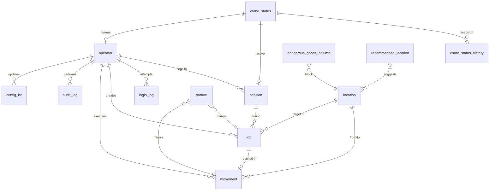
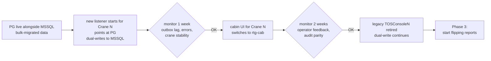

# 02 — Data Model (PostgreSQL)

> **Phase 2 — Step 2.2** · Designer: Claude Code · Date: 2026-04-21
> **Companion file:** [`02_schema.sql`](02_schema.sql) — executable DDL.
> **Scope:** the new PostgreSQL schema that replaces the RTG-owned parts of `TerminalData`, the mapping from legacy MSSQL tables/columns, the dual-write strategy, and the data-ownership rules during the transition.

---

## 1. Design philosophy

Five commitments that drove every schema decision:

1. **Explicit, not packed.** Legacy packs yard coordinates into a single `nvarchar(11) LocationCode` and decodes with `LEFT` / `SUBSTRING` / `REPLACE`. New schema has explicit `block_code`, `bay`, `row_letter`, `height` columns, plus a generated-column `legacy_location_code` for backward-compat joins and outbox mirroring.
2. **Enums for coded fields.** `crane_id`, `block_code`, `job_state`, `role`, `outbox_status`, `connection_state` — all become `CREATE TYPE … AS ENUM`. Cheap validation at the DB boundary; self-documenting.
3. **State machines, not nullable-date columns.** `RG_B3` encoded a 6-state job lifecycle as 4 nullable `datetime` columns (`A3Date`, `PickDate`, `PlaceDate`, `CancelDate`, `FinishDate`). New `rtg.job.state` is an explicit enum; timestamps are kept as secondary columns for auditing / UX.
4. **Partitioned log tables with retention.** `crane_status_history` (replacing `RG_A1_LOG`) and `movement` (replacing `RG_Shifting`) are monthly-partitioned. Old partitions drop on a scheduled job.
5. **No god-table.** `TB_Parameters` (48 cols, one row) is dismembered: RTG-relevant flags (`RefreshMapRTG*`, `ContainerPick*`) become boolean columns on `rtg.crane_status`; genuine config goes into `rtg.config_kv` (JSONB).

---

## 2. Schema summary

| Table | Purpose | Legacy counterpart | Rows (rough scale) |
|---|---|---|---|
| `rtg.operator` | Crane operators + auth | `SC_Users` + `HR_Emp` subset (UserGroupCode=22) | ~100s |
| `rtg.session` | Open login sessions (login + logout lifecycle) | `RG_Log` (partial — RG_Log only captured logins) | ~10k/year |
| `rtg.login_log` | Append-only login attempts (success + failure) | *new* — not in legacy | ~100k/year |
| `rtg.location` | Yard slots with current container | `TB_Location` (RTG subset) | 35k static |
| `rtg.recommended_location` | Suggested yard location by (client, type) | `TB_RecommendedLocation` | 100s |
| `rtg.crane_status` | **Live** status per crane + signal flags | `RG_A1` + parts of `TB_Parameters` + `RG_Container` | **3** (one per crane) |
| `rtg.crane_status_history` | Append-only position history, **partitioned by month** | `RG_A1_LOG` (populated by trigger) | ~10M/year |
| `rtg.job` | Job queue + lifecycle (state machine) | `RG_B3` | ~100k/year |
| `rtg.movement` | Append-only movement events, **partitioned by month** | `RG_Shifting` | ~500k/year |
| `rtg.dangerous_goods_column` | DG lookup for map overlay | `RG_ColDG` | ~100 static |
| `rtg.config_kv` | RTG config (JSONB values) | RTG-relevant subset of `TB_Parameters` | ~10 |
| `rtg.audit_log` | Every state-changing action | *new* — not in legacy | retained 7 yrs |
| `rtg.outbox` | Dual-write events to MSSQL | *new* — infra | ephemeral |

See [`02_schema.sql`](02_schema.sql) for the executable DDL.

---

## 3. Entity-Relationship diagram



*Note:* the diagram shows conceptual relations; many joins in practice go through `container` (char(11)) which the RTG schema owns locally but does not FK-ref to the legacy `CO_Containers` (that table stays in MSSQL).

---

## 4. Key design decisions

### 4.1 `rtg.crane_status` absorbs the RTG-relevant `TB_Parameters` flags

Legacy has five `RefreshMapRTG*` bits + three `ContainerPick*` bits on `TB_Parameters`, used to signal the UI via 2Hz polling. In PG:

- `crane_status.needs_refresh_map boolean` — one per crane (3 rows total, rather than 5 flag columns).
- `crane_status.container_pick_pending boolean` — one per crane (3 rows, rather than 3 flag columns).
- `crane_status.carrying_container char(11)` + `carrying_operator_id` — absorbs `RG_Container` (legacy: one-row-per-crane transient table).

UI is pushed via `LISTEN/NOTIFY` on `crane_status` updates (see `rtg.notify_crane_change` trigger in the DDL). No polling.

### 4.2 `rtg.job` has explicit state machine

```
PENDING  →  SENT      →  ACKED       →  PICKED    →  PLACED
   │                                                    │
   ├──────────────────────────────────────────────►  CANCELLED
   │                                                    │
   └──────────────────►  FAILED  ◄──────────────────────┘
```

Legacy derived the state from `A3Date IS NULL` and `PickDate IS NULL` every time the listener queried. New schema has a direct `state` column + a **partial index** `job_queue_pending_idx ... WHERE state IN (…)` that makes the "pull pending jobs" query O(log(pending)) instead of O(log(historical)).

Counter wrap (the 255 recycle logic in `Form1.cs:1409-1413`) is handled by a UNIQUE constraint `(crane_id, counter)` + application-level recycle logic. No more `SELECT MAX+1` race.

### 4.3 `rtg.location` — structured coordinates with backward-compat column

```sql
CREATE TABLE rtg.location (
    block_code   rtg.block_code_t NOT NULL,
    bay          text NOT NULL,
    row_letter   text NOT NULL,
    height       text NOT NULL,
    ...
    legacy_location_code text GENERATED ALWAYS AS (bay||row_letter||height) STORED,
    ...
    PRIMARY KEY (block_code, bay, row_letter, height)
);
```

The generated column `legacy_location_code` lets the outbox worker (and emergency-SQL-console users) join against `TB_Location.LocationCode` in MSSQL without reinventing the concatenation. It's `STORED`, indexed, and auto-maintained.

### 4.4 Partitioning for log tables

Both `crane_status_history` and `movement` are `PARTITION BY RANGE (ts)`. Pre-create monthly partitions with [`pg_partman`](https://github.com/pgpartman/pg_partman) or a lightweight pgAgent / cron job. Drop partitions older than:
- `crane_status_history`: **90 days** (high-volume, most value is live; older positions aren't useful)
- `movement`: **2 years** (smaller volume; history is queried by operations reports)

The DDL creates the first April 2026 partition; add a scheduled job before go-live.

### 4.5 `rtg.outbox` + `LISTEN/NOTIFY`

The outbox pattern has one table and one trigger that calls `pg_notify`. The `rtg-outbox-worker` subscribes with `LISTEN rtg_outbox_new;` and reacts in milliseconds. Idempotency key prevents double-send if the worker crashes mid-batch.

### 4.6 No FK to MSSQL

RTG references `container char(11)` as an opaque string. We do **not** replicate `CO_Containers` into PG. The legacy MSSQL copy remains the canonical container-master for the transition period. This keeps the PG schema small and the dual-write direction one-way (PG → MSSQL), never two-way.

### 4.7 Hebrew-safe by default

Postgres is UTF-8 end-to-end. `text` everywhere. Hebrew operator names, client names, comments work without any collation or encoding tuning. Row-order uses ICU if needed; default locale works for RTL text.

---

## 5. Legacy → PostgreSQL mapping table

This is the master reference for the `rtg-outbox-worker` to know what to mirror, and for the migration team to know how to move historical data.

Columns marked **N/A (MIS-owned)** stay exclusively in MSSQL.

### 5.1 RG_A1 → rtg.crane_status + rtg.crane_status_history

| MSSQL | PostgreSQL | Transformation |
|---|---|---|
| `RG_A1.CHE` | `crane_status.crane_id` | cast to enum |
| `RG_A1.Time` | `crane_status.last_crane_time` | verbatim; parsed to timestamp in app layer |
| `RG_A1.CTime` | `crane_status.last_packet_at` | `datetime` → `timestamptz at UTC` |
| `RG_A1.Status` | `crane_status.crane_status_code` | verbatim |
| `RG_A1.HBBlockName` | `crane_status.hb_block_code` | TRIM + cast to block_code_t; `BOND1/2/3` unchanged; `G` / `T` normalized |
| `RG_A1.HBBayNumber` | `crane_status.hb_bay` | TRIM |
| `RG_A1.HBRowNumber` | `crane_status.hb_row` | TRIM |
| `RG_A1.HBHeight` | `crane_status.hb_height` | TRIM |
| `RG_A1.CraneStatus` | `crane_status.crane_status_code` *(same name reused in app semantics)* | verbatim; enum in future |
| `RG_A1.GPSStatus` | `crane_status.gps_status_code` | verbatim |
| `RG_A1.PLC` | `crane_status.plc_code` | verbatim |
| `RG_A1.Len` | `crane_status.container_length` | verbatim |
| `RG_A1.TwistLock` | `crane_status.twist_lock` | verbatim |
| *(via trigger)* RG_A1_LOG all columns | `crane_status_history.*` | trigger on crane_status UPDATE writes a row |

### 5.2 RG_B3 → rtg.job

| MSSQL | PostgreSQL | Transformation |
|---|---|---|
| `RG_B3.CounterID` | `rtg.job.id` | new bigserial; counter identity is now (crane_id, counter) |
| `RG_B3.Counter` | `rtg.job.counter` | `char(2)` hex → `int` |
| `RG_B3.CHE` | `rtg.job.crane_id` | cast to enum |
| `RG_B3.ContID1` | `rtg.job.container` | TRIM to 11 chars (preserve) |
| `RG_B3.LiftBlockName` | `rtg.job.lift_block_code` | TRIM + cast to block_code_t |
| `RG_B3.LiftBayNumber` | `rtg.job.lift_bay` | TRIM |
| `RG_B3.LiftRowNumber` | `rtg.job.lift_row` | TRIM |
| `RG_B3.LiftHeight` | `rtg.job.lift_height` | TRIM |
| `RG_B3.PlaceBlockName` / `PlaceBayNumber` / `PlaceRowNumber` / `PlaceHeight` | `place_*` counterparts | as above |
| `RG_B3.Len` | `rtg.job.container_length` | verbatim |
| `RG_B3.A3Date` | `rtg.job.acked_at` | timestamp |
| `RG_B3.PickDate` | `rtg.job.picked_at` | timestamp |
| `RG_B3.PlaceDate` | `rtg.job.placed_at` | timestamp |
| `RG_B3.FinishDate` | `rtg.job.finished_at` | timestamp |
| `RG_B3.CancelDate` | `rtg.job.cancelled_at` | timestamp |
| *(derived)* from date fields | `rtg.job.state` | derivation: if CancelDate — `CANCELLED`; else if PlaceDate — `PLACED`; else if PickDate — `PICKED`; else if A3Date — `ACKED`; else if Message set — `SENT`; else — `PENDING` |
| `RG_B3.Message` | `rtg.job.wire_message` | hex string → `bytea` |
| `RG_B3.PreMessage` | *not stored* | recomputed on demand from the structured coordinates; legacy stored it redundantly |
| `RG_B3.PreMessageCancel` | *not stored* | same |
| `RG_B3.MessageCancel` | `rtg.job.wire_message_cancel` | hex string → `bytea` |
| `RG_B3.OperatorID` | `rtg.job.created_by` | join HR_Emp.EmpID → rtg.operator.id |
| `RG_B3.TruckType` | `rtg.job.truck_type` | verbatim |
| `RG_B3.Time` | *not migrated* | legacy's "5 min from now" future-stamp was protocol-specific |

### 5.3 RG_Log → rtg.session (split into login + session)

| MSSQL | PostgreSQL | Transformation |
|---|---|---|
| `RG_Log.OperatorID` | `session.operator_id` | join HR_Emp.EmpID → operator.id |
| `RG_Log.LoginDate` | `session.started_at` | `datetime` → `timestamptz` |
| `RG_Log.CHE` | `session.crane_id` | cast to enum (`BOND1/2/3` → `GOLD1/2/3`, see Q-09 resolution below) |
| `RG_Log.BlockName` | `session.block_code` | cast to enum |
| — | `session.ended_at`, `session.end_reason` | **new** — legacy had no logout; retrofit as NULL for historical rows |

**Q-09 resolution for migration:** historical `RG_Log.CHE` contains a mix of `BOND1/BOND2/BOND3` (from the UI path that reads `CHEName.txt`) and `GOLD1/GOLD2/GOLD3` (from any code that used the listener's convention). Migration script maps both to the canonical `GOLD{1,2,3}` enum.

### 5.4 RG_Shifting → rtg.movement

| MSSQL | PostgreSQL | Transformation |
|---|---|---|
| `RG_Shifting.OperatorID` | `movement.operator_id` | resolve to bigint |
| `RG_Shifting.CHE` | `movement.crane_id` | cast to enum; normalize BOND↔GOLD |
| `RG_Shifting.BlockName` | `movement.block_code` | cast to enum |
| `RG_Shifting.ShiftDate` | `movement.ts` | |
| `RG_Shifting.Container` | `movement.container` | verbatim |
| `RG_Shifting.FromLocation` | split into `from_block/from_bay/from_row/from_height` | parse 5-char legacy code into 4 structured fields |
| `RG_Shifting.ToLocation` | `to_block/to_bay/to_row/to_height` | same |
| — | `movement.job_id` | link to `rtg.job` when known; NULL for historical |

### 5.5 RG_Container → rtg.crane_status (absorbed)

| MSSQL | PostgreSQL | Transformation |
|---|---|---|
| `RG_Container.Container` | `crane_status.carrying_container` | at most 1 row per CHE in legacy; fits 1 column per crane |
| `RG_Container.CHE` | *PK crane_id* | |
| `RG_Container.OperatorID` | `crane_status.carrying_operator_id` | |

### 5.6 RG_ErrorLog → NOT MIGRATED

Application logs move to Loki/journald/file. The `RG_ErrorLog` table is frozen at cutover; existing 1.6M rows archive to cold storage. Phase 2 does not recreate this table.

### 5.7 TB_Parameters → rtg.config_kv + rtg.crane_status columns

| MSSQL | PostgreSQL | Note |
|---|---|---|
| `TB_Parameters.RefreshMapRTG`, `RefreshMapRTG2`, `RefreshMapRTG3`, `RefreshMapRTG4`, `RefreshMapRTG3N` | `crane_status.needs_refresh_map` (one bool per crane) | 5 flags → 3 bools |
| `TB_Parameters.ContainerPick1`, `ContainerPick2`, `ContainerPick3` | `crane_status.container_pick_pending` | 3 flags → 3 bools |
| `TB_Parameters.PinCodeUpdateDaysInterval` | `config_kv['pin_rotation_days']` | |
| Everything else in `TB_Parameters` | **N/A (MIS-owned)** — stays in MSSQL | 40 columns for other modules |

### 5.8 TB_Location → rtg.location

| MSSQL | PostgreSQL |
|---|---|
| `TB_Location.BlocCode` | `location.block_code` |
| `TB_Location.LocationCode` | split into `bay` + `row_letter` + `height` |
| `TB_Location.Container` | `location.container` |
| `TB_Location.CHE` | `location.crane_id` |
| `TB_Location.Active` / `Empty` / `Special` / `Terminal` | same names in PG |
| `TB_Location.LocationCodeNew` / `BlocCodeNew` | **not migrated** (migration-artifact columns) |
| `TB_Location.LocationType` / `LocationDesc` / `IdyNumber` / `GroupTypeCode` / `PalletType` / `Counter` / `CounterOdd` / `FirstColumn` | **N/A (MIS-owned)** — used by ForkliftApp; stays in MSSQL |

**Scope note:** the RTG module only reads/writes a subset of `TB_Location` columns. We migrate only the RTG subset; ForkliftApp-owned columns remain exclusively in MSSQL.

### 5.9 TB_RecommendedLocation → rtg.recommended_location

Straight 1:1 with Hebrew-column aliases removed (stored as English column names; UI renders Hebrew labels).

### 5.10 RG_ColDG → rtg.dangerous_goods_column

1:1 with better column names.

### 5.11 CO_Containers / CO_ContainerProfile / CP_Deal / CP_Order / HR_Emp / SC_Users / SC_AppGroup / TC_Client / TC_HazardousSubstances / TB_Drivers / TB_WorkType

**N/A (MIS-owned). Stays in MSSQL.** The RTG code accesses these through a **thin read-through API** (`rtg-api` has a `/legacy/...` read endpoint proxy to MSSQL). For container lookups the app does `SELECT ... FROM CO_Containers WHERE Container = ?` against MSSQL, caching the hot fields in Redis or just in-memory for the session duration.

Write-back from RTG to `CO_Containers` (specifically `EntranceForkliftDate`, `ReleaseForkliftDate`, `LocationCode`, `RtgWeight`) goes through the outbox (the 5 columns the listener touches today are mirrored).

---

## 6. Data ownership during the transition

| Table / entity | Source of truth | Writers | Readers | Flips when |
|---|---|---|---|---|
| `rtg.crane_status` | **PG (day 1)** | new rtg-listener | rtg-api / UI | Never; PG owns |
| `rtg.job` | **PG (day 1)** | new rtg-listener + rtg-api | rtg-api | Never; PG owns |
| `rtg.movement` | **PG (day 1)** | new rtg-listener | reports, rtg-api | Never; PG owns |
| `rtg.location` | **PG (day 1)** | new rtg-listener (RTG-relevant writes); rtg-api (ContainerLocation manual update) | UI, reports | Never; PG owns |
| `rtg.operator` | **PG (day 1)** | rtg-api | rtg-api | Never; PG owns |
| `rtg.audit_log` | **PG (day 1)** | everything | admin reports | Never; PG owns |
| `RG_A1` in MSSQL (legacy) | PG mirrors → MSSQL | rtg-outbox-worker only | legacy reports that still query it | Can be frozen after crane cutover confirmed |
| `RG_B3` in MSSQL | PG mirrors → MSSQL | rtg-outbox-worker only | nothing useful; frozen | Can be frozen at crane cutover |
| `RG_Shifting` in MSSQL | PG mirrors → MSSQL | rtg-outbox-worker | MIS reports | Freeze only after legacy reports moved to PG (Phase 3) |
| `RG_Log` in MSSQL | PG mirrors → MSSQL | rtg-outbox-worker | MIS user-activity reports | Freeze when reports re-pointed at PG |
| `TB_Location` in MSSQL | **MSSQL (PG dual-writes RTG subset)** | rtg-outbox-worker AND ForkliftApp AND MIS | everything | MSSQL stays canonical for multi-module columns (LocationType, IdyNumber, etc.); PG is canonical for RTG-subset (Container, CHE) **only after all RTG writers migrated** |
| `TB_Parameters` in MSSQL | **MSSQL (unchanged)** for non-RTG columns; PG for RTG columns (via `rtg.config_kv` + `rtg.crane_status`) | MIS, ForkliftApp (not-RTG); rtg-outbox-worker (RTG bits dual-written as legacy signals still fire) | everything | Eventually the RTG-specific bits (`RefreshMapRTG*`, `ContainerPick*`) will stop being written; `TB_Parameters` non-RTG columns remain MSSQL-owned forever |
| `CO_Containers` in MSSQL | **MSSQL (unchanged)** | MIS, Gate system, ForkliftApp, rtg-outbox-worker (5 columns only) | everything | Never in this project; waits for broader ERP migration |
| `CP_Deal`, `CP_Order`, `HR_Emp`, `SC_Users`, `SC_AppGroup`, `TC_*`, `TB_Drivers`, `TB_WorkType`, `TB_RecommendedLocation`, `CO_ContainerProfile` | **MSSQL (unchanged)** | MIS only | everything | Never in this project |

**Mental model:** the wedge of ownership PG takes away from MSSQL is exactly the RTG tables (`RG_*`) plus the operator auth. Everything shared (containers, yard-master, commercial, HR) stays with MSSQL. The outbox is the bridge for the specific columns RTG writes back.

---

## 7. Historical-data migration plan

### 7.1 Approach: one-time bulk + ongoing sync

1. **One-time bulk** (executed in a maintenance window, ideally the weekend before cutover Crane 1):
   - Snapshot MSSQL RTG tables (`RG_A1`, `RG_B3`, `RG_Log`, `RG_Shifting`, `RG_Container`, `RG_ColDG`, `TB_Location` RTG subset, `TB_RecommendedLocation`, `HR_Emp` UserGroupCode=22).
   - Transform using the mapping in §5 (see `migrate_bulk.py` or a T-SQL / `pg_dump` pipeline — to be scripted in Phase 3).
   - Load into PG.
   - Validate: row counts match, `rtg.operator` has one row per `SC_Users`+`HR_Emp` UserGroupCode=22 pair, no duplicate PKs, no orphan FKs.

2. **Ongoing sync (dual-write)**: starts when the new listener goes live for a crane. All writes from that moment onward go:
   - First to PG (atomic).
   - Then asynchronously to MSSQL (via outbox) — this keeps MSSQL readers happy until they're migrated.

3. **Initial PIN migration**: `HR_Emp.UserPinCode` is a plaintext `int`. For each operator in UserGroupCode=22:
   - Generate `pin_hash = Argon2id(UserPinCode.ToString().PadLeft(4, '0'))`.
   - Store in `rtg.operator.pin_hash`.
   - Force `pin_must_change_after = NOW() + 30 days` — mandates a PIN change in the first month of the new system.

### 7.2 Migration cutover flow per crane



**Rollback at any step**: stop `rtg-listener`, restart legacy `TOSConsoleN`, revert cabin PC to RTGApp.exe. PG state up to that moment is preserved for forensics but ignored.

---

## 8. Dual-write strategy — detailed

### 8.1 Three options evaluated

| Option | Pattern | Consistency | Complexity | Chosen? |
|---|---|---|---|---|
| A: Synchronous dual-write | Listener opens both connections, writes to both in one logical transaction, commits both or rolls both back | Strong (2-phase commit or compensation) | High (XA/DTC or hand-rolled compensation; any-DB-down = halt) | ❌ |
| B: Change Data Capture (CDC) | Tool reads PG WAL, pushes to MSSQL | Eventual, stream-based | Moderate-high (Debezium / Kafka Connect infrastructure; PG replication slot; schema drift) | ❌ (over-engineered for MVP, keep as Phase 3 option) |
| **C: Transactional outbox** | Listener writes PG atomically (biz-state + outbox row); worker reads outbox and mirrors to MSSQL with retries | Eventual (typically < 1s lag) | Low-moderate (one extra table, one worker, built-in retry) | ✅ |

### 8.2 Why transactional outbox wins for this case

- **Partial-failure handling is clean.** If MSSQL is down, PG state is still consistent. The outbox row stays `PENDING`, worker retries on a backoff. Everything else keeps working.
- **No distributed transactions.** PG is an island; MSSQL is an island; the worker is the bridge. No XA coordinator.
- **Idempotent by design.** The worker writes exactly-once thanks to the idempotency key. Retries don't duplicate.
- **Easy to observe.** Outbox lag is a single gauge. Alerts are trivial.
- **Easy to stop.** When MSSQL write is no longer needed for a given event type (because the downstream reader migrated to PG), flip a config flag and the worker skips that event type.

### 8.3 Outbox worker pseudocode

```csharp
// rtg-outbox-worker (simplified)

await using var conn = await pg.OpenAsync();
await conn.ExecuteAsync("LISTEN rtg_outbox_new;");

while (!token.IsCancellationRequested)
{
    // wake on NOTIFY or every 1s (belt-and-suspenders polling)
    var notified = await WaitForNotifyAsync(timeout: TimeSpan.FromSeconds(1));

    var batch = await pg.QueryAsync<OutboxRow>(
        @"SELECT id, aggregate_type, aggregate_id, event_type, payload, attempts, idempotency_key
          FROM rtg.outbox
          WHERE status = 'PENDING'
          ORDER BY id
          LIMIT 100
          FOR UPDATE SKIP LOCKED");

    foreach (var row in batch)
    {
        try
        {
            var sql = TranslateToLegacySql(row);      // §5 mapping tables
            await mssql.ExecuteAsync(sql);             // in a local transaction

            await pg.ExecuteAsync(
                @"UPDATE rtg.outbox
                  SET status='SENT', sent_at=now(), attempts=attempts+1
                  WHERE id=@id",
                new { row.id });
        }
        catch (Exception ex)
        {
            await pg.ExecuteAsync(
                @"UPDATE rtg.outbox
                  SET attempts=attempts+1, last_attempt_at=now(), last_error=@err,
                      status=CASE WHEN attempts+1 >= 10 THEN 'FAILED_PERMANENT'::rtg.outbox_status_t
                                 ELSE 'PENDING'::rtg.outbox_status_t END
                  WHERE id=@id",
                new { row.id, err = ex.ToString() });

            Metrics.OutboxFailures.Inc();
            await Task.Delay(Backoff(row.attempts));
        }
    }
}
```

`TranslateToLegacySql` is the map-&-emit function that knows how to produce the legacy string-concat SQL for each event type — effectively the 10 SQL statements we saw the legacy listener issue, templated with the PG-side structured data.

### 8.4 When to turn off the dual-write

Per-crane, per-table, independently. The config flags:

- `outbox.mirror_to_mssql.rg_a1`
- `outbox.mirror_to_mssql.rg_b3`
- `outbox.mirror_to_mssql.rg_shifting`
- `outbox.mirror_to_mssql.rg_log`
- `outbox.mirror_to_mssql.rg_container`
- `outbox.mirror_to_mssql.tb_location`
- `outbox.mirror_to_mssql.tb_parameters`
- `outbox.mirror_to_mssql.co_containers`

Exit criterion: no reader of the legacy table is still querying it. Ops confirm via DB audit query over a 7-day window. See `06_rollout.md` for the runbook.

---

## 9. Performance & sizing

- `rtg.crane_status` has 3 rows forever; updated ~1 Hz per crane ≈ 3 updates/s total. `LISTEN/NOTIFY` fires on each.
- `rtg.crane_status_history` grows ~260k rows/day per crane (A1 at 2 Hz × 3 cranes × 86400 s × 0.5). Monthly partition ≈ 24M rows; ~3-5 GB with indexes; drop at 90 days = ~70M rows max live.
- `rtg.job` ≤ 475 live (one crane's pending queue matches legacy); ~200 new/day/crane; ~200k/year. Trivial.
- `rtg.movement` ~500k/year (per legacy). Partitioned monthly = 40k/partition. Trivial.
- `rtg.outbox` stays small: pending < 100 typically; `FAILED_PERMANENT` rows accumulate but auto-purged after 30 days.

PG dimensioning:
- **CPU**: 4 vCPU is overkill. 2 would suffice.
- **RAM**: 8 GB (of which ~2 GB shared_buffers).
- **Storage**: 100 GB NVMe with 90-day partitions is comfortable for the first year.
- **Connections**: `rtg-listener` (1) + `rtg-outbox-worker` (1) + `rtg-api` (pool of ~10) + reports (~10) ≈ 25 concurrent. Well within default `max_connections`.

---

## 10. Backup & disaster recovery

- **Physical backups** nightly via `pg_basebackup` or WAL-G to an off-host location.
- **Point-in-time recovery** target: 15-minute granularity via continuous WAL archiving.
- **Streaming replication** to a warm standby (same subnet, failover via DNS or `patroni` for automatic).
- **MSSQL backup** is unchanged — it was already being backed up by the ops team.

---

## 11. Open questions raised by the data model

### Q-56 🟡 Medium — Should `rtg.operator` hold Hebrew names only, or also transliteration?
For searching and sorting, a romanized `full_name_latin` column can be useful. Add if reports need it.

### Q-57 🟡 Medium — PG locale / collation for Hebrew
Default `en_US.UTF-8` collation works for equality but sorts Hebrew lexicographically by Unicode codepoint — not always what users expect. If Hebrew-natural sort is needed, create with `lc_collate='he_IL.UTF-8'` or use ICU collations on specific columns.

### Q-58 🟢 Low — Retention horizons
I assumed 90 days for position history and 2 years for movements. Confirm with ops / legal.

### Q-59 🟠 High — Forward ownership of `CO_Containers.LocationCode`
Today MIS, ForkliftApp, and RTG all write this column. Once PG owns the location for RTG workflows, is there any risk of two writers contending? The outbox write to MSSQL happens *after* PG commits, so if ForkliftApp writes at the same second to the same row, the last-writer-wins determines the final state. Need alignment with ForkliftApp team.

---

## 12. Check-in summary

- **Schema fits on one page mentally:** 12 tables + 1 view + 2 functions + 5 triggers. `02_schema.sql` is 310 lines of executable DDL. All enum types, partitioning, indexes, outbox, NOTIFY wiring are in place.
- **Ownership boundaries are explicit:** PG owns the RTG module (`RG_*` + `rtg.operator` + `rtg.audit_log`). MSSQL keeps everything shared with MIS/ForkliftApp (CO_Containers, CP_Deal, HR_Emp, TB_Location majority). The outbox bridges the 5-8 columns of the 3-4 legacy tables RTG writes back.
- **Dual-write = transactional outbox.** One-way PG → MSSQL, idempotent, retryable, per-event-type feature-flag-able to turn off as downstream readers migrate.
- **Next:** Step 2.3 — the listener (`rtg-listener`) design: language, framing, resilience, packet-parser state machine, secret handling, deployment unit.
