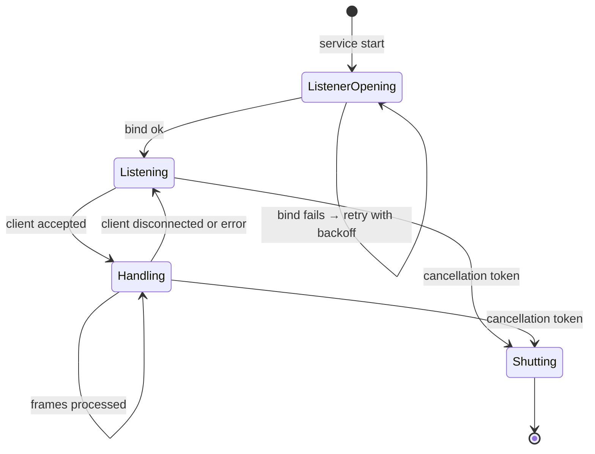

# 03 — Listener / Connector Redesign

> **Phase 2 — Step 2.3** · Designer: Claude Code · Date: 2026-04-21
> **Scope:** the `rtg-listener` service that replaces `TOSConsole{1,2,3}.exe` and `TOSService.exe`. Its job is to terminate TCP from each crane's KoneCranes PLC, parse the wire protocol correctly, persist to PostgreSQL atomically, and feed the outbox for MSSQL dual-write.
> **Assumes:** the architecture (01), data model (02), and Phase-1 protocol analysis (`05_protocol.md`).

---

## 1. What this component owns (and what it does NOT)

**Owns:**
- All TCP sockets facing the cranes.
- Wire-protocol parsing, framing, checksum verification / emission.
- The "send pending jobs on connection-open / every loop iteration" flow.
- Writing the 5 RTG-owned PG tables (`crane_status`, `crane_status_history`, `job` state transitions, `movement`, `location`).
- Emitting outbox rows for every externally-visible state change.

**Does NOT own:**
- User authentication (that's `rtg-api`).
- UI push (that's `rtg-api` + PG NOTIFY).
- Dual-write execution (that's `rtg-outbox-worker`; the listener merely inserts the outbox row atomically with the biz write).
- Job creation from the UI (that's an HTTPS POST to `rtg-api`, which then inserts into `rtg.job` with `state='PENDING'`; the listener picks up PENDING jobs on its next broadcast cycle).

---

## 2. Language & runtime — **.NET 8 LTS**, ASP.NET Core Worker template

### 2.1 Why .NET 8 (decision rationale)

The listener is a TCP broker with modest throughput (< 100 packets/second total across 3 cranes), a binary protocol, a synchronous SQL Server code path that matters for legacy mirror, and a small team whose existing code is C#. The candidates are Go, Rust, .NET, Node.

| Concern | .NET 8 | Go | Rust | Node |
|---|---|---|---|---|
| Team skill | ✅ | low | low | medium |
| Binary-protocol framing library | **`System.IO.Pipelines`** — exactly the tool for this problem | `bufio.Reader` — manual | `tokio::io::AsyncBufRead` — manual | `Buffer` — manual |
| SQL Server driver quality | Best (`Microsoft.Data.SqlClient`) | decent | OK | decent |
| PostgreSQL driver quality | Excellent (`Npgsql`) | Excellent | Excellent | Excellent |
| Memory footprint (single-file publish) | ~25-40 MB | ~10-15 MB | ~5-10 MB | ~80+ MB |
| Operational maturity as a Windows service *and* Linux daemon | Native both | Native both | Native both | Both, more setup |
| Debugging production issues | Visual Studio / Rider / dotnet-dump | delve | gdb + rust-gdb | node inspector |

**.NET 8 wins on team fit + the critical `System.IO.Pipelines`.** Binary footprint is acceptable. Performance headroom is 100× what we need.

### 2.2 Project layout

```
src/
  Rtg.Listener/
    Program.cs
    appsettings.json                 # listener.yaml equivalent
    appsettings.Production.json      # only overrides; secrets via env
    Workers/
      CraneListenerHostedService.cs
      OutboxEmitterBackgroundService.cs
    Protocol/
      Frame.cs                       # immutable record for one parsed message
      Framer.cs                      # System.IO.Pipelines reader: bytes → frames
      FrameParser.cs                 # frame bytes → typed A1/A2/A3 record
      WireEncoder.cs                 # typed record → bytes (for ACK/NAK and jobs)
      LegacyChecksum.cs              # modular additive two's-complement
    Handlers/
      A1Handler.cs                   # position update
      A2PickHandler.cs
      A2PlaceHandler.cs
      A3Handler.cs
      FallbackNakHandler.cs
    Persistence/
      ICranePersistence.cs
      PgCranePersistence.cs          # all writes + outbox rows
      DbSchemaVerifier.cs            # startup health: assert expected schema version
    Connections/
      CraneConnection.cs             # one per crane; long-lived; reconnect logic
      CraneConnectionSupervisor.cs
    Config/
      ListenerOptions.cs             # typed POCO bound to appsettings
      CraneOptions.cs
      ProtocolOptions.cs
    Observability/
      Metrics.cs
      LoggingExtensions.cs
  Rtg.Listener.Tests/
    Protocol/
      FramerTests.cs                 # feed split / coalesced buffers; assert right frames out
      ChecksumTests.cs
      A1RoundtripTests.cs
      A2RoundtripTests.cs
    Handlers/
      A1HandlerTests.cs              # fakes the PG persistence
    GoldenFiles/
      sample_a1_v1.bin
      sample_a2_pick.bin
      sample_a3_cancel.bin
  Rtg.OutboxWorker/
    Program.cs
    ...
```

Unit tests on **Framer** are the critical test body — that's the single biggest correctness risk.

---

## 3. Handling the wire protocol — the key redesign

### 3.1 Framing with `System.IO.Pipelines`

Legacy bug #1 (§1 `07_edge_cases.md`): `stream.Read(256)` was assumed to return one message. TCP may split or coalesce. `System.IO.Pipelines` solves this idiomatically:

```csharp
// Sketch — actual code includes buffer ownership details
public sealed class Framer
{
    private readonly PipeReader _reader;
    private readonly ProtocolOptions _opt;

    public async IAsyncEnumerable<Frame> ReadFramesAsync(
        [EnumeratorCancellation] CancellationToken ct)
    {
        while (!ct.IsCancellationRequested)
        {
            ReadResult result = await _reader.ReadAsync(ct);
            ReadOnlySequence<byte> buffer = result.Buffer;

            while (TryReadOne(ref buffer, out Frame frame))
                yield return frame;

            _reader.AdvanceTo(buffer.Start, buffer.End);

            if (result.IsCompleted) break;
        }
    }

    private bool TryReadOne(ref ReadOnlySequence<byte> buffer, out Frame frame)
    {
        frame = default;

        // 1. find magic header '??'  (0x3F 0x3F in ASCII)
        var scanPos = buffer.PositionOf((byte)0x3F);
        if (scanPos is null) { buffer = buffer.Slice(buffer.End); return false; }

        // (handle the second '?' — both must be at consecutive offsets)
        // …

        // 2. peek message type at offset 4
        if (buffer.Length < 6) return false;
        byte[] typeBytes = buffer.Slice(scanPos.Value, 6).ToArray();
        // e.g. "??..A1", "??..A2", "??..A3"

        // 3. required length per type
        int neededLength = typeBytes[4..6] switch
        {
            [0x41, 0x31] => 78,   // A1 min
            [0x41, 0x32] => 93,   // A2 min
            [0x41, 0x33] => 8,    // A3 min
            _            => 0     // unknown — consume minimally, emit Fallback frame
        };

        if (buffer.Length < neededLength) return false;   // need more bytes

        // 4. slice exactly 'neededLength' bytes
        ReadOnlySequence<byte> oneMsg = buffer.Slice(scanPos.Value, neededLength);
        buffer = buffer.Slice(oneMsg.End);

        frame = Frame.Parse(oneMsg, _opt);
        return true;
    }
}
```

Key properties this buys:
1. **Split messages:** we only advance past a full frame's worth of bytes. If `Read` returns half, `TryReadOne` returns false and we wait for more.
2. **Coalesced messages:** we loop on `TryReadOne` while the buffer still has bytes — multiple frames per `ReadAsync`.
3. **Clean backpressure:** the `PipeReader` applies the OS socket's buffer; we never OOM.
4. **Cancellable.** `ct` stops the whole reader cleanly.

### 3.2 Checksum verification (inbound, once KoneCranes spec arrives)

Config flag `protocol.validate_inbound_checksum: true|false`. Default `false` until Q-11 resolves. When `true`:

```csharp
public static bool VerifyInboundChecksum(ReadOnlySpan<byte> frame, ProtocolOptions opt)
{
    // The crane sends checksum at a vendor-specified offset within the frame.
    // Until we get the spec, we simulate by recomputing over the body-minus-trailer.
    int bodyEnd   = frame.Length - opt.InboundChecksumLengthBytes;
    int recomputed = LegacyChecksum.Compute(frame[..bodyEnd]);
    int sent       = ParseHexChecksum(frame[bodyEnd..]);
    return recomputed == sent;
}
```

Failed checksum → log violation, increment `rtg_protocol_checksum_failures` metric, drop the frame (do not write to DB). This is the behaviour change the new listener *should* introduce — the legacy silently accepted corrupted frames.

### 3.3 The parser — dispatch table, not `if/else` chain

```csharp
public static class FrameParser
{
    public static Frame Parse(ReadOnlySequence<byte> sequence, ProtocolOptions opt)
    {
        Span<byte> buf = stackalloc byte[256];
        sequence.CopyTo(buf);
        ReadOnlySpan<byte> body = buf[..(int)sequence.Length];

        return FrameType(body) switch
        {
            "A1" => ParseA1(body),
            "A2" when body[14] == '0' && body[15] == '3' => ParseA2Pick(body),
            "A2" when body[14] == '0' && body[15] == '4' => ParseA2Place(body),
            "A3" => ParseA3(body),
            _    => Frame.Unknown(body.ToArray())
        };
    }

    // ParseA1/A2Pick/A2Place/A3 use the SAME byte offsets as the
    // legacy code. See 05_protocol.md §2 for the offset table.
}
```

`Frame` is a discriminated union (record types with a `Kind` discriminator) carrying typed fields for each message type. The handler layer (§3.4) dispatches on `frame.Kind`.

### 3.4 Handler contract

```csharp
public interface IFrameHandler
{
    Task<HandlerResult> HandleAsync(Frame frame, CraneContext ctx, CancellationToken ct);
}

public sealed record CraneContext(
    string CraneId,            // 'GOLD1' / 'GOLD2' / 'GOLD3'
    string BindInterfaceIP,    // '192.6.1.8'
    Guid ConnectionId,         // unique per TCP connection
    IPgPersistence Pg,
    IClock Clock,
    ILogger Logger);

public sealed record HandlerResult(
    IReadOnlyList<byte[]> OutboundFrames,   // what to write back to the crane
    bool CloseConnection);                   // usually false
```

Each message type has a dedicated handler. `A2PlaceHandler` is the one with the 7-statement PG transaction:

```csharp
public async Task<HandlerResult> HandleAsync(Frame frame, CraneContext ctx, CancellationToken ct)
{
    await using var tx = await ctx.Pg.BeginTransactionAsync(ct);

    await ctx.Pg.MarkJobPlacedAsync(ctx.CraneId, frame.Counter, ctx.Clock.UtcNow, tx, ct);
    var carry = await ctx.Pg.TakeCarryingContainerAsync(ctx.CraneId, tx, ct);
    if (carry is not null)
        await ctx.Pg.UpdateContainerForkliftFieldsAsync(carry.Container, carry.OperatorId, tx, ct);
    await ctx.Pg.InsertMovementAsync(ctx.CraneId, carry?.Container ?? frame.ContainerOrNull, /* …from/to coords… */, tx, ct);
    await ctx.Pg.ClearOldLocationContainerAsync(frame.FromLocation, tx, ct);
    await ctx.Pg.SetNewLocationContainerAsync(frame.ToLocation, /* container */, tx, ct);

    // Outbox rows (one per legacy table we need to mirror)
    await ctx.Pg.EmitOutboxAsync("a2_place", frame, carry, tx, ct);

    await tx.CommitAsync(ct);

    byte[] ack = WireEncoder.EncodeA2Ack(frame.Counter);
    return new HandlerResult(new[] { ack }, CloseConnection: false);
}
```

All seven writes commit atomically in PG, eliminating the yard-state divergence risk #16 of `07_edge_cases.md`.

---

## 4. Per-crane configurability without code change

### 4.1 Config shape (from §9.2 of `01_architecture.md`)

One YAML file (or `appsettings.json`) on the edge host. Each crane is a config block:

```yaml
listener:
  cranes:
    - id: GOLD1
      tcp_port: 30701
      bind_interface: 192.6.1.8       # IP to bind; multi-homed host
      block_names: [BOND1, BOND2]
      counter_wrap_at: 255
    - id: GOLD2
      tcp_port: 30702
      bind_interface: 192.6.2.8
      block_names: [BOND1, BOND2]
      counter_wrap_at: 255
    - id: GOLD3
      tcp_port: 30703
      bind_interface: 192.6.3.8
      block_names: [BOND3]
      counter_wrap_at: 255
```

Adding a fourth crane is a matter of appending a block and restarting the service. **Zero code change.**

### 4.2 What is NOT in config (deliberate)

- Connection strings → **env vars**: `RTG_PG_CONN`, `RTG_MSSQL_CONN`. Never on disk in clear.
- JWT signing key → env var.
- PIN salts → random per-record in PG.

---

## 5. Resilience

### 5.1 TCP connection lifecycle



Each crane has its own `CraneConnection` task that runs the state machine independently. A failure on Crane 1's socket does not affect Crane 2/3. The legacy `while(true) + goto START + goto Outer` spaghetti is replaced with this clean state machine.

### 5.2 Reconnect and backoff

- **Accept loop:** if `AcceptTcpClient` throws (rare — usually listener socket still healthy), log and retry after 1s.
- **Client socket error (read returns 0, exception, timeout):** close the `TcpClient`, wait 500 ms, accept again. We do NOT close the *listener* socket; that's a separate thing. (Legacy did close it, creating re-bind races.)
- **Bind fails at startup:** exponential backoff (1s, 2s, 4s, …, max 60s) with a loud alert. The edge host's NIC might not be up yet.

### 5.3 Duplicate detection on reconnect broadcast

When a crane reconnects, the listener re-queries "pending jobs" and pushes them. Legacy had no de-duplication, so the crane might execute the same job twice if its firmware doesn't de-dup (Q-31). The new listener adds a **sent-watermark** to the `rtg.job` table:

- `rtg.job.sent_at` timestamp: set on first broadcast.
- On reconnect, only broadcast `WHERE state IN ('PENDING', 'SENT') AND (last_sent_at IS NULL OR last_sent_at < now() - interval '15 seconds')`.
- Even if Q-31 reveals that the crane does de-dup, the 15-second window still prevents tight re-send loops.

### 5.4 Clock-skew handling

The legacy UI's `CounterConnect` counter (stale-time detection) broke at midnight because it compared "HHmmss" strings as elapsed seconds. In the new design:

- **Listener** uses `DateTimeOffset.UtcNow` for all server-side timestamps. PG stores `timestamptz` — tz-aware.
- **Live-ness detector** on the `rtg-api` side compares `crane_status.last_packet_at` to `now()`:
  ```csharp
  var isOnline = (DateTimeOffset.UtcNow - status.LastPacketAt) < TimeSpan.FromSeconds(30);
  ```
- The crane's `HHmmss` field is stored verbatim in `crane_status.last_crane_time` for display, but never used for detecting connection loss.

### 5.5 TCP keep-alive

```csharp
socket.IOControl(IOControlCode.KeepAliveValues, new KeepAliveTcpValues(
    onoff: 1,
    keepaliveTime: 10_000,     // 10 seconds of idle
    keepaliveInterval: 2_000   // probe every 2 seconds
).ToBytes(), null);
```

A dead crane is detected in ~20 seconds (10 idle + 5 × 2 probe), not 2 hours (Windows default).

### 5.6 Backpressure & buffering when PG is slow

If the PG writes slow down (big vacuum, network hiccup), the listener:
1. Stops ACKing inbound A1 frames as quickly, but still reads them from the socket (so the crane's TCP buffer doesn't fill).
2. Uses `Channel<Frame>` between the reader and the handler — the reader never blocks; the handler drains as fast as it can; Channel bounds at 10k messages — past that, we drop-oldest with a counter.
3. Raises `rtg_pg_write_latency_ms` metric; alert at p99 > 1s sustained.

If PG is completely unavailable: A1 frames are dropped with a metric; A2/A3 frames are buffered to an on-disk file (`/var/lib/rtg/unflushed/...jsonl`) and replayed when PG is back. This guarantees we never lose a pick/place event even under DB outage.

---

## 6. Secret handling

| Secret | Where | How loaded | Rotation |
|---|---|---|---|
| PG connection string | env var `RTG_PG_CONN` | `.env.d/rtg-listener.env` (systemd `EnvironmentFile=`) or secret manager | update file + restart |
| MSSQL connection string (for outbox worker) | env var `RTG_MSSQL_CONN` | same | same |
| *None in source, none in binary, none in image* | | | |

At service start, the listener binary has a **hard fail if env vars are missing**, rather than falling back to a default (the legacy antipattern). A startup log line announces *which* conn strings were resolved and from where (without printing their values).

---

## 7. Observability — the listener's RED metrics

| Metric | Type | Labels |
|---|---|---|
| `rtg_packets_in_total` | counter | `crane_id`, `message_type`, `result` (ok/parse_error/checksum_fail) |
| `rtg_packet_parse_duration_ms` | histogram | `crane_id`, `message_type` |
| `rtg_pg_write_duration_ms` | histogram | `operation` (a1 / a2_pick / a2_place / a3) |
| `rtg_pg_write_errors_total` | counter | `sqlstate` |
| `rtg_crane_connections_open` | gauge | `crane_id` |
| `rtg_crane_last_packet_age_seconds` | gauge | `crane_id` (evaluated by rtg-api but sourced from crane_status) |
| `rtg_jobs_pending` | gauge | `crane_id` |
| `rtg_jobs_dispatched_total` | counter | `crane_id` |
| `rtg_jobs_completed_total` | counter | `crane_id` |
| `rtg_outbox_emitted_total` | counter | `event_type` |

Structured log fields on every log line:
- `crane_id`, `connection_id`, `frame_counter`, `message_type`, `trace_id`.

### 7.1 Example alerts

- `rtg_crane_connections_open{crane_id="GOLD1"} == 0 for 1m` → page
- `rate(rtg_pg_write_errors_total[5m]) > 0.1` → warn
- `histogram_quantile(0.99, rtg_pg_write_duration_ms) > 1000 for 5m` → warn

---

## 8. Deployment unit

### 8.1 Packaging

**Linux (preferred):** `dotnet publish -c Release -r linux-x64 --self-contained true /p:PublishSingleFile=true` → ~30 MB binary. Packaged as a deb / rpm or bare file into `/opt/rtg/listener/`.

**Windows (fallback, if the edge host must remain Windows):** same command with `win-x64` runtime identifier, registered as a Windows Service via `sc.exe`.

### 8.2 systemd unit (Linux)

```ini
# /etc/systemd/system/rtg-listener.service
[Unit]
Description=RTG Crane Listener
After=network-online.target postgresql.service
Wants=network-online.target

[Service]
Type=notify
User=rtg
Group=rtg
WorkingDirectory=/opt/rtg/listener
ExecStart=/opt/rtg/listener/Rtg.Listener
EnvironmentFile=/etc/rtg/rtg-listener.env
Restart=on-failure
RestartSec=5
NoNewPrivileges=true
ProtectSystem=strict
ReadWritePaths=/var/lib/rtg /var/log/rtg
LimitNOFILE=65536

[Install]
WantedBy=multi-user.target
```

**`Type=notify`** means the service reports its ready-state back to systemd after successful bind + PG connection + MSSQL ping. Cleaner than `Type=simple` for our health model.

### 8.3 Windows Service (fallback)

`sc.exe create RtgListener binPath= "...\Rtg.Listener.exe" start= auto` + recovery actions set to restart on failure, with a health check via Performance Monitor or a scheduled task that hits the health endpoint.

### 8.4 Health endpoint

The listener also runs a tiny HTTP server on `127.0.0.1:9099` with:

- `GET /health/live` → 200 if the process is alive (always).
- `GET /health/ready` → 200 if all 3 crane sockets are bound AND PG is reachable AND MSSQL is reachable (for outbox worker co-located).
- `GET /metrics` → Prometheus text format.

---

## 9. Startup sequence

```
1. Load config (YAML + env vars).  Fail fast on missing required fields.
2. Resolve NIC interfaces by IP.   Fail if any bind_interface IP is not bound to a NIC.
3. Open PG connection pool.        Fail if PG is unreachable after 60s of retries.
4. Run DbSchemaVerifier:           confirm rtg.* schema version matches what this
                                   listener expects.  If not, log and refuse to start.
5. Start CraneListenerHostedService for each crane (one task per).
6. Start OutboxEmitterBackgroundService (if in same process) or skip (if separate).
7. Report ready to systemd / service manager.
8. Serve /metrics and /health endpoints on localhost.
```

Step 4 is important: it prevents the listener from running against an older schema that lacks (say) the outbox table.

---

## 10. Testing strategy

### 10.1 Unit tests

- `Framer` fed various byte streams — split frames, coalesced frames, garbage, invalid header, short A1. Goal: every scenario in `07_edge_cases.md` #1–#6 has a red test that turns green.
- `LegacyChecksum` round-trip for every sample byte in 0..255.
- Handlers' PG statements verified against a test-container PostgreSQL instance (Testcontainers).

### 10.2 Integration tests

**Real PG + vendor-authored CHE simulator** (`KoneCranes/RTG/Konecranes Simulator/CheSimulator/chesimu.exe`).
*Updated 2026-04-21 after operator delivered KoneCranes directory.* No need to build a Python fake — the vendor ships the definitive simulator. It supports heartbeats, pick/place, job ACK, retransmission, all 3 protocol versions. Connect it to our listener and assert:

- `crane_status` row advances correctly.
- `job` transitions through the full lifecycle.
- `movement` rows match expectations.
- Outbox rows are emitted.
- Byte-level outputs match what the vendor's own `tossimu.exe` emits for the same input (dual-run A/B comparison).

### 10.3 Soak test

Drive `chesimu.exe` in an automation loop (or a small C# harness that opens/closes the TCP connection + sends A1 bursts) for 24 hours. Target load: 10 000 A1 frames + 1 000 pick/place pairs + random disconnect/reconnect. Assert no memory growth, no stuck connections, outbox drains continuously.

---

## 11. Differences from legacy, summarized for review

| Aspect | Legacy `TOSConsole*.exe` | New `rtg-listener` |
|---|---|---|
| Runtime | .NET 4.8, Debug, x86 | .NET 8 LTS, Release, x64 |
| Processes | 3 (+TOSService stray) | 1 (+optional separate outbox worker) |
| Protocol parsing | `Substring(offset, length)` — throws on short buffer | `System.IO.Pipelines` + explicit length gates |
| SQL | String concatenation | Parameterised with `Npgsql` |
| Transactions | None | Explicit per-handler |
| Checksum validation (inbound) | None | Configurable; default off until Q-11 resolves |
| Logs | UNC file path `\\Broadcast\Logs\...` | JSON stdout → log aggregator |
| Config | Hard-coded constants | YAML + env vars |
| Secrets | Connection string in binary | Env vars only |
| Restart | `goto START` | Supervised by systemd / Windows Service |
| Dual crane-restart paths (`E:\` vs `C:\`) | Two mechanisms disagree | One supervisor, one path |
| CHE values | Hard-coded `'GOLDn'` per .exe | Parameter from config |
| Log path bug (`RTG1\TOSConsole2`) | Present (see `08_binaries.md` §3.4) | Not applicable — no per-path logging |
| Wire format to crane | Byte-exact | **Identical — byte-exact** (must not change) |

---

## 12. Open questions specific to the listener

### Q-60 🔴 Blocker (pending Q-11 answer) — Inbound checksum layout
The legacy listener does not validate inbound checksums. The new one *wants* to, but doesn't know where the checksum bytes are. Until KoneCranes spec is obtained, ship with `validate_inbound_checksum: false` and document how to turn it on.

### Q-61 🟡 Medium — Should the listener and outbox worker be one process or two?
Co-located: simpler ops, fewer moving parts, co-located transactions. Separated: independent failure domains, outbox can restart without interrupting cranes.
**Proposal:** ship as one binary with `--mode=listener-only` / `--mode=outbox-only` / `--mode=both` flag. Default to `both`; operations can split later if needed.

### Q-62 🟢 Low — Windows service vs Linux daemon
Preference of the ops team. .NET 8 supports both; the code is identical. Prefer Linux for cheaper licensing and simpler supervision, but no hard blocker either way.

### Q-63 🟡 Medium — Should broadcast on connection-open include A3 status?
Legacy only broadcasts "pending jobs" (PickDate IS NULL). Should it also re-emit A3Date-pending rows in case the A3 ACK was missed? In the new design, this is a simple config flag.

---

## 13. Check-in summary

- **`rtg-listener` is one .NET 8 binary** that replaces 3+1 legacy processes. Per-crane runtime configuration via YAML, no per-crane code. `System.IO.Pipelines` solves the message-framing bug (edge cases #1 and #2). PG transactions solve the partial-write issue (edge case #16). Explicit state machine and proper keep-alives solve the 2-hour dead-crane detection (edge case #3).
- **Protocol byte compatibility is preserved.** The parser reuses the exact byte offsets reverse-engineered in `05_protocol.md`. ACK and NAK bytes are identical. Checksum algorithm is the same `LegacyChecksum` (not real CRC16). Inbound checksum validation ships OFF; toggles ON once the KoneCranes spec gives us the checksum offset.
- **Observability is baked in** from day 1: Prometheus metrics, structured JSON logs, per-crane RED dashboards, alerts on lost connections and PG / MSSQL write failures. A listener crash or crane outage becomes visible within seconds, not hours.
- **Next:** Step 2.4 — Flutter Operator UI design: screen inventory mapped 1:1 to legacy, offline behaviour, 3+ wireframes, RTL-first design system, accessibility.
