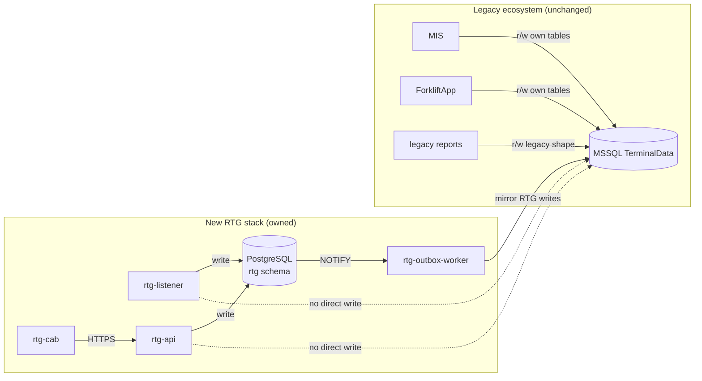

# 05 — Coexistence & Dual-Write

> **Phase 2 — Step 2.5** · Designer: Claude Code · Date: 2026-04-21
> **Scope:** how the new PG-primary system keeps MSSQL in sync during the transition so that legacy consumers (MIS, ForkliftApp, reports) continue to work until they are migrated. This extends §6-8 of `02_data_model.md`.

---

## 1. Coexistence model at a glance



Key properties:

- **New writes only go to PG** (first-class, atomic).
- **Outbox worker is the single MSSQL writer from the new side.**
- **Legacy MIS and ForkliftApp continue to read and write MSSQL** — the outbox produces exactly the byte-shape they expect.
- **Legacy reports continue to work** because `RG_A1`, `RG_B3`, `RG_Shifting`, `RG_Log`, `TB_Location`, `TB_Parameters` all continue to be populated in MSSQL.

---

## 2. Catalogue of write operations and their dual-write shape

Every PG write that also needs a MSSQL mirror is enumerated below. For each: the trigger, the PG transaction, the outbox event emitted, and the SQL the outbox worker executes against MSSQL.

### 2.1 A1 — position update

**Trigger:** listener receives an `A1` frame from a crane.

**PG transaction:**
```sql
BEGIN;
UPDATE rtg.crane_status
SET last_packet_at     = $1,
    last_crane_time    = $2,
    hb_block_code      = $3,
    hb_bay             = $4,
    hb_row             = $5,
    hb_height          = $6,
    crane_status_code  = $7,
    gps_status_code    = $8,
    plc_code           = $9,
    container_length   = $10,
    twist_lock         = $11,
    connection_state   = 'CONNECTED'
WHERE crane_id = $12;

-- crane_status_history is an insert via a trigger on crane_status UPDATE,
-- OR an explicit INSERT done by the listener — design choice: explicit
-- insert is clearer and avoids trigger surprises.
INSERT INTO rtg.crane_status_history (ts, crane_id, hb_block_code, hb_bay,
    hb_row, hb_height, crane_status_code, gps_status_code, plc_code,
    container_length, twist_lock, crane_time)
VALUES ($1, $12, $3, $4, $5, $6, $7, $8, $9, $10, $11, $2);

INSERT INTO rtg.outbox (aggregate_type, aggregate_id, event_type, payload, idempotency_key)
VALUES ('crane_status', $12, 'a1_received',
        jsonb_build_object('crane_id', $12, 'time', $2, 'status', $7,
                           'block', $3, 'bay', $4, 'row', $5, 'height', $6,
                           'crane_status', $7, 'gps_status', $8,
                           'plc', $9, 'len', $10, 'twist_lock', $11,
                           'ctime', $1),
        $12 || ':' || $1);
COMMIT;
```

**Outbox event `a1_received`** → worker executes:
```sql
UPDATE dbo.RG_A1
SET Time        = @time,
    Status      = @status,
    HBBlockName = @block,
    HBBayNumber = @bay,
    HBRowNumber = @row,
    HBHeight    = @height,
    CraneStatus = @crane_status,
    GPSStatus   = @gps_status,
    CTime       = @ctime,
    PLC         = @plc,
    Len         = @len,
    TwistLock   = @twist_lock
WHERE CHE = @crane_id;
```

This is **exactly the legacy statement** from `TOSConsole1/Program.cs:225-236` — parameterised.

**Frequency:** ~1 Hz per crane = 3 writes/s on the outbox; peak with 3 cranes = 3 UPDATE/s on MSSQL RG_A1. Trivial.

**Legacy triggers that still fire on MSSQL:** `rg_a1_updatetime` (noop, re-updates CTime), `rg_up_triger` (inserts into `RG_A1_LOG`). These continue to work; no change needed.

### 2.2 A2/03 — pick confirmed

**PG transaction (sketch — see `03_listener.md` §3.4 for fuller):**
```sql
BEGIN;
UPDATE rtg.job SET state='PICKED', picked_at=now()
  WHERE crane_id=$1 AND counter=$2 AND state IN ('SENT','ACKED');

-- On G/T pickup:
UPDATE rtg.crane_status
SET container_pick_pending=true,
    carrying_container=(select container from rtg.location where ...),
    carrying_operator_id=(...)
WHERE crane_id=$1;

INSERT INTO rtg.outbox (..., event_type, payload)
VALUES (..., 'a2_pick', jsonb_build_object(
    'crane_id', $1, 'counter', $2, 'from_location', $3,
    'container', $4, 'operator_id', $5, 'truck_type', $6));
COMMIT;
```

**Outbox event `a2_pick`** → worker executes the legacy statements from `Program.cs:258-277`:
```sql
-- 1. Optional TB_Parameters flag
IF @from_row IN ('G','T') AND (SELECT COUNT(*) FROM dbo.RG_Container WHERE CHE = @crane_id) = 0
    UPDATE dbo.TB_Parameters SET ContainerPick1 = 'TRUE';    -- or 2/3 per crane

-- 2. RG_B3.PickDate
UPDATE dbo.RG_B3 SET PickDate = GETDATE()
WHERE CounterID = (SELECT MAX(CounterID) FROM dbo.RG_B3 WHERE CHE = @crane_id)
  AND CHE = @crane_id;

-- 3. RG_Container INSERT (done by legacy UI today; now emitted by the outbox
--    when the PG rtg.crane_status.carrying_container transitions to non-NULL)
INSERT INTO dbo.RG_Container (Container, CHE, OperatorID)
VALUES (@container, @crane_id, @operator_id);
```

### 2.3 A2/04 — place confirmed

**PG transaction** (writes ~5 tables atomically; summary):
```sql
BEGIN;
UPDATE rtg.job SET state='PLACED', placed_at=now() WHERE ...;

-- clear carrying state
UPDATE rtg.crane_status SET carrying_container=NULL, carrying_operator_id=NULL, container_pick_pending=false
WHERE crane_id=$1;

-- container moved
INSERT INTO rtg.movement(crane_id, operator_id, container, from_*, to_*, job_id)
VALUES (...);

-- yard slots: clear old, set new
UPDATE rtg.location SET container=NULL WHERE container=@container_and_from;
UPDATE rtg.location SET container=@container WHERE block_code=@to_block AND bay=@to_bay AND row_letter=@to_row AND height=@to_height;

-- also request map refresh for cabs watching this (crane_id, block)
UPDATE rtg.crane_status SET needs_refresh_map=true WHERE crane_id=$1;
-- (rtg-api listens on PG NOTIFY and pushes to the Flutter client)

INSERT INTO rtg.outbox (..., 'a2_place', ...);
COMMIT;
```

**Outbox event `a2_place`** → worker executes the legacy 7-statement block from `Program.cs:283-325`:
```sql
BEGIN TRAN;
  -- 1. RG_B3.PlaceDate
  UPDATE dbo.RG_B3 SET PlaceDate = GETDATE()
  WHERE CounterID = (SELECT MAX(CounterID) FROM dbo.RG_B3 WHERE CHE=@crane_id) AND CHE=@crane_id;

  -- 2. Was it a G/T pickup? Take from RG_Container
  IF EXISTS(SELECT 1 FROM dbo.RG_Container WHERE CHE=@crane_id)
  BEGIN
     SELECT @container = Container, @operator_id = OperatorID
     FROM dbo.RG_Container WHERE CHE=@crane_id;

     DELETE FROM dbo.RG_Container WHERE CHE=@crane_id;

     UPDATE dbo.CO_Containers
     SET EntranceForkliftDate         = GETDATE(),
         EntranceForkliftOperatorID   = @operator_id,
         EntranceForkliftNumber       = '1'
     WHERE Container = @container
       AND EntranceDate IS NOT NULL
       AND EntranceForkliftDate IS NULL;
  END

  -- 3. Movement row (RG_Shifting)
  IF LEN(LTRIM(RTRIM(@container))) = 11
  BEGIN
    INSERT dbo.RG_Shifting (OperatorID, CHE, BlockName, ShiftDate, Container, FromLocation, ToLocation)
    SELECT L.OperatorID, L.CHE, @block, GETDATE(), @container, @from_location, @to_location
    FROM dbo.V_RG_CurrentOperator C INNER JOIN dbo.RG_Log L
         ON C.LoginDate = L.LoginDate AND C.CHE = L.CHE
    WHERE L.CHE = @crane_id;

    -- 4. old location cleared
    UPDATE dbo.TB_Location SET Container = NULL, CHE = @crane_id WHERE Container = @container;

    -- 5+6: destination update (two branches for G/T vs normal yard)
    IF @to_row IN ('G','T')
      UPDATE dbo.CO_Containers SET RtgWeight=@weight, LocationCode=@truck_type,
             ReleaseForkliftDate=GETDATE(), ExitForkliftOperatorID=@operator_id, ExitForkliftNumber='1'
      WHERE DATEDIFF(minute, COALESCE(EntranceForkliftDate, GETDATE()-2), GETDATE()) > 1
        AND Container=@container AND (EntranceDate IS NOT NULL OR RegisterDate IS NOT NULL)
        AND (ExitDate IS NULL OR ExitGateDate IS NULL);
    ELSE
    BEGIN
      UPDATE dbo.TB_Location SET Container=@container, CHE=@crane_id
      WHERE LocationCode=@to_location AND BlocCode=@to_block;

      UPDATE dbo.CO_Containers SET RtgWeight=@weight, LocationCode=@to_location
      WHERE Container=@container
        AND (EntranceDate IS NOT NULL OR RegisterDate IS NOT NULL)
        AND (ExitDate IS NULL OR ExitGateDate IS NULL);
    END
  END
COMMIT TRAN;
```

**Legacy triggers that fire on MSSQL:** `TB_Location_Container_up` (sets `RefreshMapRTG*`), `update_location_in_container` (double-updates CO_Containers), `CO_Containers_*_trigger` family (audit logs). All continue to fire. This is acceptable and desired — legacy consumers still see the legacy side-effects.

### 2.4 A3 — cancel ACK

PG:
```sql
UPDATE rtg.job SET state='CANCELLED', cancelled_at=now()
WHERE crane_id=$1 AND counter=$2 AND state != 'PLACED';
```
Outbox `a3_cancel` → MSSQL:
```sql
UPDATE dbo.RG_B3 SET CancelDate=GETDATE() WHERE A3Date IS NOT NULL AND Counter=@counter AND CHE=@crane_id;
UPDATE dbo.RG_B3 SET A3Date    =GETDATE() WHERE A3Date IS NULL     AND Counter=@counter AND CHE=@crane_id;
```

### 2.5 Job created from UI

UI → `rtg-api POST /api/jobs` → PG:
```sql
INSERT INTO rtg.job(crane_id, counter, state, container, container_length,
   lift_block_code, lift_bay, lift_row, lift_height,
   place_block_code, place_bay, place_row, place_height,
   truck_type, created_by, session_id)
VALUES (...);

-- emit outbox
INSERT INTO rtg.outbox(..., 'job_created', ...);
```

Outbox `job_created` → MSSQL:
- Mirror the `INSERT dbo.RG_B3 ... SELECT TOP 1 ...` statement that the legacy UI's `btnOK_Click` did at `Form1.cs:1420-1430`.
- Also compute the `Message` hex string (`"FFFF" + ReturnAsciText(PreMessage + calcChecksum(PreMessage))`) **because the legacy listener reads `RG_B3.Message` from MSSQL** during the transition (not the PG side).

Wait — that's important. **In the transition, does the listener still read `RG_B3.Message` from MSSQL, or does it read `rtg.job.wire_message` from PG?**

**Design decision:** during transition, **the new listener reads from PG only**. Legacy `RG_B3.Message` is still written (via outbox) so that **if we have to fall back to TOSConsole*.exe**, that binary can still read and broadcast its own `RG_B3.Message`. But in normal operation, the new listener doesn't query `RG_B3`. This keeps dual-write one-way (PG→MSSQL) cleanly.

### 2.6 Login / logout / session lifecycle

UI → `rtg-api POST /api/auth/login` → PG:
```sql
INSERT INTO rtg.session (operator_id, crane_id, block_code, started_at) VALUES (...);
INSERT INTO rtg.login_log (...) VALUES (...);
INSERT INTO rtg.outbox(..., 'login_recorded', payload);
```

Outbox `login_recorded` → MSSQL:
```sql
INSERT INTO dbo.RG_Log(OperatorID, LoginDate, CHE, BlockName) VALUES(@operator_id, @started_at, @crane_id, @block);
```
This matches `FrmLogin.cs:90` exactly.

**Logout** is a new concept (legacy had no logout). Emit `session_ended` outbox event → currently no MSSQL mirror (no corresponding legacy column). Future: extend `RG_Log` with `LogoutDate` if needed; for now, PG-only.

### 2.7 Manual container-location edit

UI (ContainerLocation screen) → API → PG:
```sql
UPDATE rtg.location
SET container = $1
WHERE block_code=$2 AND bay=$3 AND row_letter=$4 AND height=$5;

INSERT INTO rtg.outbox(..., 'location_manual_edit', ...);
```
Outbox → MSSQL:
```sql
UPDATE dbo.TB_Location SET Container=@container WHERE LocationCode=@loc AND BlocCode=@block;
UPDATE dbo.CO_Containers SET LocationCode=@loc WHERE Container=@container ...;
```

### 2.8 Recommended-location edit

PG + outbox → MSSQL `UPDATE dbo.TB_RecommendedLocation`.

---

## 3. Failure matrix — who handles what

| Failure | Effect on operator | Effect on data | Handling |
|---|---|---|---|
| PG available, MSSQL **down** | invisible to operator | PG is authoritative; MSSQL lag accumulates | outbox retries exponentially; alert if backlog > 60s for 5min |
| PG **down**, MSSQL available | critical; cranes can still send A1 but the listener buffers locally to disk | disk-buffered until PG returns | listener replays buffer on PG recovery; outbox then mirrors |
| Listener crash / restart | seconds of possible missed packets (until crane reconnects TCP) | legacy listener would have the same problem; no worse | systemd restarts; PG state consistent; outbox unaffected |
| Outbox worker crash | legacy MSSQL lag grows | PG state correct | systemd restarts; on recovery worker drains pending rows |
| Outbox event fails repeatedly (10+ attempts) | `FAILED_PERMANENT`; visible in admin dashboard | PG has the truth; MSSQL has the event missing | ops reviews `last_error`, decides: fix manually, retry, or accept divergence |
| MSSQL trigger fires twice (legacy `update_location_in_container` running again on our outbox-issued INSERT into RG_Shifting) | legacy MSSQL sees double-update | same as legacy did historically — idempotent | acceptable; not a regression |
| New listener and legacy listener **both running** during cutover | two sockets fight for port 30701 | one binds, the other fails | cutover procedure (`06_rollout.md`) hard-stops legacy before starting new; no overlap |
| A2/04 PG txn commits, but outbox `a2_place` MSSQL mirror fails | operator sees job completed (correct); MIS sees nothing in `RG_Shifting`, `CO_Containers` | visible via outbox lag metric; resolved on retry | automatic retry; alerts; `rtg_outbox_lag_seconds` gauge |
| Idempotency key collision | same event is written twice to outbox (e.g. listener retry after PG commit ack lost) | worker skips duplicate; no double-mirror | UNIQUE constraint on `outbox.idempotency_key` rejects duplicate |

---

## 4. Reconciliation

Despite best-effort mirror, real-world runs need periodic audit. Two reconciliation jobs:

### 4.1 Nightly `rtg-reconcile` job

A small script run at 02:00 local time that compares PG and MSSQL state for recent writes:

```sql
-- in PG
SELECT crane_id, counter, state, placed_at FROM rtg.job
WHERE placed_at > now() - interval '26 hours'
  AND state = 'PLACED';

-- in MSSQL (joined by (CHE, Counter))
SELECT CHE, Counter, PlaceDate FROM dbo.RG_B3
WHERE PlaceDate > dateadd(hour, -26, getdate());
```

For each PG-PLACED job, verify a corresponding MSSQL row with `PlaceDate` set. Any discrepancy → emit an alert to `#rtg-ops` slack channel (or equivalent) + insert a row into `rtg.reconciliation_report`.

Similar checks:
- PG `movement` rows vs MSSQL `RG_Shifting` rows — COUNT by (crane_id, date) should match.
- PG `session` starts vs MSSQL `RG_Log` inserts — COUNT by (operator, day) should match.
- PG `location.container` for each slot vs MSSQL `TB_Location.Container` — set-compare.
- PG `crane_status.hb_*` vs MSSQL `RG_A1.HB*` at a recent timestamp — eventual-consistency delta should be < 2s.

### 4.2 On-demand `rtg-reconcile --deep`

Used before flipping a dual-write feature-flag off (see §5 below). Walks the full range (not just yesterday) and reports any divergence.

---

## 5. Exit criteria per event type (turning off dual-write)

Dual-write for a given event type can be turned off when:
1. **No legacy consumer reads the MSSQL column that event updates.** Verified by:
   - A DBA audit of `sys.dm_exec_query_stats` over a 7-day window filtered by table (no recent SELECTs against the target table other than from known reconciliation jobs).
   - An explicit sign-off from the MIS / ForkliftApp team that they've moved to PG (or don't need the data).
2. **Rollback capability is no longer required** for that event type. Usually, that's 2-4 weeks after the new system has been stable for the crane.
3. **Reconciliation has shown zero divergence for 7 consecutive days.**

When all three are true, ops flips `config_kv.outbox.mirror_to_mssql.<event_type>` to `false`. The outbox worker silently ignores new events of that type.

### 5.1 Per-event exit order (recommended)

Per-crane, after that crane is stable:

1. **`login_recorded`** (RG_Log) — legacy reports can be repointed at `rtg.session` trivially.
2. **`a1_received`** (RG_A1) — only legacy "crane status" queries read it; easy to migrate.
3. **`job_created`** (RG_B3 inserts) — depends on whether the legacy TOSConsole*.exe is still a rollback path. Keep enabled while rollback is live.
4. **`a2_pick`** / **`a2_place`** / **`a3_cancel`** (RG_B3 date updates + RG_Shifting) — these have the most legacy readers (reports). Last to turn off.
5. **`location_manual_edit`** (TB_Location) — requires ForkliftApp buy-in; probably **never turned off** because ForkliftApp reads TB_Location heavily.

**Plan:** by the time all 3 cranes are on the new stack, we will have:
- `login_recorded` / `a1_received` dual-write off.
- `job_*` / `a2_*` / `a3_*` still on (legacy reports still running).
- `location_*` / `container_*` still on (ForkliftApp still running).
- Exit from the *last* three events happens as part of Phase 3 (MIS migration), not Phase 2.

---

## 6. Edge cases specific to coexistence

### 6.1 Legacy UI still running alongside new UI

During the per-crane UI cutover (after the listener is already cut over), some cabin PCs may still run the legacy `RTGApp.exe` while others run `rtg-cab`. Both talk to different systems:

- Legacy UI writes directly to MSSQL `RG_B3`.
- New UI writes through `rtg-api` to PG, outbox mirrors to MSSQL.

**Problem:** if two operators on the same crane (rare but possible during training) submit jobs from different UIs, they race on MSSQL `RG_B3.CounterID`:

- Legacy UI's `SELECT MAX(CounterID) + 1` is a classic race.
- Outbox worker INSERT into `RG_B3` uses the PG-side `rtg.job.counter` — possibly collides with what the legacy UI just inserted.

**Mitigation:** during the overlap window, **only one UI operates per cabin at a time**. Ops ensure that when `rtg-cab` is installed on cabin-N, `RTGApp.exe` is uninstalled simultaneously. The fleet-wide picture:

- Cabin 1: legacy UI until its cutover date, then only new UI.
- Cabin 2: same, later.
- Cabin 3: same, latest.

No cabin has both at once.

### 6.2 Legacy listener accidentally started during the overlap

The cabin PC → crane PLC → listener host flow means if someone starts `TOSConsole1.exe` while `rtg-listener` is already running, whichever binds first gets the port; the other fails silently. Detection:

- `rtg-listener` health endpoint reports `ready`.
- Ops script: `systemctl status rtg-listener && ! pgrep -f TOSConsole1.exe`.
- Alert if both are running (impossible, but monitor for the bug).

### 6.3 `TB_Parameters` trigger writes during outbox mirror

When the outbox worker executes `UPDATE dbo.TB_Location ...`, the legacy trigger `TB_Location_Container_up` fires and sets `RefreshMapRTG*`. The new UI **does not read** `TB_Parameters`, so this is harmless. The legacy UI (if any is still running) sees the refresh signal and polls — as it always did. No regression.

### 6.4 Direction of `CO_Containers` conflict

Both MIS and the outbox worker can update `CO_Containers.LocationCode`. If they race:

- MIS's update is normally the authoritative one for gate events.
- The outbox worker only updates the 5 RTG-relevant columns (`EntranceForkliftDate`, `ReleaseForkliftDate`, `LocationCode`, `RtgWeight`, `ExitForkliftOperatorID`) and only when a crane actually moved the container.

**Collision scenario:** MIS records a gate-exit (sets `ExitDate`) at the same second the outbox applies the crane PLACE. Last-writer-wins at the row level. Since PG has the RTG-authoritative view, if the two disagree ops can always consult `rtg.movement` history and fix MSSQL by hand. This is rare.

### 6.5 Outbox worker lagging while new UI is live

If the outbox worker falls behind for 10 minutes, MSSQL views show stale yard state. Impact:

- Legacy reports: stale.
- ForkliftApp: may act on stale `TB_Location`. *If* ForkliftApp is actively working yard moves in parallel with the RTG cranes, this could cause a conflict where ForkliftApp believes a slot is empty (because old MSSQL state) and dispatches a forklift to place another container there.

**Mitigation:** the outbox worker has tight SLOs (p99 lag < 5s). Alerts fire at > 60s. In practice, we never let the outbox lag into dangerous territory.

---

## 7. Observability of the dual-write pipeline

Beyond the general observability setup (`01_architecture.md` §8), dual-write-specific metrics:

| Metric | Purpose |
|---|---|
| `rtg_outbox_pending_total` (gauge) | How many events waiting to mirror |
| `rtg_outbox_lag_seconds` (gauge) | Time since oldest PENDING event created |
| `rtg_outbox_write_duration_ms` (histogram, label: `event_type`) | How long each MSSQL write takes |
| `rtg_outbox_failures_total` (counter, label: `event_type`, `mssql_error_class`) | Retry counter |
| `rtg_outbox_permanent_failures_total` (counter, label: `event_type`) | Events that gave up |
| `rtg_reconciliation_divergences_total` (counter, label: `table`) | Nightly audit findings |

### 7.1 Dashboard "Dual-write health"

Panels:
- **Outbox backlog & lag** time series
- **MSSQL write rate** per event type
- **Failure rate** per event type
- **Reconciliation results** per night
- **Feature-flag state** table: which event types still dual-writing, when they were turned off, by whom

---

## 8. When do we know we're done?

The dual-write era ends when Goldbond's ERP migration reaches the next module (MIS). At that point:
- MIS reads from PG (via an adapter layer, or by moving to a new internal app).
- ForkliftApp either migrates to PG or shuts down.
- `TB_Location` / `TB_Parameters` / `CO_Containers` cease to be shared.
- Every remaining `outbox.mirror_to_mssql.*` flag is flipped off.
- MSSQL `TerminalData` can be archived or frozen.

**For this Phase 2, we don't pursue that end state. We prove the transactional-outbox model works for RTG and we hand off a clean coexistence layer that can run indefinitely while the broader migration catches up.**

---

## 9. Open questions raised by the dual-write design

### Q-70 🟠 High — Does ForkliftApp write `TB_Location.Container` in parallel with RTG?
Critical for §6.4. If ForkliftApp writes the same column, we need a clear per-slot ownership model or optimistic-lock checks.
*How to find out:* interview ForkliftApp owner; code review of `sp_ForkLift*`.

### Q-71 🟡 Medium — When is PG-side legacy `RG_B3.Message` computation retired?
Phase-2 scope keeps dual-writing the Message hex because the legacy listener could still be the fallback. When we decide we won't ever restart the legacy listener (post-pilot stabilization of all 3 cranes), we can drop the Message hex computation from the outbox.

### Q-72 🟡 Medium — Retention for `rtg.outbox.FAILED_PERMANENT`
How long do we keep rows that exceeded retry budget? Suggest 90 days, then archive.

### Q-73 🟢 Low — Reconciliation schedule
02:00 nightly is a guess. Align with MSSQL backup window.

---

## 10. Check-in summary

- **Every RTG write produces exactly one outbox row per legacy destination table**; the worker deterministically translates PG events into the exact legacy SQL shape (parametrised) so MIS / ForkliftApp / legacy reports see the same MSSQL as before. 8 event types catalogued with SQL mappings.
- **Failure modes are well-defined:** PG down = disk-buffered in listener; MSSQL down = outbox backlog + alerts; listener restart = no data loss; outbox-worker restart = catches up on PG NOTIFY; idempotency key prevents double-mirror. Alerts at every failure point.
- **Exit criteria per event type** let us turn off MSSQL mirror progressively (not all-or-nothing). Order: login → a1 → jobs → movements. `TB_Location` probably stays dual-written until the broader MIS migration.
- **Next:** Step 2.6 — Migration & Rollout plan (crane-by-crane, pilot = Crane 3, go/no-go checklist, rollback, operator training).
