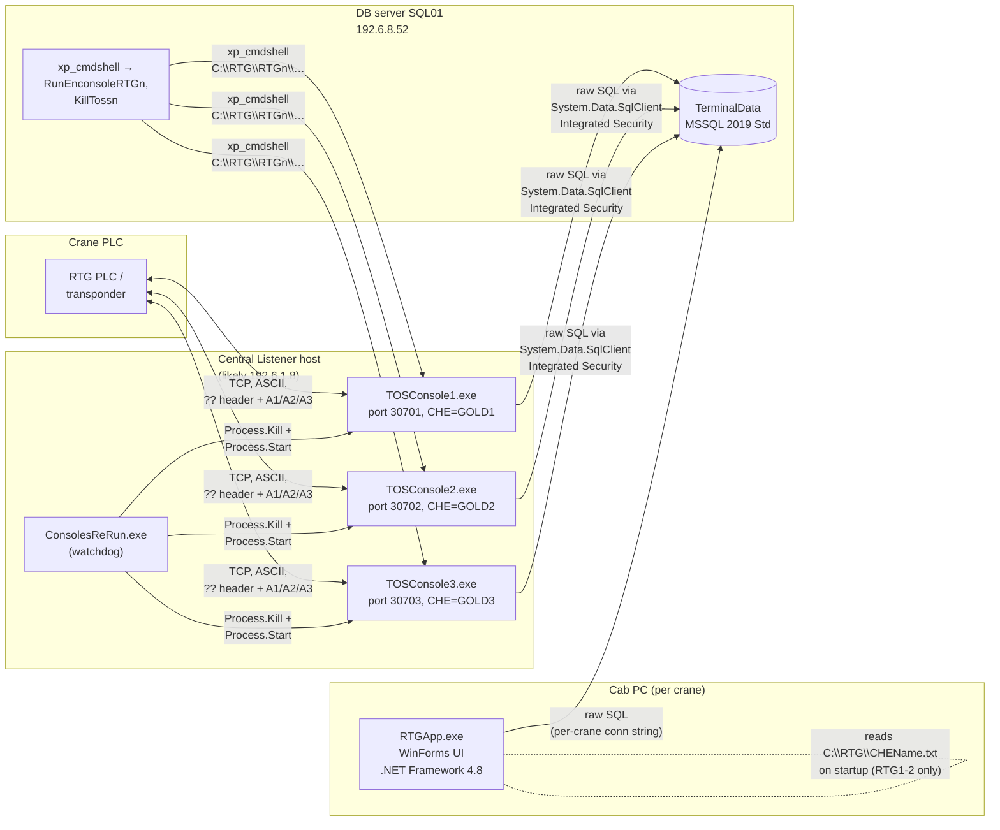
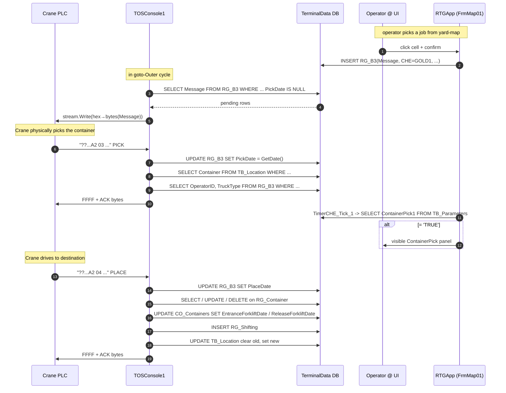

# 03 — Data Flow Mapping (end-to-end)

> **Phase 1 — Step 1.3** · Analyst: Claude Code · Date: 2026-04-21

This document traces how data moves through the RTG system — from the crane's PLC over the wire, through the Listener, into the SQL database, up to the Operator UI, and back. Evidence is cited with `file:line` references. **Confirmed** means the behaviour is directly observable in code; **Inferred** means it is the most reasonable interpretation but not proven; **Unknown** means it needs operator / runtime verification.

---

## 0. The three moving parts (recap)



> ⚠ The diagram shows two **completely separate restart paths**: a .NET 6 watchdog (`ConsolesReRun.exe`) on the listener host and stored procedures (`KillToss*` / `RunEnconsoleRTG*`) on the DB server. These expect different disk paths (`E:\RTG\Console{n}\` vs. `C:\RTG\RTG{n}\`). Either two hosts are involved, or one of the mechanisms is stale. See Q-04 / Q-12.

---

## 1. The catalogue of tables touched by the data path

From `01_target_objects.txt` and the SQL scattered through the code. (Full schema analysis is in `04_database.md`; this is the working set for the flows below.)

| Table | Primary role in the flow | Written by | Read by |
|---|---|---|---|
| `RG_A1` | **Current live crane status** — 1 row per CHE (`GOLD1/2/3`). Position, height, GPS, twist-lock, time tick. | TOSConsole{1,2,3} on every `A1` packet (`Program.cs:225-236`) | RTGApp's map timer (`Form1.cs:1580`) |
| `RG_B3` | **Outbound job queue to the crane.** Each row is a broadcast message + lifecycle dates: `A3Date`, `PickDate`, `PlaceDate`, `CancelDate`. | RTGApp (enqueue from operator actions — see Form1 inserts), TOSConsole on ACK of A2/A3 | TOSConsole (at connection open, to send pending) |
| `RG_Log` | **Operator session log.** One row per UI login. | RTGApp `FrmLogin.cs:90` on successful PIN check | `V_RG_CurrentOperator` view (listener uses it on A2/04 PLACE to attribute the move — `Program.cs:304-309`) |
| `RG_Shifting` | **Movement event history.** Written on every successful PLACE. | TOSConsole (`Program.cs:304-309`) | Reports |
| `RG_Container` | **Transient "currently held" state** (one row per crane when it is carrying a container picked from ground/truck without prior yard location). | UI → (needs verification — not seen in code yet, Q-13) | TOSConsole on A2/04 PLACE |
| `RG_ErrorLog` | **Application log table.** 1.6M rows as of 2026-04-21 — high-volume. Both RTG1-2 and RTG3 UIs write here; listeners do **not** (they write to `\\Broadcast\Logs\RTG\…` files). | RTGApp UI's `Utils.WriteLog` (RTG1-2) / `ContainerLocation.WriteLog` (RTG3) | Diagnostics only |
| `TB_Location` | **Yard location master.** `LocationCode` + `BlocCode` uniquely identifies a slot; `Container` column is current container (nullable). | TOSConsole on A2/04 PLACE clears the old slot and sets the new one (`Program.cs:311, 322`) | Listener lookups, UI screens (FrmContainersByBloc, FrmRecommendedLocation, map views) |
| `TB_Parameters` | **Single-row global flags.** Columns seen used: `ContainerPick1`, `ContainerPick2`, `ContainerPick3`(?), `RefreshMapRTG`, `RefreshMapRTG2`, `RefreshMapRTG3`, `RefreshMapRTG4`. | TOSConsole writes `ContainerPickN='TRUE'` (`Program.cs:261`); RTGApp clears `RefreshMapRTGn` after reading (`Form1.cs:1716-1736`) | RTGApp `TimerCHE_Tick_1` reads both (`Form1.cs:1657-1700`) |
| `CO_Containers` | **Container master history** (2.59M rows). Tracks `EntranceForkliftDate`, `ReleaseForkliftDate`, `LocationCode`, `RtgWeight`, etc. | TOSConsole on A2/04 PLACE updates entrance and/or release forklift fields (`Program.cs:298, 316-323`); RTGApp can update (Works / ContainerLocation screens) | UI screens (V_ContainerUnloadRG, V_ContainerUnloadRTG3, V_RTG_App_ContainerMovement, etc.) |
| `CP_Deal`, `CP_Order` | **Commercial** — deal / order lifecycle. **Shared with MIS and ForkliftApp.** | Not touched by RTG (this is MIS's territory) | Read by `V_ContainerUnloadRG`, `V_OrderForkLift`, `V_RTG_App_ContainerMovement` |
| `SC_Users`, `HR_Emp`, `SC_AppGroup` | Login, PIN, EmpID resolution. Group 22 = RTG-operator group. | Not touched by RTG | `FrmLogin.cs:36-38, 69-74, 87` |
| `TB_RecommendedLocation` | Suggested drop-off by container type | Not visible | `FrmRecommendedLocation` |
| `TB_WorkType`, `TB_Drivers`, `TC_Client`, `TC_HazardousSubstances` | Master / reference data | Not touched by RTG | UI lookups |
| `RG_ColDG` | Likely "column dangerous goods" cross-reference | Not visible | Unknown — Q-14 |

---

## 2. Scenario 1 — Crane position update (the happy path)

### 2.1 Numbered narrative (Crane #1 used as example)

1. **[Crane side]** The crane's PLC / transponder transmits an ASCII packet over the pre-opened TCP connection to the listener host. The packet starts with `??`, followed by a sequence byte pair, then `A1` (message type), then positional data. [Inferred; the TOSConsole parser is the only evidence of packet layout — see `05_protocol.md`].
2. **[Listener]** `TOSConsole1.exe` is inside the outer `while(true)` loop (`Program.cs:149-344`). It has an open `NetworkStream stream` (`Program.cs:161-163`) from the `TcpClient` accepted earlier (`Program.cs:155`).
3. **[Listener]** The `stream.Read(bytes, 0, bytes.Length)` call (`Program.cs:206`) returns `i` bytes into `bytes`.
4. **[Listener]** The bytes are decoded as ASCII (`data = System.Text.Encoding.ASCII.GetString(bytes, 0, i);`) and upper-cased (`Program.cs:211-214`). *Any content of the packet that contained characters below 0x20 or above 0x7F will be mangled by this.*
5. **[Listener]** Checks `data.Substring(0, 2) == "??"` (`Program.cs:219`). On mismatch, falls to the end of the block and sends fallback hex `FFFF303342313046454641` back — 11 hex-pairs (= 11 bytes) that appear to be a default NAK (`Program.cs:338`).
6. **[Listener]** Checks `data.Substring(4, 2) == "A1"` (`Program.cs:222`). Position update.
7. **[Listener → DB]** Runs, synchronously and by string concatenation, a single long `UPDATE dbo.RG_A1 SET Time='…', Status='…', HBBlockName='…', HBBayNumber='…', HBRowNumber='…', HBHeight='…', CraneStatus='…', GPSStatus='…', CTime=getdate(), PLC='…', Len='…', TwistLock='…' WHERE CHE='GOLD1'` (`Program.cs:225-236`). The fields are extracted from **fixed-byte offsets** in the packet (12, 18, 22, 30, 33, 36, 40, 42, 55, 75, 77 — 11 offsets for 11 columns).
8. **[Listener]** Jumps `goto Outer` (`Program.cs:241`) — re-enters the *outer* try-block inside the same `while(true)` iteration, re-fetches pending broadcasts from `RG_B3`, and waits for the next stream read.
9. **[UI side, in parallel]** Meanwhile on the crane's cab PC, `RTGApp.exe` is running the logged-in operator's session. The form `FrmMap01` has a timer `TimerCHE` firing every N ms (interval not read — Q-15).
10. **[UI → DB]** `TimerCHE_Tick_1` issues `SELECT Time, Status, HBBlockName, RTRIM(HBBayNumber)+RTRIM(HBRowNumber)+RTRIM(HBHeight) AS Position, CraneStatus, GPSStatus, CHE, PLC, Len, TwistLock FROM RG_A1 WHERE CHE='GOLD1'` (`Form1.cs:1580`). The returned row is bound to a `DataGridView` named `DGH`.
11. **[UI]** The timer compares the new `Time` value against the value from the previous tick (`TimeByTimer`) (`Form1.cs:1604-1622`). If the difference in seconds is zero, `CounterConnect++`; if `CounterConnect > 90`, it enables the "Enconsole" (re-engage) button. If the time moved, `CounterConnect=0`.
12. **[UI → DB]** The timer then reads `TB_Parameters.ContainerPick1` (or `ContainerPick2` for Crane #2 — `Form1.cs:1657-1663`) and, if `TRUE`, shows `ContainerPick` UI widget — telling the operator "you've just picked a container".
13. **[UI → DB]** The timer then reads one of `TB_Parameters.RefreshMapRTG` / `RefreshMapRTG2` / `RefreshMapRTG3` / `RefreshMapRTG4` depending on (CHE, BlockName) pair (`Form1.cs:1678-1700`). If `TRUE`, it calls `MappingSquare()` to repaint the yard-map grid and then clears the flag to `FALSE`.

### 2.2 Sequence diagram

```mermaid
sequenceDiagram
    autonumber
    participant PLC as Crane PLC
    participant L as TOSConsole1.exe<br/>(listener/persistence)
    participant DB as TerminalData DB
    participant UI as RTGApp.exe (cab)
    participant T as FrmMap01 Timer

    Note over L: already in while(true) loop,<br/>client already accepted
    loop every position update
        PLC->>L: ASCII packet "??...A1..." (fixed offsets)
        L->>L: data = ASCII.GetString; ToUpper
        alt header != "??"
            L-->>PLC: FFFF + 11B "NAK"
        else A1 message
            L->>DB: UPDATE RG_A1 SET ... WHERE CHE='GOLD1'
            Note over L: goto Outer →<br/>re-poll RG_B3, keep reading stream
        end
    end

    loop every N ms, in parallel
        T->>DB: SELECT ... FROM RG_A1 WHERE CHE='GOLD1'
        T->>UI: bind DGH grid
        T->>DB: SELECT ContainerPick1 FROM TB_Parameters
        alt ContainerPick1='TRUE'
            T->>UI: show ContainerPick widget
        end
        T->>DB: SELECT RefreshMapRTG FROM TB_Parameters
        alt RefreshMapRTG='TRUE'
            T->>UI: MappingSquare() - repaint map
            T->>DB: UPDATE TB_Parameters SET RefreshMapRTG='FALSE'
        end
    end
```

---

## 3. Scenario 2 — Operator login / session start

### 3.1 Numbered narrative

1. **[Cab PC]** The cabin PC boots. A shortcut / autostart entry launches `C:\RTG\RTGApp.exe` (or wherever the file was deployed; the deploy bundle places it under `RTG1-2/RTGApp.exe` / `RTG3/RTGApp.exe`).
2. **[UI]** `Program.Main()` runs `Application.Run(new FrmLogin())` (`Program.cs:18`).
3. **[UI]** `FrmLogin` constructor runs. It creates `ConTerminalData Con1 = new ConTerminalData()` and fires `Con1.ReturnDT("SELECT '' UNION ALL SELECT HR_Emp.LoginName FROM SC_Users JOIN HR_Emp WHERE UserGroupCode=22")` (`FrmLogin.cs:36-38`) — populating the LoginName combobox with all operators in group 22 plus a leading blank row. *Any operator name can be selected from the dropdown, without further filtering by crane.*
4. **[UI]** RTG1-2 only: `FrmLogin_Load` reads **the first line** of `C:\RTG\CHEName.txt` and puts it into the `CHE` field (`FrmLogin.cs:246-252`). Per `Read Me !.txt` this is `BOND1` or `BOND2`.
5. **[UI]** RTG3 only: `FrmLogin_Load` forces `CHE.Text = "GOLD3"` and `LiftBlockName.Text = "Bond3"`, and disables the `LiftBlockName` field (`RTG3/.../FrmLogin.cs:232-237`).
6. **[Operator]** Operator selects their name, presses numeric buttons to build up a PIN in the `Password` MaskedTextBox, optionally changes the `LiftBlockName` (RTG1-2 only), and presses OK.
7. **[UI → DB]** `btnOK_Click` runs a check: `SELECT COUNT(*) FROM SC_Users JOIN SC_AppGroup JOIN HR_Emp WHERE UserGroupCode=22 AND HR_Emp.UserPinCode = <PIN>` (`FrmLogin.cs:69-74`). **Note:** the selected `LoginName` is not part of the WHERE clause.
8. **[UI → DB]** If count > 0: look up the `EmpID` of the **selected LoginName** (`FrmLogin.cs:87`). **This is where the audit trail diverges from the actual authentication:** the user whose PIN matched may not be the user whose name is recorded.
9. **[UI → DB]** INSERT `RG_Log (OperatorID, LoginDate, CHE, BlockName) VALUES (<EmpID>, GetDate(), <CHE from form>, <BlockName from form>)` (`FrmLogin.cs:90`).
10. **[UI]** Opens `FrmMap01` (`FrmLogin.cs:92-93`). **FrmLogin is not closed** — it stays open behind the map form. (Relevant for edge case #7 in `07_edge_cases.md`.)
11. **[UI → DB]** `FrmMap01` constructor and `FrmMap01_Load` populate the map grid (from `V_MapRTGBond1` / `V_MapRTGBond2` — see `Form1.cs:1194`) and start `TimerCHE`.

### 3.2 Sequence diagram

```mermaid
sequenceDiagram
    autonumber
    actor Op as Operator
    participant CHEf as C:\RTG\CHEName.txt
    participant F as FrmLogin
    participant DB as TerminalData DB
    participant Map as FrmMap01

    Op->>F: start RTGApp.exe
    F->>CHEf: ReadAllLines (RTG1-2 only)
    CHEf-->>F: "BOND1" / "BOND2"
    F->>DB: SELECT operators WHERE UserGroupCode=22
    DB-->>F: rows
    Op->>F: pick LoginName, type PIN, pick LiftBlockName, OK
    F->>DB: SELECT COUNT(*) WHERE UserGroupCode=22 AND UserPinCode=<PIN>
    DB-->>F: count
    alt count > 0
        F->>DB: SELECT EmpID WHERE LoginName=<picked>
        DB-->>F: EmpID
        F->>DB: INSERT RG_Log(OperatorID, LoginDate, CHE, BlockName)
        F->>Map: new FrmMap01(); Show()
        Map->>DB: initial SELECT on RG_A1 + map views
    else count = 0
        F-->>Op: MessageBox "אינך מורשה להכנס…"
    end
```

---

## 4. Scenario 3 — Operator selects container / reports activity

This flow is still partly **Inferred** — the full extent of Form1.cs (116 KB) has not been read exhaustively. The observations here are from the grep of method names (`Form1.cs:2142-3122`) and selected reads. A deeper walkthrough is in `06_operator_ui.md`.

### 4.1 Sub-flows visible in the UI (inferred from method names)

| UI action | Method | Behaviour (inferred) |
|---|---|---|
| Click a cell in the yard-map grid | `DG_CellClick`, `DG_CellDoubleClick` (`Form1.cs:67, 257`) | Enters the clicked `LocationCode` into the Container/Location fields |
| Confirm the selected container | `btnOK_Click` (`Form1.cs:1386`) | INSERT into `RG_B3` with a `Counter` (= `TOSConsole.data[12..14]`) — sending the broadcast to the crane. [Needs confirmation Q-13] |
| Cancel | `btmCancel_Click` (`Form1.cs:2277`) | UPDATE `RG_B3.MessageCancel` / relevant flags |
| Go to Menu | `btmMenu_Click` | open `FrmMenu` |
| Find container | `BtmFindContainer_Click` (`Form1.cs:2683`) | Query `CO_Containers` by container number and populate fields |
| Update container | `BtmUpdateContainer_1_Click` (`Form1.cs:3122`) | Open `ContainerLocation` form |
| Digit buttons `One_Click` … `DELETE_Click` (`Form1.cs:2370-2631`) | On-screen keypad for container number / weight | Append digits to the active text field |
| Close sub-windows | `Close_Click` / `Close_1_Click` | hide/close secondary panels |
| Truck type | `CmdTruck_Click` (`Form1.cs:2333`) | Toggle truck/yard mode |

### 4.2 Back-channel: UI → Crane

The crane only hears "new job" messages when the **Listener** reads them from `RG_B3` at connection-open (`Program.cs:181`). That means any operator action that needs to reach the crane must:

1. Be INSERTed into `RG_B3` by the UI.
2. Either wait for the crane to drop and reopen the TCP connection, or rely on the listener's `Outer:` loop, which **also re-reads RG_B3 on every iteration of the inner try** (`Program.cs:181` inside `Outer:`).

So the pattern is: UI writes, listener polls DB on every goto-Outer cycle (roughly every packet it reads), listener forwards bytes to crane. **Inferred.** This is a high-latency, DB-polling-based message bus.

### 4.3 Sequence diagram (pick/place acknowledged)



---

## 5. Scenario 4 — Network disconnect and reconnect

### 5.1 From the crane side (Confirmed from listener source)

- The listener uses a blocking `server.AcceptTcpClient()` (`Program.cs:155`) **only once** per `START:` iteration. It accepts one client, then enters an inner `while` loop reading the stream.
- If `stream.Read()` returns 0, the inner while exits naturally (`Program.cs:206`) — control reaches the inner `catch` or falls out to the outer try's `finally`, which calls `server.Stop()`.
- On any exception inside the inner try, the listener does `goto Outer` (`Program.cs:350`) — it **does not close the socket**, just retries inside the same iteration. If the exception was caused by the socket dying, this means the listener will probably throw again on the very next `stream.Read()` and fall out.
- On an outer exception, `goto START` (`Program.cs:358`) — the `server.Stop()` from the `finally` runs, and the whole thing restarts. The listener creates a **new** `TcpListener` and waits for a new `AcceptTcpClient`.

### 5.2 From the UI side

The UI has no TCP connection to the crane. Its only view of crane health is indirect:

- The timer queries `RG_A1.Time`. If the value doesn't change for 90 consecutive ticks (`CounterConnect > 90`) it enables the `EnconsoleButtom` button for the operator (`Form1.cs:1624-1635`).
- The handler for `EnconsoleButtom.Click` was **not inspected yet** (Q-18). Best guess: it triggers the `RunEnconsoleRTG1` stored procedure via `xp_cmdshell`, which launches `C:\RTG\RTG1\TOSConsole1.exe`. In that case, pressing this button from the cab *could* start a new listener instance — if the DB server is running `xp_cmdshell` and has permission, and if `C:\RTG\RTG1\` is the right path (which conflicts with `ConsolesReRun`'s `E:\RTG\Console1\`).

### 5.3 Reconnect race conditions (potential)

- The single-instance guard in `TOSConsole1.Main()` (`Program.cs:105-108`) just checks `Process.GetProcesses().Count(... == "TOSCONSOLE1") > 1`. If the watchdog starts a new instance while the old one is still shutting down, one of them will silently exit. No state transfer.
- Any broadcast rows in `RG_B3` that were already `WRITE`ed to the socket but whose `PickDate` hadn't yet been set will be **re-sent** to the crane on the next accept — because the listener re-queries the same predicate. Cranes may receive duplicates.

### 5.4 Sequence diagram

```mermaid
sequenceDiagram
    participant PLC as Crane PLC
    participant L as TOSConsole1
    participant DB as TerminalData DB
    participant UI as RTGApp (cab)

    Note over L,PLC: happy state, steady stream
    PLC--xL: (network drops)
    L->>L: stream.Read returns 0 OR throws
    alt inner catch
        L->>L: WriteLog(ex); goto Outer
        L->>DB: SELECT Message FROM RG_B3 ... (next iteration)
        L->>L: next stream.Read throws again
    end
    L->>L: outer catch -> WriteLog; goto START
    L->>L: server.Stop(); new TcpListener
    L->>L: server.AcceptTcpClient() (blocks)
    Note over UI,DB: meanwhile RG_A1.Time is frozen
    UI->>DB: SELECT Time ... RG_A1
    UI->>UI: CounterConnect++ each tick
    alt CounterConnect > 90
        UI->>UI: enable EnconsoleButtom
    end
    PLC->>L: (crane reconnects)
    L->>PLC: resend all un-Pick'd RG_B3 messages
    Note over L,DB: position updates resume
```

---

## 6. Scenario 5 — Malformed or out-of-range position packet

Observation in `TOSConsole1/Program.cs`:

- Header check is `data.Substring(0, 2) == "??"` — without try/catch around it. If fewer than 2 bytes were received in the stream.Read, this throws `ArgumentOutOfRangeException`. This **does** get caught by the inner `try/catch` (`Program.cs:346-351`) → `WriteLog(e.ToString())` → `goto Outer`.
- Message type check uses `data.Substring(4, 2)`. If the packet is 4 bytes or shorter, same exception, same handling.
- Field extraction for A1 uses offsets up to index **77** (`data.Substring(77, 1)` — `Program.cs:236`). A short A1 packet throws → caught → `goto Outer` → the `UPDATE RG_A1` did NOT execute, so RG_A1 keeps stale data.
- For A2/03 (PICK), offsets up to **92** (`data.Substring(92, 1)` — `Program.cs:268`). Same failure mode.
- **No range validation.** A packet with garbage bytes at those offsets will be passed through to SQL as text. Example: if byte 78-83 contains binary garbage that lower-cases to something unexpected, it goes into `TB_Location.BlocCode` as part of the WHERE clause. Worst case: SQL injection via the crane protocol (the `Upper()` call reduces the attack surface but does not eliminate it — see `07_edge_cases.md` #12).
- **No checksum validation on inbound.** The listener **computes** a checksum for outgoing ACKs (`calcChecksum` — `Program.cs:30-42`) but does not verify the inbound packet's checksum or framing. Any bits arriving in the right positions are accepted. Cranes are trusted.

---

## 7. Scenario 6 — DB write failure

- All DB calls go through `Crc16Ccitt.ReturnDT(instr)` (`Crc32.cs:35-79`) in the listener, or `ConTerminalData.ReturnDT(instr)` (`Class1.cs:21-126`) in the UI.
- In the listener, on SQL failure, the catch block writes to log and **returns null** (`Crc32.cs:74-78`). Callers dereference `dt.Rows[…]` immediately afterwards — NullReferenceException → caught by outer try → `goto Outer`. The row-level change did not happen.
- **Partial-success hazard:** the A2/04 PLACE handler runs **four distinct SQL statements** in sequence without a transaction (`Program.cs:287-323`): `UPDATE RG_B3 SET PlaceDate`, `SELECT COUNT(Container) FROM RG_Container`, `DELETE RG_Container WHERE CHE=…`, `UPDATE CO_Containers`, `INSERT RG_Shifting`, `UPDATE TB_Location old`, `UPDATE TB_Location new` (or `UPDATE CO_Containers`). If statement 2 throws, statement 1 has already committed — `RG_B3.PlaceDate` says the crane placed, but `TB_Location` and `CO_Containers` have not been updated yet. Yard state is now inconsistent.
- In the UI, `ConTerminalData.ReturnDT` catches exceptions only implicitly via `System.Data.SqlClient`'s own flow; there is no explicit try/catch wrapper in most places. A UI error surfaces as `MessageBox` / uncaught exception → Windows Forms "crash dialog". Some screens do have try/catch around `btnOK_Click` (RTG3's FrmLogin has one; RTG1-2's FrmLogin does not).

---

## 8. Scenario 7 — Startup / shutdown of each service

### 8.1 Startup

| Component | How it is started | Evidence |
|---|---|---|
| `TOSConsole{1,2,3}.exe` | Three mechanisms possible: (a) manual double-click; (b) `ConsolesReRun.exe` (which kills and starts from `E:\RTG\Console{n}\…`); (c) SQL stored procedure `RunEnconsoleRTG{n}` via `xp_cmdshell` launching `c:\RTG\RTG{n}\TOSConsole{n}.exe` (`05_module_definitions.sql:387-416`) | Two disk paths — conflict, see Q-12 |
| `RTGApp.exe` (UI) | Launched by the operator on the cabin PC | Assumed auto-start shortcut or manually clicked |
| `ConsolesReRun.exe` / `TosReRun.exe` | Likely Task Scheduler or manual — neither source nor config reveal a service registration | Q-04 |
| `TOSService.exe` | Current source doesn't compile (§1.4 in `02_components.md`); deployed 2022 binary runs if invoked, but only Gold2 path is active | Q-04 |
| `KillToss{n}.exe` | Invoked by the SQL proc `KillToss{n}` via `xp_cmdshell 'C:\RTG\RTG{n}\KillToss{n}.exe'` | `05_module_definitions.sql:350-379` |

Single-instance enforcement in `TOSConsole1.Main`:

```csharp
String thisprocessname = Process.GetCurrentProcess().ProcessName;
if (Process.GetProcesses().Count(p => p.ProcessName == thisprocessname) > 1)
    return;
```
(`TOSConsole1/Program.cs:105-108`)

This is a best-effort guard; race-condition-prone (two procs can both pass the check before either decrements).

### 8.2 Shutdown

- Graceful shutdown is not implemented. All the listeners use `while(true)` with `goto` for retries and `server.Stop()` in `finally`. There is no `Console.CancelKeyPress` handler, no service-stop signal, no `ManualResetEvent` draining in-flight work.
- The only documented shutdown flow is "use `KillToss{n}.exe` to `Process.Kill()` the target" — a hard kill that can leave RG_B3 rows with `PickDate` set but no physical crane acknowledgment, or vice versa.
- The UI has `BtnExit_Click` on FrmLogin (`FrmLogin.cs:53-56`) which calls `Application.Exit()`. But FrmMap01 is opened as a secondary form; it does **not** close FrmLogin. Exiting only when FrmLogin is at the top of the window stack is reliable; otherwise, depending on user behaviour, the UI can be left in an inconsistent open-forms state.

---

## 9. Component diagram — with config surfaces and identifiers

```mermaid
graph TB
  classDef cfg fill:#fff4c2,stroke:#c5a300;
  classDef secret fill:#ffd1d1,stroke:#b30000;
  classDef stale fill:#d9d9d9,stroke:#666;

  PLC1[Crane 1 PLC] -->|"TCP 30701<br/>?? header"| TC1(TOSConsole1.exe<br/>CHE='GOLD1')
  PLC2[Crane 2 PLC] -->|"TCP 30702"| TC2(TOSConsole2.exe<br/>CHE='GOLD2')
  PLC3[Crane 3 PLC] -->|"TCP 30703"| TC3(TOSConsole3.exe<br/>CHE='GOLD3')
  TOSS(TOSService.exe<br/>only Gold2 live):::stale

  TC1 & TC2 & TC3 -->|Integrated Security SSPI<br/>hard-coded conn str| DB[(TerminalData<br/>SQL01 / 192.6.8.52)]
  TC1 -.->|log file| LOG["\\\\Broadcast\\Logs\\RTG\\RTG1\\TOSConsole1\\<br/>Log -MM-dd-yyyy.txt"]:::cfg
  TC2 -.->|log file| LOG
  TC3 -.->|log file| LOG
  TOSS -.->|log file| LOG

  RTG12(RTGApp.exe<br/>Cranes 1 or 2<br/>CHE from CHEName.txt) -->|Integrated Security<br/>Data Source=192.6.8.52| DB
  RTG3(RTGApp.exe<br/>Crane 3<br/>CHE='GOLD3' hard-coded) -->|"**User+Password=z3334606***"| DB:::secret
  RTG12 -->|writes| LOG2[(RG_ErrorLog<br/>1.6M rows)]
  RTG3 -->|writes| LOG2

  CHET["C:\\RTG\\CHEName.txt"]:::cfg -.->|read at FrmLogin_Load| RTG12

  WD(ConsolesReRun.exe):::stale -->|Process.Kill + Start<br/>from E:\\RTG\\Console{n}\\| TC1 & TC2 & TC3
  DB -.->|xp_cmdshell<br/>RunEnconsoleRTGn<br/>from C:\\RTG\\RTGn\\| TC1 & TC2 & TC3
```

---

## 10. What we learned about end-to-end integrity

1. **No transactions.** No `using (var tx = connection.BeginTransaction())` anywhere in the RTG code. Every database change is auto-committed per statement. Multi-statement operations (Place, Pick, login) can leave the DB mid-way on a crash.
2. **No queues.** `RG_B3` is treated like a queue, but it is a plain table. Ordering is by `CounterID` (an identity column, inferred). No FIFO guarantees under concurrent writers (e.g. two operators logged in on the same crane). Deduplication depends on the `PickDate IS NULL` WHERE clause.
3. **No framing on the wire.** Messages are parsed by **offset**, not by length prefix, delimiter, or framing. The stream.Read returns `i` bytes with no guarantee `i` is exactly one message. A packet split across two reads, or two packets coalesced into one read, will be misparsed. TCP is stream, not message. This is a clear class of bugs that must be real in production; look for patterns in `RG_ErrorLog`.
4. **No synchronization between UI and listener.** Both components are reading and writing the same DB tables with no locks and no signalling. The only coordination is `TB_Parameters` flags ("RefreshMapRTGn", "ContainerPick1/2/3") — a polling pattern using the DB as a broker. **Every live cab tablet is polling the DB every few seconds, multiplied by the number of RTGs.**
5. **Clock skew matters.** The UI extracts crane time as `HH:mm:ss` from `RG_A1.Time` and compares it to `DateTime.Now` on the cab. If the cab PC clock drifts from the crane PLC clock, `CounterConnect` behaviour becomes flaky. (The SecondsByTimer formula in `Form1.cs:1606-1622` treats time-of-day as elapsed seconds — will misbehave at midnight rollover.)
6. **Identity namespace is not unified.** `CHE` values in code/DB oscillate between `GOLD1/GOLD2/GOLD3` (what the listener writes / looks up in RG_A1) and `BOND1/BOND2/BOND3` (what the UI writes to RG_Log from CHEName.txt, and what `TB_Location.BlocCode` uses). `HR_Emp.CHE` / `RG_Log.CHE` must accept both conventions in practice — open question to validate with the live data (Q-09).
7. **End-user audit trail lies.** Because PIN auth is decoupled from LoginName selection, the value in `RG_Log.OperatorID` does not necessarily represent the person whose PIN was used.

---

## 11. Check-in summary

- **One happy-path traced end-to-end** (Crane → TCP → Listener → RG_A1 → UI timer → DGH grid), plus login, pick/place, disconnect, malformed packet, DB failure, and service lifecycle — all documented with Mermaid sequence diagrams and file:line references.
- **Major concerns surfaced for Phase 2 design:** no transactions, no message framing, DB-as-message-bus via `TB_Parameters` flags, duplicate restart paths (watchdog vs `xp_cmdshell` SPs), UI auth decoupled from audit trail, identity naming schism between `GOLDn` and `BONDn`.
- **Next:** Step 1.4 — cut the DB schema into (a) write set per component, (b) read set per component, (c) shared-with-MIS/ForkliftApp integration boundaries, (d) schema smells. Depend on `rtg-discovery/02_columns.txt` (53 MB), `06_triggers.sql` and `07_core_sample_rows.txt`.
