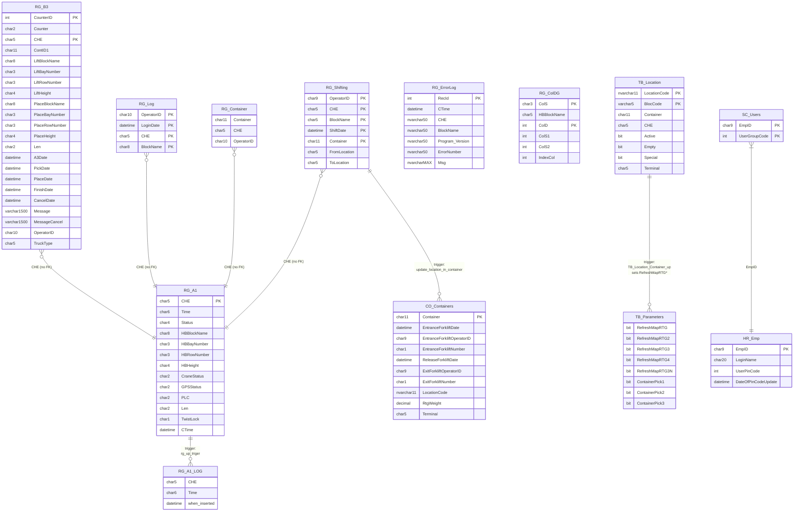

# 04 — Database Schema & Logic

> **Phase 1 — Step 1.4** · Analyst: Claude Code · Date: 2026-04-21
> **Source of truth:** `Current/rtg-discovery/` dump generated from `SQL01` / `TerminalData` on 2026-04-21 12:39 (MSSQL 2019 Std).
> **Scope of this document:** the 21 tables / 13 views / 80 stored procedures / 2 functions flagged as targets in `01_target_objects.txt` — i.e. everything the RTG modules read or write, directly or via ForkliftApp integration.

---

## 1. Database context

| Property | Value |
|---|---|
| Server | `SQL01` (alias for `192.6.8.52`) |
| Database | `TerminalData` |
| Engine | Microsoft SQL Server 2019 (RTM-CU32-GDR) Standard Edition, Build 15.0.4460.4, x64 |
| Host OS | Windows Server 2019 Datacenter (Hypervisor) |
| Collation | Not explicit in dump — infer Hebrew-aware (column aliases contain Hebrew text) |
| Export timestamp | 2026-04-21 12:39:13 |

**This is a shared enterprise database.** 49 foreign keys exist (on `CP_Order`, `HR_*`, `FI_*`, etc.) — but **zero** of them reference any `RG_*` or `TB_Location` or `TB_Parameters` table. The RTG tables are an island inside the larger MIS schema.

---

## 2. Write-vs-read matrix (per component × per table)

| Table | Approx rows | Listener writes | Listener reads | UI writes | UI reads | MIS / ForkliftApp / other |
|---|---:|:---:|:---:|:---:|:---:|:---:|
| `RG_A1` | 3 | ✅ (A1 msg) | — | — | ✅ (map timer) | — |
| `RG_B3` | 475 | ✅ (A2/A3 msg → dates) | ✅ (broadcast pending) | ✅ (enqueue job) | ✅ (queue state) | — |
| `RG_Container` | 0 | ✅ (A2/04 PLACE DELETE) | ✅ (A2 COUNT/SELECT) | ❓ (inferred UI INSERT on pick — Q-13) | ❓ | — |
| `RG_Log` | 31 654 | — | — via `V_RG_CurrentOperator` on A2/04 PLACE | ✅ (login INSERT) | ✅ (misc) | — |
| `RG_Shifting` | 503 414 | ✅ (A2/04 PLACE INSERT) | — | — | ✅ (reports) | ✅ trigger `update_location_in_container` updates CO_Containers automatically |
| `RG_ColDG` | 84 | — | — | ❓ | ❓ | Probably DG column cross-reference |
| `RG_ErrorLog` | **1 615 872** | — | — | ✅ (Utils/ContainerLocation WriteLog) | — | — |
| `RG_A1_LOG` | ❓ (not in target list) | — | — | — | — | Populated by **trigger** `rg_up_triger` — every UPDATE to `RG_A1` inserts here. **See Q-19.** |
| `TB_Location` | 35 174 | ✅ (A2/04 PLACE, 1-2 UPDATEs) | ✅ (A2/03 PICK SELECT) | ✅ (ContainerLocation screen) | ✅ (many screens) | ✅ shared with ForkliftApp (`sp_ForkLift*`) and inventory flows |
| `TB_Parameters` | 1 | ✅ (ContainerPick1/2/3 flag on PICK) | ✅ | ✅ (clears RefreshMapRTG* flags after render) | ✅ (reads flags) | ✅ heavily shared — 48 columns, most are MIS config |
| `TB_RecommendedLocation` | 80 | — | — | — | ✅ (FrmRecommendedLocation) | ✅ MIS |
| `CO_Containers` | 2 591 916 | ✅ (A2/04 PLACE, EntranceForkliftDate, ReleaseForkliftDate, LocationCode, RtgWeight) | — | ✅ (update screens) | ✅ | ✅ heavy — shared with MIS + ForkliftApp |
| `CO_ContainerProfile` | 1 722 128 | — | — | — | ✅ (views) | ✅ MIS |
| `CP_Deal` | 2 080 099 | — | — | — | ✅ (views) | ✅ MIS owns |
| `CP_Order` | 400 969 | — | — | — | ✅ (V_OrderForkLift) | ✅ MIS |
| `TB_Drivers` | 49 667 | — | — | — | ✅ (views) | ✅ MIS |
| `TB_WorkType` | 190 | — | — | — | ✅ (views) | ✅ MIS |
| `HR_Emp` | 876 | — | — | — | ✅ (login, views) | ✅ MIS |
| `SC_Users` | 1 345 | — | — | — | ✅ (login) | ✅ MIS |
| `SC_AppGroup` | 1 060 | — | — | — | ✅ (login join) | ✅ MIS |
| `TC_Client` | 90 559 | — | — | — | ✅ (views) | ✅ MIS |
| `TC_HazardousSubstances` | 1 966 | — | — | — | ✅ (views) | ✅ MIS |

**Key takeaway for the dual-write design:** the *exclusively* RTG-owned tables are `RG_A1`, `RG_B3`, `RG_Container`, `RG_Log`, `RG_Shifting`, `RG_ColDG`, `RG_ErrorLog`, `RG_A1_LOG`. Everything else (`CO_*`, `CP_*`, `TB_*`, `HR_*`, `SC_*`, `TC_*`) is **shared** with the rest of the ERP. Dual-write must apply there. The RTG-exclusive tables can migrate freely.

---

## 3. Table-by-table schema — RTG-exclusive tables

### 3.1 `RG_A1` — current crane status (3 rows)

| # | Column | Type | Null | Default | Meaning |
|---|---|---|---|---|---|
| 1 | `Time` | `char(6)` | NOT NULL | | `HHmmss` when the crane sent this packet (from packet bytes 12..18). String, not TIME. |
| 2 | `Status` | `char(4)` | NULL | | Crane status code (from packet bytes 18..22). Undocumented values — Q-20. |
| 3 | `HBBlockName` | `char(8)` | NULL | | Head-block block name (BOND1/2/3 or ground/truck marker). |
| 4 | `HBBayNumber` | `char(3)` | NULL | | Head-block bay (X coordinate). |
| 5 | `HBRowNumber` | `char(3)` | NULL | | Head-block row (Y). Offsets 33..36. |
| 6 | `HBHeight` | `char(4)` | NULL | | Head-block height (Z). Offsets 36..40. |
| 7 | `CraneStatus` | `char(2)` | NULL | | Packet bytes 40..42. |
| 8 | `GPSStatus` | `char(2)` | NULL | | Packet bytes 42..44. |
| 9 | `CHE` | `char(5)` | NOT NULL | | Primary-key. `GOLD1` / `GOLD2` / `GOLD3`. |
| 10 | `PLC` | `char(2)` | NULL | | Packet bytes 55..57. |
| 11 | `Len` | `char(2)` | NULL | | Container length code (20/40/45). Packet bytes 75..77. |
| 12 | `TwistLock` | `char(1)` | NULL | | Single-byte flag. Packet byte 77. |
| 13 | `CTime` | `datetime` | NULL | `getdate()` | Server-side time of the UPDATE. |

**PK:** `PK_RG_A1` on `CHE`. No FK. 3 rows — 1 per crane, permanently present.

**Triggers on RG_A1:**

1. `rg_a1_updatetime` (AFTER UPDATE) — re-`UPDATE` same row to set `CTime=getdate()`. Redundant (TOSConsole already `SET CTime=getdate()` in its main UPDATE), and creates a second statement inside the original transaction.
2. `rg_up_triger` (AFTER UPDATE) — INSERT into `RG_A1_LOG` the 12 status columns of the newly-updated row. **This is the only use of `RG_A1_LOG`.** Effectively every position packet turns into: 1 UPDATE on `RG_A1` + 1 INSERT on `RG_A1_LOG` (this trigger also implicitly retriggers `rg_a1_updatetime` via SQL Server trigger recursion rules — Q-21).

**Smell:** `Time` is `char(6)` instead of a TIME column; comparisons with `DateTime.Now` in UI code treat it as elapsed seconds of the day, which breaks at midnight. See edge-case #X in `07_edge_cases.md`.

### 3.2 `RG_B3` — outbound job queue to crane (475 rows)

| # | Column | Type | Null | Meaning |
|---|---|---|---|---|
| 1 | `CounterID` | `int` | NOT NULL | Identity-like surrogate key. Used as "newest first" via `MAX(CounterID)` throughout the listener. |
| 2 | `Counter` | `char(2)` | NOT NULL | Wire-protocol message counter (two hex chars). Sent in the packet, echoed in ACK. |
| 3 | `Time` | `char(14)` | NULL | (wall-clock timestamp string?) |
| 4 | `CHE` | `char(5)` | NOT NULL | Target crane (GOLD1/2/3). |
| 5 | `ContID1` | `char(11)` | NULL | Container id (11-char industry standard). |
| 6-9 | `LiftBlockName`, `LiftBayNumber`, `LiftRowNumber`, `LiftHeight` | `char(8|3|3|4)` | NULL | Source (pick) coordinates. |
| 10-13 | `PlaceBlockName`, `PlaceBayNumber`, `PlaceRowNumber`, `PlaceHeight` | `char(8|3|3|4)` | NULL | Destination (place) coordinates. |
| 14 | `Len` | `char(2)` | NULL | Container length. |
| 15 | `A3Date` | `datetime` | NULL | Set when crane sent an A3 (ack) response. |
| 16 | `PickDate` | `datetime` | NULL | Set when crane reported successful pick (A2/03). |
| 17 | `PlaceDate` | `datetime` | NULL | Set when crane reported successful place (A2/04). |
| 18 | `FinishDate` | `datetime` | NULL | Unused in code inspected so far — Q-22. |
| 19 | `CancelDate` | `datetime` | NULL | Set when crane confirms cancel. |
| 20 | `PreMessage` | `varchar(201)` | NULL | (staging text) |
| 21 | `Message` | `varchar(1500)` | NULL | Hex-encoded outbound packet to crane. Listener uses `ToByteArray(Message)` to convert back to bytes on send. |
| 22 | `PreMessageCancel` | `varchar(6)` | NOT NULL | (staging text) |
| 23 | `MessageCancel` | `varchar(1500)` | NULL | Hex-encoded cancel packet. |
| 24 | `OperatorID` | `char(10)` | NULL | Which operator created this job. |
| 25 | `TruckType` | `char(5)` | NULL | Truck code used on ground-deliveries. |

**PK:** `PK_RG_B3` (compound — likely `CHE`+`CounterID` or `CHE`+`Counter`; 2 rows in dump suggest 2 columns).

**Lifecycle (derived from code):** row is INSERTed by UI when operator creates a job → listener SELECTs and sends bytes at every goto-Outer → crane acks A3 → listener sets `A3Date` → crane picks (A2/03) → listener sets `PickDate` → crane places (A2/04) → listener sets `PlaceDate`. `FinishDate` and `CancelDate` are end-states.

**Observation:** `PreMessage` / `Message` / `PreMessageCancel` / `MessageCancel` — four textual blobs (~1500 chars each) per job — suggests the UI does **not** regenerate the wire format on demand; it persists the packet at enqueue time. This simplifies the listener but couples the DB schema to the wire format.

### 3.3 `RG_Container` — transient "currently held" state (0 rows)

| # | Column | Type |
|---|---|---|
| 1 | `Container` | `char(11)` |
| 2 | `CHE` | `char(5)` |
| 3 | `OperatorID` | `char(10)` |

**PK:** none. No constraints. Listener logic (`TOSConsole1/Program.cs:259-262`): on A2/03 PICK of a container from `G`/`T` (ground/truck), if `SELECT COUNT(*) FROM RG_Container WHERE CHE='GOLD1'` is zero, set `TB_Parameters.ContainerPick1 = 'TRUE'`. On A2/04 PLACE (`:289-299`), if any rows for this CHE, take the first, DELETE all rows for this CHE, and use the captured `Container`/`OperatorID` as part of the place action.

So `RG_Container` is a per-crane "I'm carrying X for operator Y" scratchpad with row count ∈ {0,1}. But **nothing inserts into it from the listener** — only DELETEs. The INSERT must happen elsewhere (UI — see Q-13). This is the kind of bug-magnet that a new design must replace with an explicit state machine.

### 3.4 `RG_Log` — operator session log (31 654 rows)

| # | Column | Type | Null |
|---|---|---|---|
| 1 | `OperatorID` | `char(10)` | NOT NULL |
| 2 | `LoginDate` | `datetime` | NOT NULL |
| 3 | `CHE` | `char(5)` | NOT NULL |
| 4 | `BlockName` | `char(8)` | NOT NULL |

**PK:** `PK_RG_Log` (multi-column — likely all 4). Written only by `RTGApp.FrmLogin.btnOK_Click` on successful PIN auth. Read by `V_RG_CurrentOperator` (`CHE` + `MAX(LoginDate)`). No "logout" row — you only know *when* someone logged in, not out.

**Observation:** `V_RG_CurrentOperator` filters out `OperatorID <> '444444444'` — the magic number 444444444 is a placeholder / admin / test user (Q-23). This value should be treated carefully in the migration.

### 3.5 `RG_Shifting` — container movement history (503 414 rows)

| # | Column | Type |
|---|---|---|
| 1 | `OperatorID` | `char(9)` **(different length from RG_Log's char(10)!)** |
| 2 | `CHE` | `char(5)` |
| 3 | `BlockName` | `char(5)` **(different length from RG_Log's char(8)!)** |
| 4 | `ShiftDate` | `datetime` |
| 5 | `Container` | `char(11)` |
| 6 | `FromLocation` | `char(5)` |
| 7 | `ToLocation` | `char(5)` |

**PK:** `PK_RG_Shifting` (5-column — likely all except `Container` → probably `OperatorID,CHE,BlockName,ShiftDate,Container`). No FK.

**Trigger `update_location_in_container`** (AFTER INSERT on RG_Shifting): performs `UPDATE CO_Containers SET LocationCode = inserted.ToLocation WHERE CO_Containers.LocationCode = inserted.fromLocation AND CO_Containers.Container = inserted.Container`.

⚠ **This duplicates work** that the listener already does explicitly in the A2/04 PLACE handler (`TOSConsole1/Program.cs:322-323`: `UPDATE CO_Containers SET LocationCode = ...`). Both paths run. In nominal operation the trigger is a no-op because the listener already set `LocationCode = ToLocation` before the `INSERT RG_Shifting`. But if the two disagree (e.g. `toLocation` case-sensitivity, trailing spaces), the trigger can silently "fix" or "unfix" state.

**Column-length mismatches:** `RG_Shifting.OperatorID` is `char(9)` vs `RG_Log.OperatorID`=`char(10)`; `BlockName` is `char(5)` vs `char(8)`. Same data, different lengths — pure technical debt. ForkliftApp and MIS may see padding differences.

### 3.6 `RG_ColDG` — dangerous-goods column lookup (84 rows)

| # | Column | Type |
|---|---|---|
| 1 | `ColS` | `char(3)` |
| 2 | `HBBlockName` | `char(5)` |
| 3 | `ColD` | `int` |
| 4 | `ColS1` | `int` |
| 5 | `ColS2` | `int` |
| 6 | `IndexCol` | `int` |

**PK:** `PK_RG_ColDG_1`. Semantics **unknown** from the code read so far (no code references `RG_ColDG`). Column names suggest a conversion table between DG (dangerous-goods) classes / yard columns — Q-14.

### 3.7 `RG_ErrorLog` — app-level error log (1 615 872 rows)

| # | Column | Type | Null | Default |
|---|---|---|---|---|
| 1 | `RecId` | `int` identity | NOT NULL | |
| 2 | `CTime` | `datetime` | NOT NULL | `getdate()` |
| 3 | `CHE` | `nvarchar(50)` | NOT NULL | |
| 4 | `BlockName` | `nvarchar(50)` | NULL | |
| 5 | `Program_Version` | `nvarchar(50)` | NULL | |
| 6 | `ErrorNumber` | `nvarchar(50)` | NULL | |
| 7 | `Msg` | `nvarchar(max)` | NULL | |

**PK:** on `RecId`. **1.6M rows for a 3-crane system is a huge smell** — at 500K rows/year that's a hot write path. Main writers are the UI's `Utils.WriteLog` (RTG1-2) and `ContainerLocation.WriteLog` (RTG3). Listener writes to flat files, **not** to this table. (Interesting — it is the UI that drowns this table.)

`Msg` is `nvarchar(max)` — unbounded; every logged exception stacktrace is dumped here.

**Must-do in Phase 2:** centralise logging to a real sink (file + log aggregator) and keep this table either archived or retired.

### 3.8 `RG_A1_LOG` — (not in target list, but exists)

Schema not in the dump. Columns used by `rg_up_triger` (`05_module_definitions.sql:509-512`) are the 12 status columns of `RG_A1` — `Time, Status, HBBlockName, HBBayNumber, HBRowNumber, HBHeight, CraneStatus, GPSStatus, CHE, PLC, Len, TwistLock`.

**Cost model:** listener sends ~1 A1 packet per second per crane under heavy use → ~259 000 inserts per crane per day → this table is the fastest-growing in the RTG footprint. Q-19 asks: is it being rolled / archived? What is its current size?

---

## 4. Key shared tables — RTG integration boundary

### 4.1 `TB_Location` — yard location master (35 174 rows)

| # | Column | Type | Null | Notes |
|---|---|---|---|---|
| 1 | `LocationCode` | `nvarchar(11)` | NOT NULL | PK part. Format: `bayrowheight` concat like `103A1` |
| 2 | `BlocCode` | `varchar(5)` | NOT NULL | PK part. `BOND1`, `BOND2`, `BOND3` — or ground/truck markers |
| 3 | `LocationType` | `nvarchar(20)` | NULL | |
| 4 | `LocationDesc` | `varchar(150)` | NULL | |
| 5-11 | `ColumnNumber`, `HeightNumber`, `IdyNumber`, `PalletType`, `Counter`, `CounterOdd`, `FirstColumn` | various | | |
| 12 | `Container` | `char(11)` | NULL | Current container occupying the slot. Updated by listener A2/04 PLACE. |
| 13 | `Active` | `bit` | NULL | default `0` — suggests many rows are inactive |
| 14 | `GroupTypeCode` | `int` | NULL | |
| 15 | `CHE` | `char(5)` | NULL | Which crane last touched it. |
| 16 | `Empty` | `bit` | NULL | default `0` |
| 17 | `Special` | `bit` | NULL | default `0` |
| 18 | `Terminal` | `char(5)` | NOT NULL | Multi-terminal DB — only `'ILCXQ'` is used in RTG views |
| 19 | `LocationCodeNew` | `nvarchar(11)` | NULL | Possibly a migration artefact — Q-24 |
| 20 | `BlocCodeNew` | `nvarchar(20)` | NULL | Same |

**PK:** multi-column. **Indexes:** `Id_Block`, `Id_Container`, `ID_CHE` — good, operational queries are well-served.

**Trigger `TB_Location_Container_up`** (FOR UPDATE): THIS IS THE **MECHANISM THAT DRIVES THE UI MAP REFRESH**. The trigger fires when `Container` column changes; based on `(BlocCode, CHE)` pair it sets one of 5 flags in `TB_Parameters`:

| If update matches… | Sets `TB_Parameters` column |
|---|---|
| `BlocCode='BOND1' AND CHE='GOLD1'` | `RefreshMapRTG` |
| `BlocCode='BOND2' AND CHE='GOLD1'` | `RefreshMapRTG2` |
| `BlocCode='BOND1' AND CHE='GOLD2'` | `RefreshMapRTG3` |
| `BlocCode='BOND2' AND CHE='GOLD2'` | `RefreshMapRTG4` |
| `BlocCode='BOND3' AND CHE='GOLD3'` | `RefreshMapRTG3N` |

> **This is the single biggest piece of logic hidden in the DB.** The `RefreshMapRTGn` flags are then polled by `FrmMap01.TimerCHE_Tick_1` (`Form1.cs:1682-1736`) and cleared after repainting. Port this to Phase 2 exactly, preferably as a pub/sub notification (PostgreSQL `LISTEN/NOTIFY` + server-side event stream), not as another polled flag.

**⚠ The trigger condition** `count(*)=1` with a cross-join `inserted × deleted` only handles **single-row updates**. A multi-row update (e.g. if the UI ever did `UPDATE TB_Location SET Container=NULL WHERE …many rows`) would produce `count(*) > 1` and none of the flags would fire. Today only single-row updates are observed in the code, but the constraint is undeclared and fragile.

### 4.2 `TB_Parameters` — single-row config table (1 row × 48 columns)

Only the RTG-related columns are listed here; the table has 48 columns total and is shared with MIS, ForkliftApp, invoicing, portal, etc.

| # | Column | Type | Used by | Meaning |
|---|---|---|---|---|
| 23 | `RefreshMapRTG` | `bit` (default 0) | UI timer | Re-render map for (GOLD1, BOND1). Set by TB_Location trigger; cleared by UI. |
| 24 | `RefreshMapRTG2` | `bit` (default 0) | UI timer | (GOLD1, BOND2) |
| 25 | `RefreshMapRTG3` | `bit` (default 0) | UI timer | (GOLD2, BOND1) |
| 26 | `RefreshMapRTG4` | `bit` (default 0) | UI timer | (GOLD2, BOND2) |
| 27 | `ContainerPick1` | `bit` (default 0) | Listener sets on A2/03 from G/T when RG_Container empty; UI reads to show widget | |
| 28 | `ContainerPick2` | `bit` (default 0) | same for GOLD2 | |
| 29 | `RefreshMapRTG3N` | `bit` | UI timer | (GOLD3, BOND3). Suffix "N" = "new". |
| 30 | `ContainerPick3` | `bit` | for GOLD3. **But the RTG3 UI's FrmMap01 has not been re-read to confirm usage** (Q-25) |
| 31 | `QueryTaskYam` | `bit` | Unknown usage — Q-14 | |

The rest of the columns are clearly non-RTG: `AmitalLocationFile`, `AganLocationFile`, `ClientContainerLocationFilePath`, `VAT`, `ManagerMessage`, `PortUserNane` [sic], `PortPassword`, `IDFMail`, `EGoldEmpIDGenerateInvoice`, `IncludeDeliveryLucyApp`, `MaxStorageHH`, `NoAutoInvPP`, etc. — a **god-table of environment parameters**.

⚠ **`PortPassword` and `PortUserNane`** are plaintext `varchar(50)` — another credential store in the same table. Not RTG-related but worth flagging for the user.

### 4.3 `CO_Containers` (2.59 M rows) — shared container master

RTG interactions with this table (from listener code `TOSConsole1/Program.cs:298-323`):

| Operation | Columns touched | When |
|---|---|---|
| UPDATE `EntranceForkliftDate`, `EntranceForkliftOperatorID`, `EntranceForkliftNumber` | 3 cols | On A2/04 PLACE of a container previously in `RG_Container` (ground/truck pickup) |
| UPDATE `RtgWeight`, `LocationCode`, `ReleaseForkliftDate`, `ExitForkliftOperatorID`, `ExitForkliftNumber` | 5 cols | On A2/04 PLACE when destination is G/T (ground/truck) |
| UPDATE `RtgWeight`, `LocationCode` | 2 cols | On A2/04 PLACE for normal yard-to-yard placement |

**Triggers fire on every update:** `CO_Containers_LocationCode_UpdateTrigger`, `CO_Containers_WebUpdateTrigger`, `CO_Containers_NetoWeight_up_log`, `CO_Containers_Container_up_log`, `CO_Containers_EntranceDate_up_log`, `CO_Containers_ExitDate_up_log`, `CO_Containers_EntranceDriverID_up_log` — plus the `RG_Shifting.update_location_in_container` trigger that indirectly updates `CO_Containers.LocationCode` again.

**A single A2/04 PLACE packet from the crane therefore fires:**
- 1 UPDATE on RG_B3 (+ triggers on RG_B3 — none listed, likely none)
- 1 optional DELETE on RG_Container
- 1 UPDATE on CO_Containers (+ ~7 triggers, several of which write audit rows to `log` or `AuditWeb`)
- 1 INSERT on RG_Shifting (+ `update_location_in_container` triggers ANOTHER UPDATE on CO_Containers + its 7 triggers)
- 1 UPDATE on TB_Location clearing old slot (+ `TB_Location_Container_up` trigger updates TB_Parameters)
- 1 UPDATE on TB_Location setting new slot (+ trigger again)

So the write amplification of a single place operation is roughly **10-15 DB writes** from one socket packet. This is one of the drivers of the 1.6 M `RG_ErrorLog` rows and the 503 K `RG_Shifting` rows.

---

## 5. Views & stored procedures — categorized

The discovery file lists **13 views + 80 procedures + 2 functions** at priorities 1-4. I group them by role:

### 5.1 Views used directly by the Operator UI (priority 1-2)

| View | Used by | Role |
|---|---|---|
| `V_MapRTGBond1` | FrmMap01 for (GOLD1+GOLD2 × BOND1) | Pivoted container-count grid, columns 100-132. |
| `V_MapRTGBond2` | FrmMap01 for BOND2 | Columns 133-185. Notice: no `V_MapRTGBond3`. |
| `V_MapRTGBond1Pre`, `V_MapRTGBond2Pre` | Inputs to the above (not listed as targets — must exist — Q-26) | |
| `V_RG_CurrentOperator` | Listener on A2/04 PLACE + misc | `CHE, MAX(LoginDate)` from `RG_Log WHERE OperatorID <> '444444444'` |
| `V_ContainerUnloadRG` | Some UI — likely `FrmExpectedContainers` | Unloadable containers for BOND1/2 (ILCXQ), excludes HandlingTypeCode='DP' |
| `V_ContainerUnloadRTG3` | Crane 3 UI variant | Same as above but HandlingTypeCode='FR' only |
| `V_Location_BOND_TOP` (name in dump: `V_Location_BOND1_TOP`) | Likely map top-row lookup | `LEFT(LocationCode, 4) + MAX(SUBSTRING(LocationCode, 5, 1))` — "highest stack column" per bay for BOND1/2 |
| `V_LocationCount` | Joined in `V_RTGLoad` | Per-bay stack count for BOND1/2 |
| `V_LocationCountRTG3` | Joined in `V_RTG3Load` | Same for BOND3 |
| `V_OrderForkLift` | `v_RtgContainerData`, FrmMap01 cell tooltip (probable) | Open orders for forklift work |
| `V_RTG_App_ContainerMovement` | A report in RTGApp? | 7-day in/out movements (Hebrew column aliases) |
| `V_RTG3Load`, `V_RTGLoad` | Per-crane "load list" | Containers ready to load (with truck info, bay/column, UN, DG class, weight) |
| `v_RtgContainerData` | Detail / tooltip for a container | Enriched container info (client, order, container type, weight, UN) |

**Pattern:** the UI issues heavy, multi-join, Hebrew-column-alias queries against these views at each timer tick. In PostgreSQL, these become materialized views or scheduled refreshes; today they're re-run every N seconds, per-cab, against a live 2.59 M row `CO_Containers` table.

### 5.2 Stored procedures — the out-of-band control plane

The four "system-level" SPs are the shocking finding:

| Procedure | Body | Risk |
|---|---|---|
| `KillToss1` | `EXEC xp_cmdshell 'C:\RTG\RTG1\KillToss1.exe'` | `xp_cmdshell` enabled on production DB server; shells out to `.exe` on local disk |
| `KillToss2` | `EXEC xp_cmdshell 'C:\RTG\RTG2\KillToss2.exe'` | ″ |
| `KillToss3` | `EXEC xp_cmdshell 'C:\RTG\RTG3\KillToss3.exe'` | ″ |
| `RunEnconsoleRTG1` | `EXEC xp_cmdshell 'c:\RTG\RTG1\TOSConsole1.exe', 'no_output'` | ″ — launches the listener from the DB server |
| `RunEnconsoleRTG2` | `EXEC xp_cmdshell 'c:\RTG\RTG2\TOSConsole2.exe', 'no_output'` | ″ |
| `RunEnconsoleRTG3` | `EXEC xp_cmdshell 'c:\RTG\RTG3\TOSConsole3.exe', 'no_output'` | ″ |

**Implication:** the DB server (`SQL01` / `192.6.8.52`) and the Listener host (`192.6.1.8`) must be the same Windows host, OR `C:\RTG\RTG1\` is a networked/shared path, OR `xp_cmdshell` there is a no-op in a misconfigured environment. Q-12 is a blocker for the Phase 2 deployment plan.

### 5.3 `sp_ForkLift*` (priority 4) — the ForkliftApp integration surface

~30 procedures prefixed `sp_ForkLift*` that query / update `CO_Containers`, `TB_Location`, `CP_Deal`, `TB_Trucks`, etc. (e.g. `sp_ForkLiftActIn`, `sp_ForkLiftContainersActQuery_APP`, `sp_ForkLiftContainersEMOutUpDate_new`). They are **not invoked from RTG code** — they belong to the separate ForkliftApp (`From TFS/RTG/New Folder/ForkliftApp/`). They matter for migration because:

- They read `CO_Containers.EntranceForkliftDate` and `LocationCode` — the **same columns** RTG writes on A2/04 PLACE. Any skew between PG-primary and MSSQL-dual-write will be observable to ForkliftApp.
- Some of them write to `TB_Location.Container` — which will fire our `TB_Location_Container_up` trigger, which writes `RefreshMapRTGn` flags, which RTG UI polls. **ForkliftApp can indirectly cause RTG map to refresh.** This entanglement must be preserved in the dual-write phase.

### 5.4 Functions

Two scalar functions:
- `IntToHex` — integer → hex string. Used probably in the RG_B3 message building.
- `udf_GetNumeric` — extract numeric characters from a string (seen in `05_module_definitions.sql:340-343`).

Simple; both trivially portable to PostgreSQL.

---

## 6. Schema smells (Phase-2 redesign inputs)

1. **No transactions and no consistency contract** — cross-table invariants are upheld by *trigger-ordered* side-effects. If one step fails mid-way, the row in `RG_B3` says "placed" but `TB_Location` says "still there". See §7 of `03_data_flows.md`.
2. **`TB_Parameters` is a god-row.** One row, 48 columns, shared by half the enterprise. Every module treats it as a namespaced key-value store. Replace with a real configuration store; fan-out bitfields into a proper signal bus.
3. **Code-by-`LocationCode` string manipulation everywhere.** `LEFT(LocationCode, 4) + MAX(SUBSTRING(LocationCode, 5, 1))` — yard coordinates are packed into a single `nvarchar(11)` and dismantled with `LEFT`/`SUBSTRING`/`REPLACE`. Smart Phase-2 schema: split bay/row/height into explicit columns.
4. **Per-crane hardcoding in schema** — `TB_WorkType.Gold3` (a per-work-type boolean just for crane 3), `TB_Parameters.RefreshMapRTG3N`, `V_ContainerUnloadRTG3`, `V_LocationCountRTG3`, etc. The schema replicates the code-fork on RTG3. Parameterise in the new design (crane_id FK).
5. **Column-length mismatches** — `RG_Log.OperatorID=char(10)` vs `RG_Shifting.OperatorID=char(9)` vs `HR_Emp.EmpID=char(9)`. Same logical field, three widths. Trailing-space bugs guaranteed.
6. **`char(N)` strings storing coded fields.** Every packet field is a `char` (fixed-width, space-padded). Not a nominal problem, but becomes one when comparing to trimmed inputs in WHERE clauses.
7. **Dates-as-state** — `RG_B3` represents a job's state machine as 4 nullable datetime columns (A3Date / PickDate / PlaceDate / CancelDate). An explicit `state ENUM` would make the machine queryable.
8. **No partitioning / archiving** on the growth tables (`RG_ErrorLog` 1.6 M, `RG_Shifting` 503 K, `RG_A1_LOG` unknown, `CO_Containers` 2.59 M). Phase 2 should define retention and partition rules.
9. **Terminal-scoped data is mixed with RTG** — the RTG code assumes `Terminal='ILCXQ'` implicitly; views hard-code it. Multi-terminal future would need to configure this.
10. **Untyped JSON/XML — NO.** This DB does not use JSON/XML blobs. Everything is flat columns. That is actually a migration-friendly property.

---

## 7. ER diagram (RTG subset)

Scope: only the tables RTG touches.

> ⚠ There are **no declared foreign keys** between any `RG_*` tables and the rest of the schema. The relationships drawn above are *conventional* — all joins happen at query time by column name. Phase 2 should make these explicit.

---

## 8. What to migrate in what order

A suggested **sequencing hint** for the Phase 2 migration plan (deep design happens in `docs/design/`):

1. **Migrate first — RTG-owned tables** (`RG_*` except `RG_ErrorLog`, `RG_A1_LOG`). Pure greenfield. No FKs. Short data history on `RG_A1` (3 rows) and `RG_B3` (475 rows). `RG_Shifting` and `RG_Log` have history worth preserving but no external referencers.
2. **Retire in Phase 2** — `RG_ErrorLog` and `RG_A1_LOG` are log tables. Stop writing; read-only archive until retention expires.
3. **Migrate the RTG-owned triggers & views as code** (application-level or postgres triggers).
4. **Dual-write required on shared tables** — `CO_Containers` (EntranceForkliftDate, ReleaseForkliftDate, LocationCode, RtgWeight), `TB_Location` (Container, CHE), `TB_Parameters` (the RTG-relevant columns only).
5. **Don't write** (read-only from MIS during transition) — `CP_Deal`, `CP_Order`, `HR_Emp`, `SC_Users`, `SC_AppGroup`, `TC_Client`, `TC_HazardousSubstances`, `TB_Drivers`, `TB_WorkType`, `TB_RecommendedLocation`, `CO_ContainerProfile`.
6. **Beware of cross-cutting triggers** — every write to `CO_Containers` and `SC_Users` fires `*_WebInsertTrigger` / `*_WebUpdateTrigger` that write to `AuditWeb`. The dual-write layer must not duplicate these rows. Consider either (a) write only via the SP-equivalent with a special `system_user` name, or (b) disable specific triggers during the dual-write and re-audit at the boundary.

---

## 9. Check-in summary

- **21 RTG-target tables, 13 views, 80 procedures, 2 functions mapped.** RTG-exclusive vs shared split is clean: only `RG_*` are exclusive; everything else is shared with MIS/ForkliftApp. Dual-write scope is therefore well-bounded.
- **Two schema discoveries that change the architecture:** (1) `TB_Location_Container_up` trigger sets the `RefreshMapRTGn` flags in `TB_Parameters` — the UI's "map refresh" is a **trigger-based pub/sub** built out of polled bit columns. (2) `RG_A1` every UPDATE also INSERTs to `RG_A1_LOG` via trigger — the RG_A1 log is write-amplified by one insert per packet per crane. Plus `KillToss*` / `RunEnconsoleRTG*` invoke `xp_cmdshell` on the DB server — a control-plane coupling of DB and OS processes that Phase 2 must replace.
- **Top 5 schema smells to fix in PG target:** (1) state-machine-as-nullable-dates in `RG_B3`; (2) yard coordinates packed into a single `nvarchar(11) LocationCode`; (3) per-crane hardcoding of column names (`RefreshMapRTG3N`, `Gold3`, etc.); (4) `TB_Parameters` 48-column god-row; (5) unbounded `RG_ErrorLog`/`RG_A1_LOG` growth without partitioning.
- **Next:** Step 1.5 — wire-protocol analysis. Extract the exact byte offsets / message types / checksum from the listener code. Determine whether this is a recognised crane protocol (NMEA / vendor-proprietary / DGPS) or a bespoke Goldbond format.
