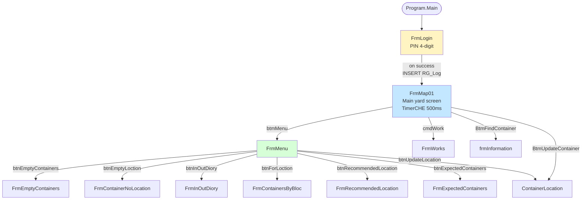

# 06 — Operator UI Analysis

> **Phase 1 — Step 1.6** · Analyst: Claude Code · Date: 2026-04-21
> **Scope:** The operator-facing Windows Forms application `RTGApp.exe`, its ~13 forms, and the Hebrew/RTL conventions used. Differences between the RTG1-2 variant and the RTG3 fork are flagged throughout. All file references point to `From TFS/RTG/RTG1-2/RTGApp/RTGApp/` unless stated otherwise.

---

## 1. Application shape at a glance

| Property | Value |
|---|---|
| Runtime | .NET Framework 4.8, WinForms, x86, Windows-only |
| Entry point | `Program.cs` → `Application.Run(new FrmLogin())` |
| Forms (13) | `FrmLogin` → `FrmMap01` → `FrmMenu` → six submenu forms → `ContainerLocation`, `frmInformation`, `FrmWorks` |
| Localization | **Hebrew RTL** — every top-level form has `RightToLeft = Yes` and most have `RightToLeftLayout = true`. Dialog / message text is Hebrew. Field / control names (in code) are English. |
| Fonts / sizes | Standard Windows Forms defaults; large on-screen keypad buttons for the PIN and container/location entry (suits touch use). |
| Input modes | On-screen keypad (4-digit PIN, numeric container fields), mouse / touch clicks, dropdowns (combo boxes). **No keyboard shortcuts** observed. |
| Frame chrome | Windows title bar + minimize/close icons. Not kiosk-mode; operator can Alt-Tab. |
| Multi-monitor | Not used. Single-window workflow. |

### 1.1 Deploy locations

| Crane | Binary on cabin PC | Identity file | DB connection |
|---|---|---|---|
| #1 | `C:\RTG\RTGApp.exe` (per `Read Me !.txt`) | `C:\RTG\CHEName.txt` contains `BOND1` | Integrated Security to `192.6.8.52` |
| #2 | `C:\RTG\RTGApp.exe` | `C:\RTG\CHEName.txt` contains `BOND2` | Integrated Security to `192.6.8.52` |
| #3 | `C:\RTG\RTGApp.exe` (RTG3 build) | **No file needed** — hardcoded `GOLD3` / `Bond3` | SQL-auth with **hardcoded password `z3334606*`** (see `02_components.md` §4) |

---

## 2. Forms inventory (13 active + ~3 historical-only)

Mapped by the `FrmMenu` dispatch and by `Application.Run(new FrmLogin())` + `FrmLogin` → `new FrmMap01()`.

| Class name | File | Approx lines | Opened from | Purpose | Status |
|---|---|---:|---|---|---|
| `FrmLogin` | `FrmLogin.cs` | 265 | Program.Main | PIN-based login | ✅ active |
| `FrmMap01` | `Form1.cs` | **~4000** (116 KB) | FrmLogin OK → `new FrmMap01(); Show()` | Main yard map + job selection + live crane status | ✅ active, **dominant form** |
| `FrmMenu` | `FrmMenu.cs` | 80 | FrmMap01 "btmMenu" button | Dispatcher to the 7 secondary screens | ✅ active |
| `ContainerLocation` | `ContainerLocation.cs` | 370 (RTG3 variant has `WriteLog` helper here) | FrmMenu "btnUpdateLocation" | Update a container's LocationCode manually | ✅ active |
| `frmInformation` | `Form2.cs` | ~500 | FrmMap01? (multiple callers) | Container details / information | ✅ active |
| `FrmWorks` | `Works.cs` | ~520 | FrmMap01 "cmdWork" button | Outstanding work orders (CP_Order filtered by TB_WorkType) | ✅ active |
| `FrmContainersByBloc` | `FrmContainersByBloc.cs` | 300 | FrmMenu "btnForLoction" | Containers in a given yard block | ✅ active |
| `FrmContainerNoLocation` | `FrmContainerNoLocation.cs` | 70 | FrmMenu "btnEmptyLoction" | Containers without a location code | ✅ active |
| `FrmEmptyContainers` | `FrmEmptyContainers.cs` | 340 | FrmMenu "btnEmptyContainers" | List of empty containers | ✅ active |
| `FrmExpectedContainers` | `FrmExpectedContainers.cs` | 230 | FrmMenu "btnExpectedContainers" | Containers expected to arrive / unload | ✅ active |
| `FrmInOutDiory` | `FrmInOutDiory.cs` | 130 | FrmMenu "btnInOutDiory" | In/Out "diary" (misspelled — should be Diary) | ✅ active |
| `FrmRecommendedLocation` | `FrmRecommendedLocation.cs` | 267 | FrmMenu "btnRecommendedLocation" | Edit system-recommended locations per client | ✅ active |

**Historical-only (referenced by compiled `.resources` but no matching `.cs` in TFS):**

| Class (inferred) | Evidence | Status |
|---|---|---|
| `frmInformation` | Has a `.cs` in newer code; earlier build had a differently-structured one | Historically present, now evolved |
| `FrmMap01` | Was called `Form1` historically; class name is `FrmMap01` but file is still `Form1.cs` | Evolved |
| `FrmWorks` | File `Works.cs`, class `FrmWorks` — similar rename | Evolved |

### 2.1 Form dependency diagram



---

## 3. `FrmMap01` — the central form (the workday screen)

This is the single most important screen; the operator spends their entire shift on it. Named class `FrmMap01` but file name is `Form1.cs` — evidence the "Map" screen was promoted to the main screen without the file being renamed.

### 3.1 Layout (as inferred from Designer + click handlers)

Top-level controls (method-name grep in `Form1.cs:67-3122`):

- **DG** — `DataGridView`. 2D yard map. Columns are bay numbers (e.g. 100, 102, 104…132 for BOND1). Rows are row letters (A..F) plus ground/truck pseudo-rows (G, T).
- **DGC** — secondary `DataGridView`. Exact purpose unclear — possibly "crane current position" or a detail panel.
- **DGH** — `DataGridView` showing `RG_A1` status (Time, Status, HBBlockName, Position, CraneStatus, GPSStatus, CHE, PLC, Len, TwistLock) — live-refreshed every 500 ms.
- **DGDealContainer** — `DataGridView`, likely showing containers matching a given deal (RTL = Yes).
- Fields for job entry: `Container`, `ContainerLenghth` [sic], `HandlingTypeCode`, `FromLocation`, `ToLocation`, `Counter`, `DriverName`, `TruckID`, `Weight`, `CHE`, `BlockName`, `ContainerTarget`, `OperatorID`.
- **EnconsoleButtom** [sic] — reconnect / re-engage button. Enabled only after 90 stale-ticks (45 seconds of frozen `RG_A1.Time`).
- **On-screen numeric keypad** — `One_Click` … `Nine_Click` + `Zero_Click` + `DELETE_Click`; **two copies of the keypad** (`_1` suffix — likely one for Container number, one for Weight or similar), visible via the method pairs (`One_Click` / `One_1_Click`). See `Form1.cs:2370-2612`.
- **Command buttons**: `btnOK_Click` (enqueue job to RG_B3), `btmCancel_Click` (cancel / send MessageCancel), `CmdTruck_Click`, `Container_Click` (select container), `CmdExit_Click`, `btmMenu_Click`, `BtmFindContainer_Click`, `BtmUpdateContainer_1_Click`, `cmdWork_Click`.

### 3.2 The 500 ms polling loop

`TimerCHE.Interval = 500` (`Form1.Designer.cs:321`). The handler `TimerCHE_Tick_1` (`Form1.cs:1573-1700`) runs **twice per second** and:

1. `SELECT Time, Status, HBBlockName, RTRIM(HBBayNumber) + RTRIM(HBRowNumber) + RTRIM(HBHeight) AS Position, CraneStatus, GPSStatus, CHE, PLC, Len, TwistLock FROM dbo.RG_A1 WHERE CHE='<CHE>'` → `DGH`.
2. Compares the new `Time` field (HH:mm:ss as a string) to the previous tick. If no change, `CounterConnect++`. If `CounterConnect > 90`, show "reconnect" button.
3. `SELECT ContainerPickN FROM TB_Parameters` (based on `CHE.Text == "GOLD1"` then column 1 else column 2) → if TRUE, show `ContainerPick` widget.
4. `SELECT RefreshMapRTGn FROM TB_Parameters` (based on (CHE, BlockName) pair) → if TRUE, call `MappingSquare()` → render the yard map → `UPDATE TB_Parameters SET RefreshMapRTGn = 'FALSE'`.
5. (FrmMap01 has more logic after line 1700 that has not been read exhaustively — see Q-33.)

**Cost model:** ~6 queries × 2 Hz × 3 active cab PCs = **36 queries/sec** on the DB just for the map-polling. Does not include Listener writes, DataGrid subsidiary queries, or human interactions. Q-34.

**UI blocking:** Several handlers do `System.Threading.Thread.Sleep(2000)` on the main thread (`Form1.cs:1440`, `Form1.cs:2292`, `FrmRecommendedLocation.cs:217`). The UI freezes for 2 seconds during Submit operations — that is by design (the developer wanted the listener to have time to pick up the RG_B3 row before the UI re-queries), but it means the map-timer misses its next tick(s) as well.

### 3.3 `MappingSquare()` — how the map is populated

In `Form1.cs:758-862`. Two DB trips:

1. `SELECT BONDR, [100], [102], …, [132] FROM V_MapRTGBond1` (or `V_MapRTGBond2` for BOND2). The view is a pivot by bay number, one column per bay. Rows are rows (A..F). Cells are container counts per stack. Then it iterates row × column, copying cells to `DG.Rows[i].Cells[j]`.
2. A 37-line query against `CO_Containers INNER JOIN RG_ColDG INNER JOIN TB_Location` filtering containers that are "awaiting exit" and coloring those cells `LightSeaGreen`. This reveals:
   - `RG_ColDG.IndexCol` is the **column index to highlight** in the map grid
   - `RG_ColDG.ColS` is the bay number (as `char(3)`)
   - `RG_ColDG.HBBlockName` filters to `'BOND1'`

So **`RG_ColDG` is the bay-column-mapping table** that maps a bay number + row letter + height character to a grid column index in the UI. This answers Q-14 partially: `RG_ColDG` is used for the highlight-color overlay, not for the map structure itself.

### 3.4 UI → DB job creation (`btnOK_Click`)

In `Form1.cs:1386-1459`. The full flow:

1. Capture truck type: `TruckTypeStr` = `"גורר"` (tractor) or `"משאית"` (truck) based on `this.TruckID.Text`.
2. `SELECT MAX(CounterID) FROM RG_B3 WHERE CHE=…`. If `== 255`, **wrap around**: DELETE all rows, INSERT a sentinel (CounterID=1, Counter=0).
3. `SELECT MAX(CounterID+1) FROM RG_B3 WHERE CHE=…` → `Counter` field.
4. `INSERT RG_B3(…)` — complex INSERT that computes a future `Time` (5 minutes from now as `YYYYMMDDHHMMSS`), calls SQL function `dbo.IntToHex(<counter>)` to produce the 2-hex-char wire counter, and fills in 16 columns including the Lift{Block,Bay,Row,Height} and Place{Block,Bay,Row,Height} from `BlocDef`/`FromLocation`/`ToLocation`. **Not listed: `PreMessage`** — see §3.5.
5. `SELECT MAX(CounterID) … → this.Counter.Text`. (Why again? Probably to re-read the identity-assigned value.)
6. `SELECT PreMessage FROM RG_B3 WHERE CounterID=…`. **PreMessage must have been populated by a DB-side mechanism** (trigger or computed column) — see Q-30.
7. `MessageStr = "FFFF" + ReturnAsciText(PreMessage + calcChecksum(PreMessage))` — build the wire hex.
8. `UPDATE RG_B3 SET Message = '<MessageStr>' WHERE CounterID=… AND CHE=…`.
9. `Thread.Sleep(2000)` — **block UI for 2 seconds**.
10. `SELECT COUNT(*) WHERE CounterID=… AND PickDate IS NULL AND PlaceDate IS NULL` — check whether the listener has taken it.
11. Set UI visual state accordingly (green/white backgrounds on FromLocation/ToLocation fields).
12. If `FromLocation[3] == "G"` or `"T"`: `INSERT RG_Container(Container, CHE, OperatorID)`.

**This answers Q-13:** RG_Container is written only by the UI, only on G/T source pick, to act as the "what am I carrying" breadcrumb that the listener reads on the next A2/04 PLACE.

### 3.5 Cancel flow (`btmCancel_Click`)

`Form1.cs:2277-2332`. Mirror of OK:

1. `SELECT PreMessageCancel FROM RG_B3 WHERE CounterID=…`
2. `MessageStr = "FFFF" + ReturnAsciText(PreMessageCancel + calcChecksum(PreMessageCancel))`
3. `UPDATE RG_B3 SET MessageCancel='<...>'`
4. Listener at its next cycle picks up `MessageCancel` from the broadcast SELECT and sends it to the crane.

---

## 4. `FrmLogin` — authentication

### 4.1 RTG1-2 vs. RTG3

Both variants (`FrmLogin.cs:1-265` and `RTG3/…/FrmLogin.cs:1-254`) share the PIN check. Key differences:

| Aspect | RTG1-2 | RTG3 |
|---|---|---|
| CHE identity source | reads `C:\RTG\CHEName.txt` line 1 | hardcoded `"GOLD3"` and `"Bond3"`; `LiftBlockName.Enabled = false` |
| Error-handling around `btnOK_Click` | none (uncaught exceptions show Forms crash dialog) | wrapped in try/catch with `ContainerLocation.WriteLog` |
| Logging helper | `Utils.WriteLog` → INSERT INTO RG_ErrorLog with Program_Version=`2025-08-04` | `ContainerLocation.WriteLog` → INSERT INTO RG_ErrorLog with Program_Version=`2025-01-08.1`, quotes escaped |

### 4.2 The auth logic (both variants)

```csharp
SELECT COUNT(*) AS Counter
FROM   dbo.SC_Users JOIN dbo.SC_AppGroup ON … JOIN dbo.HR_Emp ON …
WHERE  dbo.SC_Users.UserGroupCode = 22
   AND dbo.HR_Emp.UserPinCode     = <Password.Text>
```

If the count > 0, authentication passes. The **selected `LoginName` is then used to look up `EmpID`**, which is written to `RG_Log.OperatorID`.

Implications:

1. **Not multi-factor.** 4-digit numeric PIN only.
2. **PIN namespace is shared.** The PIN check does not include the LoginName — any operator in `UserGroupCode=22` whose PIN matches is accepted as the authentication. The LoginName the user picked in the dropdown is then used for audit. **If two operators share a PIN, or if an attacker knows any one operator's PIN, the attacker can log in as another operator just by picking a different LoginName.**
3. **No lockout.** Unlimited attempts allowed. The Password field is cleared on combo-box `SelectedIndexChanged` but not on failure — the operator can retry indefinitely.
4. **No session expiry.** Once logged in, the UI stays up indefinitely. The only "logout" is closing the app.
5. **No password rotation enforcement** in the UI even though the schema has `HR_Emp.DateOfPinCodeUpdate` and `TB_Parameters.PinCodeUpdateDaysInterval`. The UI does not check that `DATEDIFF(day, DateOfPinCodeUpdate, GETDATE()) <= PinCodeUpdateDaysInterval`.
6. **Bilingual-Hebrew error:** `"אינך מורשה להכנס למערכת \n      הקש ססמא שנית"` = "You are not authorized to access the system / Type password again".

### 4.3 Operator group "22"

The magic number `UserGroupCode = 22` appears 3 times in the UI code and 2 times in DB stored procedures (inferred from `SC_AppGroup` references). It identifies the **RTG Crane Operator** role. Any change to group numbering must flow through here — see Q-35.

---

## 5. The on-screen keypad pattern

All forms that take numeric input (PIN, container, location, weight) use the same pattern: one `Button` per digit, each has a one-line click handler:

```csharp
private void One_Click(object sender, EventArgs e) {
    Button ctl = new Button(); ctl = One;
    this.Password.Text += ctl.Text.ToString();
}
```

(`FrmLogin.cs:133-139`, and 10 more per form, and 20 more in `Form1.cs` as there are two keypads)

Observations:

- `new Button()` is allocated then immediately overwritten — memory leak by dead-reference. Benign but reveals the code quality bar.
- Cross-form copy-paste — every form has its own `One_Click … Zero_Click` set. A shared component was never extracted.
- `DELETE_Click` is backspace (removes last char). **No "clear" key.** Operator must press DELETE multiple times to erase a long string.
- Each keypad binds to ONE text field by name (e.g. `Password.Text` in FrmLogin, `txtLocation.Text` in FrmRecommendedLocation). In `FrmRecommendedLocation.cs:149-154` there is a subtle bug: `Seven_Click` appends to `txtRecommendedLocation.Text` while all the other digits append to `txtLocation.Text`. Typing "7" vs any other digit goes to a different text box! Clearly unintended and probably explains Q-36.

---

## 6. Per-form deep-dive (secondary menu)

### 6.1 `FrmMenu` — simple dispatcher (`FrmMenu.cs:12-80`)

8 buttons, each opens one of the 7 child forms (`btnClose` closes Menu). Identity label at the top shows `this.CHE.Text` — presumably passed from FrmLogin via the static fields `FrmLogin.StrCHE`.

**Behaviour quirk:** each button does `frm.Show();` (non-modal) — opens the child form and does **not close** FrmMenu. An operator who opens two different submenus ends up with 3 open windows on the screen (FrmMap01 underneath, FrmMenu, and the child). This is visually confusing; modernizing the UI should replace with a tabbed or stacked layout.

### 6.2 `FrmEmptyContainers` / `FrmContainerNoLocation` / `FrmExpectedContainers` — reports

Read-only views. Each form on `Load` runs a query — typically against one of the `V_*` views (`V_ContainerUnloadRG`, etc.) — and binds to a grid. No filtering, sorting, or paging UI exists; the query is the full result.

### 6.3 `FrmContainersByBloc` — more complex

300-line form with multiple combos / filters by block. Not analysed in full.

### 6.4 `FrmInOutDiory` — in-out diary

130-line form showing `V_RTG_App_ContainerMovement`. 7-day window of forklift in/out events.

### 6.5 `FrmRecommendedLocation` — edit recommended location

See `FrmRecommendedLocation.cs:1-267`. An operator can select (ClientCode, ContainerLength, ContainerTypeCode, CarrierCode) from dropdowns → type a location on the keypad → `btnOK_Click` → `UPDATE TB_RecommendedLocation SET RecommendedLocationCode = ... WHERE ...`. Edits a record for `HandlingTypeCode='EM'` only.

**Validation:** only checks that all 4 combos are non-empty (`FrmRecommendedLocation.cs:205`). Does **not** check that the resulting location is a valid `TB_Location.LocationCode` — so an operator can save garbage like `99ZZ7` and the listener will fail to resolve it.

**UX weakness:** the Hebrew message `"עליך למלא את כל הפרטים לעדכון בשדות שלמעלה"` doesn't say *which* field is missing.

### 6.6 `ContainerLocation` — update a container's yard location manually

Used when the listener didn't assign a location automatically (e.g. cranes off-duty and a forklift placed the container by hand). Calls `UPDATE CO_Containers SET LocationCode = ... WHERE Container = ...` directly.

**Concern:** bypassing the listener means `TB_Location.Container` is NOT updated, and the `TB_Location_Container_up` trigger does NOT fire, so the UI map does NOT refresh. This is a class of edge case (#8 in `07_edge_cases.md`).

### 6.7 `FrmWorks` — outstanding work orders

Reads from `CP_Order` joined with `TB_WorkType` (`ForkLiftUse = 1` or `2`) where `PerformCode=0` and the container is in bays 100-199 (BOND1/BOND2). Displays in Hebrew: `מכולה | גודל | סוג | משקל | איתור | מיקום | לתאריך | סוג עבודה | הערות | סוג הבדיקה`. Read-only.

Filter combo `cboWorks` lets the operator filter by work-type.

### 6.8 `frmInformation` (`Form2.cs`)

Container details / "information" dialog. Includes validation like *"20-foot container cannot be stored in this bay"* (`Form2.cs:254,353`). Two occurrences of the same check — indicates repeat-paste.

---

## 7. UI-side data-access pattern — `ConTerminalData`

All forms use `Con1.ReturnDT(sql)` — a single method on `ConTerminalData` (class in `Class1.cs:18-128`). Characteristics:

- Reads connection string from `Settings.Default.TerminalDataConnectionString`.
- **If `Application.OpenForms.Count == 0`**: connect directly without reading user credentials from a form. (`Class1.cs:37-64`)
- **Otherwise**: loop through open forms, find one named `"FrmLogin"`, read its `LoginName` and `Password` controls via `Controls.Find(…)`. Then, pointlessly, proceed to connect using `connectionString` — without actually using the captured user credentials. (`Class1.cs:65-124`)

This is unused boilerplate. The `UserNameStr` / `PasswordStr` locals are captured but never applied to the connection. A refactor that never landed. For migration, strip entirely.

**Commented-out audit logic** at `Class1.cs:103-113` would have logged all non-SELECT statements into `RG_ErrorLog` — removed because it would have ballooned the already huge error log.

### 7.1 The six-letter SELECT test

Core method classifies the query:
```csharp
if (instr.Substring(0, 6).ToString() == "SELECT")
    adapter.Fill(dt100);          // SELECT path
else
{
    connection.Open();
    command.ExecuteNonQuery();
    connection.Close();
    dt100.Columns.Add(instr.Substring(0, 6));  // dummy column so caller sees a DataTable
}
```

Implications:

- Statements that begin with `"\n SELECT"`, `"select"` (lowercase), `"WITH "` (CTE), `"EXEC"`, `"  DECLARE"`, `"SET …"`, `"IF …"` are all pushed to the non-SELECT path.
- `ExecuteNonQuery` returns a row count; the caller never uses the return value because it is wrapped in `dt100.Columns.Add(...)` which produces a 0-row DataTable with a single column named with the statement prefix.
- On exception → `return null` or thrown up (`Class1.cs` has no catch; exceptions bubble unless caller wraps). This explains the crash-to-desktop behaviour on DB failures.

---

## 8. Offline / disconnected behaviour

**There is none.** No caching, no local DB, no retry logic.

- If the DB is unreachable, every form-open attempt throws at `Con1.ReturnDT(...)` — the form displays an empty grid (because the SELECT returned null) or the app throws an uncaught exception (Windows Forms crash dialog).
- The `TimerCHE` handler in FrmMap01 fires every 500 ms even if previous queries failed — each failure lands in `RG_ErrorLog`. During a DB outage the cab tablet might insert thousands of rows per minute. This is another driver of the 1.6 M `RG_ErrorLog` rows.
- `FrmLogin_Load` calls `System.IO.File.ReadAllLines(@"C:\RTG\CHEName.txt")` — if that file is missing or unreadable, uncaught `FileNotFoundException` crashes the app before login.

**Phase 2 requirements (operator-side):**
- Work offline for at least the map view and current-crane state.
- Queue enqueued jobs locally and push when connectivity returns.
- Clear, friendly "connection lost" status indicator instead of crashes.

---

## 9. Pain points & workarounds observed in code / data

1. **Hebrew label on English field** — forms use English control names but render Hebrew column aliases from SQL (`AS מכולה`, `AS גודל`, `AS סוג`, `AS משקל`, `AS קוד`, `AS קו`, `AS משאית`, `AS איתור`, `AS המתנה`). Hebrew is baked into the **query text**, not into translation resources. Migration will need to centralize strings.

2. **Quoting bug in `FrmRecommendedLocation`** — `dv1 = new DataView(dt, "לקוח = '" + this.cmbClientCode.Text + "'", "לקוח Desc", ...)`. If the client name contains a single quote (e.g. "מ'שה"), DataView filter parsing fails.

3. **`Thread.Sleep(2000)` on UI thread** after every "submit" — 6× over the code base. Symptom of "I don't trust the DB is committed yet" rather than proper waits.

4. **CHE-BlockName column mapping hardcoded** — in `FrmMap01.TimerCHE_Tick_1`:
   ```
   (GOLD1, BOND1) → RefreshMapRTG
   (GOLD1, BOND2) → RefreshMapRTG2
   (GOLD2, BOND1) → RefreshMapRTG3
   (GOLD2, BOND2) → RefreshMapRTG4
   ```
   Any future crane / block addition requires a new bit column and a new `if` branch.

5. **Two keypads per form**, where each key has a `_1`-suffixed copy — reveals that one text box is "active" and the other is "inactive" depending on mode. Simpler in Flutter: one virtual keyboard that binds to whichever field has focus.

6. **`EnconsoleButtom` spelled wrong** (should be "EnconsoleButton"). Non-native-English dev.

7. **`FrmInOutDiory` misspelled** (should be "Diary"). Same.

8. **`ContainerLenghth` misspelled** (should be "ContainerLength"). Same.

9. **`cmdWork_Click`** at `Form1.cs:2671-2675` is a 3-line stub; `FrmWorks_Load` does a massive 17-line SQL with `OR` between two disjoint conditions — a very common pitfall. The outer `OR` may produce duplicates.

10. **Shared static fields for session state** — `FrmLogin.StrCHE`, `FrmLogin.StrBlockName`, `FrmLogin.StrOperatorID` are `public static string`. Any child form can read or mutate them. Multi-window workflows are fragile. Modernized UI must use proper state management.

---

## 10. Observations for Phase 2 Flutter design

### 10.1 What to keep

- **RTL, Hebrew-first**. All labels, messages, date formats, sort orders.
- **Large tap targets** (buttons in FrmLogin are ~80×80 px; FrmMap01 has similar). Ergonomic for gloved hands.
- **Map-centric workflow**: map is always visible; secondary screens open on top. Operator's "home" is the yard map with live status panel.
- **Minimal chrome**. No menus-within-menus.
- **Offline-safe reads** for the map, status, and work list.
- **PIN login**. Operators don't type passwords. Numeric keypad is fine.
- **One-hand operation**. Critical actions (confirm pick, confirm place, cancel) must be reachable without reaching around.
- **"Last known good" display** — don't blank the map on disconnect; show stale-data indicator.

### 10.2 What to change

- **Unify RTG1-2 and RTG3 into one codebase** parameterised by crane-id. Delete the fork.
- **Real authentication**: PIN should be operator-specific (comparison includes LoginName), not group-wide. Enforce `DateOfPinCodeUpdate + PinCodeUpdateDaysInterval`.
- **Lockout after N failed PIN attempts.**
- **Audit logout**, not just login. Close the loop on session time.
- **Replace all `RG_ErrorLog` writes with structured client-side logging** sent to a log aggregator — not the DB.
- **Replace the 500 ms polling** with server-push (WebSocket / SignalR) driven by PostgreSQL `LISTEN/NOTIFY` on the equivalents of `TB_Location_Container_up` trigger output.
- **Typed domain model** in the client — no more raw DataGrid rows bound to result sets with Hebrew column-alias names.
- **Validate every field before submit** — not just "all combos non-empty". Cross-check against `TB_Location` for real locations.
- **Standardize the keypad** as a reusable component with `onChange` callback and support for backspace + clear.
- **Explicit "Logout" button** that closes all open secondary forms and returns to the login screen.

### 10.3 Three wireframe sketches (high-level, for the Phase 2 design doc)

**Wireframe A — Login screen (Hebrew RTL, big keypad)**
```
┌──────────────────────────────────────────────┐
│                                              │
│       [ מנוף: BOND1 ▾ ]   [ בלוק: BOND1 ▾ ]  │
│                                              │
│         [ שם משתמש: יעקב כהן ▾ ]              │
│                                              │
│              ●●●●           קוד זיהוי        │
│                                              │
│    ┌───┬───┬───┐                             │
│    │ 1 │ 2 │ 3 │                             │
│    ├───┼───┼───┤      [ אישור ]              │
│    │ 4 │ 5 │ 6 │                             │
│    ├───┼───┼───┤      [ יציאה ]              │
│    │ 7 │ 8 │ 9 │                             │
│    ├───┼───┼───┤                             │
│    │ ← │ 0 │ ✓ │                             │
│    └───┴───┴───┘                             │
└──────────────────────────────────────────────┘
```

**Wireframe B — Main map screen (FrmMap01 replacement)**
```
┌──────────────────────────────────────────────────────────────────────────────────┐
│  יעקב כהן  |  מנוף BOND1  |  בלוק BOND1     [ תפריט ▸ ] [ עבודות ▸ ] [ יציאה ▸ ] │
│  ────────────────────────────────────────────────────────────────────────────    │
│  סטטוס:  14:30:22 | OK | GPS: A | PLC: 00 | Len: 40 | Twist: 1 | BOND1 BAY 128 │
│                                                              [ ● חי  /  ○ מת ]  │
│  ┌────────────────────────  מפת חצר  ──────────────────────────────────────┐     │
│  │           100  102  104  106  108  110  ...                             │     │
│  │   A       [ ] [X] [X] [ ] [ ] [X]                                       │     │
│  │   B       [X] [X] [ ] [ ] [X] [X]                                       │     │
│  │   C       [ ] [X] [X] [X] [X] [ ]                                       │     │
│  │   ...                                                                    │     │
│  │   G (ground)  [ ] [ ] [ ]                                                │     │
│  │   T (truck)   [X]                                                        │     │
│  └──────────────────────────────────────────────────────────────────────────┘     │
│                                                                                  │
│  [ מיקום מקור: 106B1 ]  →  [ מיקום יעד: 128A2 ]       [ שליחה ]  [ ביטול ]      │
│  [ מספר מכולה: ABCD1234567 ]  [ משקל: 20 T ]                                    │
└──────────────────────────────────────────────────────────────────────────────────┘
```

**Wireframe C — Container details / info drawer (opens on cell tap)**
```
┌──────────────────────────────────────────────┐
│  מכולה  ABCD1234567                      ✕  │
│ ─────────────────────────────────────────── │
│  גודל                   40                  │
│  סוג                     GP                  │
│  משקל                   24 T                 │
│  קוד טיפול              EM                   │
│  קו הובלה              MSK                   │
│  משאית                 75-123-45             │
│  איתור                 128A2                 │
│  מסוכן                —                      │
│  [ עדכון מיקום ]      [ סגירה ]             │
└──────────────────────────────────────────────┘
```

---

## 11. Check-in summary

- **13 Windows Forms** active, central one is `FrmMap01` (confusingly named `Form1.cs` in the filesystem) with a 500 ms polling timer that drives all live state. The 7 menu children are mostly read-only reports + 2 editors (ContainerLocation, RecommendedLocation).
- **Auth is PIN-only, group-wide, unaudited for failed attempts**, and the audit trail is unreliable because the selected LoginName is decoupled from the PIN check. Operators will not tolerate losing the PIN-only flow — we must keep **fast** login — but we must fix the "any PIN in group 22" flaw and enforce rotation.
- **Hebrew/RTL is pervasive but baked into SQL column aliases**, not into string tables. Flutter redesign should extract all strings to resource files so future translation / renaming doesn't require SQL edits. The UI is not offline-tolerant at all — a dropped DB connection crashes or silently drowns `RG_ErrorLog`. Offline queue + live indicator must be designed-in from day 1.
- **Next:** Step 1.7 — build the edge-case register with ≥25 rows, cross-referencing all the failure modes enumerated so far in `03_data_flows.md`, `04_database.md`, `05_protocol.md`, and this document.
